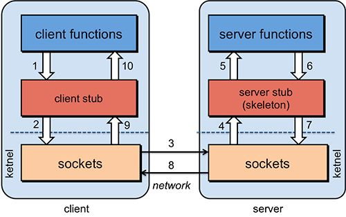
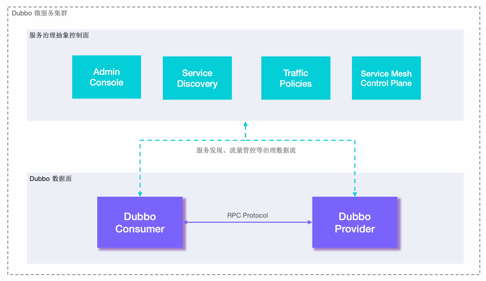

# RPC框架

## 一、RPC框架的基本内容
1. 基本定义：RPC（Remote Procedure Call）即远程过程调用，不同于本地调用，RPC是指调用远端机器的函数或方法，且不需要关心底层的调用细节，如网络协议和传输协议等，对于调用者来说，和调用本地方法没有什么区别。
2. 工作流程
   - 客户端（Client）调用：客户端应用程序调用本地的一个存根（Stub）函数，该函数是一个本地函数，但其实现会触发远程调用。
   - 存根（Stub）处理：存根函数负责将调用参数打包成一种可以在网络上传输的格式（如序列化），并通过网络发送给服务器。
   - 网络传输：打包后的数据通过网络发送到服务器。
   - 服务器端接收：服务器端接收并解包这些数据，调用实际的服务端程序或函数，处理请求。
   - 结果返回：服务端将处理结果打包，通过网络发送回客户端。
   - 客户端接收结果：客户端的存根函数接收并解包结果，然后返回给原始的调用者。
   
   
3. RPC的一些特点：
   - RPC是协议：既然是协议就只是一套规范，那么就需要有人遵循这套规范来进行实现。目前典型的RPC实现包括：`Dubbo`、`Thrift`、`GRPC`等。
   - 网络协议和网络IO模型对其透明：既然RPC的客户端认为自己是在调用本地对象。那么传输层使用的是TCP/UDP还是HTTP协议，又或者是一些其他的网络协议它就不需要关心了。
   - 信息格式对其透明：我们知道在本地应用程序中，对于某个对象的调用需要传递一些参数，并且会返回一个调用结果。至于被调用的对象内部是如何使用这些参数，并计算出处理结果的，调用方是不需要关心的。那么对于远程调用来说，这些参数会以某种信息格式传递给网络上的另外一台计算机，这个信息格式是怎样构成的，调用方是不需要关心的。
   - 应该有跨语言能力：为什么这样说呢？因为调用方实际上也不清楚远程服务器的应用程序是使用什么语言运行的。那么对于调用方来说，无论服务器方使用的是什么语言，本次调用都应该成功，并且返回值也应该按照调用方程序语言所能理解的形式进行描述。
4. 常见的RPC框架（也就是RPC协议的具体实现）包括哪些？
   - `Thrift`：`thrift`是一个软件框架，用来进行可扩展且跨语言的服务的开发。它结合了功能强大的软件堆栈和代码生成引擎，以构建在 C++, Java, Python, PHP, Ruby, Erlang, Perl, Haskell, C#, Cocoa, JavaScript, Node.js, Smalltalk, and OCaml 这些编程语言间无缝结合的、高效的服务。
   - `gRPC`：一开始由`google`开发，是一款语言中立、平台中立、开源的远程过程调用系统。
   - `Dubbo`：`Dubbo`是一个分布式服务框架，以及SOA治理方案。其功能主要包括：高性能NIO通讯及多协议集成，服务动态寻址与路由，软负载均衡与容错，依赖分析与降级等。Dubbo是阿里巴巴内部的SOA服务化治理方案的核心框架，Dubbo自2011年开源后，已被许多非阿里系公司使用。
   - `Spring Cloud`：`Spring Cloud`由众多子项目组成，如`Spring Cloud Config`、`Spring Cloud Netflix`、`Spring Cloud Consul`等，提供了搭建分布式系统及微服务常用的工具，如配置管理、服务发现、断路器、智能路由、微代理、控制总线、一次性token、全局锁、选主、分布式会话和集群状态等，满足了构建微服务所需的所有解决方案。Spring Cloud基于Spring Boot, 使得开发部署极其简单。
5. 设计一个RPC框架需要关注哪些？
   1. 透明化远程服务调用：保持调用方对底层具体实现的无感
   2. 消息的编码和解码：消息内容需要按照统一的格式在网络中进行传输
   3. 函数映射：服务提供者和服务调用者之间的函数需要一一对应

## 二、Dubbo简介
1. `Dubbo`宏观架构从抽象架构上主要分为两层：**服务治理抽象控制面**和**Dubbo 数据面**。
   - 服务治理控制面（主要指服务节点动态变化、外部化配置、日志跟踪、可观测性、流量管理、高可用性、数据一致性等一系列问题，我们将这些问题统称为服务治理）。服务治理控制面不是特指如注册中心类的单个具体组件，而是对`Dubbo`治理体系的抽象表达。控制面包含协调服务发现的注册中心、流量管控策略、`Dubbo Admin`控制台等。
   - `Dubbo`数据面（主要指服务提供者和服务调用者，严格来讲不属于`Dubbo`内部的体系，但是`Dubbo`提供了双方必须遵守的一些基本规范）。数据面代表集群部署的所有`Dubbo`进程，进程之间通过`RPC`协议实现数据交换，`Dubbo`定义了微服务应用开发与调用规范并负责完成数据传输的编解码工作。
     - 服务消费者`Dubbo Consumer`，发起业务调用或`RPC`通信的`Dubbo`进程
     - 服务提供者`Dubbo Provider`，接收业务调用或`RPC`通信的`Dubbo`进程

   
2. `Dubbo`、`Nacos`、微服务之间的关系
   - 启动流程 + 关系梳理
     - `Step 1`：启动微服务（注册）
       - 启动`Nacos`（独立进程，先启动）
       - 启动微服务`Dubbo Provider`：进程内部`Dubbo`模块，主动连接`Nacos`，上报信息：服务名、地址、提供接口
       - 启动微服务`Dubbo Consumer`：进程内部`Dubbo`连接`Nacos`，订阅接口`DialingServiceGatewayI`，`Nacos`把`Dubbo Provider`实例列表推送给`Dubbo Consumer`，`Dubbo Consumer`本地缓存节点地址
     - `Step 2`：业务调用
       - `Dubbo Consumer`请求`Dubbo Provider`时，`Dubbo Consumer`读取本地缓存的`Dubbo Provider`节点列表
       - 按照负载均衡策略（是调用方本地提供的均衡算法实现，动态从列表中选择一个节点进行调用），直接通过`TCP`连接`Dubbo Provider`发起`RPC`调用
       - `Dubbo Provider`接收请求，执行业务逻辑，将结果原路返回`Dubbo Consumer`
     - `Step 3`：配置更新
       - 修改`Nacos`控制台配置，无需重启服务，配置可以动态下发到微服务（本质上是微服务轮训获取）
       - 微服务进程启动的时候，会同步启动线程用于轮训拉配置
   - 常见知识误区：
     1. 没有`Dubbo`单独的进程，`Dubbo`寄生在微服务内部；
        - `Provider`：微服务启动的时候会主动链接`Nacos`并上报服务名、提供服务的接口信息、服务本身的地址等信息
        - `Consumer`：微服务启动的时候会拉对应订阅的接口信息
     2. `Nacos`只负责交换地址信息；真正微服务之间的数据传输、远程方法调用，全部由`Dubbo`完成。
     3. `Nacos`是单独启动的配置中心和注册中心，拥有独立的Java进程；主要用于服务注册、服务发现等

参考文档：
1. rpc框架：https://blog.csdn.net/weixin_42482896/article/details/127606492
2. rpc框架：https://blog.csdn.net/yuiezt/article/details/140190124
3. rpc框架：https://mp.weixin.qq.com/s/ll4nUVB28KpyTMS93xAckQ
4. rpc框架：https://www.zhihu.com/question/25536695
5. dubbo官方github源码：https://github.com/apache/dubbo/
6. dubbo使用手册：https://cn.dubbo.apache.org/zh-cn/overview/what/overview/

