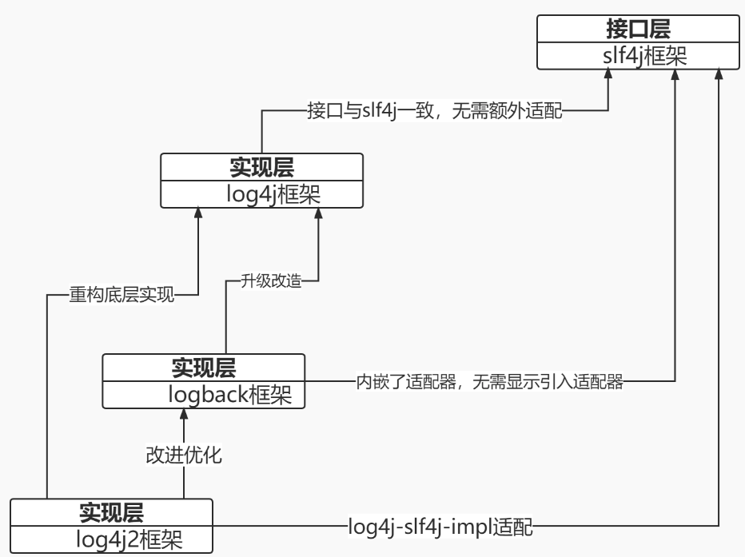

# 日志框架

## 一、slf4j、log4j、log4j2、logback
1. slf4j不是一个真正意义的可用应用程序，它是一个接口；单纯的执行log.info或者log.debug方法只能在控制台打印日志，并不会持久化到文件，因此slf4j想持久化，必须要借助一个实现层框架。
2. log4j是log日志的实现框架，就是实现了slf4j接口的实现层框架，是基础版本。
   logback也是实现层框架，是基于slf4j和log4j。
   log4j2是log4j和logback的升级版。
3. 时间线：log4j - slf4j - logback - log4j2
4. slf4j只是接口层，必须依赖实现层的框架实现接口层才能真正实现日志记录；log4j的接口层与slf4j接口一致无需适配，log4j2与logback都是实现层的框架，内部都有自己独立的接口层。
   但是这就有一个问题，一个应用程序用了独立用了log4j款就改，如果哪天想要切换成logback框架的话，所有的log初始化以及info等语句都要替换。
   基于这一点log4j的作者独立开发了一个slf4j层，专门用来适配底层的实现；就算你这个日志实现框架比如log4j2，logback等与slf4j不兼容也没关系，再开发一个xxx-slf4j-impl实现就slf4j的接口就可以了，相当于做了一个adapter。
   比如应用程序的底层实现框架用的是log4j2，但是接口层我想要用slf4j接口层，那么就引入一个log4j-slf4j-impl.jar等就可以了。
5. 示意图

## 二、日志配置文件

参考文章：
1. https://blog.csdn.net/madness1010/article/details/128332275

