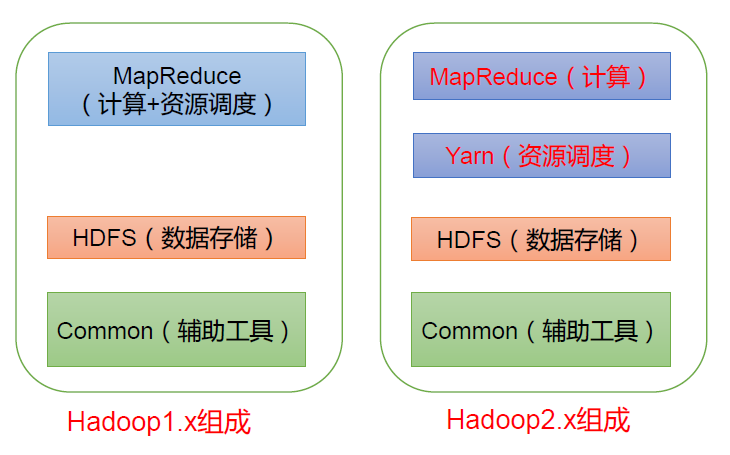
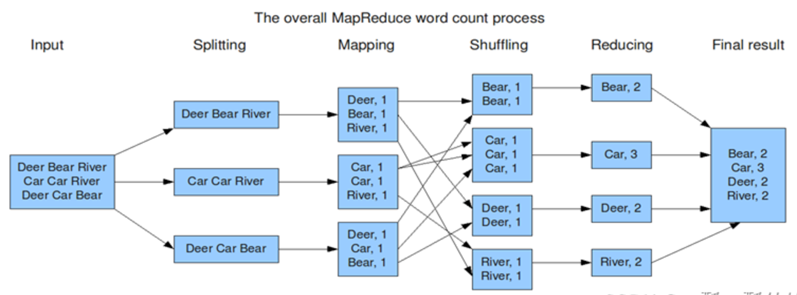

# Hadoop基础内容


## 一、Hadoop基础
1. Hadoop是一个由Apache基金会所开发的分布式系统基础架构；主要解决海量数据的存储和海量数据的分析计算问题；广义上来说，Hadoop通常是指一个更广泛的概念——Hadoop生态圈。  
   
2. Hadoop 1.0的基本组成：MapReduce、HDFS、Common
   - MapReduce：负责计算 + 资源调度
   - HDFS：数据存储
   - Common：辅助工具
3. Hadoop 2.0的基本组成：MapReduce、Yarn、HDFS、Common
   - MapReduce：计算
   - Yarn：资源调度
   - HDFS：数据存储
   - Common：辅助工具


## 二、MapReduce
1. MapReduce架构概述
   - Map阶段负责并行处理输入数据
   - Reduce阶段对Map结果进行汇总
2. MapReduce的工作流程大概可以分为以下五个步骤
   - 分片、格式化数据：将源文件划分为大小相等的小数据块，也就是分片；将划分好的分片格式化为键值对`<key, value>`的形式，其中key代表偏移量，value代表每一行内容
   - 执行`MapTask`：输入的分片数据经过Map任务处理后的中间结果会写入内存缓冲区中
   - 执行`Shuffle`过程：`Map`阶段处理的数据如何传递给`Reduce`阶段，这是`MapReduce`框架中关键的一个过程，这个过程叫作`Shuffle`
   - 执行`ReduceTask`：输入`ReduceTask`的数据流是`<key, {value list}>`形式，用户可以自定义`reduce()`方法进行逻辑处理，最终以`<key, value>`的形式输出。
   - 写入文件：`MapReduce`框架会自动把`ReduceTask`生成的`<key, value>`传入`OutputFormat`的`write`方法，实现文件的写入操作。
3. MapReduce案例——实现word count，计算文本中出现的word并计算相应的频次
   - Map阶段：将输入的文本数据进行切割；在本案例中，我们将value统一设置为1，代表出现一次。因此输出就是<word, 1>
   - shuffle阶段：经过默认的排序分组，key相同的单词会作为一组数据构成新的key-value对。
   - reduce阶段：处理shuffle完的一组数据，该组数据就是该单词所有的键值对。  
   


## 三、HDFS（Hadoop分布式文件系统）
- 基本构成
   - NameNode：存储文件的元数据，如文件名，文件目录结构，文件属性（生成时间、副本数、文件权限），以及每个文件的块列表和块所在的DataNode等
   - DataNode：在本地文件系统存储文件块数据，以及块数据的校验和
   - Secondary NameNode：每隔一段时间对NameNode元数据备份

## 四、Java开发中的MapReduce
1. 继承Mapper来实现对数据的Map，继承Reducer来实现对数据的Reduce，从而将任务包装成Hadoop可以承接的形式。
2. 实例：实现word count
   - Mapper
   ```java
   class WordCountMapper extends Mapper<LongWritable, Text, Text, LongWritable> {
       // Mapper输出kv键值对 <单词，1>
       private Text keyOut = new Text();
       private final static LongWritable valueOut = new LongWritable(1);

       @Override
       protected void map(LongWritable key, Text value, Context context) throws IOException, InterruptedException {
       	    // 将读取的一行内容根据分隔符进行切割
       	    String[] words = value.toString().split("\\s+");
       	    // 遍历单词数组
       	    for (String word : words) {
       	    	keyOut.set(word);
       	    	// 输出单词，并标记1
       	    	context.write(new Text(word), valueOut);
           }
       }
   }
   ```
   - Reducer
   ```java
   class WordCountReducer extends Reducer<Text, LongWritable, Text, LongWritable> {
       private LongWritable result = new LongWritable();
    
       @Override
       protected void reduce(Text key, Iterable<LongWritable> values, Context context) throws IOException, InterruptedException {
           // 统计变量
    	   long count = 0;
           // 遍历一组数据，取出该组所有的value
    	   for (LongWritable value : values) {
               // 所有的value累加 就是该单词的总次数
    	   	   count += value.get();
           }
           result.set(count);
           // 输出最终结果<单词，总次数>
    	   context.write(key, result);
       }
   }
   ```
   - Driver和其他配置项省略


参考资料
1. https://blog.csdn.net/qq_25409421/article/details/132347019
2. MapReduce的Java实例：https://blog.csdn.net/chenwewi520feng/article/details/130431900