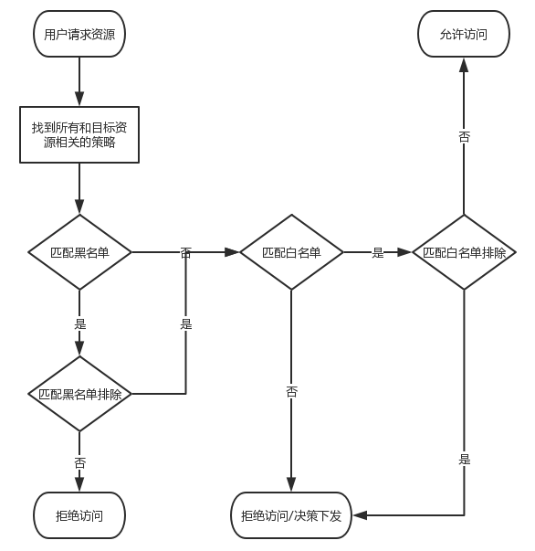
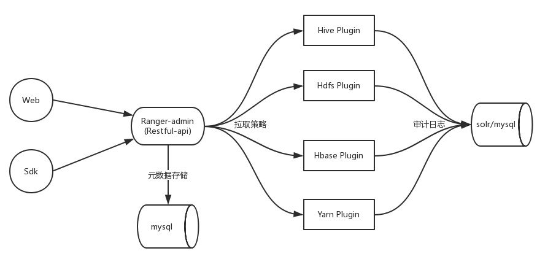

# Ranger 大数据权限管理

## 一、Ranger
1. 基本概念：大数据领域的一个集中式安全管理框架，它可以对诸如hdfs、hive、kafka、storm等组件进行细粒度的权限控制。比如它可以控制用户读取hdfs文件的权限，甚至可以控制某个用户对hive某个列访问的权限。
2. 权限模型：主要包含三个实体，用户、资源、权限。
   - 用户：ranger可以对用户进行分组，一个用户可以属于多个分组。Ranger支持对用户或者用户组配置某资源的相关权限。  
   - 资源：对于各个不同的组件，资源的表述都不相同。比如在HDFS中，文件路径就是资源，而在Hive中，资源可以指Database、Table甚至Column。  
   - 权限：ranger可以对各个资源的读、写、访问进行限制，具体可以配置白名单、白名单排除、黑名单、黑名单排除等条目。
   
3. 简单说，Ranger可以理解为一种通过实现某些大数据权限校验接口来做统一权限管理的平台。

## 二、Ranger基础架构  

1. Ranger-admin【Ranger管理中心】：一个Web服务，用于管理员管理用户、资源、权限等相关的信息。用户可以在它的基础上开发
2. Plugin【插件】：几乎所有的大数据组件都有一个抽象的验证接口，Ranger通过编写程序实现了各个大数据组件的验证接口，来实现对Ranger插件的适配。
3. MySQL【数据库】：用户存储相关的策略
4. 拉取策略：以Hive为例，Hive会定时（默认30s）从Ranger中刷新权限策略。
5. Ranger的整体架构比较简单，主要就是admin和plugin；简单说就是一个web项目 + 一些插件实现 + MySQL数据库。

## 三、Ranger的一些思考
1. 组件策略缓存
   - 由于组件的多样性以及策略的复杂性，在ranger的数据库中，和策略相关的表就多达10来张。也就是说，一个组件要来Ranger-Admin拉取其相关的所有策略时，需要查询这十多张表，然后将其组织成组件需要的数据结构，再转成json返回。这是一个相对耗时较长的操作，另外，不止组件会获取这些策略，web界面或者sdk也可能调用相关接口获取所有策略。
   - 为了提高获取策略的性能，ranger以Service为单位，来缓存这些已经组织好的数据。当数据被缓存起来后，后续的请求只需从内存中获取相关数据即可。
   - 使用缓存会引发另一个问题，怎么判定缓存已经失效？为了解决这个问题，Ranger在Service表中添加了一个字段：policy_version，只要和这个service的策略有关的属性发生了变化，就更新policy_version。
   - 当用户请求策略时，发现policy_version和缓存的不一致，就会重新拉取数据，然后更新缓存。
2. 插件类加载器的实现
   比如Hive用到了1.0版本的A包，Ranger开发Hive插件的时候用到了1.1版本的B包，为了避免类冲突，Ranger实现了自己的类加载器。

参考资料：
1. https://blog.csdn.net/u013332124/article/details/86360756