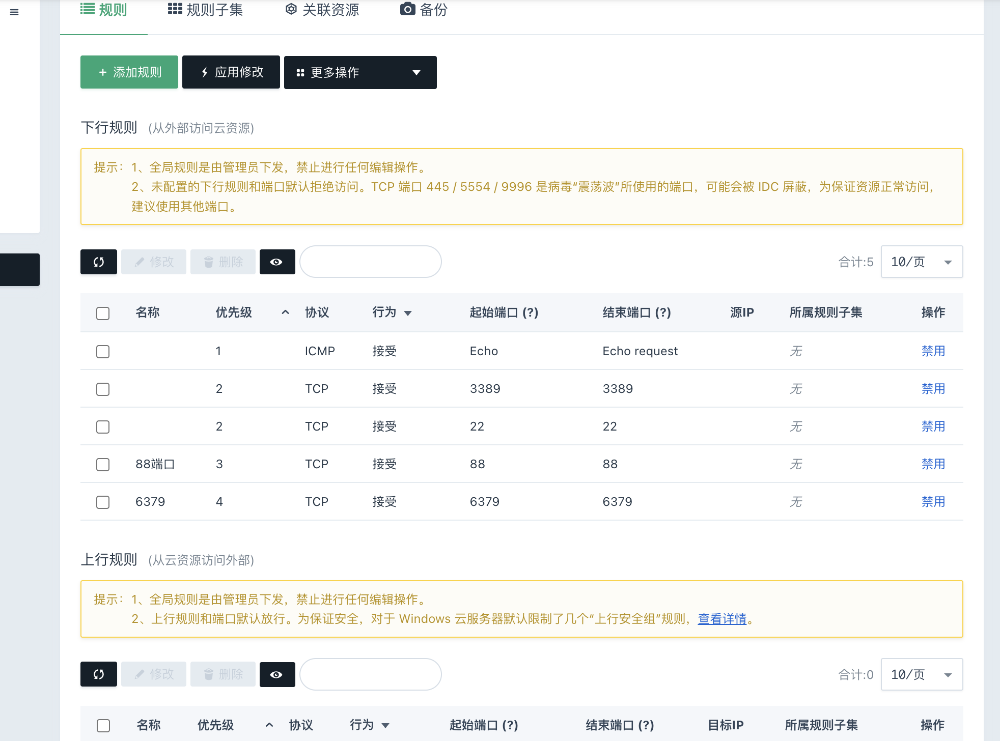
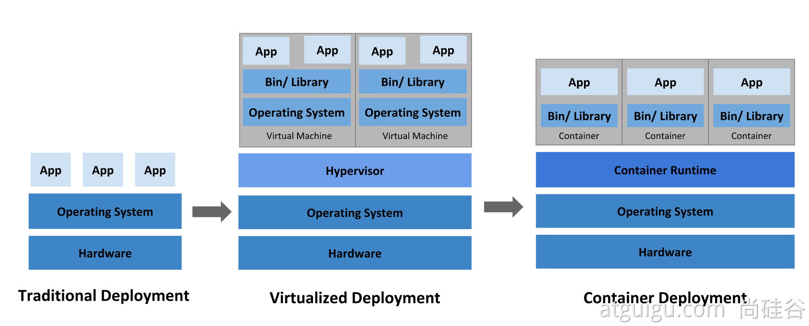
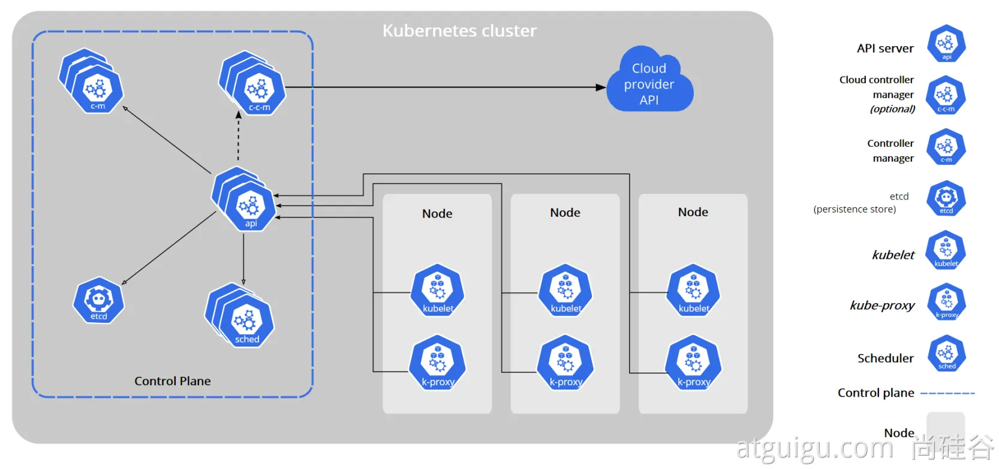
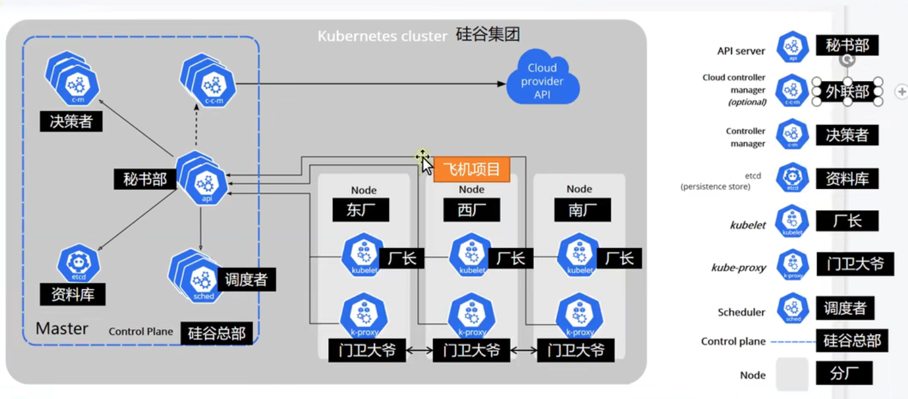
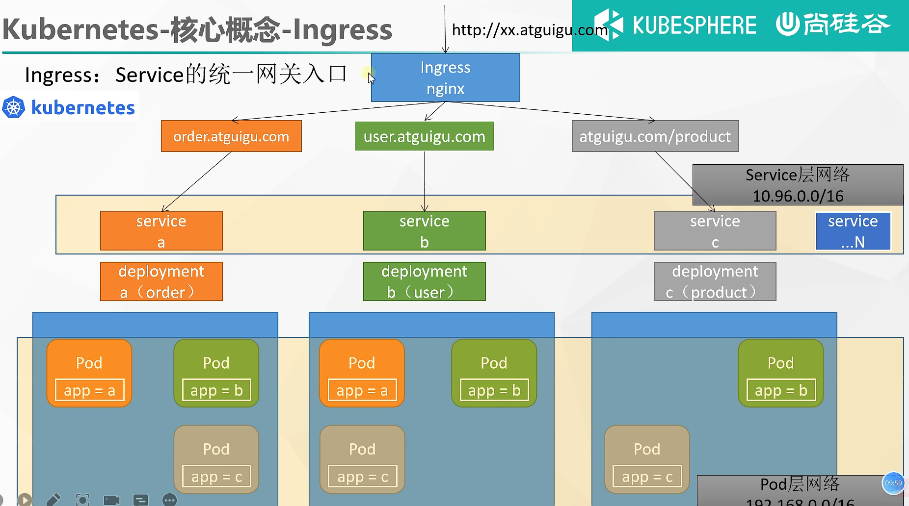

# 云原生实战--Docker、Kubernetes

---

## 云平台核心

1. 为什么用云平台
   - 环境统一
   - 按需付费
   - 即开即用
   - 稳定性强
   - ......

2. 国内常见云平台：

   - [阿里云](https://promotion.aliyun.com/ntms/act/ambassador/sharetouser.html?userCode=50sid5bu&utm_source=50sid5bu)、百度云、[腾讯云](https://curl.qcloud.com/iyFTRSJb)、[华为云](https://activity.huaweicloud.com/discount_area_v5/index.html?fromacct=d1a6f32e-d6d0-4702-9213-eafe022a0708&utm_source=bGVpZmVuZ3lhbmc==&utm_medium=cps&utm_campaign=201905)、青云......
   - 国外常见云平台：亚马逊 AWS、微软 Azure ...

3. 公有云——购买云服务商提供的公共服务器

   公有云是最常见的云计算部署类型。公有云资源（例如服务器和存储空间）由第三方云服务提供商拥有和运营，这些资源通过 Internet 提供。在公有云中，所有硬件、软件和其他支持性基础结构均为云提供商所拥有和管理。Microsoft Azure 是公有云的一个示例。

   在公有云中，你与其他组织或云“租户”共享相同的硬件、存储和网络设备，并且你可以使用 Web 浏览器访问服务和管理帐户。公有云部署通常用于提供基于 Web 的电子邮件、网上办公应用、存储以及测试和开发环境。

   - 公有云优势：
     - 成本更低：无需购买硬件或软件，仅对使用的服务付费。
     - 无需维护：维护由服务提供商提供。
     - 近乎无限制的缩放性：提供按需资源，可满足业务需求。
     - 高可靠性：具备众多服务器，确保免受故障影响。
     - 可用性： 全年的故障时间： $$365*24*3600*(1-0.999999)$$

4. 私有云：自己搭建云平台，或者购买

   私有云由专供一个企业或组织使用的云计算资源构成。私有云可在物理上位于组织的现场数据中心，也可由第三方服务提供商托管。但是，在私有云中，服务和基础结构始终在私有网络上进行维护，硬件和软件专供组织使用。

   这样，私有云可使组织更加方便地自定义资源，从而满足特定的 IT 需求。私有云的使用对象通常为政府机构、金融机构以及其他具备业务关键性运营且希望对环境拥有更大控制权的中型到大型组织。

   - 私有云优势：
     - 灵活性更强：组织可自定义云环境以满足特定业务需求。
     - 控制力更强：资源不与其他组织共享，因此能获得更高的控制力以及更高的隐私级别。
     - 可伸缩性更强：与本地基础结构相比，私有云通常具有更强的可伸缩性。

5. 没有一种云计算类型适用于所有人。多种不同的云计算模型、类型和服务已得到发展，可以满足组织快速变化的技术需求。部署云计算资源有三种不同的方法：公共云、私有云和混合云。采用的部署方法取决于业务需求。
6. 注册云平台的一些平台：
   - [阿里云](https://www.aliyun.com/daily-act/ecs/activity_selection?userCode=50sid5bu)   aliyun.com 
   - [腾讯云](https://curl.qcloud.com/iyFTRSJb)   cloud.tencent.com
   - [华为云](https://activity.huaweicloud.com/discount_area_v5/index.html?fromacct=d1a6f32e-d6d0-4702-9213-eafe022a0708&utm_source=bGVpZmVuZ3lhbmc==&utm_medium=cps&utm_campaign=201905)   huaweicloud.com
   - [青云](https://www.qingcloud.com/promotion2021)       qingcloud.com
   - [百度云](http://cloud.baidu.com/)    cloud.baidu.com

7. 基础概念 

   - 云服务器作为应用的最终载体
   - VPC（私有网络，专有网络）为所有云服务器提供网络隔离
   - 所有云服务器都是绑定某个私有网络
   - 安全组控制每个服务器的防火墙规则
   - 公网IP使得资源可访问
   - 端口转发的方式访问到具体服务器

8. VPC：私有网络，专有网络

   - 网络内部之间可以互相访问，例如配置了第一组VPC，包含A、B、C三台服务器；第二组VPC，包含D、E、F三台服务器，ABC之间可以互相访问，但是DEF之间是不可以的。

9. 安全组的概念

   - 原来Linux中防火墙的概念现在被抽象为安全组的概念，目前在相关的云平台配置相关的端口放开，来实现控制访问。

   - 案例：https://console.qingcloud.com/pek3/security_groups/security_groups/sg-bneesfk7/

     

     


## Docker基础

### Docker基本概念

1. 解决的问题 
   - 统一标准
     - 应用构建
       - Java、C++、JavaScript
       - 打成软件包
       - .exe
       - docker build ....   镜像
     - 应用分享
       - 所有软件的镜像放到一个指定地方  docker hub
       - 安卓，应用市场
     - 应用运行
       - 统一标准的镜像
       - docker run
   - 资源隔离
     - cpu、memory资源隔离与限制
     - 访问设备隔离与限制
     - 网络隔离与限制
     - 用户、用户组隔离限制
2. 架构 


- Docker_Host：
  - 安装Docker的主机
- Docker Daemon：
  - 运行在Docker主机上的Docker后台进程
- Client：
  - 操作Docker主机的客户端（命令行、UI等）
- Registry：
  - 镜像仓库
  - Docker Hub
- Images：
  - 镜像，带环境打包好的程序，可以直接启动运行
- Containers：
  - 容器，由镜像启动起来正在运行中的程序

> 装好Docker，然后去 软件市场 寻找镜像，下载并运行，查看容器状态日志等排错

3. 安装

- centos下安装docker【其他系统参照如下[文档](https://docs.docker.com/engine/install/centos/)】

  1. 移除以前docker相关包 

     ```bash
     sudo yum remove docker \
     docker-client \
     docker-client-latest \
     docker-common \
     docker-latest \
     docker-latest-logrotate \
     docker-engine
     ```

  2. 配置yum源

     ```bash
     sudo yum install -y yum-utils
     sudo yum-config-manager \
     --add-repo \
     http://mirrors.aliyun.com/docker-ce/linux/centos/docker-ce.repo
     ```

  3. 安装Docker

     ```bash
     sudo yum install -y docker-ce docker-ce-cli containerd.io
     #以下是在安装k8s的时候使用
     yum install -y docker-ce-20.10.7 docker-ce-cli-20.10.7  containerd.io-1.4.6
     ```

  4. 启动

     ```bash
     systemctl enable docker --now
     ```

  5. 额外配置

     ```bash
     ## 个人使用的，与shangguigu官方不一致
     sudo mkdir -p /etc/docker
     sudo tee /etc/docker/daemon.json <<-'EOF'
     {
       "registry-mirrors": [
                     "https://x9r52uz5.mirror.aliyuncs.com",
                     "https://dockerhub.icu",
                     "https://docker.chenby.cn",
                     "https://docker.1panel.live",
                     "https://docker.awsl9527.cn",
                     "https://docker.anyhub.us.kg",
                     "https://dhub.kubesre.xyz"
             ],
       "exec-opts": ["native.cgroupdriver=systemd"],
       "log-driver": "json-file",
       "log-opts": {
         "max-size": "100m"
       },
       "storage-driver": "overlay2"
     }
     EOF
     sudo systemctl daemon-reload
     sudo systemctl restart docker
     ```

### Docker命令实战

1. 常用命令

   

2. 基础实战

   - 找镜像（docker hub网址：http://hub.docker.com/）

     ```bash
     docker pull nginx  #下载最新版
     ## 镜像名:版本名（标签）
     docker pull nginx:1.20.1
     ## docker拉镜像
     docker pull redis  #下载最新
     ## 指定版本
     docker pull redis:6.2.4
     ## 下载来的镜像都在本地
     docker images  #查看所有镜像
     ## 如果仅仅书写redis，那就代表是最新版本
     redis = redis:latest
     ## 删除镜像
     docker rmi 镜像名:版本号/镜像id
     ```

   - 启动容器

     ```bash
     ## 基础命令
     docker run [OPTIONS] IMAGE [COMMAND] [ARG...]
     # -d：后台运行
     # --restart=always: 开机自启
     # 启动nginx应用容器，并映射88端口，本机的ip是88端口，映射到nginx小Linux虚拟机的80端口
     docker run --name=mynginx -d --restart=always -p 88:80 nginx
     # 查看正在运行的容器
     docker ps
     # 查看所有
     docker ps -a
     # 删除停止的容器
     docker rm  容器id/名字
     #强制删除正在运行中的
     docker rm -f mynginx  
     #停止容器
     docker stop 容器id/名字
     #再次启动
     docker start 容器id/名字
     #应用开机自启
     docker update 容器id/名字 --restart=always
     ```

3. 修改容器内容

   - 进容器内部修改

     ```bash
     # 进入容器内部的系统，修改容器内容
     docker exec -it 容器id  /bin/bash
     ```

   - 挂载数据到外部修改

     ```bash
     docker run --name=mynginx   \
     ## -d：后台启动
     -d  --restart=always \
     ## -p：端口暴露 -v：挂载
     -p  88:80 -v /data/html:/usr/share/nginx/html:ro  \
     nginx
     # 修改页面只需要去 主机的 /data/html
     ```

4. 提交改变

   - 将自己修改好的镜像（也就是自己进行了私有化开发的镜像）提交

     ```bash
     docker commit [OPTIONS] CONTAINER [REPOSITORY[:TAG]]
     ## -a :作者
     ## -m :本次的备注
     docker commit -a "leifengyang"  -m "首页变化" 341d81f7504f guignginx:v1.0
     ```

   - 镜像传输（可以用Linux的SCP命令）

     ```bash
     # 将镜像保存成压缩包
     docker save -o abc.tar guignginx:v1.0
     
     # 别的机器加载这个镜像
     docker load -i abc.tar
     ```

5. 推动到远程仓库

   - 首先需要在DockerHub上注册并创建自己的仓库，相当于在远程先开一个仓库，然后再提上传的事情

   - 下面是代码

     ```bash
     docker tag local-image:tagname new-repo:tagname
     docker push new-repo:tagname
     # 把旧镜像的名字，改成仓库要求的新版名字
     docker tag guignginx:v1.0 leifengyang/guignginx:v1.0
     # 登录到docker hub
     docker login
     docker logout（推送完成镜像后退出）
     # 推送
     docker push leifengyang/guignginx:v1.0
     # 别的机器下载
     docker pull leifengyang/guignginx:v1.0
     ```

6. 补充

   ```bash
   docker logs 容器名/id   排错
   docker exec -it 容器id /bin/bash
   # docker 经常修改nginx配置文件
   docker run -d -p 80:80 \
   -v /data/html:/usr/share/nginx/html:ro \
   -v /data/conf/nginx.conf:/etc/nginx/nginx.conf \
   --name mynginx-02 \
   nginx
   #把容器指定位置的东西复制出来 
   docker cp 5eff66eec7e1:/etc/nginx/nginx.conf  /data/conf/nginx.conf
   #把外面的内容复制到容器里面
   docker cp  /data/conf/nginx.conf  5eff66eec7e1:/etc/nginx/nginx.conf
   ```

### Docker进阶实战

1. 编写自己的java程序

   - 正常的代码开发

2. 将应用打包成镜像

   - 旧有模式：
     - SpringBoot使用Maven打包成可以执行的jar包
     - 把jar包上传到服务器上
     - 服务器进行java - jar
   - Docker现有模式：
     - 所有的机器预先安装Docker，在运行时直接采用Docker加载

3. 怎么打包（使用Docker file）

   - 在项目中编写Docker file：

   ```dockerfile
   ## 指定源镜像
   FROM openjdk:8-jdk-slim
   LABEL maintainer=leifengyang
   # 将某目录下的所有jar 复制到 Docker容器中的/app.jar目录
   COPY target/*.jar   /app.jar
   # 启动的时候直接使用app.jar
   ENTRYPOINT ["java","-jar","/app.jar"]
   ```

   - 在一台安装了Docker打包工具的机器上，将java代码打包成Docker镜像文件

   ```bash
   ## 后面的 . 不可以忽略，表示在当前目录下工作
   ## -t 表示tag 起名叫什么
   ## -f 使用哪个DockerFile
   ## 当前目录aaa包括：DockerFile + app.jar
   docker build -t java-demo:v1.0 .
   ```

   - 启动容器

   ```bash
   docker run -d -p 8080:8080 --name myjava-app java-demo:v1.0 
   ```

   - 分享容器

   ```bash
   # 登录docker hub
   docker login
   # 给旧镜像起名
   docker tag java-demo:v1.0  leifengyang/java-demo:v1.0
   # A机器 推送到docker hub
   docker push leifengyang/java-demo:v1.0
   # B机器 从仓库中拉取
   docker pull leifengyang/java-demo:v1.0
   # 别的机器运行
   docker run -d -p 8080:8080 --name myjava-app java-demo:v1.0 
   ```

---

## Kubernetes实战入门

### Kubernetes基础概念

1. 是什么

   传统的部署模式是上传jar包到一台服务器

   后来出现了虚拟化技术，可以在虚拟机上部署服务，实现应用之间的隔离

   再后来出现了容器化部署的方式，可以实现完全的隔离，而且变得更轻量级了。

   但是如果一台机器损毁了，有没有方式能够保证服务的可用性？我们急需一个大规模容器编排系统。

   

   - kubernetes具有以下特性：

     - **服务发现和负载均衡**
       Kubernetes 可以使用 DNS 名称或自己的 IP 地址公开容器，如果进入容器的流量很大， Kubernetes 可以负载均衡并分配网络流量，从而使部署稳定。

     - **存储编排**
       Kubernetes 允许你自动挂载你选择的存储系统，例如本地存储、公共云提供商等。

     - **自动部署和回滚**
       你可以使用 Kubernetes 描述已部署容器的所需状态，它可以以受控的速率将实际状态 更改为期望状态。例如，你可以自动化 Kubernetes 来为你的部署创建新容器， 删除现有容器并将它们的所有资源用于新容器。

     - **自动完成装箱计算**
       Kubernetes 允许你指定每个容器所需 CPU 和内存（RAM）。 当容器指定了资源请求时，Kubernetes 可以做出更好的决策来管理容器的资源。

     - **自我修复**
       Kubernetes 重新启动失败的容器、替换容器、杀死不响应用户定义的 运行状况检查的容器，并且在准备好服务之前不将其通告给客户端。

     - **密钥与配置管理**
       Kubernetes 允许你存储和管理敏感信息，例如密码、OAuth 令牌和 ssh 密钥。 你可以在不重建容器镜像的情况下部署和更新密钥和应用程序配置，也无需在堆栈配置中暴露密钥。

   - Kubernetes为你提供了一个可弹性运行分布式系统的框架。 Kubernetes 会满足你的扩展要求、故障转移、部署模式等。 例如，Kubernetes可以轻松管理系统的Canary部署（金丝雀部署）。

2. 架构

   - 工作方式

     K8S集群 = N个主节点 + M个工作节点，N, M>= 1

   - 组件架构角色

     

     Node：工作节点

     Control Plane：控制面板，理解为总部

     Controller Manager：决策者

     API server：接口，秘书

     etcd：资料库

     kubelet：工作节点的对接人

     k-proxy：门卫，负责管理单机下面的服务，而且与其他节点的门卫之间互相同步

     Scheduler：调度者

   - 基本的流程

     

     秘书部（API）是所有角色之间访问的对接人。

     worker节点和master节点之间的相互交互，依赖秘书部。

     > 举例说明K8S的工作流程
     >
     > 架构：Master Node（1台）、Worker Node（2台）（这三台机器必须有容器运行时环境，Docker安装了）
     >
     > WN、MN都有一个kubelet（厂长），决定本机项目的启动
     >
     > 崩溃修复过程：WN1上的造飞机项目崩了，厂长探测到项目崩溃了，kubelet向MN的API（秘书）进行汇报，API向MN的决策者（Controlller-manager汇报），决策者生产出一个解决方案，告诉秘书（API），秘书将该解决方案存储在ETCD（键值数据库）中，秘书通知调度者（Scheduler）按照方案执行，调度者产生方案后调用API将解决方案存储到ETCD上，秘书随后向对应机器的kubelet（厂长）提出要求，要求按照总部的方案进行执行，将造飞机的项目在机器WN2上运行，实现了应用的重新部署。
     >
     > WN1中的应用APP-WN1-1，想访问造飞机项目，首先找到WN1中的kube-proxy，由WN1的kube-proxy告知对应的服务地址。
     >
     > 程序员部署服务也是与API交互，例如命令：
     >
     > ```bash
     > kubectl create deploy myapp --image -nginx
     > ```
     >
     > 总结：
     >
     > 1. 集群中所有组件都是通过API交互的
     > 2. 集群中的网络访问都是通过kube-proxy实现的
     > 3. 所有的机器都有容器运行时环境
     > 4. 每一个节点都要有个kubelet监工，厂长

   - 控制平面组件 

     控制平面的组件对集群做出全局决策(比如调度)，以及检测和响应集群事件（例如，当不满足部署的 `replicas` 字段时，启动新的 [pod](https://kubernetes.io/docs/concepts/workloads/pods/pod-overview/)）。

     控制平面组件可以在集群中的任何节点上运行。 然而，为了简单起见，设置脚本通常会在同一个计算机上启动所有控制平面组件， 并且不会在此计算机上运行用户容器。 请参阅[使用 kubeadm 构建高可用性集群](https://kubernetes.io/zh/docs/setup/production-environment/tools/kubeadm/high-availability/) 中关于多 VM 控制平面设置的示例。

   - kube API server 秘书，交互API

     API 服务器是 Kubernetes [控制面](https://kubernetes.io/zh/docs/reference/glossary/?all=true#term-control-plane)的组件， 该组件公开了 Kubernetes API。 API 服务器是 Kubernetes 控制面的前端。

     Kubernetes API 服务器的主要实现是 [kube-apiserver](https://kubernetes.io/zh/docs/reference/command-line-tools-reference/kube-apiserver/)。 kube-apiserver 设计上考虑了水平伸缩，也就是说，它可通过部署多个实例进行伸缩。 你可以运行 kube-apiserver 的多个实例，并在这些实例之间平衡流量。

   - etcd 键值数据库

     etcd 是兼具一致性和高可用性的键值数据库，可以作为保存 Kubernetes 所有集群数据的后台数据库。

     您的 Kubernetes 集群的 etcd 数据库通常需要有个备份计划。

     要了解 etcd 更深层次的信息，请参考 [etcd 文档](https://etcd.io/docs/)。

   - kube-scheduler 调度者

     控制平面组件，负责监视新创建的、未指定运行[节点](https://kubernetes.io/zh/docs/concepts/architecture/nodes/)的 [Pods](https://kubernetes.io/docs/concepts/workloads/pods/pod-overview/)，选择节点让 Pod 在上面运行。

     调度决策考虑的因素包括单个 Pod 和 Pod 集合的资源需求、硬件/软件/策略约束、亲和性和反亲和性规范、数据位置、工作负载间的干扰和最后时限。

   - kube-controller-manager 决策者

     在主节点上运行[控制器](https://kubernetes.io/zh/docs/concepts/architecture/controller/)的组件。

     从逻辑上讲，每个[控制器](https://kubernetes.io/zh/docs/concepts/architecture/controller/)都是一个单独的进程， 但是为了降低复杂性，它们都被编译到同一个可执行文件，并在一个进程中运行。

     这些控制器包括：

     - 节点控制器（Node Controller）: 负责在节点出现故障时进行通知和响应
     - 任务控制器（Job controller）: 监测代表一次性任务的 Job 对象，然后创建 Pods 来运行这些任务直至完成
     - 端点控制器（Endpoints Controller）: 填充端点(Endpoints)对象(即加入 Service 与 Pod)
     - 服务帐户和令牌控制器（Service Account & Token Controllers）: 为新的命名空间创建默认帐户和 API 访问令牌

   - cloud-controller-manager 外联部

     云控制器管理器是指嵌入特定云的控制逻辑的 [控制平面](https://kubernetes.io/zh/docs/reference/glossary/?all=true#term-control-plane)组件。 云控制器管理器允许您链接集群到云提供商的应用编程接口中， 并把和该云平台交互的组件与只和您的集群交互的组件分离开。

     `cloud-controller-manager` 仅运行特定于云平台的控制回路。 如果你在自己的环境中运行 Kubernetes，或者在本地计算机中运行学习环境， 所部署的环境中不需要云控制器管理器。

     与 `kube-controller-manager` 类似，`cloud-controller-manager` 将若干逻辑上独立的 控制回路组合到同一个可执行文件中，供你以同一进程的方式运行。 你可以对其执行水平扩容（运行不止一个副本）以提升性能或者增强容错能力。

     下面的控制器都包含对云平台驱动的依赖：

     - 节点控制器（Node Controller）: 用于在节点终止响应后检查云提供商以确定节点是否已被删除
     - 路由控制器（Route Controller）: 用于在底层云基础架构中设置路由
     - 服务控制器（Service Controller）: 用于创建、更新和删除云提供商负载均衡器

   - Node 组件 

     节点组件在每个节点上运行，维护运行的 Pod 并提供 Kubernetes 运行环境。

   - kubelet

     一个在集群中每个[节点](https://kubernetes.io/zh/docs/concepts/architecture/nodes/)上运行的代理。 它保证[容器](https://kubernetes.io/zh/docs/concepts/overview/what-is-kubernetes/#why-containers)都 运行在 [Pod](https://kubernetes.io/docs/concepts/workloads/pods/pod-overview/) 中。

     kubelet 接收一组通过各类机制提供给它的 PodSpecs，确保这些 PodSpecs 中描述的容器处于运行状态且健康。 kubelet 不会管理不是由 Kubernetes 创建的容器。

   - kube-proxy

     [kube-proxy](https://kubernetes.io/zh/docs/reference/command-line-tools-reference/kube-proxy/) 是集群中每个节点上运行的网络代理， 是实现Kubernetes服务的一部分。

     kube-proxy维护节点上的网络规则。这些网络规则允许从集群内部或外部的网络会话与 Pod 进行网络通信。

     如果操作系统提供了数据包过滤层并可用的话，kube-proxy 会通过它来实现网络规则。否则， kube-proxy 仅转发流量本身。

3. `kubeadm`创建集群

   > 基本流程：
   >
   > 每台机器装Docker、kubelet、kubeadm、kubectl（实际上在Master节点上部署就可以了）
   >
   > 主节点机器：kubeadm init——将该节点创建为主节点MN，kubeadm会自动将主节点需要的东西组装好
   >
   > 其他机器：kubeadm join——将该节点加入集群

   > 安装kubeadm需要的内容
   >
   > - 一台兼容的`Linux`主机。`Kubernetes`项目为基于`Debian`和`Red Hat`的`Linux`发行版以及一些不提供包管理器的发行版提供通用的指令
   > - 每台机器 2 GB 或更多的 RAM （如果少于这个数字将会影响你应用的运行内存)
   > - 2 CPU 核或更多
   > - 集群中的所有机器的网络彼此均能相互连接(公网和内网都可以)
   >   - **设置防火墙放行规则**
   >
   > - 节点之中不可以有重复的主机名、`MAC`地址或`product_uuid`。请参见[这里](https://kubernetes.io/zh/docs/setup/production-environment/tools/kubeadm/install-kubeadm/#verify-mac-address)了解更多详细信息。
   >   - **设置不同hostname**
   >
   > - 开启机器上的某些端口。请参见[这里](https://kubernetes.io/zh/docs/setup/production-environment/tools/kubeadm/install-kubeadm/#check-required-ports)了解更多详细信息。
   >   - **内网互信**
   >
   > - 禁用交换分区。为了保证 kubelet 正常工作，你**必须**禁用交换分区。
   >   - **永久关闭**

   > 流程一：安装容器化环境Docker
   >
   > 流程二：安装 预备环境
   >
   > ```bash
   > #各个机器设置自己的域名
   > hostnamectl set-hostname xxxx
   > # 将 SELinux 设置为 permissive 模式（相当于将其禁用）
   > sudo setenforce 0
   > sudo sed -i 's/^SELINUX=enforcing$/SELINUX=permissive/' /etc/selinux/config
   > 
   > #关闭swap
   > swapoff -a  
   > sed -ri 's/.*swap.*/#&/' /etc/fstab
   > 
   > #允许 iptables 检查桥接流量
   > cat <<EOF | sudo tee /etc/modules-load.d/k8s.conf
   > br_netfilter
   > EOF
   > 
   > cat <<EOF | sudo tee /etc/sysctl.d/k8s.conf
   > net.bridge.bridge-nf-call-ip6tables = 1
   > net.bridge.bridge-nf-call-iptables = 1
   > EOF
   > 
   > sudo sysctl --system
   > ```
   >
   > 流程三：安装三大件
   >
   > ```bash
   > cat <<EOF | sudo tee /etc/yum.repos.d/kubernetes.repo
   > [kubernetes]
   > name=Kubernetes
   > baseurl=http://mirrors.aliyun.com/kubernetes/yum/repos/kubernetes-el7-x86_64
   > enabled=1
   > gpgcheck=0
   > repo_gpgcheck=0
   > gpgkey=http://mirrors.aliyun.com/kubernetes/yum/doc/yum-key.gpg
   >    http://mirrors.aliyun.com/kubernetes/yum/doc/rpm-package-key.gpg
   > exclude=kubelet kubeadm kubectl
   > EOF
   > 
   > sudo yum install -y kubelet-1.20.9 kubeadm-1.20.9 kubectl-1.20.9 --disableexcludes=kubernetes
   > ## 让厂长就位
   > sudo systemctl enable --now kubelet
   > ```
   >
   > 流程四：使用kubeadm引导集群
   >
   > ```bash
   > ## 准备镜像
   > sudo tee ./images.sh <<-'EOF'
   > #!/bin/bash
   > images=(
   > kube-apiserver:v1.20.9
   > kube-proxy:v1.20.9
   > kube-controller-manager:v1.20.9
   > kube-scheduler:v1.20.9
   > coredns:1.7.0
   > etcd:3.4.13-0
   > pause:3.2
   > )
   > for imageName in ${images[@]} ; do
   > docker pull registry.cn-hangzhou.aliyuncs.com/lfy_k8s_images/$imageName
   > done
   > EOF
   > ## 加可执行权限
   > chmod +x ./images.sh && ./images.sh
   > ```
   >
   > 流程五：创建主节点
   >
   > ```bash
   > ## 初始化主节点
   > ## 所有机器添加master域名映射，以下需要修改为自己的ip
   > ## 172.31.0.4使用ip a查看主节点的ip
   > ## 为所有节点添加路由映射，172.31.1.3代表cluster-endpoint。
   > echo "172.31.1.3  cluster-endpoint" >> /etc/hosts
   > 
   > ## 主节点初始化
   > ## --apiserver-advertise-address 写自己的ip
   > ## --pod-network-cidr 是kubectl为pod分配的ip地址范围
   > ## --service-cidr 是kubectl部署服务产生的ip地址范围
   > kubeadm init \
   > --apiserver-advertise-address=172.31.1.3 \
   > --control-plane-endpoint=cluster-endpoint \
   > --image-repository registry.cn-hangzhou.aliyuncs.com/lfy_k8s_images \
   > --kubernetes-version v1.20.9 \
   > --service-cidr=10.96.0.0/16 \
   > --pod-network-cidr=192.168.0.0/16
   > 
   > #所有网络范围不重叠
   > ## --service-cidr --pod-network-cidr 本机ips 不重叠
   > ```
   >
   > ```bash
   > ## 执行完毕后，控制台上会出现下面的内容
   > ## 主节点已经部署完毕
   > Your Kubernetes control-plane has initialized successfully!
   > 
   > To start using your cluster, you need to run the following as a regular user:
   > 
   >   mkdir -p $HOME/.kube
   >   sudo cp -i /etc/kubernetes/admin.conf $HOME/.kube/config
   >   sudo chown $(id -u):$(id -g) $HOME/.kube/config
   > 
   > Alternatively, if you are the root user, you can run:
   > 
   >   export KUBECONFIG=/etc/kubernetes/admin.conf
   > 
   > ## 需要部署一个网络插件
   > You should now deploy a pod network to the cluster.
   > Run "kubectl apply -f [podnetwork].yaml" with one of the options listed at:
   >   https://kubernetes.io/docs/concepts/cluster-administration/addons/
   > 
   > You can now join any number of control-plane nodes by copying certificate authorities
   > and service account keys on each node and then running the following as root:
   > 
   >   kubeadm join cluster-endpoint:6443 --token x2c0z3.pntg7nlngcw3wt5a \
   >     --discovery-token-ca-cert-hash sha256:b668e828c79a927e796e66eace991d5bd070cd51585b3f15bd1f89f0904087fc \
   >     --control-plane
   > 
   > Then you can join any number of worker nodes by running the following on each as root:
   > 
   > kubeadm join cluster-endpoint:6443 --token x2c0z3.pntg7nlngcw3wt5a \
   >     --discovery-token-ca-cert-hash sha256:b668e828c79a927e796e66eace991d5bd070cd51585b3f15bd1f89f0904087fc
   > ```
   >
   > ```bash
   > ## 查看集群所有节点
   > kubectl get nodes
   > ## docker中看应用使用下面的命令
   > docker ps
   > ## 查看k8s集群部署了哪些应用
   > ## 运行中的应用在docker里面叫容器，在k8s里面叫Pod
   > kubectl get pods -A
   > ```
   >
   > ```bash
   > # 安装网络插件 下载calico插件（也是仅仅在主节点部署）
   > curl https://docs.projectcalico.org/v3.20/manifests/calico.yaml -O
   > ## 根据配置文件，给集群创建资源
   > kubectl apply -f xxxx.yaml
   > kubectl apply -f calico.yaml
   > ```
   >
   > 关于`calico`插件的更多细节：https://docs.tigera.io/archive/v3.21/getting-started/kubernetes/requirements
   >
   > 流程六：加入work节点
   >
   > ```bash
   > ## 将node加入集群 
   > ## from 上面主节点启动时的控制台信息
   > ## 24小时内有效的加入令牌命令
   > kubeadm join cluster-endpoint:6443 --token x2c0z3.pntg7nlngcw3wt5a \
   >     --discovery-token-ca-cert-hash sha256:b668e828c79a927e796e66eace991d5bd070cd51585b3f15bd1f89f0904087fc
   > ## 如果想产生新的加入命令令牌，在主节点上执行
   > kubeadm token create --print-join-command
   > ```
   >
   > 流程七：部署可视化界面`dashboard`
   >
   > ```bash
   > ## kubernetes官方提供的可视化界面
   > ## https://github.com/kubernetes/dashboard
   > kubectl apply -f https://raw.githubusercontent.com/kubernetes/dashboard/v2.3.1/aio/deploy/recommended.yaml
   > ## 如果文件下载的过慢，可以自己手动打开并创建文件保证访问
   > ```
   >
   > 流程八：使用浏览器公网访问dashboard对k8s进行控制
   >
   > ```bash
   > ## 打开配置文件
   > kubectl edit svc kubernetes-dashboard -n kubernetes-dashboard
   > ## 将文件中type: ClusterIP 改为 type: NodePort
   > ## 将dashboard的端口暴露出来，保证外部访问
   > 
   > ## 设置了NodePort类型的应用的Service信息查询结果
   > kubectl get svc -A | grep kubernetes-dashboard
   > ## 找到端口，在安全组放行
   > ## 访问方式：https://集群任意IP:端口      https://139.198.165.238:30231
   > ```
   >
   > ```bash
   > ## 现在已经打开浏览器并看到了页面，需要创建一个访问令牌，将下面的内容写入dash.yaml文件中
   > apiVersion: v1
   > kind: ServiceAccount
   > metadata:
   >   name: admin-user
   >   namespace: kubernetes-dashboard
   > ---
   > apiVersion: rbac.authorization.k8s.io/v1
   > kind: ClusterRoleBinding
   > metadata:
   >   name: admin-user
   > roleRef:
   >   apiGroup: rbac.authorization.k8s.io
   >   kind: ClusterRole
   >   name: cluster-admin
   > subjects:
   > - kind: ServiceAccount
   >   name: admin-user
   >   namespace: kubernetes-dashboard
   > ## 执行
   > kubectl apply -f dash.yaml
   > ```
   >
   > ```bash
   > ## 创建访问令牌
   > kubectl -n kubernetes-dashboard get secret $(kubectl -n kubernetes-dashboard get sa/admin-user -o jsonpath="{.secrets[0].name}") -o go-template="{{.data.token | base64decode}}"
   > 
   > ## 我的令牌
   > eyJhbGciOiJSUzI1NiIsImtpZCI6ImgtV2FyX0E4RXZzdzNtNWhobFZNQV9rODBJLTZwcWY3Y0tRSVEtSG5MSkEifQ.eyJpc3MiOiJrdWJlcm5ldGVzL3NlcnZpY2VhY2NvdW50Iiwia3ViZXJuZXRlcy5pby9zZXJ2aWNlYWNjb3VudC9uYW1lc3BhY2UiOiJrdWJlcm5ldGVzLWRhc2hib2FyZCIsImt1YmVybmV0ZXMuaW8vc2VydmljZWFjY291bnQvc2VjcmV0Lm5hbWUiOiJhZG1pbi11c2VyLXRva2VuLXR4NmdsIiwia3ViZXJuZXRlcy5pby9zZXJ2aWNlYWNjb3VudC9zZXJ2aWNlLWFjY291bnQubmFtZSI6ImFkbWluLXVzZXIiLCJrdWJlcm5ldGVzLmlvL3NlcnZpY2VhY2NvdW50L3NlcnZpY2UtYWNjb3VudC51aWQiOiI2Y2Q3ODNkNC1kNWE3LTQ3MjQtOGIwMC1jNDNmZGY1ZmY0ZWMiLCJzdWIiOiJzeXN0ZW06c2VydmljZWFjY291bnQ6a3ViZXJuZXRlcy1kYXNoYm9hcmQ6YWRtaW4tdXNlciJ9.nDEtwXaILGrZfXjbHESCMYAvDxisw7MYagA3aDScN0EoAw2Ulby0a6fbTIHtQCty8OoWkE82nBxw7kToNwnNb75xH8IlpEITqPH5vCRonjS-SVmQ2btlblxsP6OiLrlPwK5hZTay4Ufg0MvaN-LEDgfn2akjGttnlAh3nrZLXo13112LjRs8_q4h_IKUe3P4bzsnItUCghbLcAB6w3_IqRRbop-nNkY9QpmXRSnb5uxfRjO2q0LHqNxUo9avVqwkvSKBEVlOValKeItQ4tlKERKRbj95lNYsG9hxTsKhbBAmD8LMch4kWXnMrzc2VRcSQgbl5G4pzKMnDlSHlUVTQA
   > ```

### Kubernetes核心实战

1. 资源创建方式

   - 命令行方式
   - yaml文件方式

2. Namespace：用于隔离资源，资源分组；只隔离资源，网络不隔离

   - 线上环境：应用A 配置A
   - 测试开发环境：应用A 配置A，使用namespace进行了隔离
   - k8s自带的一些namespace：kube-node-lease、kube-public、kube-system

   ```bash
   # 命令行
   ## 创建空间
   kubectl create ns hello
   ## 删除空间
   kubectl delete ns hello
   ```

   ```yaml
   ## yaml
   apiVersion: v1
   kind: Namespace
   metadata:
     name: hello
     
   ## 应用
   kubectl apply -f hello.yaml
   ## 删除
   kubectl delete -f hello.yaml
   ```

3. Pod：运行中的一组容器，是k8s中应用的最小单位

   - POD实际上是在Docker的基础上又包裹了一层

   - POD可以在一个POD中放多个容器，但是k8s调度的最小单位就是pod了

     

   - 创建一些POD用于测试

     - 命令行模式

       ```bash
       kubectl run mynginx --image=nginx
       
       # 查看 default名称空间 的Pod
       kubectl get pod 
       # 描述，看看pod现在运行的怎么样了
       kubectl describe pod 你自己的Pod名字
       # 删除
       kubectl delete pod Pod名字
       # 查看Pod的运行日志
       kubectl logs Pod名字
       
       # 每个Pod - k8s都会分配一个ip
       # 看pod的详细信息
       kubectl get pod -owide
       # 使用Pod的ip访问容器的端口
       curl 192.168.169.136
       
       ## 进入pod内部
       kubectl exec -it mynginx -- /bin/bash
       
       # 集群中的任意一个机器以及任意的应用都能通过Pod分配的ip来访问这个Pod
       # 注意，只能是机器集群内访问的方式才可以，其他的不可以
       ```

     - yaml文件模式

       ```yaml
       apiVersion: v1
       kind: Pod
       metadata:
         labels:
           run: mynginx
         name: mynginx
       #  namespace: default
       spec:
         containers:
         - image: nginx
           name: mynginx
       ```

       ```yaml
       apiVersion: v1
       kind: Pod
       metadata:
         labels:
           run: myapp
         name: myapp
       spec:
         containers:
         - image: nginx
           name: nginx
         - image: tomcat:8.5.68
           name: tomcat
       ```

4. Deployment 部署：控制Pod，使Pod拥有多副本，自愈，扩缩容等能力

   - 功能一：控制Pod，使Pod拥有自愈能力

     ```bash
     # 清除所有Pod，比较下面两个命令有何不同效果？
     kubectl run mynginx --image=nginx
     
     # 使用deployment部署pod，如果服务挂了会自愈
     ## 可以理解为部署是更高级的pod创建，带了一个while循环的pod创建
     kubectl create deployment mytomcat --image=tomcat:8.5.68
     ```

   - 功能二：控制Pod，使Pod拥有多副本能力

     ```bash
     ## 命令行模式
     kubectl create deployment my-dep --image=nginx --replicas=3
     ## kubectl创建了3份副本
     ```

     ```yaml
     ## yaml模式
     apiVersion: apps/v1
     kind: Deployment
     metadata:
       labels:
         app: my-dep
       name: my-dep
     spec:
       replicas: 3
       selector:
         matchLabels:
           app: my-dep
       template:
         metadata:
           labels:
             app: my-dep
         spec:
           containers:
           - image: nginx
             name: nginx
     ```

   - 功能三：控制Pod，使Pod拥有扩缩容能力

     ```bash
     ## 更改replicas对应的数量，实现部署服务份数的调整
     kubectl scale --replicas=5 deployment/my-dep
     
     kubectl edit deployment my-dep
     # 修改 replicas
     ```

   - 功能四：自愈&故障转移

     - 停机
     - 删除Pod
     - 容器崩溃

   - 功能五：滚动更新

     ```bash
     kubectl set image deployment/my-dep nginx=nginx:1.16.1 --record
     kubectl rollout status deployment/my-dep
     
     # 修改 kubectl edit deployment/my-dep
     ```

   - 功能六：版本回退

     ```bash
     #历史记录
     kubectl rollout history deployment/my-dep
     
     #查看某个历史详情
     kubectl rollout history deployment/my-dep --revision=2
     
     #回滚(回到上次)
     kubectl rollout undo deployment/my-dep
     
     #回滚(回到指定版本)
     kubectl rollout undo deployment/my-dep --to-revision=2
     ```

     > 更多：
     >
     > 除了Deployment，k8s还有 `StatefulSet` 、`DaemonSet` 、`Job`  等类型资源。我们都称为 `工作负载`。
     >
     > 所谓的无状态和有状态，举个例子说明：redis重启之后希望将原来的数据一起带着重启，而不是仅仅开启所谓的redis服务就可以了，这时候就需要采取`StatefulSet`方式部署，也就是所谓的有状态和无状态。
     >
     > 有状态应用使用  `StatefulSet`  部署，无状态应用使用 `Deployment` 部署
     >
     > Deployment部署：无状态应用
     >
     > StatefulSet部署：有状态应用
     >
     > DaemonSet部署：守护进程集
     >
     > Job、CronJob部署：定时任务
     >
     > https://kubernetes.io/zh/docs/concepts/workloads/controllers/

5. Service 服务：将一组 [Pods](https://kubernetes.io/docs/concepts/workloads/pods/pod-overview/) 公开为网络服务的抽象方法。

   前面的deployment并通过`kubectl get pod -owide`方式获取ip，只能实现内网访问。

   ```bash
   ## 暴露Deploy
   ## 暴露某次部署 deployment my-dep
   ## --port 对外暴露的端口
   ## --target-port pod的端口
   ## 这样外部就可以访问该服务了
   kubectl expose deployment my-dep --port=8000 --target-port=80 --type=ClusterIp
   
   ## 查看service对外暴露的ip地址
   kubectl get service
   ## 使用对应的ip实现访问
   10.96.202.80:8080
   ## 在服务内部，可以使用服务名+端口的形式实现
   service域名:8000
   
   # 使用标签检索Pod
   kubectl get pod -l app=my-dep
   ```

   ```yaml
   apiVersion: v1
   kind: Service
   metadata:
     labels:
       app: my-dep
     name: my-dep
   spec:
     selector:
       app: my-dep
     ports:
     - port: 8000
       protocol: TCP
       targetPort: 80
   ```

   - ClusterIP

     ```bash
     # 等同于没有--type的
     kubectl expose deployment my-dep --port=8000 --target-port=80 --type=ClusterIP
     ```

     ```yaml
     apiVersion: v1
     kind: Service
     metadata:
       labels:
         app: my-dep
       name: my-dep
     spec:
       ports:
       - port: 8000
         protocol: TCP
         targetPort: 80
       selector:
         app: my-dep
       type: ClusterIP
     ```

   - NodePort （NodePort范围在30000-32767之间）

     集群外采用公网ip + 端口的方式就可以访问了

     ```bash
     kubectl expose deployment my-dep --port=8000 --target-port=80 --type=NodePort
     ```

     ```yaml
     apiVersion: v1
     kind: Service
     metadata:
       labels:
         app: my-dep
       name: my-dep
     spec:
       ports:
       - port: 8000
         protocol: TCP
         targetPort: 80
       selector:
         app: my-dep
       type: NodePort
     ```

6. Ingress 入口，集群统一网关入口，是service的上层入口

   - Ingress -- service -- deployment -- pod

   1. 安装

      ```bash
      wget https://raw.githubusercontent.com/kubernetes/ingress-nginx/controller-v0.47.0/deploy/static/provider/baremetal/deploy.yaml
      
      #修改镜像
      vi deploy.yaml
      #将image的值改为如下值：
      registry.cn-hangzhou.aliyuncs.com/lfy_k8s_images/ingress-nginx-controller:v0.46.0
      
      # 检查安装的结果
      kubectl get pod,svc -n ingress-nginx
      
      ## 开启了ingress的同时，还会产生一个svc
      该svc是以NodePort的形式暴露对外的，保证流量的入口可用，然后再内部分发请求
      # 最后别忘记把svc暴露的端口要放行
      ```

      ```txt
      ## 执行 kubectl get svc -A
      ## http:139.198.26.142:30725
      ## https:139.198.26.142:30362
      NAMESPACE              NAME                                 TYPE        CLUSTER-IP      EXTERNAL-IP   PORT(S)                      AGE
      
      default                kubernetes                           ClusterIP   10.96.0.1       <none>        443/TCP                      17h
      
      default                my-dep                               NodePort    10.96.223.87    <none>        8000:31749/TCP               19m
      
      ingress-nginx          ingress-nginx-controller             NodePort    10.96.190.204   <none>        80:30725/TCP,443:30362/TCP   4m9s
      
      ingress-nginx          ingress-nginx-controller-admission   ClusterIP   10.96.108.22    <none>        443/TCP                      4m9s
      
      kube-system            kube-dns                             ClusterIP   10.96.0.10      <none>        53/UDP,53/TCP,9153/TCP       17h
      
      kubernetes-dashboard   dashboard-metrics-scraper            ClusterIP   10.96.9.218     <none>        8000/TCP                     16h
      
      kubernetes-dashboard   kubernetes-dashboard                 NodePort    10.96.43.166    <none>        443:30231/TCP                16h
      ```

   2. 使用

      - Ingress的官网地址：https://kubernetes.github.io/ingress-nginx/

      - Ingress本质就是nginx做的

      - 测试一下：使用下面的yaml文件

        ```bash
        ## yaml文件怎么使用来着？
        vi test.yaml
        ## 粘贴
        kubectl apply -f test.yaml
        ```

        ```yaml
        apiVersion: apps/v1
        kind: Deployment
        metadata:
          name: hello-server
        spec:
          replicas: 2
          selector:
            matchLabels:
              app: hello-server
          template:
            metadata:
              labels:
                app: hello-server
            spec:
              containers:
              - name: hello-server
                image: registry.cn-hangzhou.aliyuncs.com/lfy_k8s_images/hello-server
                ports:
                - containerPort: 9000
        ---
        apiVersion: apps/v1
        kind: Deployment
        metadata:
          labels:
            app: nginx-demo
          name: nginx-demo
        spec:
          replicas: 2
          selector:
            matchLabels:
              app: nginx-demo
          template:
            metadata:
              labels:
                app: nginx-demo
            spec:
              containers:
              - image: nginx
                name: nginx
        ---
        apiVersion: v1
        kind: Service
        metadata:
          labels:
            app: nginx-demo
          name: nginx-demo
        spec:
          selector:
            app: nginx-demo
          ports:
          - port: 8000
            protocol: TCP
            targetPort: 80
        ---
        apiVersion: v1
        kind: Service
        metadata:
          labels:
            app: hello-server
          name: hello-server
        spec:
          selector:
            app: hello-server
          ports:
          - port: 8000
            protocol: TCP
            targetPort: 9000
        ```

        

      - 域名访问

        ```yaml
        apiVersion: networking.k8s.io/v1
        kind: Ingress  
        metadata:
          name: ingress-host-bar
        spec:
          ingressClassName: nginx
          rules:
          ## 对应的域名
          - host: "hello.atguigu.com"
            http:
              paths:
              ## 前缀模式
              - pathType: Prefix
                path: "/"
                ## 后台服务器
                backend:
                  service:
                    name: hello-server
                    port:
                      number: 8000
          - host: "demo.atguigu.com"
            http:
              paths:
              - pathType: Prefix
                path: "/nginx"  # 把请求会转给下面的服务，下面的服务一定要能处理这个路径，不能处理就是404
                backend:
                  service:
                    name: nginx-demo  ## java，比如使用路径重写，去掉前缀nginx
                    port:
                      number: 8000
        ```

   3. 【Ingress高级功能一】路径重写

      ```yaml
      apiVersion: networking.k8s.io/v1
      kind: Ingress  
      metadata:
        annotations:
          nginx.ingress.kubernetes.io/rewrite-target: /$2
        name: ingress-host-bar
      spec:
        ingressClassName: nginx
        rules:
        - host: "hello.atguigu.com"
          http:
            paths:
            - pathType: Prefix
              path: "/"
              backend:
                service:
                  name: hello-server
                  port:
                    number: 8000
        - host: "demo.atguigu.com"
          http:
            paths:
            - pathType: Prefix
              path: "/nginx(/|$)(.*)"  # 把请求会转给下面的服务，下面的服务一定要能处理这个路径，不能处理就是404
              backend:
                service:
                  name: nginx-demo  ## java，比如使用路径重写，去掉前缀nginx
                  port:
                    number: 8000
      ```

   4. 【Ingress 高级功能二】流量限制

      ```yaml
      apiVersion: networking.k8s.io/v1
      kind: Ingress
      metadata:
        name: ingress-limit-rate
        annotations:
          nginx.ingress.kubernetes.io/limit-rps: "1"
      spec:
        ingressClassName: nginx
        rules:
        - host: "haha.atguigu.com"
          http:
            paths:
            - pathType: Exact
              path: "/"
              backend:
                service:
                  name: nginx-demo
                  port:
                    number: 8000
      ```

7. 存储抽象——把pod中的目录挂载出来，暴露给本机，方便操作

   原来Docker部署的时候经常使用文件挂载，现在使用新的存储层来代替这一切。（可以去理解为这个就是当时使用过的WFS）

   - 环境准备（存储层使用NFS文件系统，搭建NFS文件系统）

     - 所有节点

       ```bash
       #所有机器安装
       yum install -y nfs-utils
       ```

     - 主节点（让别的节点同步自己的数据）

       ```bash
       # nfs主节点 暴露了一个目录 /nfs/data
       echo "/nfs/data/ *(insecure,rw,sync,no_root_squash)" > /etc/exports
       
       mkdir -p /nfs/data
       systemctl enable rpcbind --now
       systemctl enable nfs-server --now
       # 配置生效
       exportfs -r
       ```

     - 从节点

       ```bash
       ## 看一下远程机器有哪些文件目录可以挂载
       showmount -e 172.31.1.3
       
       #执行以下命令挂载 nfs 服务器上的共享目录到本机路径 /root/nfsmount
       mkdir -p /nfs/data
       
       ## 挂载远程服务器的地址 到 本地的某个文件夹
       mount -t nfs 172.31.1.3:/nfs/data /nfs/data
       # 写入一个测试文件
       echo "hello nfs server" > /nfs/data/test.txt
       ```

     - 原生方式数据挂载

       ```yaml
       apiVersion: apps/v1
       kind: Deployment
       metadata:
         labels:
           app: nginx-pv-demo
         name: nginx-pv-demo
       spec:
         replicas: 2
         selector:
           matchLabels:
             app: nginx-pv-demo
         template:
           metadata:
             labels:
               app: nginx-pv-demo
           spec:
             ## 这个容器启动的mountPath路径，会被挂载到volumes的path路径
             containers:
             - image: nginx
               name: nginx
               ## 卷挂载
               volumeMounts:
               - name: html
                 mountPath: /usr/share/nginx/html
             volumes:
               - name: html
                 nfs:
                   ## 改成自己服务器的ip
                   server: 172.31.1.3
                   path: /nfs/data/nginx-pv
       ```

       > 原生方式挂载产生的问题：
       >
       > 1. 每个位置的文件夹需要自己创建
       > 2. pod删除，但是文件挂载对应的内容不会删除
       > 3. 空间限制

   - PV & PVC

     > PV：持久卷（Persistent Volume），将应用需要持久化的数据保存到指定位置
     >
     > PVC：持久卷申明（**Persistent Volume Claim**），申明需要使用的持久卷规格，可以理解为空间申请书

     - 创建PV池

       ```bash
       #nfs主节点
       mkdir -p /nfs/data/01
       mkdir -p /nfs/data/02
       mkdir -p /nfs/data/03
       ```

       ```yaml
       apiVersion: v1
       kind: PersistentVolume
       metadata:
         name: pv01-10m
       spec:
         capacity:
           storage: 10M
         accessModes:
           - ReadWriteMany
         storageClassName: nfs
         nfs:
           path: /nfs/data/01
           server: 172.31.1.3
       ---
       apiVersion: v1
       kind: PersistentVolume
       metadata:
         name: pv02-1gi
       spec:
         capacity:
           storage: 1Gi
         accessModes:
           - ReadWriteMany
         storageClassName: nfs
         nfs:
           path: /nfs/data/02
           server: 172.31.1.3
       ---
       apiVersion: v1
       kind: PersistentVolume
       metadata:
         name: pv03-3gi
       spec:
         capacity:
           storage: 3Gi
         accessModes:
           - ReadWriteMany
         storageClassName: nfs
         nfs:
           path: /nfs/data/03
           server: 172.31.1.3
       ```

     - PVC创建与绑定

       ```yaml
       kind: PersistentVolumeClaim
       apiVersion: v1
       metadata:
         name: nginx-pvc
       spec:
         accessModes:
           - ReadWriteMany
         resources:
           requests:
             storage: 200Mi
         storageClassName: nfs
       ```

       ```yaml
       ## pvc绑定到pod上
       apiVersion: apps/v1
       kind: Deployment
       metadata:
         labels:
           app: nginx-deploy-pvc
         name: nginx-deploy-pvc
       spec:
         replicas: 2
         selector:
           matchLabels:
             app: nginx-deploy-pvc
         template:
           metadata:
             labels:
               app: nginx-deploy-pvc
           spec:
             containers:
             - image: nginx
               name: nginx
               volumeMounts:
               - name: html
                 mountPath: /usr/share/nginx/html
             volumes:
               - name: html
                 persistentVolumeClaim:
                   claimName: nginx-pvc
       ```

8. ConfigMap——将配置抽取为配置集

   - Redis案例

     ```bash
     # 创建配置，redis保存到k8s的etcd；
     kubectl create cm redis-conf --from-file=redis.conf
     ```

     ```yaml
     apiVersion: v1
     data:    #data是所有真正的数据，key：默认是文件名   value：配置文件的内容
       redis.conf: |
         appendonly yes
     kind: ConfigMap
     metadata:
       name: redis-conf
       namespace: default
     ```

     ```yaml
     apiVersion: v1
     kind: Pod
     metadata:
       name: redis
     spec:
       containers:
       - name: redis
         image: redis
         command:
           - redis-server
           - "/redis-master/redis.conf"  #指的是redis容器内部的位置
         ports:
         - containerPort: 6379
         volumeMounts:
         - mountPath: /data
           name: data
         - mountPath: /redis-master
           name: config
       volumes:
         - name: data
           emptyDir: {}
         - name: config
           configMap:
             name: redis-conf
             items:
             - key: redis.conf
               path: redis.conf
     ```

     ```bash
     kubectl exec -it redis -- redis-cli
     
     127.0.0.1:6379> CONFIG GET appendonly
     127.0.0.1:6379> CONFIG GET requirepass
     ```

     ```yaml
     apiVersion: v1
     kind: ConfigMap
     metadata:
       name: example-redis-config
     data:
       redis-config: |
         maxmemory 2mb
         maxmemory-policy allkeys-lru 
     ```

     ```bash
     kubectl exec -it redis -- redis-cli
     
     127.0.0.1:6379> CONFIG GET maxmemory
     127.0.0.1:6379> CONFIG GET maxmemory-policy
     ```

     - 检查指定文件内容是否已经更新

       修改了CM（config map）。Pod里面的配置文件会跟着变

       值未更改，因为需要重新启动 Pod 才能从关联的 ConfigMap 中获取更新的值。

       原因：我们的Pod部署的中间件自己本身没有热更新能力

9. Secret——用于存储敏感信息的对象，密钥对象

   > Secret 对象类型用来保存敏感信息，例如密码、OAuth 令牌和 SSH 密钥。 将这些信息放在 secret 中比放在 [Pod](https://kubernetes.io/docs/concepts/workloads/pods/pod-overview/) 的定义或者 [容器镜像](https://kubernetes.io/zh/docs/reference/glossary/?all=true#term-image) 中来说更加安全和灵活。


