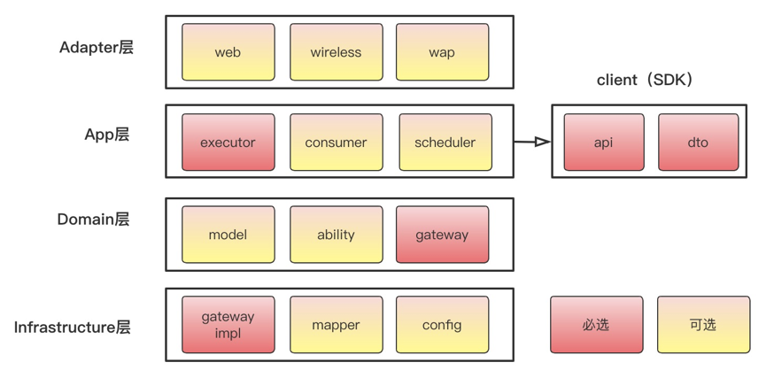

# DDD架构

## 一、DDD架构相关
1. DDD（Domain-Driven Design）架构，领域驱动设计，
2. 敏捷实践中的重构、测试驱动设计及持续集成可以对付各种混乱问题。重构——保持行为不变的代码改善清除了不协调的局部设计，测试驱动设计确保对系统的更改不会导致系统丢失或破坏现有功能，持续集成则为团队提供了同一代码库。

解决复杂和大规模软件的武器可以被粗略地归为三类：抽象、分治和知识。

分治 把问题空间分割为规模更小且易于处理的若干子问题。分割后的问题需要足够小，以便一个人单枪匹马就能够解决他们；其次，必须考虑如何将分割后的各个部分装配为整体。分割得越合理越易于理解，在装配成整体时，所需跟踪的细节也就越少。即更容易设计各部分的协作方式。评判什么是分治得好，即高内聚低耦合。

抽象 使用抽象能够精简问题空间，而且问题越小越容易理解。举个例子，从北京到上海出差，可以先理解为使用交通工具前往，但不需要一开始就想清楚到底是高铁还是飞机，以及乘坐他们需要注意什么。

知识 顾名思义，DDD可以认为是知识的一种。

根据需求划分出初步的领域和限界上下文，以及上下文之间的关系；
进一步分析每个上下文内部，识别出哪些是实体，哪些是值对象；
对实体、值对象进行关联和聚合，划分出聚合的范畴和聚合根；
为聚合根设计仓储，并思考实体或值对象的创建方式；
在工程中实践领域模型，并在实践中检验模型的合理性，倒推模型中不足的地方并重构。

一般的工程中包的组织方式为{com.公司名.组织架构.业务.上下文.*}，这样的组织结构能够明确的将一个上下文限定在包的内部。

## 二、COLA架构——DDD的具体实践
1. COLA架构：
2. COLA架构的目录结构
   - Adapter层：程序入口，相当于MVC中的controller；具体可以包含以下几种
     - RPC接口调用：通过RPC实现
     - 硬件调用：wireless设备调用
     - 前端调用：前端的页面展示等
     - MQ：消息队列的消息接收可以算作Adapter或者Application
   - Application层：主要负责获取输入，组装上下文，参数校验，调用领域层做业务处理，如果需要的话，发送消息通知等。层次是开放的，应用层也可以绕过领域层，直接访问基础实施层；
   - Domain层：主要是封装了核心业务逻辑，并通过领域服务（Domain Service）和领域对象（Domain Entity）的方法对App层提供业务实体和业务逻辑计算。领域是应用的核心，不依赖任何其他层次；
   - Infrastructure层：主要负责技术细节问题的处理，比如数据库的CRUD、搜索引擎、文件系统、分布式服务的RPC等。此外，领域防腐的重任也落在这里，外部依赖需要通过gateway的转义处理，才能被上面的Application层和Domain层使用。
3. COLA项目架构的基本样式
   
   

   |       层次       |     包名      |            功能             | 是否必须 |
   |:--------------:|:-----------:|:-------------------------:|:----:|
   |    Adapter     |     web     |         处理前端相关的请求         |  否   |
   |    Adapter     |     rpc     |       处理rpc框架相关的请求        |  否   |
   |    Adapter     |  wireless   |         处理硬件相关请求          |  否   |
   |                |             |                           |      | 
   |  Application   |  executor   | 处理request，包括command和query |  是   |
   |  Application   |  consumer   |        处理外部message        |  否   |
   |  Application   |  scheduler  |          处理定时任务           |  否   |
   |                |             |                           |      |
   |     Domain     |    model    |           领域模型            |  否   |
   |     Domain     |   ability   |   领域能力，包括DomainService    |  否   |
   |     Domain     |   gateway   |         领域网关，解耦利器         |  是   |
   |                |             |                           |      |
   | Infrastructure | gatewayImpl |           网关实现            |  是   |
   | Infrastructure |   mapper    |           数据库映射           |  否   |
   | Infrastructure |   config    |           配置信息            |  否   |
   |                |             |                           |      |
   |   Client SDK   |     api     |        服务对外透出的API         |  是   |
   |   Client SDK   |     dto     |         服务对外的DTO          |  是   |
4. 

参考文档：
1. DDD架构【美团技术团队】：https://tech.meituan.com/2017/12/22/ddd-in-practice.html
2. DDD架构：https://blog.csdn.net/qq_41889508/article/details/124907312
3. COLA架构：https://zhuanlan.zhihu.com/p/656764423
4. COLA架构：https://www.cnblogs.com/makai/p/14240924.html
5. 