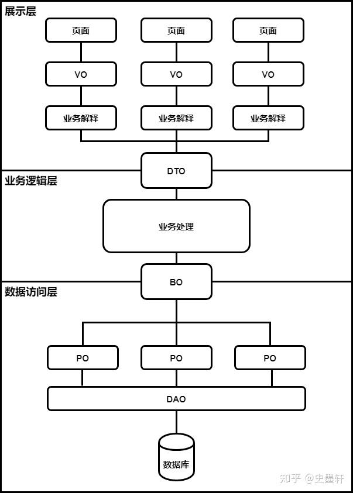

# JavaCodeQuality

## 一、各种对象POJO
1. VO（View Object）：显示层对象，通常是向视图层View显示的对象
2. DO（Domain Object）：领域实体对象【在阿里开发手册中，DO等同于PO；在DDD领域中，DO等同于BO】
3. DTO（Data Transfer Object）：数据传输对象，一般是远程服务调用之间的数据传输对象或者前后端之间的传输对象
4. BO（Business Object）：业务对象，可以由Service层输出的封装业务逻辑的对象
5. PO（Persistent Object）：持久层对象，该对象与数据库表结构一一对应，通过DAO层向上传输数据
6. 各层与Object的关系如下：   
   
7. VO和DTO的区别
   - 数目上的区别：VO会根据需要删减一些字段
   - 值的区别：VO可能需要针对DTO传过来的值进行一些处理

参考文档：
1. https://zhuanlan.zhihu.com/p/102389552
2. https://www.cnblogs.com/jiuchenchen/p/16524084.html
