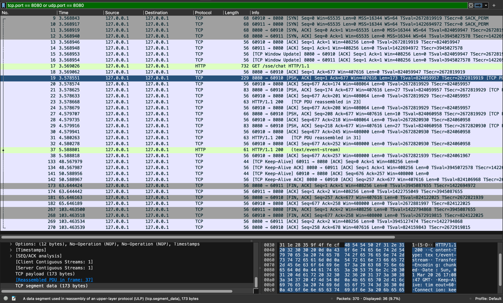

# SSE和WebSocket

## 一、SSE和WebSocket对比
1. 通信方式【单向通信 & 全双工通信】
   - SSE：SSE是基于HTTP协议的，它建立的是单向通道，只允许服务器向浏览器发送数据。这意味着客户端（浏览器）可以接收服务器的实时更新，但无法直接通过SSE向服务器发送数据。
   - WebSocket：WebSocket协议则更进一步，它提供了全双工通道，允许客户端和服务器之间进行双向通信。这意味着客户端和服务器都可以主动发送数据给对方，实时性更高，交互更丰富。
2. 协议与连接【都是基于http的，但是sse的实现要更加简单】
   - SSE：SSE是基于传统的HTTP协议实现的，它使用的是长轮询（long-polling）机制，客户端通过向服务器发送一个HTTP请求来建立连接，服务器会保持这个连接并打开，周期性地向客户端发送数据。这种方式的优点在于其简单性和对现有HTTP协议的兼容性。
   - WebSocket：WebSocket则是基于独立的TCP连接实现的，使用自定义的协议。它需要通过一次握手过程来建立持久连接，但一旦连接建立成功，就可以进行双向通信了。这种方式虽然相对于SSE来说网络开销稍大，但其提供的双向通信能力使得它在某些场景下更具优势。
3. 适用场景与优缺点【SSE：服务端向客户端发送信息，大模型流式回复，websocket：双向通信、聊天室等】
   - SSE：由于其单向通信的特性，SSE特别适合于那些只需要服务器向客户端推送实时更新数据的场景，如实时新闻更新、股票行情推送等。其优点在于简单易用、对服务器压力小且浏览器兼容性好。然而，其缺点也显而易见，即无法实现客户端与服务器之间的双向交互。
   - WebSocket：WebSocket则更适用于那些需要客户端和服务器之间进行实时双向通信的场景，如聊天室、在线游戏等。其支持双向通信、实时性高且可以实现更丰富的交互效果是其主要优点。但相应地，它也需要独立的TCP连接，这可能会增加一定的网络开销和对服务器的压力。同时，虽然现代浏览器都已经支持WebSocket协议，但在某些特定环境下可能仍存在兼容性问题。
   - 综上所述，SSE和WebSocket在通信方式、协议与连接以及适用场景与优缺点等方面都存在明显的区别。在选择使用哪种技术时，应根据具体需求和场景来进行权衡和选择。
4. 从HTTP角度，探究SSE的具体细节：客户端请求服务器后，服务器下发了一个TCP段，其中包含了`event-stream`类型，表示将开启SSE进行后续的信息推送
   
   

## 三、Java的SSE实现
1. Java的SSE实现，代码实现可以参考`Technical_Code/src/main/java/com/lxm/technical_code/SSE/SSEController.java`
2. SseEmitter接口说明
   - 构造方法
     - SseEmitter()：构造方法，用于创建一个新的 SseEmitter 对象。
     - SseEmitter(Long timeout)：构造方法，用于创建一个设置了超时时间新的 SseEmitter 对象。
   - 发送方法
     - send(Object data)：向客户端发送消息，支持字符串、JSON 等
     - send(Object data, MediaType mediaType)：指定 MIME 类型发送
     - complete()：正常关闭连接
     - completeWithError(Throwable ex)：异常关闭连接
   - 回调方法
     - onTimeout(Runnable callback)：设置超时回调
     - onError(Consumer<Throwable> callback)：设置错误回调
     - onCompletion(Runnable callback)：设置连接关闭的回调
3. 为什么要通过异步实现？因为从SseEmitter的表现来看，异步是实现流式的必要条件，或者可以说是框架的限制
   - 如果是单线程实现的
     - emitter的send方法会将数据写在缓冲区
     - 执行了controller层的return以后，才会告诉客户端将以流式形式下发信息
     - 此时服务端的处理逻辑已经结束，但是客户端收到了event-stream标识，持续打开链接，等待流式数据进入
     - 直到客户端发起keep-alive保活请求，发现远程客户端已经关闭，这时候才会主动关闭自己的资源
   - 如果是多线程实现：
     - controller层执行return返回的SseEmitter对象，实际上是下发了一个TCP段，其中标识后端将以流式返回
     - SseEmitter对象并没有因为被返回而销毁，因为这时候还有异步线程在执行send
     - 每次调用send方法，都会发送对应的信息至缓冲区，并将信息发出去，是以TCP段的形式实现的
     - 当数据全部发送完，SseEmitter对象执行complete方法，下发最终http的响应报文，标识http请求执行结束

## 四、SSE抓包分析（分析一次完整的sse）
1. 客户端请求之前，是不清楚服务端将以流式返回还是非流式返回的：请求流式接口和请求非流式的接口，从request中是看不出来的，参考`/ComputerNetwork/prof/request`，所以前端在请求一个接口的时候是不知道这个接口的后端将以什么形式返回数据
2. wireShark抓包案例：

   
3. case说明：
   - No.81-No.83：三次握手过程
   - No.84：TCP Window Update（参考文档[4]）
   - No.85：建立连接后，发起HTTP请求
   - No.86：服务器下发ACK，表明接收到请求
   - No.87：服务器下发PSH，标识推送数据，在这个帧中，下发了关键的`event-stream`表明是流式的
   - No.88-No.92、No.95-No.100：流式数据下发中
   - No.103：HTTP下发请求结束，代表流式下发完毕
   - No.104：收到结束请求
   - No.266-No.269：四次挥手过程
4. case来源
   - 后端实现：`Technical_Code/src/main/java/com/lxm/technical_code/SSE/SSEController.java`
   - curl命令：`curl --location '127.0.0.1:8080/sse/chat'`

参考文档：
1. https://www.cnblogs.com/ai888/p/18653890
2. Java实现sse：https://www.cnblogs.com/yihuihui/p/12622729.html
3. Java的SseEmitter接口说明：https://www.jb51.net/program/3243510z6.htm
4. wireShark获取到的异常帧：https://blog.csdn.net/m0_60259116/article/details/126002620