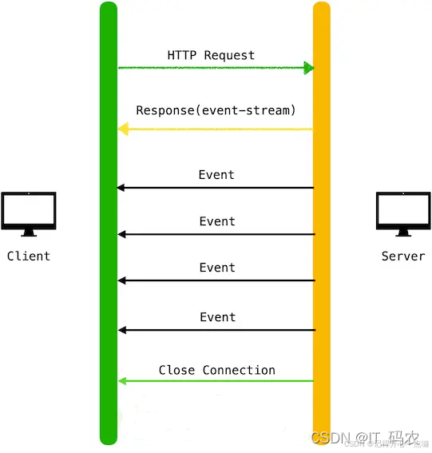

# SSE和WebSocket

## 一、SSE和WebSocket对比
1. 通信方式【单向通信 & 全双工通信】
   - SSE：SSE是基于HTTP协议的，它建立的是单向通道，只允许服务器向浏览器发送数据。这意味着客户端（浏览器）可以接收服务器的实时更新，但无法直接通过SSE向服务器发送数据。
   - WebSocket：WebSocket协议则更进一步，它提供了全双工通道，允许客户端和服务器之间进行双向通信。这意味着客户端和服务器都可以主动发送数据给对方，实时性更高，交互更丰富。
2. 协议与连接【都是基于http的，但是sse的实现要更加简单】
   - SSE：SSE是基于传统的HTTP协议实现的，它使用的是长轮询（long-polling）机制，客户端通过向服务器发送一个HTTP请求来建立连接，服务器会保持这个连接并打开，周期性地向客户端发送数据。这种方式的优点在于其简单性和对现有HTTP协议的兼容性。
   - WebSocket：WebSocket则是基于独立的TCP连接实现的，使用自定义的协议。它需要通过一次握手过程来建立持久连接，但一旦连接建立成功，就可以进行双向通信了。这种方式虽然相对于SSE来说网络开销稍大，但其提供的双向通信能力使得它在某些场景下更具优势。
3. 适用场景与优缺点【SSE：服务端向客户端发送信息，大模型流式回复，websocket：双向通信、聊天室等】
   - SSE：由于其单向通信的特性，SSE特别适合于那些只需要服务器向客户端推送实时更新数据的场景，如实时新闻更新、股票行情推送等。其优点在于简单易用、对服务器压力小且浏览器兼容性好。然而，其缺点也显而易见，即无法实现客户端与服务器之间的双向交互。
   - WebSocket：WebSocket则更适用于那些需要客户端和服务器之间进行实时双向通信的场景，如聊天室、在线游戏等。其支持双向通信、实时性高且可以实现更丰富的交互效果是其主要优点。但相应地，它也需要独立的TCP连接，这可能会增加一定的网络开销和对服务器的压力。同时，虽然现代浏览器都已经支持WebSocket协议，但在某些特定环境下可能仍存在兼容性问题。
   - 综上所述，SSE和WebSocket在通信方式、协议与连接以及适用场景与优缺点等方面都存在明显的区别。在选择使用哪种技术时，应根据具体需求和场景来进行权衡和选择。

## 二、SSE的具体细节
1. 客户端请求服务器，HTTP Request本身是有response的，只是在这个响应中包含了`event-stream`类型，表示将开启SSE进行后续的信息推送
   
   
2. Java的SSE实现

参考文档：
1. https://www.cnblogs.com/ai888/p/18653890
2. 手动实现sse：https://www.cnblogs.com/yihuihui/p/12622729.html