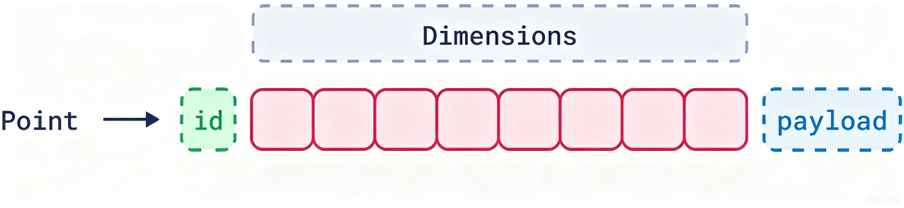
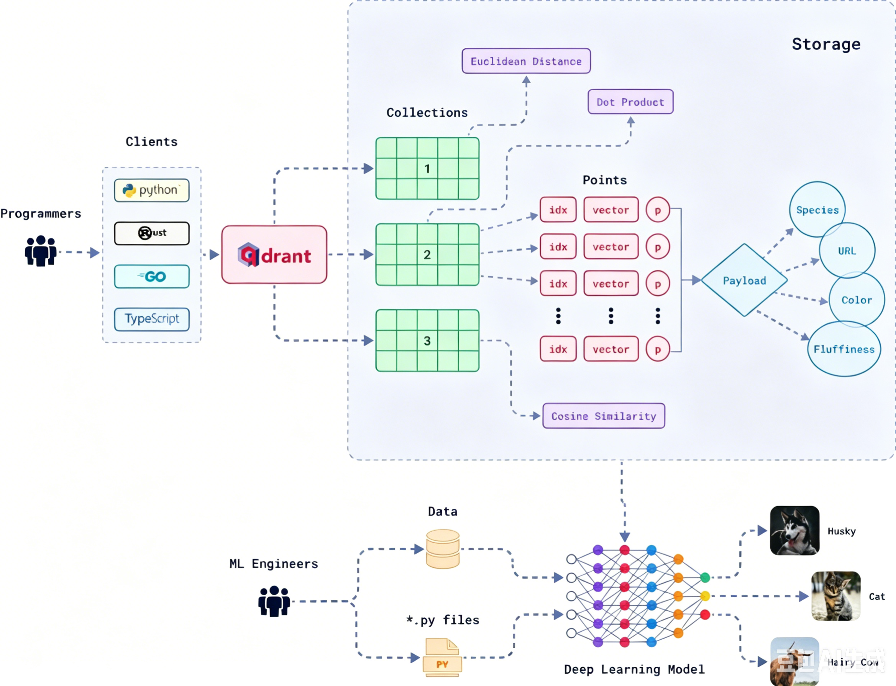

# 向量数据库

## 一、向量数据库简介
1. 人类世界日常产生的数据大多是非结构化的，它们缺乏严格的格式或者模式，这就导致传统数据库对这类数据无所适从
   - 传统`OLTP`数据库：`Online Transaction Processing`，面向日常业务交易、实时增删改查，是最常用的业务数据库
     - 场景：下单、转账、登录、订单、用户、库存、支付等线上交易
     - 操作：短事务、单条或少量数据，频繁增删改查
     - 响应：要求毫秒级实时响应
     - 数据量：单表千万级为主，强调数据一致性、高并发、高可用
     - 典型数据库：`MySQL`、`PostgreSQL`、`Oracle`、`SQL Server`
   - 传统`OLAP`数据库：`Online Analytical Processing`，面向大数据统计、分析、报表、挖掘，也就是数仓（分析）型数据库
     - 场景：经营报表、用户画像、销量统计、趋势分析、多维分析
     - 操作：大批量只读查询，极少修改，多为聚合计算（求和、分组、排序）
     - 响应：允许秒 / 分钟级延迟，不要求即时返回
     - 数据量：亿 / 百亿级海量数据，强调大数据吞吐、复杂查询、多维分析
     - 典型数据库：`ClickHouse`、`Doris`、`StarRocks`、`Hive`、`Greenplum`、`Redshift`
2. 向量数据库：将结构化的数据表示为向量，理解数据的上下文和概念相似性，从而实现数据相似性的高级分析和检索
   - 向量：向量是数据的数值表示形式，能够捕捉数据的上下文和语义
   - 向量数据库中定义向量的三个关键要素是：ID、维度和有效负载
     - ID：向量的唯一标识符
       - 与关系型数据库一样，向量数据库中的每个向量都有一个唯一ID。它是向量的“标签”，类似于主键，确保可以轻松找到向量
       - ID本身不参与相似性搜索（基于向量的数值数据操作），但它对于将向量与其对应的“现实世界”数据（如文档、图像或音频文件）关联至关重要
       - 执行搜索并找到相似向量后，会返回这些向量的ID，随后可以使用这些ID获取与结果相关的详细信息或元数据
     - 维度（`Dimension`）：数据的核心表示，每个向量的核心是一组数字，它们共同在多维空间中表示数据
       - 从文本到向量？使用嵌入模型（深度学习算法）或者大模型（比如BERT）实现
       - 其他模态的数据怎样嵌入？

         |   数据类型    |        典型预处理         |                      常用嵌入模型                      |
         |:---------:|:--------------------:|:------------------------------------------------:|
         |  PDF/文档   |       提取文本+分块        | BGE-M3、m3e、text-embedding-ada-002、Sentence-BERT  |
         |    图片     |        直接输入图像        |             CLIP、ViT、ResNet、Qwen-VL              |
         |   语音/音频   | Whisper转文字 或 直接音频嵌入  |            Whisper、Wav2Vec、AudioCLIP             |
         |    视频     |      抽帧 或 片段输入       |      VideoMAE、CLIP4Clip、Gemini Embedding 2       |
         |   多模态混合   |        统一格式输入        |          Gemini Embedding 2、CLIP、LLaVA           |
       - 嵌入将复杂的数据简化为一种可以在多维空间中进行比较的形式
     - 有效负载（`Payload`）：也叫负载，或者元数据；可以是原文信息，也可以是原文信息+补充信息等。
       - 负载可以存储任意结构化数据：字符串、数字、标签、时间、分类、原文、文件路径、权限、业务状态，比如
         ```json
         {
             "file_type": "PDF",
             "category": "技术文档",
             "create_time": "2026-06-11",
             "author": "张三",
             "page": 12,
             "is_public": true,
             "raw_text": "文档原文片段"
         }
         ```
       - 已经存储了向量，为什么还需要负载？向量负责**语义相似搜索**，Payload 负责**业务筛选、结果补全、过滤、权限控制**，二者缺一不可
         - 向量只能判“相似”，不能做精准业务过滤
         - 向量是“黑盒特征”，人类无法读懂，必须靠负载还原业务内容
         - 复杂业务条件检索（范围、排序、聚合），必须依赖负载中的内容
         - 数据管理与运维（更新、删除、生命周期），很多业务需要按业务属性管理数据，而非单纯按向量相似
         - 大模型RAG场景刚需，检索后需要将召回的原文拼接进入大模型上下文之中
     
     
   - 与传统数据库的对比
   
     |  特性   |    OLTP 数据库    |    OLAP 数据库     |        向量数据库        |
     |:-----:|:--------------:|:---------------:|:-------------------:|
     | 数据结构  |      行和列       |       行和列       |         向量          |
     | 数据类型  |      结构化       |   结构化/部分非结构化    |        非结构化         |
     | 查询方法  |  基于SQL（事务性查询）  | 基于SQL（聚合、分析查询）  |     向量搜索（基于相似性）     |
     | 存储重点  |   基于模式，优化更新    |    基于模式，优化读取    |       上下文和语义        |
     |  性能   |   优化高容量事务处理    |    优化复杂分析查询     |     优化非结构化数据检索      |
3. 
4. 


## 二、向量数据库内部探究
1. 向量数据库的架构
   - 
    - 架构图

      
    -
2. 向量数据库的HNSW算法
3. 向量数据库的


## 三、向量数据库基础使用


------
参考资料：
1. https://blog.csdn.net/a_art_xiang/article/details/146005455
2. https://blog.csdn.net/z4400840/article/details/144964802


