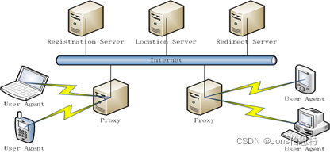
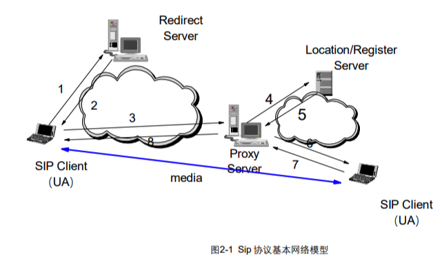
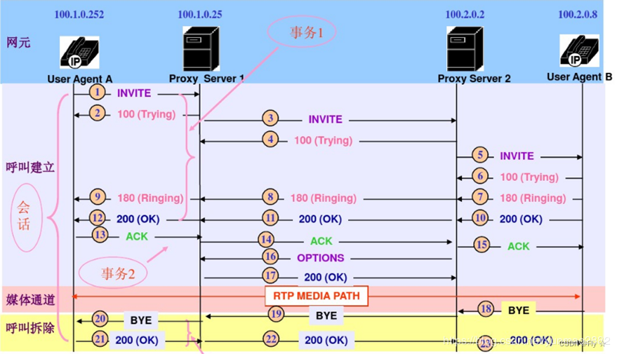
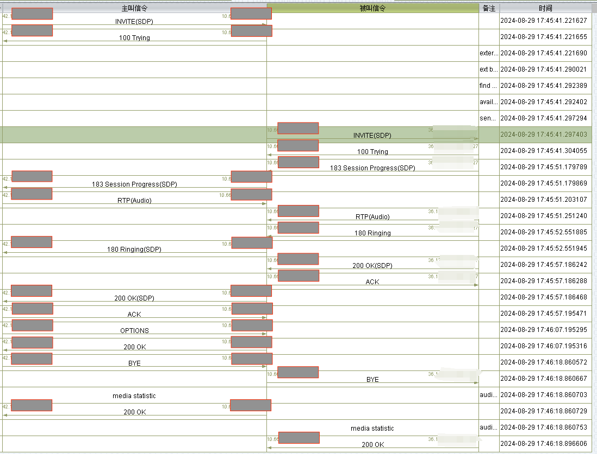
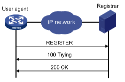
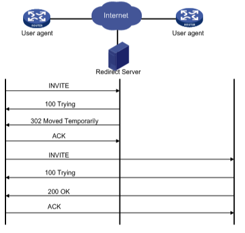

# SIP相关知识

# 一、SIP基本内容
1. SIP协议，是指Session Initiation Protocol，中文指会话发起协议，是一个应用层的控制协议，用于发起、维护和终止包括语音、视频和消息传递应用程序的通信会话。SIP用于互联网电话、专用IP电话以及通过LTE的移动电话呼叫。
2. SIP协议的使用场景
   1. 实时通信：SIP协议可以用于实现实时通信，包括语音、视频、消息等。可以使用SIP协议在不同终端设备质检建立语音通话或者视频会议。
   2. 呼叫控制：SIP协议可以用于呼叫控制和呼叫管理。可以使用SIP协议将呼叫路由到目标终端设备，或者使用SIP协议终止呼叫。
   3. 电话系统：SIP协议可以用于构建电话系统。可以使用SIP协议将电话呼入路由到IP电话或者传统电话网，也可以使用SIP协议实现语音信箱和呼叫转移等电话功能。
   4. 联网设备：SIP协议可以用于联网设备之间的通信。可以使用SIP协议在IoT设备之间传递命令和数据。
3. SIP的主要基本功能
   1. 确定用户能力：确定被叫终端可用于参加会话的媒体类型及媒体参数。SIP终端在消息交互过程中携带自身的媒体类型和媒体参数，这使得会话双方都可以明确对方的会话能力。 
   2. 建立会话：建立主被叫双方的会话。SIP会话双方通过协商媒体类型和媒体参数，最终选择双方都具有的能力建立起会话。 
   3. 管理会话：可以更改会话参数或中止会话。 
   4. 确定用户位置：确定被叫SIP用户所在的位置。SIP的最强大之处就是用户定位功能，它可以利用SIP终端在注册服务器上的注册信息实现用户定位，也可以利用其他定位服务器，如DNS、LDAP等提供的定位服务来增强其定位功能。 
   5. 确定用户可用性：确定被叫会话终端是否可以参加此会话。SIP支持多种地址描述和寻址方式，包括SIP-URI（比如sip：123456@172.18.24.11）、Tel-URL（比如tel：+1312000）和SIPS-URI（sips：123456@172.18.24.11）。这样，SIP主叫根据被叫地址，就可以识别出被叫是否在传统电话网上，然后通过一个与传统电话网相连的网关向被叫发起并建立呼叫。
4. SIP协议是一个应用层的控制协议；在传输层，SIP协议可以选择UDP或者TCP实现信息的传输，


# 二、SIP信令内容
1. SIP消息体与HTTP协议类似，包括请求行（状态行）、消息头、正文。
2. 请求行
   1. 请求行格式：[Method]-[Request-URI]-[SIP-Version]-[CRLF]  
      例：INVITE sip:bob@zju.com SIP/2.0 /r/n
   2. 请求行的`[Method]`字段
   
      | Method | 方法说明 |
      | - | - |
      | REGISTER | 注册联系信息 |
      | INVITE | 发起会话请求 |
      | ACK | INVITE请求的响应的确认 |
      | CANCEL | 取消请求 |
      | BYE | 终结会话 |
      | OPTIONS | 查询服务器能力 |
      | MESSAGE | 传递不超过1300字节的数据 |
   3. 请求行的`[Request-URI]`字段
      指示请求的用户或者服务的地址信息，格式name@domain，例如alice@atlanta.com。
   4. 请求行的`[SIP-Version]`字段
      请求和响应消息都要包含SIP版本
   5. 请求行的`[CRLF]`字段（后面状态行等的CRLF都一样）
      rfc2543中规定了SIP的CR：%d13 ; US-ASCII CR, carriage return character；LF：%d10 ; US-ASCII LF, line feed character  
      因此SIP的CRLF联合起来就是/r/n
3. 状态行
   1. 状态行格式：[SIP-Version]-[Status-Code]-[Reason-Phrase]-[CRLF]
   2. 状态行举例：SIP/2.0 200 OK /r/n
   3. 状态行的`[Status-Code]`字段：
      状态码由3位数字组成，表示请求是否被理解或被满足；其第一个数字定义了响应的类别，后面两位没有具体的分类。  

      |  状态码  |                说明                |
      |:-----:|:--------------------------------:|
      |  100  |           尝试呼叫（trying）           |
      |  180  |           振铃（Ringing）            |
      |  181  | 呼叫整子啊前赚（Call is Being Forwarded） |
      |  183  |     会话处理中（Session Progress）      |
      |  200  |             成功响应（OK）             |
      |  302  |      临时迁移（Move Temporarily）      |
      |  400  |        错误请求（Bad Request）         |
      |  401  |        未授权（Unauthorized）         |
      |  403  |          禁止（Forbidden）           |
      |  404  |         用户不存在（Not Found）         |
      |  408  |      请求超时（Request Timeout）       |
      |  480  | 暂时无人接听（Temporarily Unavailable）  |
      |  486  |          线路忙（Busy Here）          |
      |  504  |      服务器超时（Server Time-out）      |
      |  600  |       全忙（Busy Everywhere）        |
   4. 状态行的`[Reason-Phrase]`字段：
      原因码，描述状态码，增强可读性，对状态码的简短文本描述，用于提供关于响应的额外信息
4. 消息头
   1. 消息头主要分为通用头（General-Header）、请求头（Request-Header）、响应头（Response-Header）、实体头（Entity-Header）。
      ```text
      【通用头】通用头用于提供与消息本身相关的全局信息，这些信息对请求和响应都适用。常见的通用头包括：Via、Max-Forwards。
      【请求头】用于标识和描述SIP请求消息，它们提供了关于请求发起者、接收者以及请求类型等关键信息。常见的请求头包括：From、To、Call-ID、CSeq、Contact。
      【响应头】用于描述SIP响应消息，它们提供了关于响应状态、接收者信息等关键信息。常见的响应头包括：To、From、Call-ID、CSeq。
      【实体头】用于描述SIP消息体（如果存在）的属性和内容类型。当SIP消息包含消息体时，实体头就显得尤为重要。常见的实体头包括：Content-Type、Content—Length。
      ```
   2. 消息头实例
      ```text
      MESSAGE sip:0210011140114@10.192.39.37:17017 SIP/2.0
      Via: SIP/2.0/UDP 10.192.39.194:15069;rport;branch=z9hG4bK2000324456
      From: <sip:0100012000002@10.192.39.194:15069>;tag=2253307030
      To: sip:0210011140114@10.192.39.37:17017
      Contact: <sip:0100012000002@10.192.39.194:15069>
      Call-ID: 755416301
      CSeq: 20 MESSAGE
      Content-Type: Application/MANSCDP+xml
      Max-Forwards: 70
      User-Agent: eXosip/3.3.0
      Content-Length: 161
      ```
   3. 消息头各个字段解析
   
      | Header | 含义 | 举例 |
      | ------ | --- | --- |
      | call-ID | 由本地设备生成，全局唯一，每次呼叫这个值唯一不变 | Call-ID: 755416301 |
      | From | 表示请求的发起者 | From: <sip:0100012000002@10.192.39.194:15069>;tag=2253307030 |
      | To | 表示请求的接收者 | To: sip:0210011140114@10.192.39.37:17017 |
      | Via | Via头是被服务器插入request中的，用来检查路由环的，并且可以使Response根据Via找到返回的路 | Via: SIP/2.0/UDP 10.192.39.194:15069;rport;branch=z9hG4bK2000324456 |
      | Max-Forwards | 用于表示这个包最多可以传送多少跳，每经过一跳都会减一，当Max-Forwards=0系统会返回483。默认为70 | Max-Forwards: 70 |
      | Contact | 包含源的URI信息，用来给响应方直接和源建立连接用 | Contact: <sip:0100012000002@10.192.39.194:15069> |
      | Content-Type | 指明消息体的类型 (SDP会话描述协议) | Content-Type: Application/MANSCDP+xml |
      | Content-Length | 指明消息体的字节大小 | Content-Length:161 |
5. 正文（消息体）：主要用于描述会话的具体实现方式或额外额外的信息。
   SIP消息体是SIP消息中可选的一部分，紧随消息头之后，并通过一个空行与消息头分隔开。它可以是描述符，也可以是任何不透明物体，如XML、SDP（会话描述协议）等。
   正文的内容主要遵循SDP，会话描述协议，当用户代理发送创建媒体会话的请求时，它包含其支持的编解码器的描述。


# 三、SIP协议架构
1. SIP协议主要包括以下几种逻辑上的角色：UA（User Agent，用户代理），Proxy Server，Registration/Location Server，Redirect Server。
2. UA，User Agent，用户代理，类似于HTTP协议中浏览器的角色，收集用户信息，与用户在前线交流，是用户操作的终端界面，用户代理需要符合SIP协议的要求，但是结合其他的协议和不同的场景，也会有不同的实现逻辑。  
   UA分为UAC（User Agent Client）和UAS（User Agent Server）两种逻辑实体，UAC发送SIP Request并接收Response，UAS接收SIP Request并返回Response，一个物理设备既可以是UAC同时也可以是UAS。
3. Proxy Server，代理服务器，主要是转发Request和Response给其他的Proxy Server或者UA。Proxy Server分为有状态代理服务器和无状态代理服务器，前者会保留一次通信事务的状态，通过一个有限自动机来控制转发操作，而后者不保存状态，只是实现透明的转发操作。
4. Registration/Location Server，注册和定位服务器，用于登记和定位UA，在线的UA会定时的向注册服务器发送SIP消息来表明UA当前的位置，Registration服务器会将该信息存入数据库中，当其他UA向该UA发送request时就能获得该UA的位置。
5. Redirect Server，用于重定向，在逻辑上相当于一个特殊的UA。
6. 架构图  
     
     

# 四、SIP协议概念
1. SIP协议有三个需要重点理解的概念，事务（Transaction），会话（Session），对话（Dialog）。
2. 事务：事务是指一个请求消息以及这个请求对应的所有响应消息的集合。  
   对于INVITE事务来讲，出了包含INVITE请求和对应的响应消息之外，在非成功响应的情况下，还包括ACK请求。
   Via头中的branch参数能够唯一确定一个事务，branch值相同，代表同一个事务。
   事务是由事件来引起的，一个方法的建立和到来都将建立新的事务。
   根据SIP协议描述一个事务由5个必要部分组成，from & to & Via头中的branch参数 & call-id & cseq，这五个部分可以一起识别某一个事务，缺一不可。
3. 对话：对话是指两个UA之间持续一段时间的点对点SIP连接。
   对话使得UA之间的消息变得有序，同时给出请求消息的正确的路由。
   Call-ID、from中的tag字段、to中的tag字段三个值的组合能够标识一次唯一的对话。
4. 会话：会话是一次通信过程中所有参与者之间的关联关系以及他们之间的媒体流的集合。

# 五、SIP协议交互
1. 发起通话的交互流程
   - SIP发起电话的两种类别（根据被叫是否是静态地址或者是动态地址）
     - 被叫是静态地址：直接呼叫，向被叫发送INVITE请求
     - 被叫是动态地址：当被叫端为动态IP地址时，则需要借助SIP登记器确定被叫方的IP地址。主叫会通过Proxy Server向注册中心查找被叫的地址。
   - 基本理论
      ```text
      UAC 发送 INVITE 请求给 UAS，包含了自身的 SDP 描述信息，UAS 收到 INVITE 请求后，将返回 100 Trying 响应，表示正在处理请求。
      UAS 分析 SDP 描述信息，并根据其支持的编解码器和传输协议，选择合适的音频和视频编解码器以及传输协议，并生成自己的 SDP 描述信息，然后将该信息打包成 200 OK 响应发回给 UAC。
      UAC 收到 200 OK 响应后，分析 SDP 描述信息，并根据其支持的编解码器和传输协议，选择合适的音频和视频编解码器以及传输协议，并将该信息打包成 ACK 请求，发送给 UAS，表示接受了 UAS 提供的媒体协商。
      UAS 收到 ACK 请求后，开始发送 RTP 数据包（实时传输协议，用于传输音频和视频数据），表示 VoIP 会话已经建立。
      在会话过程中，UAS 可能会发送一些状态信息给 UAC，例如 180 Ringing 响应，表示正在振铃；或者 183 Session Progress 响应，表示会话处理中，代表处理有关未分类的呼叫处理的信息
      ```
      
   - 线上案例（一次正常的通话过程）
   
      | 主叫(UA)活动 | Proxy Server活动 | 被叫(UA)活动 |
      | ---------- | ---  | ---  |
      | 向Proxy Server发送INVITE请求 | | |
      | | 向主叫发送TRYING信令 | |
      | | 服务器内部校验请求 | |
      | | 校验成功，向被叫发送INVITE请求 | |
      | | | 被叫收到INVITE信令，返回TRYING |
      | | | 被叫发送Session Progress信令，会话处理中 |
      | | Proxy Server转发Session Progress信令 | |
      | 收到Session Progress信令，发送语音包 | | |
      | | --- | |
      | | | 发送语音包 |
      | | | 发送响铃信令RINGING |
      | | 转发RINGING | |
      | 收到RINGING | | |
      | | | 用户接听，发送OK信令 |
      | | 收到信令，回应ACK | |
      | | 向主叫发送OK，转发已接听 | |
      | 收到已接听，返回ACK | | |  
      | 17:45:57 会话已经建立 | 17:45:57 会话已经建立 | 17:45:57 会话已经建立 |  
      | 交互语音 | 交互语音 | 交互语音 |  
      | 发送OPTION保活信令（特殊机制） | | |
      | | 返回保活信令OK | |
      | 17:46:07 会话结束 | 17:46:07 会话结束 | 17:46:07 会话结束 |  
      | 主叫挂断，发送BYE信令 | | |
      | | 转发BYE信令，并返回OK | |
      | 收到Proxy Server的BYE信令，返回OK | | |
      | 主叫已经挂断 | | |
      | | | 收到Proxy Server的BYE信令，挂断并返回OK |
      | | 通话结束 | |
      
2. 结束通话的交互流程
   UAC（User Agent Client）或者 UAS（User Agent Server）决定结束通话。
   ```text
   发送 BYE 请求：
   当 UAC 决定结束通话时，它将向 UAS 发送一个 BYE 请求。
   当 UAS 决定结束通话时，它也可以向 UAC 发送一个 BYE 请求。
   对方接收到 BYE 请求后，需要发送 200 OK 响应以确认通话结束。
   通话正式结束，两端释放资源，关闭连接。
   ```
3. 注册的交互流程
   ```text
   在完整的SIP系统中，所有的SIP终端作为User Agent都应该向注册服务器登记注册，以告知其位置、会话能力、呼叫策略等信息。通常，SIP终端开机启动或者配置管理员执行注册操作时，就向注册服务器发送注册请求消息（REGISTER），该消息中携带了所有需要登记的信息。注册服务器收到注册请求消息后向终端发送回应消息，以告知其请求消息已收到。如果注册成功，就再向终端发送“200 OK”消息。
   ```
   
4. 重定向呼叫
   ```text
   SIP重定向服务器收到会话请求消息后，不是转发会话请求消息，而是在回应消息中告知被叫SIP终端的地址。主叫终端从而重新直接向被叫终端发送会话请求消息。被叫终端也将直接向主叫终端发送应答消息。
   ```
   
   
# 六、Java中sip开发框架
1. 来自[stackoverflow](https://stackoverflow.com/questions/498043/what-is-the-currently-popular-java-sip-library)
2. SIP Servlet
3. peers
4. [jain-sip](https://zhuanlan.zhihu.com/p/699932572)

   


参考文章
1. https://blog.csdn.net/wai_58934/article/details/136315034
2. https://blog.csdn.net/jisuanji111111/article/details/129299363
3. https://blog.csdn.net/huangyifei_1111/article/details/122865544
4. https://blog.csdn.net/hao745580264_dawei/article/details/140464697
5. https://blog.csdn.net/wai_58934/article/details/136315034
6. https://blog.csdn.net/weixin_45533131/article/details/132385632
7. jain-SIP的demo：https://blog.csdn.net/FlyLikeButterfly/article/details/85101473