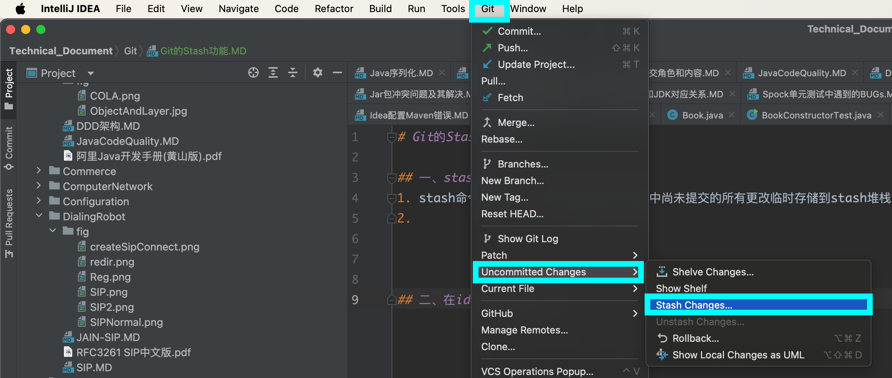
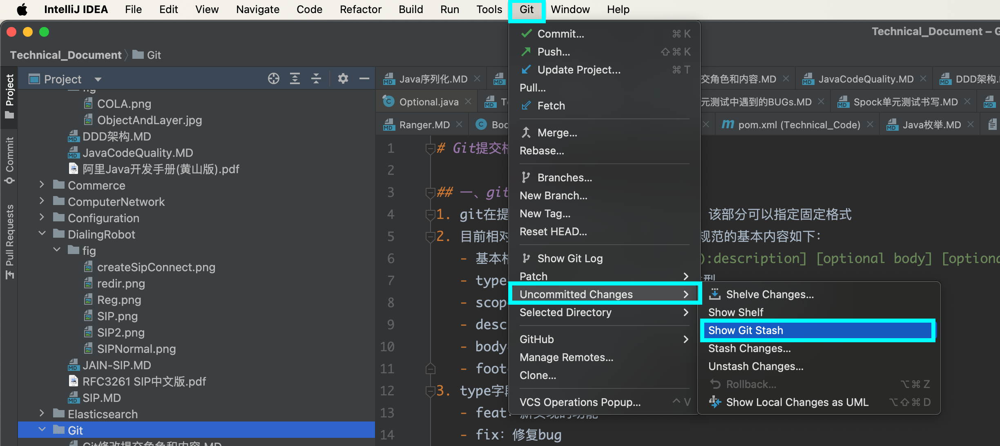
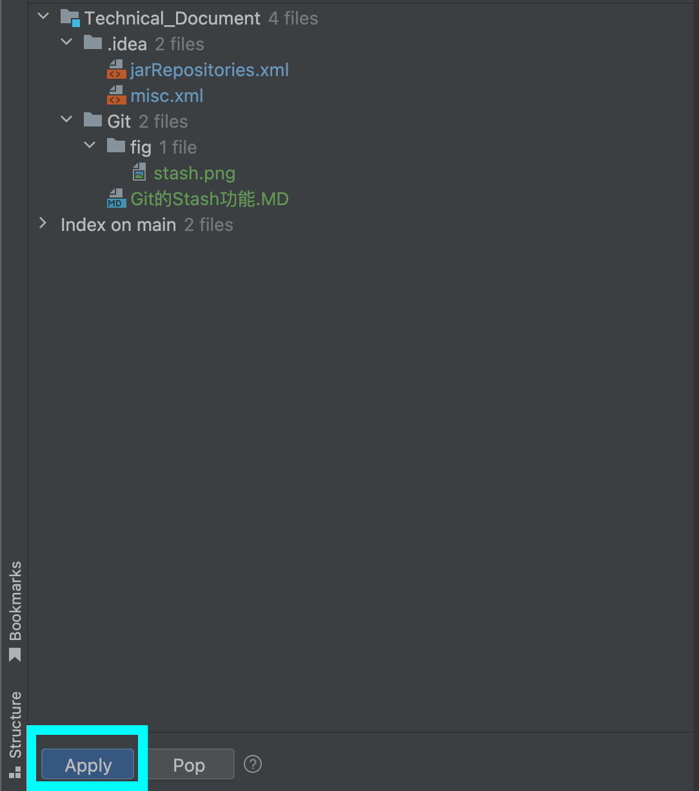

# Git的Stash功能

## 一、stash命令
1. stash命令基本含义：能够将当前工作目录中尚未提交的所有更改临时存储到stash堆栈中；切换到其他分支再切回来的时候，可以动态恢复，避免了使用commit的尴尬局面。
2. 基础命令信息如下：

   |                    命令                     |                说明                 |
   |:-----------------------------------------:|:---------------------------------:|
   |                 git stash                 |           将当前工作空间的状态保存            |
   |              git stash list               |          查看当前Git中存储的所有状态          |   
   |        git stash apply {stashName}        |           根据存储名称读取Git存储           |
   |        git stash drop {stashName}         |           根据存储名称删除Git存储           |  
   |           git stash save "日志信息"           |       将当前工作空间的状态保存并指定一个日志信息       |
   |               git stash pop               | 读取stash堆栈中的第一个存储，并将该存储从stash堆栈中移除 |   
   |      git stash show [-p] {stashName}      |         查看指定存储与未建立存储时的差异          |
   | git stash branch {branchName} [stashName] |        创建并切换到一个新分支来读取指定的存储        |  
3. stash是一个堆栈结构，存在多次提交的时候要注意

## 二、在idea中使用stash
1. stash（临时保存）
   
2. apply（应用保存的stash）
      
   

参考文档
1. https://blog.csdn.net/Bb15070047748/article/details/139791345