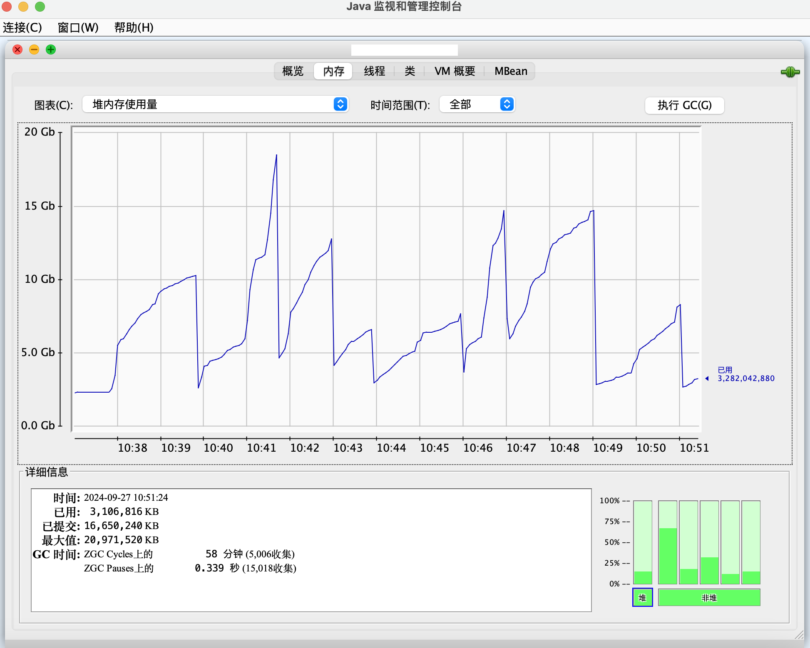

# JVM内存分析实录

## 一、分析内存前的准备

1. 找到当前机器的JAVA_HOME目录，在Linux系统下，可以使用`echo $JAVA_HOME`命令，该目录的`bin`子目录中自带了很多的java内存分析工具。
2. 个人的jdk目录是`/opt/soft/jdk/jdk-17.0.2/bin`，切换到这个目录下面之后，可以看到java自带的内存分析工具
3. JDK14起，已不再集成visualvm，需要自己去visualvm官网下载；下载地址：https://visualvm.github.io/ 。

## 二、内存分析工具
1. visualVM: JDK14之前自带，在后续版本被取消（本次没有使用）。
2. jConsole: 是各个版本JDK自带的，可以通过远程方式指定端口号和ip地址，本地监控远程的JVM运行情况。
   1. 【命令行模式】该工具可以本地执行：
      ```text
      jconsole 2956
      ```
   2. 【命令行模式】该工具可以远程调试：
      ```text
      jconsole hostName:portNum
      ```
3. jstat: 命令行工具，用于输出线程的调用栈，有助于分析线程死锁问题。
4. jstack: 命令行工具，用于生成java虚拟机当前时刻的进程快照。
5. jmap: 用于生成堆转储文件的命令行工具。
6. MAT（Memory Analyzer）：


## 三、线上内存分析案例
1. `jstat -gc [进程号]` 展示从项目启动到当前时刻GC相关信息
    ```txt
    S0C  S1C  S0U  S1U  EC  EU      OC           OU          MC         MU       CCSC      CCSU     YGC     YGCT   FGC   FGCT   CGC    CGCT     GCT   
    -    -    -    -    -   -   10964992.0    9701376.0   356288.0   355327.9   53504.0   52991.4    -        -     -      -   73291   2.225   2.225

    S0C  S1C  S0U  S1U  EC  EU      OC           OU          MC         MU       CCSC      CCSU     YGC     YGCT   FGC   FGCT   CGC    CGCT     GCT   
    -    -    -    -    -   -   10711040.0   10237952.0   356288.0   355327.9   53504.0   52991.4    -        -     -      -   73296   2.226   2.226

    S0C  S1C  S0U  S1U  EC  EU      OC           OU          MC         MU       CCSC      CCSU     YGC     YGCT   FGC   FGCT   CGC    CGCT     GCT   
    -    -    -    -    -   -    8388608.0    4249600.0   356288.0   355327.9   53504.0   52991.4    -        -     -      -   73566   2.234   2.234
    ```

   | 参数名称 |                 含义                 |
   |:----:|:----------------------------------:|
   | S0C  |    年轻代中第一个survivor（幸存区）的容量（字节）     |
   | S1C  |    年轻代中第二个survivor（幸存区）的容量（字节）     |
   | S0U  |  年轻代中第一个survivor（幸存区）目前已使用空间（字节）   |
   | S1U  |  年轻代中第二个survivor（幸存区）目前已使用空间（字节）   |
   |  EC  |        年轻代中Eden（伊甸园）的容量（字节）        |
   |  EU  |      年轻代中Eden（伊甸园）目前已使用空间（字节）      |
   |  OC  |             老年代的容量（字节）             |
   |  OU  |           老年代目前已使用空间（字节）           |
   |  MC  |       metaspace（元空间）的容量（字节）        |
   |  MU  |     metaspace（元空间）目前已使用空间（字节）      |
   | CCSC |           当前压缩类空间的容量（字节）           |
   | CCSU |         当前压缩类空间目前已使用空间（字节）         |
   | YGC  |        从应用程序启动到采样时年轻代中gc次数         |
   | YGCT |      从应用程序启动到采样时年轻代中gc所用时间（秒）      |
   | FGC  |      从应用程序启动到采样时老年代（全gc）gc次数       |
   | FGCT |    从应用程序启动到采样时老年代（全gc）gc所用时间（秒）    |
   | CGC  |  从应用程序祈祷难过到采样时发生concurrent gc的次数   |
   | CGCT | 从应用程序祈祷难过到采样时发生concurrent gc的时间（秒） |
   | GCT  |       从应用程序启动到采样时gc花费的总时间（秒）       |

   通过线上的情况看，老年代的占用确实占满了，需要进一步排查问题，究竟是那部分代码导致了老年代占用过高。

2. `jmap -histo [pid] >> myTxt.txt` 将内存相关数据，写到文件中，方便查看。
3. 使用JConsole工具：
   - 使用方式：
     - 在部署远程服务器时，在JVM启动参数中，添加下列参数：
       - `-Dcom.sun.management.jmxremote`: 是否支持JMX远程访问？
       - `-Djava.rmi.server.hostname=10.192.1.0`: 可以指定ip或者指定ip范围，例如`192.168.1.0/24`(24是子网掩码，前24位是固定的)。注意，这里的ip是服务器的ip，把服务部署在哪里就写哪个。
       - `-Dcom.sun.management.jmxremote.port=8899`: jmx绑定的端口
       - `-Dcom.sun.management.jmxremote.ssl=false`: 启用ssl连接？
       - `-Dcom.sun.management.jmxremote.authenticate=false`: 开启鉴权?
     - 启动一个本地的jConsole程序，将hostname和port配置完整，实现远程链接
   - 实时监控案例 
4. 


## 四、内存分析经验
1. 线上不要在有流量的时候进行dump，dump会导致stw，请求会超时很长时间。


参考文档

1. https://blog.csdn.net/qq_33204709/article/details/132126351
2. Oracle的官方文档：https://docs.oracle.com/en/java/javase/17/management/using-jconsole.html#GUID-0FAC766D-A99A-4E98-B6BC-1D5711C71CAE
3. -Djava.rmi.server.hostname参数配置ip：https://www.5axxw.com/questions/simple/kh4v0f
4. 