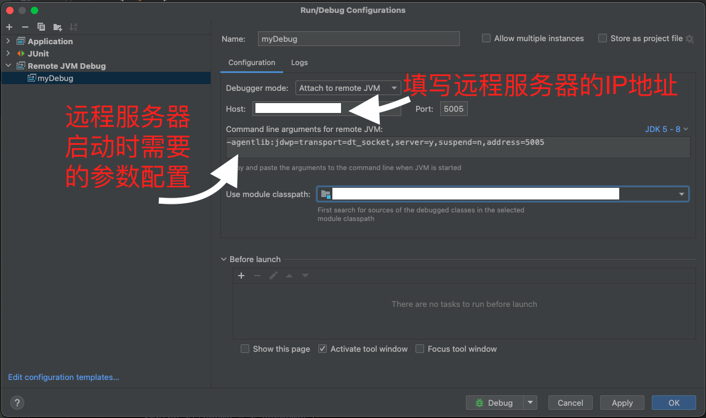
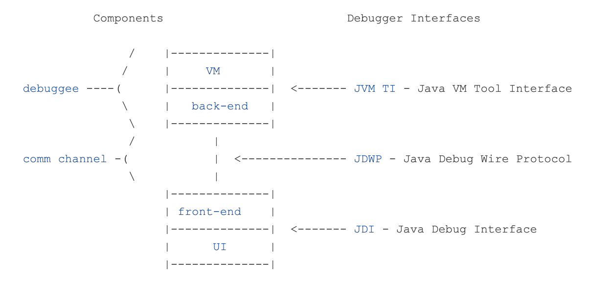

# 远程Debug的使用及原理

## 一、JVM远程Debug的必要性
1. 一般情况下，了解远程服务器的运行情况一般是通过打日志来实现的，根据分析日志逐步推断是哪里出了问题。
2. 日志查看定位问题的一般模式：想查看日志不仅仅需要在写代码的时候进行设计（当然是必要的），更需要在可能出现问题的地方提前输出日志，也即“事前诸葛亮”，一旦本次没有通过日志定位到问题，就不得不重新部署一版的代码，设置新的日志，然而本质上还是在猜测问题在哪里。
3. 翻看日志的繁琐性：grep -C 命令在一部分程度上可以降低繁琐程度，但是依然不好直接定位。
4. 得益于JVM的独特设计，java提供了远程的debug的模式，在本机设置断点就可以进行调试。


## 二、JVM远程Debug的使用方式
1. 远程debug的重要性
2. JVM的远程debug可以用简单的服务器--客户端模式来理解，远程的控制终端（idea等编译器）可以作为客户端，向远程的待调试机器发送请求；因此，如果想完成远程debug操作，我们需要在远程服务器和本地编译器上做相关的配置。
3. 【本地代码配置】
   以idea为例，选择「edit configuration」，选择「Remote JVM Debug」，配置如下：
    
   端口一般选择5005。
4. 【远程服务器配置】
   远程服务器需要在启动JVM的时候，在指定参数中加上``-Xdebug -Xrunjdwp:transport=dt_socket,address=5005,server=y,suspend=n``
    这部分的配置因服务不同有区别，有的需要在Maven中配置参数，有的需要在自研组件中指明。
5. 参数配置说明
    ```txt
    -Xdebug:通知JVM以debug模式工作
    -Xrunjdwp:通知JVM使用java debug wire protocol运行调试环境
    transport=dt_socket:指定了调试数据的传输方式，dt_socket是用SOCKET模式，还有其他的Windows平台限定的dt_shmen模式
    address=5005:调试服务器的端口号，用于传输消息的端口
    server=y:有两个值，y或者n，代表yes或者no，表示JVM是否需要作为调试服务器执行
    suspend=n:也有y或者n两个值，表示在调试客户端建立连接之后启动JVM
    ```

## 三、JVM远程Debug的基本原理
远程Debug的原理是根据[Java调试体系结构（官方文档）](https://docs.oracle.com/javase/8/docs/technotes/guides/jpda/architecture.html)中的关键组成部分Java Debug Wire Protocol(JDWP)，JDWP定义了调试器和被调试Java虚拟机之间的通信协议。借助该协议，调试器（本地编译器）可以查询被调试JVM的状态，设置断点，控制程序执行流程等。 
1. Java Debug Architecture(JDA)的关键组件
    ```txt
   JVMTI（Java Virtual Machine Tool Interface）: 一套原生编程接口，允许开发工具和调试器与JVM进行交互。JVMTI支持对代码执行的深入监控和控制，例如获取信息、设置断点和单步执行。
   JDWP（Java Debug Wire Protocol）: 一个网络协议，定义了调试器与JVM（或任何其他Java应用程序）之间的通信规范。JDWP使得调试器能够独立于它们所调试的JVM运行，允许通过网络进行远程调试。
   JDI（Java Debug Interface）: 一个高级Java编程接口，提供了在Java代码中编写调试器的能力。JDI建立在JVMTI之上，为开发者提供了一个更简单、更直观的API来控制调试过程。
    ```
   
2. 远程调试工作流程
   1. 启动远程应用程序的JVM以侦听调试连接： 
   通过在JVM启动参数中添加特定的JDWP选项，可以让远程JVM作为一个调试服务器启动，它会在指定端口上侦听来自调试器的连接请求。
   2. 调试器连接到远程JVM:
   调试器（如IntelliJ IDEA）使用JDWP通过网络连接到远程JVM的侦听端口。这需要调试器知道远程机器的IP地址（或主机名）和端口号。
   3. 双方通过JDWP交换数据:
   一旦连接建立，调试器和远程JVM就可以通过JDWP协议交换数据。调试器可以请求信息（如变量值、线程状态等）、设置断点、控制程序流（如暂停、继续执行、单步执行等）。
   4. 断点和程序控制:
   当远程应用程序执行到调试器设置的断点时，JVM会暂停执行并通知调试器。然后，调试器可以进一步控制程序执行或查询程序状态。
3. LeetCode的java调试功能的实现，可能基于该设计


参考文章：
1. https://blog.csdn.net/qq_28369007/article/details/136800482
2. https://blog.csdn.net/qq_38322527/article/details/124415916
3. https://docs.oracle.com/javase/8/docs/technotes/guides/jpda/architecture.html


