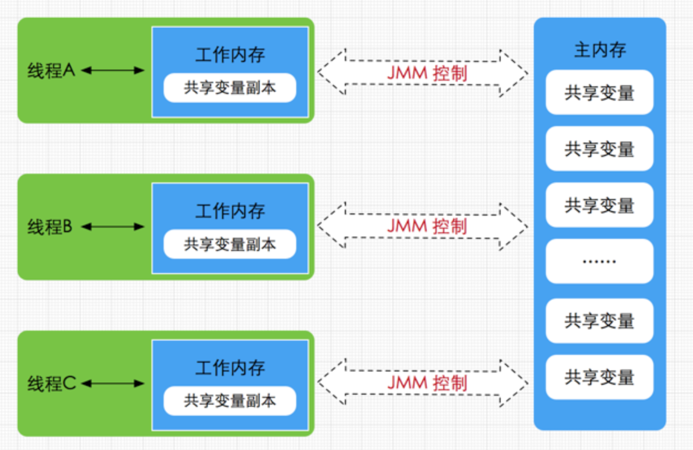

# JMM内存模型

## 一、JMM内存模型与Java语言、Java虚拟机的耦合
1. JMM本身是一种抽象的规范，它规定了Java程序中，不同的线程对变量的访问规则；或者说，JMM描述的是一种规则，通过这组规则控制程序中各个变量在共享数据区域和私有数据区域的访问方式。
2. JMM规定，所有的变量都存储在主内存，主内存是共享内存区域，所有线程都可以访问，但是线程对变量的操作必须在工作内存中进行  
   因此对于JVM来说，为了遵循JMM规定，必须先将变量加载进工作内存，再进行修改，然后重新写入主内存中  
   JVM内存和JMM的共同特点就是，都把内存分为私有的和公有的区域。  
   
3. 根据Java虚拟机规范，对于一个实例对象中的成员方法而言：
   - 如果方法中包含本地变量是基本数据类型（boolean,byte,short,char,int,long,float,double），将直接存储在工作内存的帧栈结构中。
   - 倘若本地变量是引用类型，那么该变量的引用（也就是指针）会存储在功能内存的帧栈中，而对象实例将存储在主内存（共享数据区域，堆）中。
   - 但对于实例对象的成员变量（比如Person对象的int age），不管它是基本数据类型或者包装类型（Integer、Double等）还是引用类型，都会被存储到堆区。
   - 至于static变量以及类本身相关信息将会存储在主内存中。
   - 需要注意的是，在主内存中的实例对象可以被多线程共享，倘若两个线程同时调用了同一个对象的同一个方法，那么两条线程会将要操作的数据拷贝一份到自己的工作内存中，执行完成操作后才刷新到主内存


## 二、JMM内存模型与硬件、操作系统的深度耦合


## 三、JMM内存模型
1. JMM内存模型存在的必要性：A线程和B线程都想对主内存中的数字1进行修改，当A线程将数字修改为2时，B线程读到的这个数字是什么？JMM存在的意义就是解决一个线程对共享变量的修改什么时候对另一个线程可见。
2. JMM的几个关键概念：
   - 原子性：一个操作是不可中断的；一旦一个操作开始，就不会被其他线程影响。
   - 顺序性：由于存在指令重排现象，单线程内，自己看自己内部执行过程是必然有序的；但是另一个线程看这个线程的执行过程，由于存在指令重排，另一个线程视角中，这个线程中的内容都是无序的；
     ```txt
     在Java程序中，倘若在本线程内，所有操作都视为有序行为，如果是多线程环境下，一个线程中观察另外一个线程，所有操作都是无序的，前半句指的是单线程内保证串行语义执行的一致性，后半句则指指令重排现象和工作内存与主内存同步延迟现象。
     ```
   - 可见性：一个线程对共享变量的修改，另一个线程能否直接感知到？
3. 指令重排（编译器不改变语意重排、处理器并行执行独立代码、
   - 编译器优化重排（【编译期】）：编译器在不改变单线程程序语意的情况下，可以重新安排语句的执行顺序
     ```txt
     线程一 
       | -- step 1 int x2 = a;
       | -- step 2 b = 1;
     线程二
       | -- step 1 int x1 = b;
       | -- step 2 a = 2;
     正常情况下，不可能同时出现x1 = 1 && x2 = 2的情况；但是在实际工作中，这种情况还是出现了
     仔细观察上面的代码，这两句话之间没有任何联系，因此编译器可能会觉得“换一下”也无所谓，就发动了指令重排
     ```
   - 处理器指令重排（【处理期】）：现代处理器采用了指令级并行技术（流水线）来将多条指令重叠执行。如果不存在数据依赖性(即后一个执行的语句无需依赖前面执行的语句的结果)，处理器可以改变语句对应的机器指令的执行顺序
     ```txt
     多核CPU计算 a = b + c; d = e - f;
     CPU的基础操作：[取指 IF] [译码和取寄存器操作数 ID] [执行或者有效地址计算 EX] [存储器访问 MEM] [写回 WB]
     [--表示轮空，因为数据没有加载充分，这一轮轮空，不能执行]
     不重排优化的时候
     指令：取b至寄存器R1中     IF   ID   EX   MEM  WB
     指令：取c至寄存器R2中          IF   ID   EX   MEM  WB
     指令：求和，保存至R3                IF   ID   --   EX   MEM  WB
     指令：将R3保存到a中                      IF   --   ID   EX   MEM  WB
     指令：取e至寄存器R1中                         --   IF   ID   EX   MEM  WB
     指令：取f至寄存器R2中                                   IF   ID   EX   MEM  WB  
     指令：求差，保存至R3                                         IF   ID   --   EX   MEM  WB  
     指令：将R3保存到d                                                IF   --   ID   EX   MEM  WB  

     重排优化的时候
     指令：取b至寄存器R1中     IF   ID   EX   MEM  WB
     指令：取c至寄存器R2中          IF   ID   EX   MEM  WB
     指令：取e至寄存器R1中               IF   ID   EX   MEM  WB
     指令：求和，保存至R3                     IF   ID   EX   MEM  WB
     指令：取f至寄存器R2中                         IF   ID   EX   MEM  WB  
     指令：将R3保存到a中                                IF   ID   EX   MEM  WB
     指令：求差，保存至R3                                    IF   ID    EX   MEM  WB  
     指令：将R3保存到d                                            IF   ID   EX   MEM  WB  
     ```
   - 内存系统的重排（【处理期】）：由于处理器使用缓存和读写缓存冲区，这使得加载(load)和存储(store)操作看上去可能是在乱序执行，因为三级缓存的存在，导致内存与缓存的数据同步存在时间差。
     ```txt
     问题出现原因：
     CPU [core1 cache1] [core2 cache1]
     1. CPU访问内存的基本流程：先看缓存中有没有，没有的话去内存中加载
     2. 多核处理的情况下，引入了缓存一致性协议，当要对某个值写入的时候，通过总线广播一条消息，其他CPU更新或者删除自己的缓存，全部更新后返回。
     3. 这种方案耗时太长，引入了写缓存队列机制，每次要修改的时候将修改值写入写缓存队列，开启异步处理将写缓存队列中的数据同步到每个缓存中。
     如果写缓存队列的执行不够及时，就导致看起来其他CPU读取到的值不是已经修改过的，就好像这条指令没有被执行。
     因此我们有如下结论：
     内存重排序实际上并不是真的相关操作被排序了，而是因为引入了CPU缓存还没来及刷新导致  
     每个CPU都有自己的缓存，为了提高共享变量的写操作，CPU把整个操作变成异步的了，如果写入操作还没来的及同步到其它CPU，就有可能发生其它CPU读取到的是旧的值，因此看起来这条指令还没执行一样。
     ```
4. JMM提供的解决方案：synchronized、volatile、ReentrantLock、happens-before
   > 在Java内存模型中提供了一套解决方案供Java工程师在开发过程使用：  
   > 如原子性问题，除了JVM自身提供的对基本数据类型读写操作的原子性外，对于方法级别或者代码块级别的原子性操作，可以使用synchronized关键字或者重入锁(ReentrantLock)保证程序执行的原子性。  
   > 而工作内存与主内存同步延迟现象导致的可见性问题，可以使用synchronized关键字或者volatile关键字解决，它们都可以使一个线程修改后的变量立即对其他线程可见。  
   > 对于指令重排导致的可见性问题和有序性问题，则可以利用volatile关键字解决，因为volatile的另外一个作用就是禁止重排序优化，关于volatile稍后会进一步分析。  
   > 除了靠synchronized和volatile关键字来保证原子性、可见性以及有序性外，JMM内部还定义一套happens-before原则来保证多线程环境下两个操作间的原子性、可见性以及有序性。
5. 


参考资料：
1. JMM内存模型：https://blog.csdn.net/javazejian/article/details/72772461
2. 内存系统重排：https://blog.csdn.net/m0_59749089/article/details/135239460