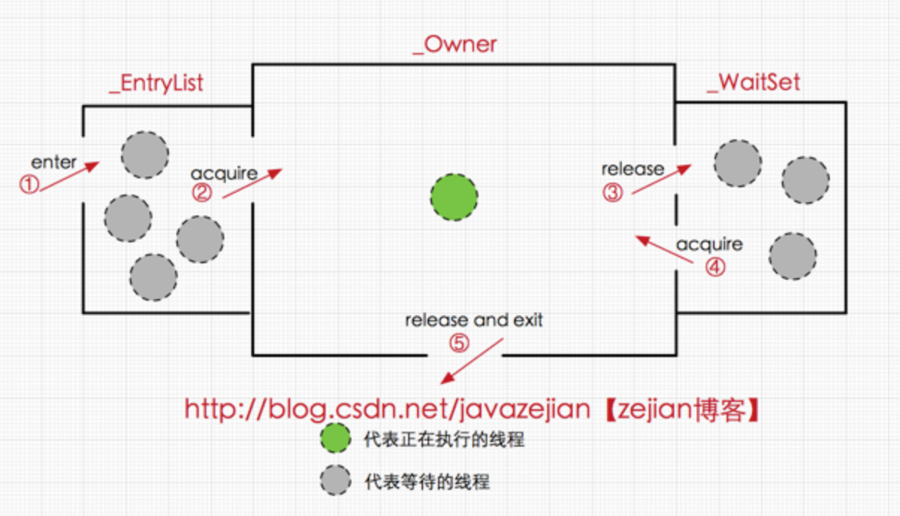
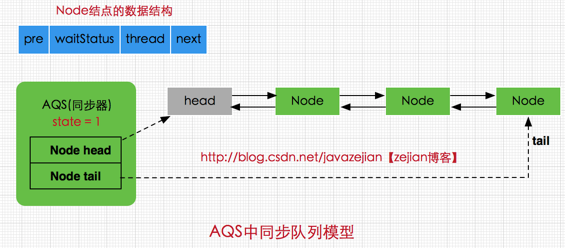
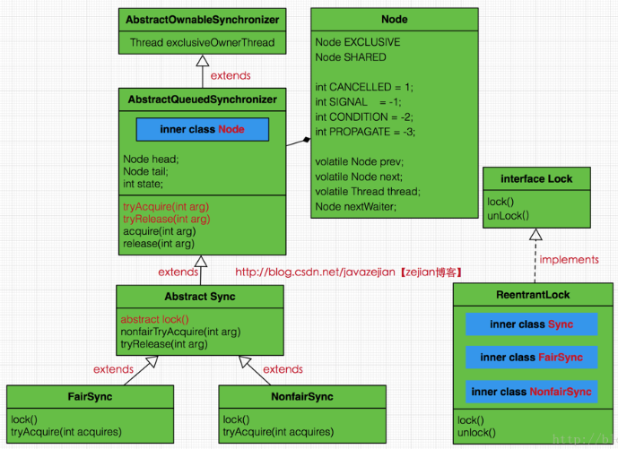
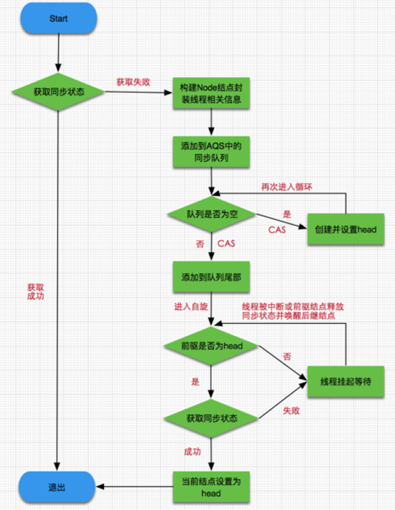
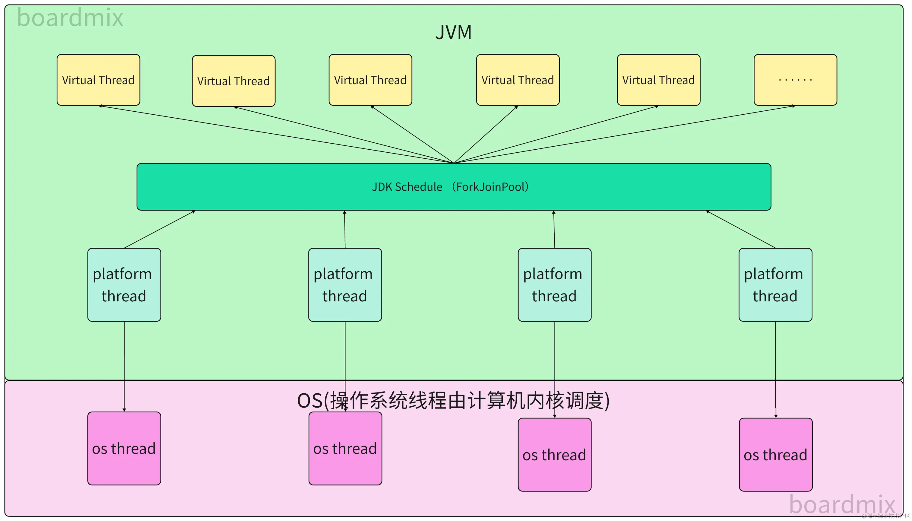

# Java多线程


## 一、synchronized关键字
1. synchronized使用规则：
   - 修饰实例方法（非静态方法）：作用于当前的实例对象
   - 修饰静态方法：作用于当前的类对象，加锁
   - 修饰代码块：指定加锁对象，对给定对象加锁，进入同步代码前要获得当前类对象的锁  
   `synchronized加在一个static方法上，是对这个类进行加锁；synchronized加在一个普通方法上，是对新建出来的这个对象加锁。`
2. synchronized关键字的底层原理
   - JVM中，对象在内存中的布局分为3块区域，对象头（存储一些数据）、实例数据、对齐填充（仅仅为了字节对齐）
   - 对象头大小一般是两个字节，如果是数组对象是三个字节；
     - Mark Word：存储对象的hashCode、锁信息或分代年龄或GC标志等信息；这个标志是可变的
       ```txt
       无锁状态：30bit（对象HashCode）      +  2bit锁标志位（01）
       偏向锁：  23bit 线程ID + 2bit Epoch + 4bit 对象分代年龄 + 1bit 是否是偏向锁 + 2bit 锁标志位（01）
       轻量级锁：25bit 指向栈中锁记录的指针   +  2bit锁标志位（01）
       重量级锁：25bit 指向互斥量的指针      +  2bit锁标志位（10）
       GC标记：  30bit空                  +  2bit锁标志位（11）
       ```
     - Class Metadata Address：类型指针指向对象的类元数据，JVM通过这个指针确定该对象是哪个类的实例。
   - JVM中每个对象都存在一个相对应的监视器Monitor（也叫管程），Monitor的底层实现上是通过C++编写的ObjectMonitor来实现的，这个对象有三个关键结构：
     - count：记录进入锁的次数
     - WaitSet：处于等待状态的线程集合
     - EntryList：处于等待锁Block状态的线程，会被加入到该列表  
     
   - synchronized同步到类上的形式
     - 通过monitorEnter和monitorExit指令实现对监视器的访问
   - synchronized同步到方法上的底层原理
     - 通过标识该方法是同步方法（ACC_SYNCHRONIZED）来实现每次调用时先访问监视器monitor
   - synchronized的可重入性：当一个线程通过synchronized获取到当前的锁之后，可以继续请求该锁。
   - synchronized的可重入性：synchronized是可重入的
3. JVM对synchronized的优化
   - synchronized的锁优化主要基于统计学原理，在大部分情况下锁的对象往往只被一个线程享有，根本不存在并发问题，基于统计学数据为了提高效率，有了如下的优化方案
   - 【优化一】synchronized具有四种状态：无锁、偏向锁、轻量级锁和重量级锁；升级是单向的
     - 无锁：没有线程访问对象的时候，是无锁状态
     - 偏向锁：“大部分情况下都是一个线程多次访问一个锁对象”，当只有一个线程在访问对象的时候，是偏向锁的状态，为了降低同一个线程获取锁的代价而引入偏向锁。
       - 偏向锁不是真的加锁，就是标记一下某个线程现在拥有锁
     - 轻量级锁（自旋锁）：“对绝大部分的锁，在整个同步周期内不存在竞争”（“大多情况下线程持有锁的时间都不会太长”），在同一时间同时访问一个锁的情况不常见，适用于“线程交替执行”的场景；
       - 轻量级锁通过自旋实现：在锁膨胀到重量级锁之前，会要求其他线程进行自旋，如果自旋结束后可以获得锁，那就获取也就没有必要膨胀到重量级锁了。
       - 自旋次数不是固定的，新版JDK中引入了自适应的机制
     - 重量级锁：monitor监视器的应用
   - 【优化二】synchronized的锁消除
     - 在某些场景下锁不可能生效，JVM会自动消除锁，比如：
       ```java
         public void add(String str1, String str2) {
             // 这个stringBuffer就属于不可能被共享的对象，JVM会自动消除内部的锁
             // 不会出现多个线程同时访问这个变量
             StringBuffer stringBuffer = new StringBuffer();
             stringBuffer.append(str1).append(str2);
         }
       ```     
     


## 二、线程回收的流程
1. 线程池中非核心线程的回收  
   非核心线程的中会存在一个while循环，不断从阻塞队列中获取任务，当获取不到任务的时候，就会跳出循环释放线程资源。
   ```java
   // getTask方法。在获取task中
   private Runnable getTask() {
       // 超时标志
       boolean timedOut = false;
       // 循环
       for (;;) {
           int c = ctl.get();
           // 1. 线程池状态为 SHUTDOWN 并且队列为空或者STOP的时候会返回 null, 释放当前线程
           if (runStateAtLeast(c, SHUTDOWN) && (runStateAtLeast(c, STOP) || workQueue.isEmpty())) {
               ...
               return null;
           }
           // 2. 获取当前线程池中线程的数量
           int wc = workerCountOf(c);
           // 3. 当允许核心线程超时 或者 当前线程数量大于核心线程数时 timed = true
           boolean timed = allowCoreThreadTimeOut || wc > corePoolSize;
           // 4. timed == true 并且 timeOut == true 并且 队列任务为空且线程池线程存在的情况下，返回null, 释放当前线程
           if ((wc > maximumPoolSize || (timed && timedOut))
                   && (wc > 1 || workQueue.isEmpty())) {
               // Worker 线程数减一操作
               if (compareAndDecrementWorkerCount(c))
                   return null;
               continue;
           }
           try {
               // 5. 这里是关键：timed==true 意思是线程数大于核心线程数的时候，从队列里面取值并加了个 keepAliveTime 超时时间，如果超过这个时间还没取到任务，就timedOut=true, 然后再次循环的时候，上面第4步的if 条件就满足了，就会return null, 然后就会释放线程了。
               Runnable r = timed ?
                       workQueue.poll(keepAliveTime, TimeUnit.NANOSECONDS) :
                       workQueue.take();
               if (r != null)
                   return r;
               timedOut = true;
           } catch (InterruptedException retry) {
               timedOut = false;
           }
       }
   }
   ```
2. 具体的释放逻辑是`processWorkerExit(w, completedAbruptly)`实现的。
   
3. 


## 三、自己实现一个线程池


## 四、线程池
1. 线程池执行任务的过程
   1. 提交一个新的任务到线程池，线程池会检查正在运行的线程数是否少于 corePoolSize（核心线程数），如果不足，则创建一个新线程来执行任务。  
      <font color='yellow'>当线程数小于核心线程数时，即使现有的线程空闲，线程池也会优先创建新线程来处理任务，而不是直接交给现有的线程处理。</font>
   2. 如果正在运行的线程数大于或等于 corePoolSize，则将任务加入到队列中。
   3. 如果无法将任务加入到队列（队列已满），则在满足条件的情况下创建 maximumPoolSize（最大线程数）大小的额外线程来处理任务，新来的任务和队列中已经有的任务，先执行后来的任务。
   4. 如果创建了最大数量的线程且队列已满，则执行拒绝策略（RejectedExecutionHandler），如默认的策略是抛出 RejectedExecutionException 异常。
   5. 举例：核心线程数2 最大线程数4 瞬间来了6个线程请求
      1. 核心线程（2个）优先处理任务1、2
      2. 队列满后，新任务5、6触发创建新线程（总线程数达最大4）
      3. 核心线程空闲后处理队列中的任务3、4
      4. 新增线程直接处理任务5、6，无需等待队列。
      5. 总顺序：125634
2. 当核心线程数配置为0的时候会发生什么？
   1. 结论：当线程池的核心线程数设置为0时，任务仍然会被丢入任务队列。如果当前工作线程数量为0，<font color='yellow'>线程池会创建非核心线程来执行任务</font>。
   2. 源码：
   ```java
   public void execute(Runnable command) {
      if (command == null)
          throw new NullPointerException();
      int c = ctl.get();
      // 如果当前工作线程的线程数量少于核心线程数目，不管这个线程是不是空闲的，都要创建新的线程工作
      if (workerCountOf(c) < corePoolSize) {
          if (addWorker(command, true))
              return;
          c = ctl.get();
      }
      if (isRunning(c) && workQueue.offer(command)) {
          int recheck = ctl.get();
          if (! isRunning(recheck) && remove(command))
              reject(command);
          // 如果新的目前工作线程数为0，新建一个非核心线程来执行
          else if (workerCountOf(recheck) == 0)
              // addWorker的第二个参数表示是否是核心线程
              addWorker(null, false);
      }
      else if (!addWorker(command, false))
          reject(command);
   }
   ```
   3. 扩展：如果核心线程和非核心线程数都为0，会报错——参数不合法异常。
   ```java
   public ThreadPoolExecutor(int corePoolSize,
                              int maximumPoolSize,
                              long keepAliveTime,
                              TimeUnit unit,
                              BlockingQueue<Runnable> workQueue,
                              ThreadFactory threadFactory,
                              RejectedExecutionHandler handler) {
        if (corePoolSize < 0 ||
            maximumPoolSize <= 0 || // 最大线程数 == 0，抛出异常
            maximumPoolSize < corePoolSize ||
            keepAliveTime < 0)
            // 抛出异常
            throw new IllegalArgumentException();
        if (workQueue == null || threadFactory == null || handler == null)
            throw new NullPointerException();
        this.acc = System.getSecurityManager() == null ?
                null :
                AccessController.getContext();
        this.corePoolSize = corePoolSize;
        this.maximumPoolSize = maximumPoolSize;
        this.workQueue = workQueue;
        this.keepAliveTime = unit.toNanos(keepAliveTime);
        this.threadFactory = threadFactory;
        this.handler = handler;
   }
   ```
3. 线程池的核心参数
   1. corePoolSize——线程池核心线程数  
      也可以理解为线程池维护的最小线程数量，核心线程创建后不会被回收。大于核心线程数的线程，在空闲时间超过 keepAliveTime 后会被回收；
   2. maximumPoolSize——线程池最大线程数  
      线程池允许创建的最大线程数；（包括核心线程池数量），也就是非核心线程+核心线程数量总和。
   3. keepAliveTime——非核心线程线程存活时间  
      当一个可被回收的线程的空闲时间大于 keepAliveTime ，就会被回收。
   4. TimeUnit——时间单位  
      参数keepAliveTime的时间单位。
   5. BlockingQueue——阻塞工作队列  
      阻塞队列不要使用默认值，默认的`new LinkedBlockingQueue()`相当于将队列长度设置为`Integer.MAX_VALUE`，也就是说线程池中的工作线程将永远稳定在核心线程数这个水平上，任务量增加的时候响应时间会陡增。  
      它用于存储等待执行的任务，如果有一些任务需要被执行，但是当前核心线程数以满且全部都在运行时期，则将当前任务存储在阻塞工作队列中，等核心线程执行完后，队列中的任务会进行分配执行。它仅仅用来存放被 execute() 方法提交的Runnable任务。工作队列实现了BlockingQueue接口。
   6. ThreadFactory——线程工厂  
      用于创建线程，以及自定义线程名称，需要实现ThreadFactory接口；
   7. RejectedExecutionHandler——拒绝策略
4. 线程池的参数配置需要考虑哪些因素？
   1. 业务类型是IO密集型还是CPU密集型？——决定核心线程数的配置  
      1. 对于IO密集型，可以配置核心线程数为`CPU核心数目的2倍或者更多`
      2. 对于CPU密集型，一般是`CPU核数 + 1`
   2. 资源上限——决定最大线程数  
      资源的上限决定了最大线程数的配置
   3. 业务类型——决定存活时间、拒绝策略  
      业务是快速响应类型，一般会配置的存活时间比较短  
      拒绝策略也可以根据响应的做出配置  
   4. 资源有限场景——决定阻塞队列的配置  
      资源有限的场景，可以使用有大小的阻塞队列，保证资源不被耗尽  

## 五、ReentrantLock可重入锁
1. ReentrantLock的使用是显式的，因此照比synchronized的使用更加灵活。
2. AQS抽象式队列同步器
   抽象式队列同步器（AbstractQueuedSynchronizer，简称AQS）是一个用来构建锁或者其他同步组件的基础框架，它使用了一个int成员变量`state`来表示同步状态，通过内置的FIFO队列来完成资源获取线程的排队工作，当状态为0时表示没有加锁，当状态大于0时表示有线程加锁。  
   AQS定义了一套多线程访问共享资源的同步器框架，许多同步类实现都依赖于它，如ReentrantLock、Semaphore、CountDownLatch等。   
     
   ```java
   public abstract class AbstractQueuedSynchronizer extends AbstractOwnableSynchronizer {
       // 指向同步队列队头
       private transient volatile Node head;
       // 指向同步的队尾
       private transient volatile Node tail;
       // 同步状态，0代表锁未被占用，1代表锁已被占用
       private volatile int state;
       // 省略其他代码......
   }
   // 静态内部类Node
   static final class Node {
       // 共享模式
       static final Node SHARED = new Node();
       // 独占模式
       static final Node EXCLUSIVE = null;
       // 标识线程已处于结束状态
       static final int CANCELLED =  1;
       // 等待被唤醒状态
       static final int SIGNAL    = -1;
       // 条件状态
       static final int CONDITION = -2;
       // 在共享模式中使用表示获得的同步状态会被传播
       static final int PROPAGATE = -3;
   
       // 等待状态，存在CANCELLED、SIGNAL、CONDITION、PROPAGATE 4种
       volatile int waitStatus;
   
       // 同步队列中前驱结点
       volatile Node prev;
   
       // 同步队列中后继结点
       volatile Node next;
   
       // 请求锁的线程
       volatile Thread thread;
   
       // 等待队列中的后继结点，这个与Condition有关
       Node nextWaiter;
   
       // 判断是否为共享模式
       final boolean isShared() {
           return nextWaiter == SHARED;
       }
   
       // 获取前驱结点
       final Node predecessor() throws NullPointerException {
           Node p = prev;
           if (p == null)
               throw new NullPointerException();
           else
               return p;
       }
       // .....
   }
   ```
   - AQS的变量一：`state`，表示同步状态；`state > 0`代表资源有线程在占用，其他访问的线程必须进入，`state = 0`代表该资源没有上锁可以抢占
   - AQS的变量二：`head`，指向同步队列队头，head指向的Node节点是空节点不存储信息。
   - AQS的变量三：`tail`，指向同步队列队尾
   - AQS的内部类`Node<pre, waitStatus, thread, next>`：封装想要访问资源的线程对象，构建<font color='yellow'>同步队列</font>
     - SHARED和EXCLUSIVE常量代表共享模式（如信号量，一个锁允许多条线程同时操作）和独占模式（如可重入锁，同一个时间段内只能有一个线程对共享资源进行操作）
     - waitStatus则表示当前被封装成Node结点的等待状态
       - CANCELLED：值为1，在同步队列中等待的线程等待超时或被中断，需要从同步队列中取消该Node的结点，其结点的waitStatus为CANCELLED，即结束状态，进入该状态后的结点将不会再变化。 
       - SIGNAL：值为-1，被标识为该等待唤醒状态的后继结点，当其前继结点的线程释放了同步锁或被取消，将会通知该后继结点的线程执行。说白了，就是处于唤醒状态，只要前继结点释放锁，就会通知标识为SIGNAL状态的后继结点的线程执行。 
       - CONDITION：值为-2，与Condition相关，该标识的结点处于等待队列中，结点的线程等待在Condition上，当其他线程调用了Condition的signal()方法后，CONDITION状态的结点将从等待队列转移到同步队列中，等待获取同步锁。 
       - PROPAGATE：值为-3，与共享模式相关，在共享模式中，该状态标识结点的线程处于可运行状态。 
       - 0状态：值为0，代表初始化状态。
   - AQS的内部类`ConditionObject`：构建<font color='yellow'>等待队列</font>
3. ReentrantLock与AQS之间的关系  
   
   - ReentrantLock的内部类Sync是抽象类，继承AQS，实现了tryRelease方法。
   - NonfairSync(非公平锁)、 FairSync(公平锁)则继承自Sync，实现了获取锁的tryAcquire()方法，ReentrantLock的所有方法调用都通过间接调用AQS和Sync类及其子类来完成的。
   - Node：AbstractQueuedSynchronizer 的内部类，用于构建虚拟队列(链表双向链表)，管理需要获取锁的线程。
   - ReentrantLock：实现了Lock接口的，其内部类有Sync、NonfairSync、FairSync，在创建时可以根据fair参数决定创建NonfairSync(默认非公平锁)还是FairSync。
4. ReentrantLock的非公平锁的具体实现  
     
   - 获取同步状态：成功——获取并退出
   - 获取同步状态：失败
     - 构建Node节点，将当前Thread封装成一个Node节点，添加到AQS的同步队列中
     - 队列是不是空：是空，创建并设置head节点；不是空，添加到队列的尾部。节点开始自旋
     - 前驱节点是head，直接获取同步状态；前驱节点不是head，线程挂起等待，被唤醒后检查前驱节点是不是head；
     - 获取成功：设置为head
5. ReentrantLock的公平锁的具体实现
   - 公平锁与非公平锁的最大差异在于：在使用CAS设置尝试设置state值前，调用了`hasQueuedPredecessors()`判断同步队列是否存在结点，如果存在必须先执行完同步队列中结点的线程，当前线程进入等待状态。
   - 这就是非公平锁与公平锁最大的区别，即公平锁在线程请求到来时先会判断同步队列是否存在结点，如果存在先执行同步队列中的结点线程，当前线程将封装成node加入同步队列等待。
   - 而非公平锁呢，当线程请求到来时，不管同步队列是否存在线程结点，直接尝试获取同步状态，获取成功直接访问共享资源，但请注意在绝大多数情况下，非公平锁才是我们理想的选择，毕竟从效率上来说非公平锁总是胜于公平锁。


## 六、volatile关键字
1. volatile是Java虚拟机提供的轻量级的同步机制。  
   volatile关键字有如下两个作用：
   - 保证被volatile修饰的共享变量对所有线程总数可见的，也就是当一个线程修改了一个被volatile修饰共享变量的值，新值总可以被其他线程立即得知。 
   - 禁止指令重排序优化。
2. JMM是怎样保证volatile的可见性呢？在写一个volatile变量的时候，JMM会把线程对应的工作内存中的共享变量值刷新到主内存中，当读取一个volatile变量时，JMM会把该线程中对应的工作线程置为无效，那么该线程将只能从主内存中重新读取共享变量。
3. JMM是怎样保证volatile禁止重排优化的呢？volatile关键字另一个作用就是禁止指令重排优化，从而避免多线程环境下程序出现乱序执行的现象。   
   内存屏障，又称内存栅栏，是一个CPU指令，它的作用有两个，一是保证特定操作的执行顺序，二是保证某些变量的内存可见性（利用该特性实现volatile的内存可见性）。   
   由于编译器和处理器都能执行指令重排优化。如果在指令间插入一条Memory Barrier则会告诉编译器和CPU，不管什么指令都不能和这条Memory Barrier指令重排序，也就是说通过插入内存屏障禁止在内存屏障前后的指令执行重排序优化。  
   Memory Barrier的另外一个作用是强制刷出各种CPU的缓存数据，因此任何CPU上的线程都能读取到这些数据的最新版本。总之，volatile变量正是通过内存屏障实现其在内存中的语义，即可见性和禁止重排优化。   
4. volatile的关键应用（单例模式）：
   ```java
    public static DoubleCheckLock {
        // 使用 volatile 禁止指令重排
        private volatile static DoubleCheckLock instance;
    
        public static DoubleCheckLock getInstance() {
            // 第一次检测
            if (instance == null) {
                // 同步
                synchronized (DoubleCheckLock.class) {
                    if (instance == null) {
                        // 多线程环境下可能会出现问题的地方
                        // 正常创建对象分配空间的流程是：
                        // memory = allocate();  // 1.分配对象内存空间
                        // instance(memory);     // 2.初始化对象
                        // instance = memory;    // 3.设置instance指向刚分配的内存地址，此时instance != null
                        // 出现重排：
                        // memory = allocate();  // 1.分配对象内存空间
                        // instance = memory;    // 3.设置instance指向刚分配的内存地址，此时instance != null，但是对象还没有初始化完成！
                        // instance(memory);     // 2.初始化对象
                        // 重排的情况下，对象还没有被初始化就已经返回了
                        instance = new DoubleCheckLock();
                    }
                }
            }
            return instance;
        }
    }
   ```
5. volatile关键字的总结：
   - 编译器在编译对volatile关键字修饰的变量进行读写的时候，会在指令中插入内存屏障
   - 内存屏障保证了每次写数据后，可以将数据直接刷到主内存中；同时内存屏障保证了禁止重排序
6. 扩展：volatile关键字的内存屏障类型（LoadStore、StoreStore、StoreLoad、LoadLoad）


## 七、CAS操作
1. 【注意】CAS操作是原子的，因为在CPU层面提供了操作原语，保证对数据Compare and Swap是原子性操作。
2. CAS基本思想：CAS(V, E, N)，如果V == E，就把V的值设置为N；如果发现V != E，那就抛出异常。
3. Java的Unsafe类：这个类中的方法都直接调用操作系统底层资源执行相应任务，可以理解为Java对底层操作系统最近的一层封装
   - 内存管理：
   - 提供实例对象的一种新方法
   - 类和实例对象以及变量的操作
   - 数组操作
   - CAS操作的支持
4. 


## 八、Atomic系列
1. 【注意】CAS操作是原子的，因为在CPU层面提供了操作原语`CMPXCHG`，保证对数据Compare and Swap是原子性操作。
2. 【注意】CAS操作通常隐含内存屏障（Memory Barrier），保证操作前后的内存可见性和顺序一致性。
3. 因此CAS可能存在的问题只包括ABA问题，而不存在原子性问题
   1. CAS的ABA问题怎么解决：加一个版本号的机制
   2. `AtomicStampedReference.java`类每次会要求传入时间戳，来保证ABA问题稳定被解决
4. 


## 八、Java虚拟线程
1. Java在JDK21中引入了新的虚拟线程概念，首先需要区分几个概念
   - 物理线程：物理线程就是CPU核心数（个别的可乘2）
   - 逻辑线程：理论上最大值是内存大小除以每个线程栈对应的大小（逻辑线程的概念非常宽泛）
2. 传统的物理机或者虚拟机上，线程数量虽然理论上没有上限，但是现实并非如此
   - 内存限制：每个线程有自己的栈及相关信息，大概是8M左右，用内存大小做相应计算，能够获得内存可支持的最大线程数量
   - 内核级全局限制：linux的`ulimit -u`命令能够限制单个用户的最大进程数，默认通常为4096
   - 用户级限制：linux的`threads-max`定义系统全局最大线程数
3. 虚拟线程
   - 轻量级线程模型：虚拟线程由JVM直接管理，而不是操作系统内核；同时采用了M-N映射模型，M个虚拟线程映射到N个平台线程
     - 平台线程：可以理解为操作系统线程，基本上是1对1的关系
     
   - 栈管理优化：
   - 协作式调度
   - 
4. 虚拟线程的优点
   - 高吞吐：在IO密集型场景中，QPS可以提高10倍
   - 低延迟：减少线程等待时间，避免线程池排排队
   - 节省资源：比如某些HTTP长链接，可以使得线程资源及时释放


参考资料：
1. volatile关键字的内存屏障类型：https://blog.csdn.net/q1372302825/article/details/139282172
2. synchronized关键字：https://blog.csdn.net/javazejian/article/details/72828483
3. ReentrantLock：https://blog.csdn.net/javazejian/article/details/75043422
4. 机器CPU核心数与线程数量的关系：https://www.zhihu.com/question/429883009/answer/2814637253
5. JVM线程池与OS线程的关系：https://blog.csdn.net/qq_51234063/article/details/124920208
6. synchronized关键字：https://blog.csdn.net/m0_61814277/article/details/143648433
