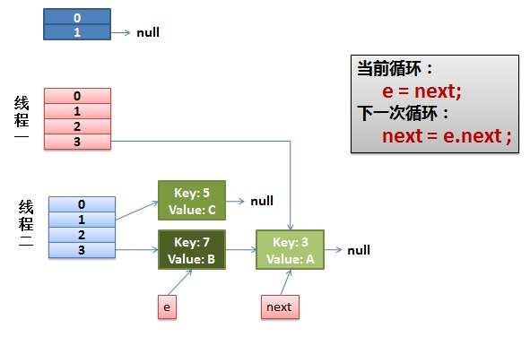

# Java集合

## 一、HashMap
1. HashMap中为什么不能使用基本数据类型？Java的容器类是通过泛型实现的，泛型实现是基于Object类型的，而基本类型不是对象，所以不能直接存放在容器类中。
2. HashMap在多线程动态扩容时出现的问题——死循环指针问题
    1. 正常的HashMap扩容问题（单线程下，主要看e和next指针）

       
       ```java
        // 基础的put方法
        public V put(K key, V value) {
            return putVal(hash(key), key, value, false, true);
        }
        // resize，超过阈值了
        final V putVal(int hash, K key, V value, boolean onlyIfAbsent, boolean evict) {
            Node<K,V>[] tab; Node<K,V> p; int n, i;
            // 如果
            if ((tab = table) == null || (n = tab.length) == 0)
                n = (tab = resize()).length;
            if ((p = tab[i = (n - 1) & hash]) == null)
                tab[i] = newNode(hash, key, value, null);
            else {
                Node<K,V> e; K k;
                if (p.hash == hash && ((k = p.key) == key || (key != null && key.equals(k))))
                   e = p;
                else if (p instanceof TreeNode)
                   e = ((TreeNode<K,V>)p).putTreeVal(this, tab, hash, key, value);
                else {
                    for (int binCount = 0; ; ++binCount) {
                        if ((e = p.next) == null) {
                            p.next = newNode(hash, key, value, null);
                            if (binCount >= TREEIFY_THRESHOLD - 1) // -1 for 1st
                                treeifyBin(tab, hash);
                            break;
                        }
                        if (e.hash == hash &&
                            ((k = e.key) == key || (key != null && key.equals(k))))
                            break;
                        p = e;
                    }
                }
                if (e != null) { // existing mapping for key
                    V oldValue = e.value;
                    if (!onlyIfAbsent || oldValue == null)
                        e.value = value;
                    afterNodeAccess(e);
                    return oldValue;
                }
            }
            ++modCount;
            // 先添加元素，再resize
            if (++size > threshold)
                // resize方法
                resize();
            afterNodeInsertion(evict);
            return null;
        }
        // resize()
        void resize(int newCapacity) {
            Entry[] oldTable = table;
            int oldCapacity = oldTable.length;
            ......
            //创建一个新的Hash Table
            Entry[] newTable = new Entry[newCapacity];
            //将Old Hash Table上的数据迁移到New Hash Table上
            transfer(newTable);
            table = newTable;
            threshold = (int)(newCapacity * loadFactor);
        }
        // transfer()
        void transfer(Entry[] newTable) {
            Entry[] src = table;
            int newCapacity = newTable.length;
            // 下面这段代码的意思是：
            //  从OldTable的一个槽中的头部摘一个元素出来，然后放到NewTable中
            for (int j = 0; j < src.length; j++) {
                Entry<K,V> e = src[j];
                if (e != null) {
                    src[j] = null;
                    do {
                        Entry<K,V> next = e.next;
                        int i = indexFor(e.hash, newCapacity);
                        e.next = newTable[i];
                        newTable[i] = e;
                        e = next;
                    } while (e != null);
                }
            }
        }

       ```
       - Map.put方法，如果没有这个节点，就进行addEntry，addEntry方法会先看容量是否超过设定的阈值 
       - 超过阈值调用resize方法，将Map中的元素重新分配到新的Map中，transfer方法负责具体的执行
       - transfer方法会遍历旧的HashMap对应的槽，从cur头部取出一个节点，并将cur修改为对应的next节点
       - 每次从头取一个节点进行reHash
    
    2. 不正常的HashMap扩容问题（多线程下，先3后7，7已经被另一个线程指向3了，但是线程一重新进入的时候，又处理了一遍3）
   
       
       
       
       
        ```java
        do {
            Entry<K,V> next = e.next; // <--假设线程一执行到这里就被调度挂起了
            int i = indexFor(e.hash, newCapacity);
            // 取出现在新hash槽的第一个元素，并让它作为e的next，因为现在e即将成为新的hash槽的头元素
            e.next = newTable[i];
            newTable[i] = e;
            e = next;
        } while (e != null);
        ```
        - 假设有两个线程正在执行，线程一执行到`Entry<K,V> next = e.next;`被挂起，此时e = 3，next = 7，先3后7
        - 线程二执行完毕了扩容操作，由于是头插法进行扩容，因此在新的Hash表中，e和next指针已经被调换位置，先7后3
        - 线程一回来继续执行扩容操作，取出3进行重hash，再取出7进行重Hash（正常情况下，7的next应该是null）
        - 由于7的next已经在线程二中被设置为3了，因此线程一`Entry<K,V> next = e.next;`这步骤的时候，next就是3，相当于做了两次7的next变为3
        - 第二次的next如果是正常情况下应该是null，但是7的next被第二个线程设置成了3
        - 本轮针对已经reHash过的3进行了重新Hash，当`e.next = newTable[i];`这句话执行的时候，3的next设置为7了，出现了循环
3. HashMap的扩容过程
   - HashMap中，正常是先插入元素再扩容；当HashMap是通过new HashMap()创建（实际上初始化的只有最大容量和负载因子）且第一次添加元素的时候，插入数据是先扩容再插入数据。
   - HashMap如果在创建时指定了容量大小，会使用`HashMap(int initialCapacity, float loadFactor)`这个方法创建HashMap
     - 使用`HashMap(int initialCapacity, float loadFactor)`这个方法创建HashMap会调用tableSizeFor方法设置HashMap的阈值（`this.threshold = tableSizeFor(initialCapacity);`）
     - tableSizeFor方法的含义就是找到大于等于cap的最小2的整数次方,，并设置大小
     ```java
     static final int tableSizeFor(int cap) {
         // 0010 0000 0000 0000 0000 0000 0000 0001      
         int n = cap - 1;
         // 0010 0000 0000 0000 0000 0000 0000 0000
         n |= n >>> 1;
         // 0011 0000 0000 0000 0000 0000 0000 0000
         n |= n >>> 2;
         // 0011 1100 0000 0000 0000 0000 0000 0000
         n |= n >>> 4;
         // 0011 1111 1100 0000 0000 0000 0000 0000
         n |= n >>> 8;
         // 0011 1111 1111 1111 1100 0000 0000 0000
         n |= n >>> 16;
         // 0011 1111 1111 1111 1111 1111 1111 1111
         return (n < 0) ? 1 : (n >= MAXIMUM_CAPACITY) ? MAXIMUM_CAPACITY : n + 1;
         // n + 1 = 0100 0000 0000 0000 0000 0000 0000 0000
         // 直接通过位移运算找到了大于等于cap的最小的2的次方 5 --> 8, 17 --> 32
     }
     ```
   - HashMap实行了懒加载，新建HashMap时不会对table进行赋值，第一次插入的时候会resize并插入元素，之后会先插入元素再判断要不要resize
   - resize过程中将元素重新定位的过程：
     ```txt
     A对象的原hash值，31  --- 如果当前16个槽位 --- A对象会被hash到最后一个[15]号槽位
     B对象的原hash值，15  --- 如果当前16个槽位 --- B对象会被hash到最后一个[15]号槽位
     
     A对象的原hash值，31  --- 如果当前32个槽位 --- A对象会被hash到最后一个[31]号槽位
     B对象的原hash值，15  --- 如果当前32个槽位 --- B对象会被hash到中间某个[15]号槽位
     
     槽位的限制导致了hash值的高位不会被采纳，因此当扩容一次的时候，也就是探究高一位的hash值是不是1
     ```


## 二、TreeMap
1. TreeMap的底层是红黑树，

## 三、ConcurrentHashMap（HashMap的线程安全版本之一）
1. 是`HashMap`的支持并发的版本，是`Collections.synchronizedMap(Map<K,V> m)`的优化版本。
2. ConcurrentHashMap在理想情况下可以支持16个线程的并发写操作
   - java段`Segment`，该对象继承了`ReentrantLock`，因此可以用于并发控制
   - java的每个段守护自己的成员对象table中包含的若干个桶，table是一个由`HashEntry`对象组成的链表数组，table数组的每一个数组成员就是一个桶
   - `HashEntry`对象用于记录真实的键值对，是一个四元组，分别是key、hash、value、next，其中key、hash、next都是final的
       - key、hash、next都是final的，因此只能够使用头插法解决Hash冲突问题
       - value是`volatile`的，所以可以确保被线程读到最新的值，因此读不需要加锁
   - ConcurrentHashMap内部维护了一个Segment数组
       - 每个Segment对象不但是一个小的`ReentrantLock`，而且是一个小的哈希表
       - Segment对象内部维护了一个hash槽数组，名曰table
           - 这个槽就是HashBucket的概念，也就是经过hash函数计算后的桶的下标
           - 槽内部用`HashEntry`对象记录信息
3. ConcurrentHashMap的一些操作实现细节
   - put操作
     - 不允许key或者value是null，否则抛异常
     - 先获取该key对应的段信息，该key属于哪个段，put的时候根据段做一个加锁`tryLock()`
     - 如果加入元素会超过阈值，先做rehash
   - rehash操作(由于final的next指针，复制操作进行了优化)
     - rehash操作实际上是对某个段进行重新Hash，所以每个段所包含的桶(HashBucket)数量自然也就不尽相同
     - 由于前面我们说过，`HashEntry`的next是final的，所以看起来似乎只能重新复制来实现rehash，但是jdk在设计的时候想偷点懒
     - jdk优化手段：在目前的链上找到一个以尾部节点为结束的子链，且该子链上的所有元素都将被rehash到一个位置，然后复用这个子链降低开销
     ```java
        // 由于扩容是按照2的幂次方进行的，所以扩展前在同一个桶中的元素，现在要么还是在原来的序号的桶里，
        // 或者就是原来的序号再加上一个2的幂次方，就这两种选择。
        // 我们知道链接指针next是final的，因此看起来我们好像只能把该桶的HashEntry链中的每个节点复制到新的桶中(这意味着我们要重新创建每个节点)，
        // 但事实上JDK对其做了一定的优化。因为在理论上原桶里的HashEntry链可能存在一条子链，这条子链上的节点都会被重哈希到同一个新的桶中，
        // 这样我们只要拿到该子链的头结点就可以直接把该子链放到新的桶中，从而避免了一些节点不必要的创建，提升了一定的效率。
        // 因此，JDK为了提高效率，它会首先去查找这样的一个子链，而且这个子链的尾节点必须与原hash链的尾节点是同一个，
        // 那么就只需要把这个子链的头结点放到新的桶中，其后面跟的一串子节点自然也就连接上了。
        // 对于这个子链头结点之前的结点，JDK会挨个遍历并把它们复制到新桶的链头(只能在表头插入元素)中。
        for (HashEntry<K,V> last = next; last != null; last = last.next) {
            int k = last.hash & sizeMask;
            if (k != lastIdx) {
                lastIdx = k;
                lastRun = last;
            }
        }
        newTable[lastIdx] = lastRun;
     ```
   - get操作：
     - 先定位到这个hash对应的段，然后在段内进行get
     - 如果get到的值是null（如果在初始化HashEntry时发生了指令重新排序，在HashEntry初始化之前就返回了它的引用），就使用加锁重读的机制
        ```java
          V get(Object key, int hash) {
             if (count != 0) {            // read-volatile，首先读 count 变量
                 HashEntry<K,V> e = getFirst(hash);   // 获取桶中链表头结点
                 while (e != null) {
                     if (e.hash == hash && key.equals(e.key)) {    // 查找链中是否存在指定Key的键值对
                         V v = e.value;
                         if (v != null)  // 如果读到value域不为 null，直接返回
                             return v;   
                         // 如果读到value域为null，说明发生了重排序，加锁后重新读取
                         return readValueUnderLock(e); // recheck
                     }
                     e = e.next;
                 }
             }
             return null;  // 如果不存在，直接返回null
          }
          // 加锁重读
          V readValueUnderLock(HashEntry<K,V> e) {
              lock();
              try {
                  return e.value;
              } finally {
                  unlock();
              }
          }
        ```
4. ConcurrentHashMap的高效并发机制是通过以下三个方面保证的：
    1. 锁分段
       ConcurrentHashMap 内部维护了一个 Segment 数组，每个 Segment 对应一个段，这些段之间相互独立，各自管理自己的哈希桶。
       Segment 类继承了 ReentrantLock，表示一个可重入锁，每个 Segment 对应一个哈希桶。在对某个段进行操作时，通过
       ReentrantLock 来进行加锁，实现对该段的互斥访问。
       每个 Segment 中有一个 HashEntry 数组，用于存储键值对。HashEntry 是键值对的节点，采用链表法处理哈希冲突。
       put 方法是 ConcurrentHashMap 中进行 put 操作的关键方法。在进行 put
       操作时，先通过哈希值找到对应的段，然后在该段的哈希桶中查找键值对。如果找到了相同的键，则更新值；如果没有找到相同的键，则将新的键值对插入到链表的头部。
    2. HashEntry的不变性、volatile的内存可见性、加锁重读机制
       - 每个段`Segment`内维护了一个volatile修饰的count字段，统计键值对数目的时候，会保证对所有线程可见
       - volatile的内存可见性：value是内存可见的
       - HashEntry的不变性：`HashEntry`的四元组中，key、next、hash都是final的
       - 加锁重读机制：如果发生了指令重排，在HashEntry初始化结束之前返回了相应的引用，会导致读到的value是null，因此需要加锁重读
    3. 加锁不加锁两种方案控制跨段的安全性
5. 与HashMap的一些区别
    1. 并发性：ConcurrentHashMap线程安全
    2. 锁机制：ConcurrentHashMap内部使用了分段锁的机制，将整个映射分为多个段，每个段都有一个独立的锁
    3. 读性能：有写的情况下读需要阻塞，ConcurrentHashMap分段，可以提高性能
    4. 迭代器：
       HashMap在迭代器遍历时，如果在迭代过程中有其他线程对集合进行了修改，可能会抛出`ConcurrentModificationException`异常；HashMap是强一致性迭代器。
       `ConcurrentHashMap`提供了弱一致性的迭代器，允许在迭代过程中对集合进行修改。
       > 结构性变化下，也不会影响Map中正在遍历的链表，因此不会受到影响；更准确地说，ConcurrentHashMap为了保证一定程度的并发性，实际上读取的是某一时刻的快照，甚至可能会返回某些另一个线程已经删除过的节点
    5. null问题：`ConcurrentHashMap`不允许key或者value是null；HashMap可以。
6. ConcurrentHashMap读操作为什么不需要加锁？
    1. 用HashEntry对象的不变性来降低读操作对加锁的需求；
       - 非结构性修改：比如更新某一个HashEntry内的value字段，由于value字段是volatile的，表示所有线程对这个值的最新更新其他线程都能看到，因此非结构性修改的并发读是不需要加锁的
       - 结构性修改的并发读：
         - put操作：put操作将新元素插入头节点，因此不影响原来的链表
         - clear操作：clear操作仅仅将 ConcurrentHashMap 中的所有桶变成空，但是之前的链表还在，只是桶不再引用这些链表而已，链表本身的结构没有被改变。
         - remove操作：remove复制了删除节点前面的，删除节点后面的没有变化（看图）
         
            
       - 综上所述，另一个线程在干什么，不影响我这个线程在读
    2. 用Volatile变量协调读写线程间的内存可见性；
    3. 若读时发生指令重排序现象，则加锁重读；
7. ConcurrentHashMap的跨段操作
    1. 什么情况下会跨段？size方法统计数量、contains操作都会跨段
    2. 跨段操作下JDK做了什么优化？
       默认重试两次，会不加锁地取所有段的size做和，并比较modCount（做结构性修改的时候会变化的一个值），如果modCount没有变化，就直接返回；  
       如果modCount变化了，就重试一次；再不行，启动获取所有段锁统一返回的复杂逻辑。
    3. 一般情况下，重试的两次都能统计出正确的结果

## 四、HashMap的线程安全版本之二：Collections.synchronizedMap
1. 使用方法
   ```java
    Map<String, Integer> hashMap = new HashMap<>();
    // 使用 Collections.synchronizedMap 方法创建同步的 Map
    Map<String, Integer> synchronizedMap = Collections.synchronizedMap(hashMap);
   ```
2. 底层原理
    1. Collections.synchronizedMap本质上是一种包装器模式，传入一个新的HashMap，作为synchronizedMap的变量
    2. 所有可能引起修改的代码块，都使用了synchronized进行同步，保证更新的时候只能有一个线程在操作这个对象
    3. synchronized(mutex)的对象实质上是这个Collections.synchronizedMap对象，因此在高并发场景下会存在性能瓶颈，性能不如ConcurrentHashMap


参考资料：
1. ConcurrentHashMap：https://blog.csdn.net/qq_24903931/article/details/82850170
2. Collections.synchronizedMap：https://blog.csdn.net/weixin_45188218/article/details/135604178
3. ConcurrentHashMap：https://blog.csdn.net/weixin_45188218/article/details/135596599
4. 多线程rehash：https://coolshell.cn/articles/9606.html