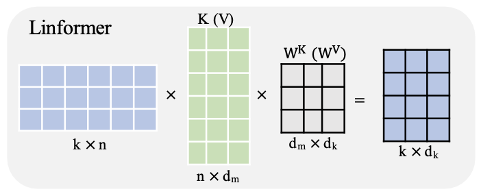
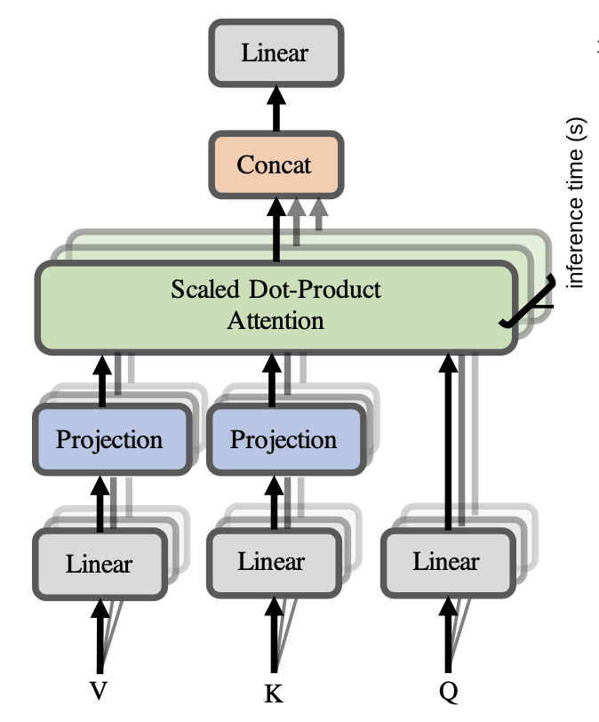
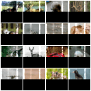
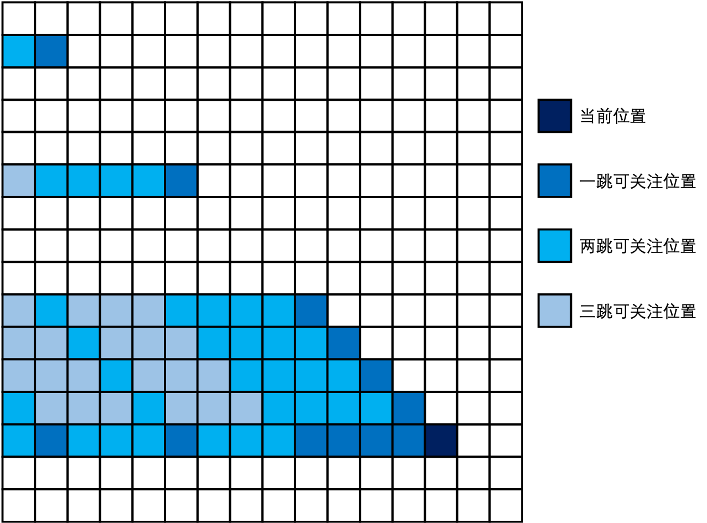
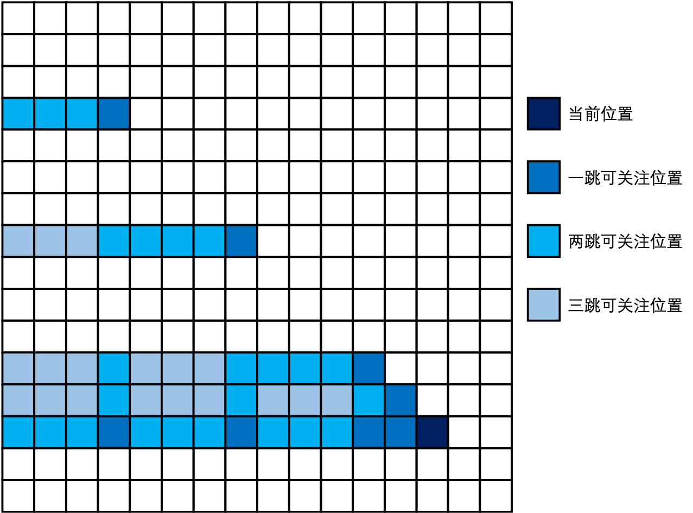
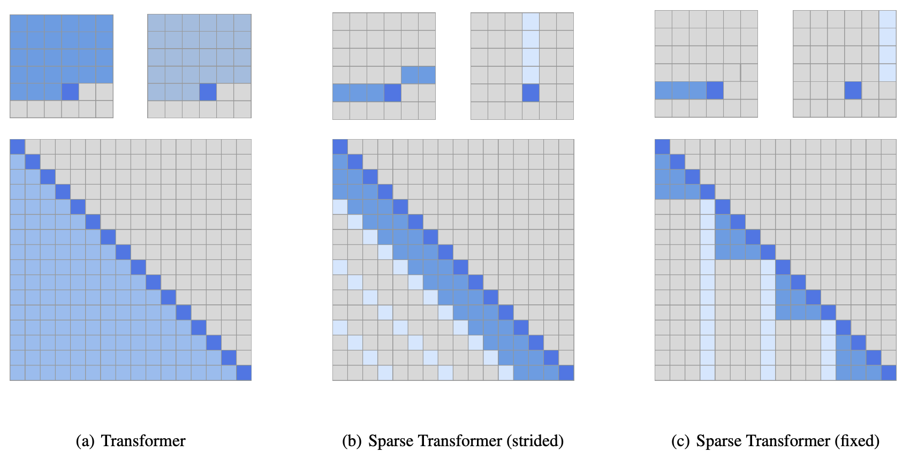

# 大模型算法技术总纲

## 一、嵌入层相关

## 二、位置编码相关
1. 正余弦编码
2. 可学习的位置编码
3. 旋转位置编码

## 三、模型宏观架构
1. MoE模型与稠密模型
2. 编码器架构、解码器架构、编码器-解码器架构
3. 思维链的产生

## 四、注意力机制优化
1. MHA、MQA、GQA
   - `MHA`（`Multi-Head Attention`）：`Transformer`原始注意力方案，多头注意力机制
   - `MQA`（`Multi-Query Attention`）：多查询注意力机制
   - `GQA`（`Grouped-Query Attention`）：分组查询注意力机制
2. 线性注意力机制、稀疏注意力机制
   - 线性注意力机制`Linformer`
     - 线性注意力机制：计算注意力机制的计算复杂度是$O(k * n)$，能够大幅度降低计算注意力机制的时间复杂度
     - 实现的数学原理：论文中对大部分注意力矩阵进行了谱分析，认为大部分注意力矩阵是低秩的，大部分的奇异值很小，信息集中在前面`k`个主成分上
     - 实现方案：直接对每个注意力矩阵做奇异值分解不现实，于是增加了两个可学习的线性层，把`K`、`V`在“序列长度”维度从`n`压缩到`k`，于是新增加了两个线性层$E_i$和$F_i$，将原来的维度进行压缩
       $$
       \begin{aligned}
       \overline{\text{head}}_i &= \text{Attention}(QW_i^Q, E_iKW_i^K, F_iVW_i^V) \\
       &= \underbrace{\text{softmax}\left( \frac{QW_i^Q (E_iKW_i^K)^T}{\sqrt{d_k}} \right)}_{\bar{P}:n \times k} \cdot \underbrace{F_iVW_i^V}_{k \times d},
       \end{aligned}
       $$

       |  矩阵名称  |              原矩阵维度参数              |              现矩阵维度参数              | 
              |:------:|:---------------------------------:|:---------------------------------:|
       |  Q矩阵   | `[batch_size, seq_len, d_model]`  | `[batch_size, seq_len, d_model]`  |
       |  K矩阵   | `[batch_size, seq_len, d_model]`  |    `[batch_size, k, d_model]`     |
       |  V矩阵   | `[batch_size, seq_len, d_model]`  |    `[batch_size, k, d_model]`     |
     - 简单描述：增加了一个线性层对$K$和$V$矩阵进行压缩，但是$Q$矩阵不处理，也就是$n$个词元去查询$k$个待关注的对象，本质上是减少了关注的范围
     - 图片描述：

       

       
   - 稀疏注意力机制`Sparse Transformers`
     - 稠密自注意力机制：之前各种模型`Transformer`和`GPT`的注意力机制都是计算当前词元和其他所有词元之间的相关性，计算相关性的矩阵是“满”的，也就是**稠密注意力机制**
       - 每次计算注意力，需要计算当前元素和之前所有元素之间的关系，也就是至少$n^2$的复杂度计算，在超长上下文序列下，计算成本太高了
       - 研究人员在研究图片注意力机制时发现，注意力机制本身就是“有限”的，并不是稠密的注意力，每一个像素点在不同层训练时关注的内容不一样，比如在自回归图像生成任务中，不同层的注意力机制被使用白色标注处理
         - 第19层的注意力机制，关注的是行维度

           
         - 第20层的注意力机制，关注的是列维度

           
         - 也就是说，本来需要使用$n^2$的复杂度计算全部的注意力，可以因为结构特殊性，用多重线性关注的$n$复杂度来替代，因此产生了**稀疏自注意力机制**算法的构想
       - 既然本来就不是全都注意，那是不是可以削弱注意力机制，用部分注意力代替全部，以节省算力？基于这种思想，诞生了稀疏注意力机制的思路
     - 稀疏自注意力机制：`GPT-3`不再使用当前词元计算和其他所有词元之间的相关性，以此在能够保证训练效果的基础上适当降低训练成本
       - 设计思想：降低注意力关注的范围，正如`Transformer`论文展望的那样，计算“部分”注意力机制已适配更长的上下文场景
       - 稀疏自注意力机制详解
         - 为什么会出现稀疏自注意力机制？因为`GPT-3`的模型参数量史无前例，当时的算力资源相对有限，必须要考虑适当优化，于是借鉴了[1]的稀疏注意力机制设计
         - 稀疏自注意力机制设计原则：保证在固定次跳跃后，能够关注到全部应该关注的内容
         - 稀疏自注意力机制的语言表述（论文中采用了二重分解注意力机制）
           - 【二重分解注意力机制】
             - 跨步注意力机制（GPT3采用的稀疏注意力机制）：只关注最近的$k$个、从当前开始的每$k$个都加上关注；通过这种设计，能够保证在当前节点之间的所有节点，最短在2步都能达到

               
             - 固定步长注意力机制：只关注最近的$x % k$个、每$x % k = 0$的位置都加上关注；通过这种设计，能够保证在当前节点之间的所有节点，最短在2步都能达到

               
           - 【两种注意力机制使用方法】
             - 多层交替使用：在神经网络的不同层中交替使用分解过的注意力机制，比如第一层使用**跨步注意力机制**，第二层使用**固定步长注意力机制**
             - 单头复合使用：在神经网络中的某一层或某一头同时应用双重分解注意力机制，也就是同时关注**跨步注意力机制**和**固定步长注意力机制**
       - 图片描述

         
3.

## 五、稳定梯度传播的策略
1. 归一化位置——`Pre-Norm`、`Post-Norm`
    - `Pre-Norm`
    - `Post-Norm`
2. 归一化策略——`BatchNorm`、`LayerNorm`、`RMSNorm`
    - `BatchNorm`
    - `LayerNorm`
    - `RMSNorm`
3. ReLU、SwiGLU、

## 六、模型泛化能力提高
1. `Dropout`随机失活
2. 退火算法
3. `AdamW`优化器

## 七、

## 八、大模型高效微调技术
1. 混合精度微调
2. 低秩分解LoRA、QLoRA

## 九、基于人类反馈的强化学习

## 十、模型缩放定律

----- 
参考资料汇总
1. 旋转位置编码：https://arxiv.org/pdf/2104.09864v2
2. 线性注意力机制：https://arxiv.org/pdf/2006.04768
3. 稀疏注意力机制：https://arxiv.org/pdf/1904.10509
4. 多查询注意力机制：https://arxiv.org/pdf/1911.02150
5. 分组查询注意力机制：https://arxiv.org/pdf/2305.13245