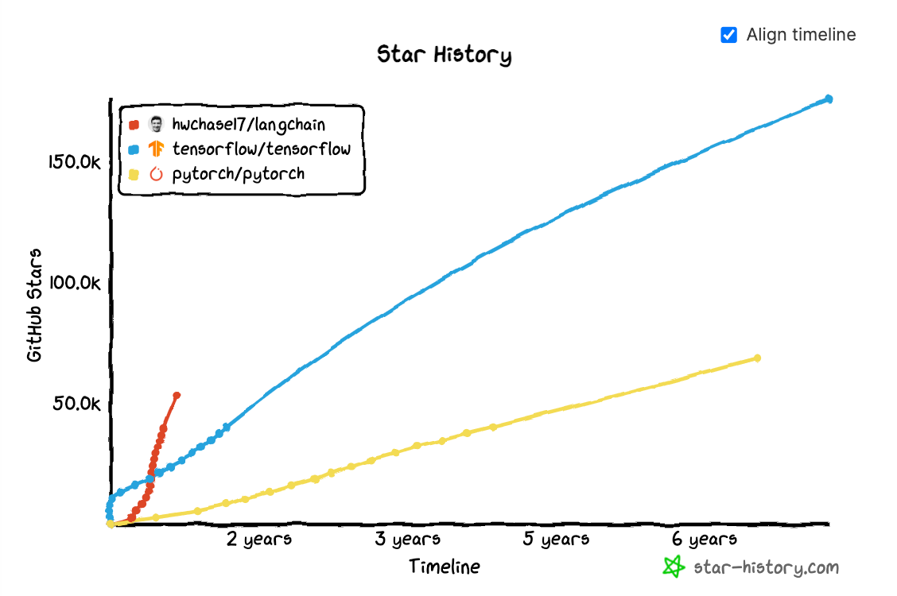
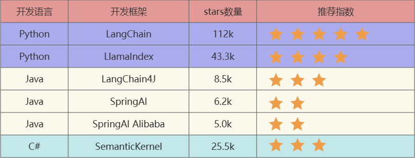
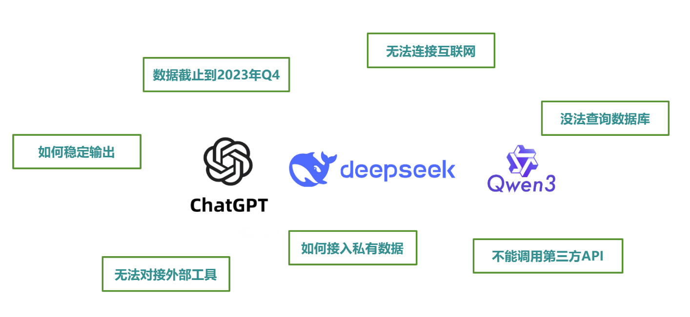
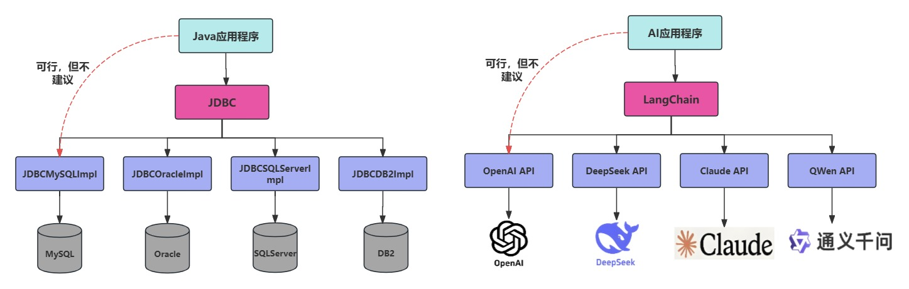
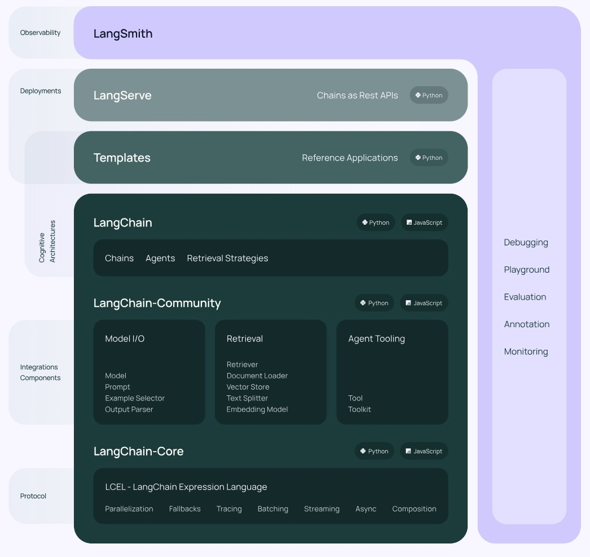
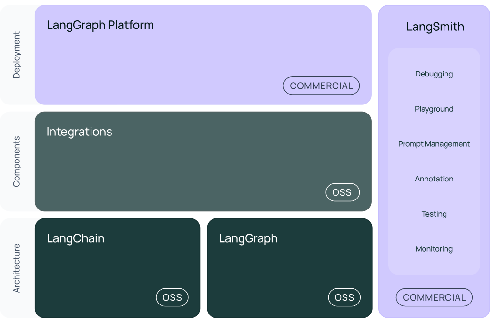
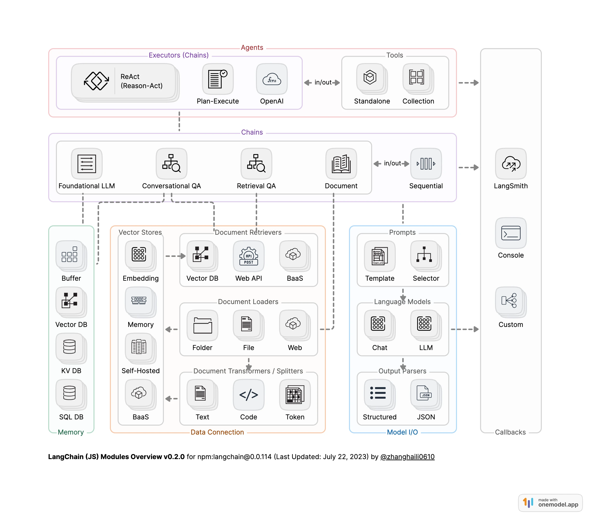
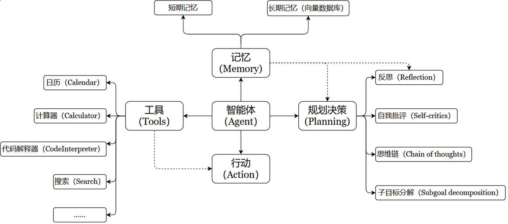
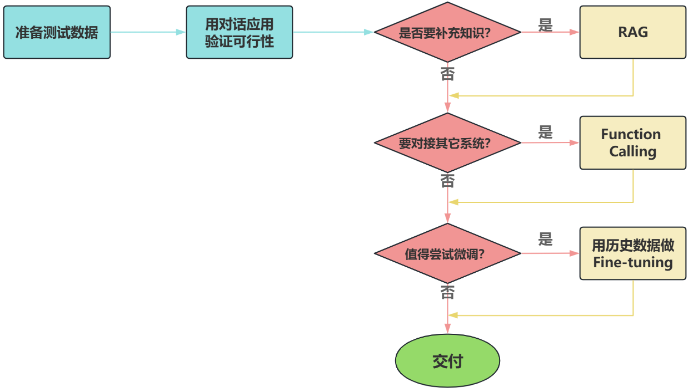

# LangChain使用概述

## 一、LangChain简介
1. LangChain：LangChain是`2022年10月`，由哈佛大学的哈里森·蔡斯发起研发的一个开源框架，用于开发由大语言模型（LLMs）驱动的应用程序
   - LangChain在Github上的热度变化
   
     
   - 简单说，LangChain就是一个大模型开发应用的框架，相当于JavaWeb中的Spring全家桶
   - LangChain中的“Lang”是指language，即大语言模型，“Chain”即“链”，也就是将大模型与外部数据&各种组件连接成链，以此构建AI应用程序。
2. 常见大模型应用开发框架
   - 截止到2025年7月26日，GitHub统计数据：
   
     
   - 概述：
     - `LangChain`：这些工具里出现最早、最成熟的，适合复杂任务分解和单智能体应用
     - `LlamaIndex`：专注于高效的索引和检索，适合 RAG 场景。（注意不是Meta开发的）
     - `LangChain4J`：LangChain出了Java、JavaScript（**LangChain.js**）两个语言的版本，LangChain4j的功能略少于LangChain，但是主要的核心功能都是有的
     - `SpringAI/SpringAI Alibaba`：有待进一步成熟，此外只是简单的对于一些接口进行了封装
     - `SemanticKernel`：也称为sk，微软推出的，面向C#同学
3. 为什么需要LangChain？
   - 在大语言模型（LLM）如 ChatGPT、Claude、DeepSeek 等快速发展的今天，开发者不仅希望能“使用”这些模型，还希望能将它们灵活集成到自己的应用中，实现更强大的对话能力、检索增强生成（RAG）、工具调用（Tool Calling）、多轮推理等功能。
   
     
   - 使用LangChain的好处：
     - 简化开发难度：更简单、更高效、效果更好 
     - 学习成本更低：不同模型的API不同，调用方式也有区别，切换模型时学习成本高。使用LangChain，可以以统一、规范的方式进行调用，有更好的移植性
     - 现成的链式组装：LangChain提供了一些现成的链式组装，用于完成特定的高级任务。让复杂的逻辑变得结构化、易组合、易扩展

     
4. LangChain的使用场景

   |                项目名称                |                     技术点                     |
   |:----------------------------------:|:-------------------------------------------:|
   |               文档问答助手               |   `Prompt` + `Embedding` + `RetrievalQA`    |
   |              智能日程规划助手              |           `Agent + Tool + Memory`           |
   |             LLM+数据库问答              |        `SQLDatabaseToolkit + Agent`         |
   |             多模型路由对话系统              |           `RouterChain` + 多`LLM`            |
   |              互联网智能客服               |    `ConversationChain` + `RAG` + `Agent`    |
   |       企业知识库助手（`RAG` + 本地模型）        |      `VectorDB` + `LLM` + `Streamlit`       |


## 二、LangChain内部架构
1. 版本架构概览
   - V0.1 版本
   
     
   - V0.2 / V0.3 版本
   
     
   - 总览

     
   - 图中展示了`LangChain`生态系统的主要组件及其分类，分为三个层次：架构`Architecture`、组件`Components`和部署`Deployment`
     - 最底层是`架构部分`，包括`LangChain`和`LangGraph`，它们均开源(OSS)
     - 中间层是`组件部分`，标注为开源(OSS)的`Integrations`模块，负责与外部工具或服务集成，例如与API、数据库或第三方模型交互，支持灵活扩展与适配
     - 最顶层是`部署部分`，包括`LangGraph Cloud`和`LangSmith`。其中：`LangGraph Cloud`是商业化的云端解决方案，支持跨平台部署与管理，`LangSmith`后面介绍
2. `LangChain`部分
   - `langchain-Core`：基础抽象和`LangChain`表达式语言LCEL
   - `langchain-community`：第三方集成
   - `langchain`：构成应用程序认知架构的`Chains`，`Agents`，`Retrieval strategies`等
3. `LangGraph`部分：`LangGraph`可以看做基于`LangChain`的api的进一步封装，能够协调多个`Chain`、`Agent`、`Tools`完成更复杂的任务，实现更高级的功能
4. `LangSmith`部分：链路追踪。提供调试、交互式测试环境、评估和监控`LLM`应用程序等功能，便于持续优化，帮助你从原型阶段过渡到生产阶段
5. `LangServe`部分：将LangChain的可运行项和链部署为`REST API`，使得它们可以通过网络进行调用
   - Java怎么调用`langchain`呢？就通过这个`langserve`。将`langchain`应用包装成一个`rest api`，对外暴露服务
   - 支持更高并发，稳定性更好

## 三、LangChain环境构建
1. 基础指令
   - `pip`安装
     ```bash
     # 安装包（默认最新版）
     pip install langchain
     
     # 指定版本
     pip install langchain==0.3.7
     
     # 批量安装（空格分隔）
     pip install langchain requests numpy
     
     # 升级包
     pip install --upgrade langchain
     
     # 卸载包
     pip uninstall langchain
     
     # 查看已安装包
     pip list
     ```
   - `conda`安装
     ```bash
     # 安装包（默认仓库）
     conda install langchain
     
     # 指定频道（如 conda-forge）
     conda install -c conda-forge langchain==0.3.7
     
     # 更新包
     conda update langchain
     
     # 卸载包
     conda uninstall langchain
     
     # 查看已安装包
     conda list
     ```
2. 测试是否安装成功
   ``` python
   import langchain
   print(langchain.__version__)  # 0.3.25
   ```

## 四、LangChain开发应用场景
1. 检索增强生成（`Retrieval-Augmented Generation`）
   - RAG架构图
     

     
   - 流程难点
     - 文件解析：如果是pdf，内部包含文件、图片、表格，图片上还有文字，需要处理
     - 文件切割：没有固定的格式
     - 知识重排序：在`RAG`应用中，随着文档数量增加，召回准确率会下降，引入`reranker`（重排器）可对初步召回的较多`chunk`（如top20或top50）进行精排，提高召回准确率，防止`LLM`处理无关信息，减少时间和成本
   - `reranker`的使用场景
     - 适合：追求`回答高精度`和`高相关性`的场景中特别适合使用`Reranker`，例如专业知识库或者客服系统等应用
     - 不适合：引入`reranker`会增加召回时间，增加检索延迟。服务对`响应时间要求高`时，使用reranker可能不合适
2. Agent开发：充分利用`LLM`的推理决策能力，通过增加规划、记忆和工具调用的能力，构造一个能够独立思考、逐步完成给定目标的智能体
   - OpenAI的元老翁丽莲于2023年6月在个人博客首次提出了现代`AI Agent`架构
     
     
   - 一个数学公式来表示：Agent = LLM + Memory + Tools + Planning +  Action
     - 大模型（LLM）作为“大脑”：提供推理、规划和知识理解能力，是Agent的决策中枢
     - 记忆（Memory）：智能体像人类一样，能留存学到的知识以及交互习惯等，这样的机制能让智能体在处理重复工作时调用以前的经验，从而避免用户进行大量重复交互
       - 短期记忆：存储单次对话周期的上下文信息，属于临时信息存储机制。受限于模型的上下文窗口长度
       - 长期记忆：可以通过模型参数微调（固化知识）、知识图谱（结构化语义网络）或向量数据库（相似性检索）方式实现
     - 工具使用：调用外部工具（如API、数据库）扩展能力边界
     - 规划决策：通过任务分解、反思与自省框架实现复杂任务处理。例如，利用思维链（Chain of Thought）将目标拆解为子任务，并通过反馈优化策略
     - 行动：实际执行决策的模块，涵盖软件接口操作（如自动订票）和物理交互（如机器人执行搬运）。比如：检索、推理、编程等。
3. 实际开发中的技术选型

   

## 五、LangChain简单实战(见`LLM/Engineering/LangChain/code&data/chap01`)

------
参考资料
1. LangChain框架github官网：https://github.com/langchain-ai/langchain
2. LangChain官网：https://www.langchain.com/langchain
3. LangChain中文文档：https://www.langchain.com.cn/
4. LangChain的API文档：https://python.langchain.com/api_reference/
5. Java版本：https://github.com/langchain4j/langchain4j

