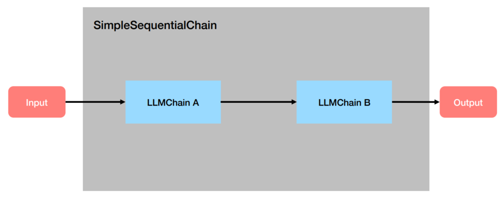
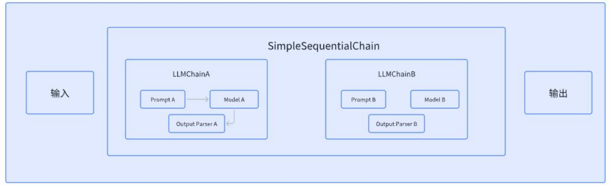
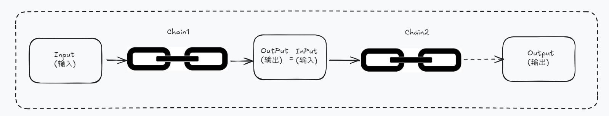
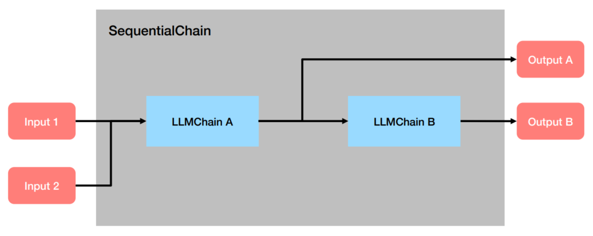
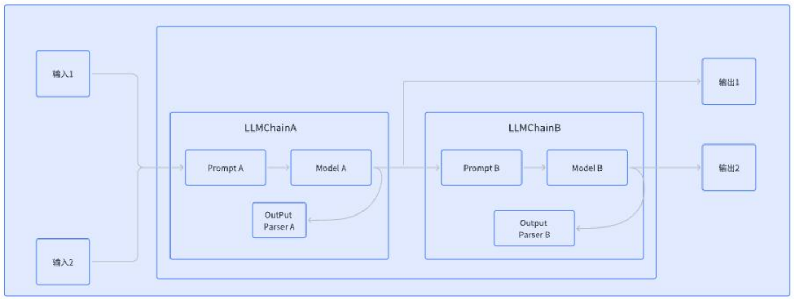
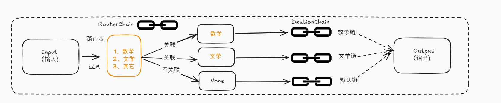
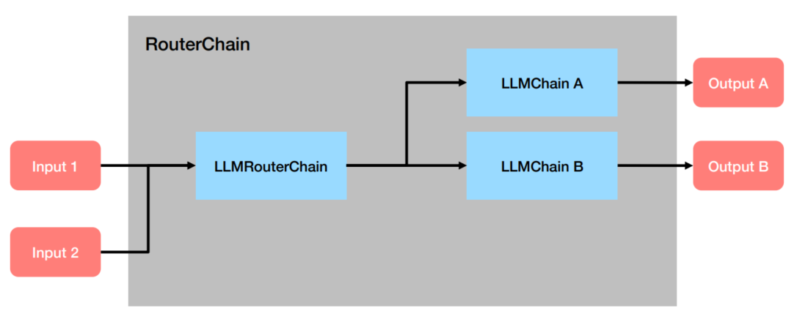
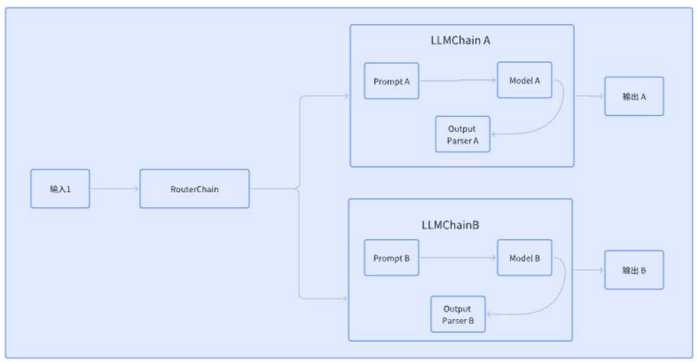

# 第03章：LangChain使用之Chains


## 一、`Chains`的基本使用
1. `Chain`的基本概念
   - `Chain`：链，用于将多个组件（提示模板、LLM模型、记忆、工具等）连接起来，形成可复用的`工作流`，完成复杂的任务
   - `Chain`的核心思想是通过组合不同的模块化单元，实现比单一组件更强大的功能。
2. 构建一个典型的链式服务主要包括如下4个部分
   - 将`LLM`与`Prompt Template`（提示模板）结合 
   - 将`LLM`与`外部数据`结合，例如用于问答
   - 将`LLM`与`长期记忆`结合，例如用于聊天历史记录
   - 通过将`第一个LLM`的输出作为`第二个LLM`的输入，将多个`LLM`按顺序结合在一起
3. `LCEL`（`LangChain Expression Languag`）：`LangChain`表达式语言是一种声明式方法，可以轻松地将多个组件链接成AI工作流。它通过`Python`原生操作符（如管道符`|`）将组件连接成可执行流程，显著简化了AI应用的开发
   - `LCEL`的基本构成：提示（`Prompt`）+ 模型（`Model`）+ 输出解析器（`OutputParser`）
   - 案例：
     ```python
     chain = prompt | model | output_parser
     chain.invoke({"input":"What's your name?"})
     ```
     - `Prompt`：`Prompt`是一个`BasePromptTemplate`，这意味着它接受一个模板变量的字典并生成一个` PromptValue`。`PromptValue`可以传递给`LLM`（它以字符串作为输入）或`ChatModel`（它以消息序列作为输入）
     - `Model`：将`PromptValue`传递给`model`。如果我们的`model`是一个`ChatModel`，这意味着它将输出一个`BaseMessage`
     - `OutputParser`：将`model`的输出传递给`output_parser`，它是一个`BaseOutputParser`，意味着它可以接受字符串或`BaseMessage`作为输入
     - `chain`：我们可以使用`|`运算符轻松创建这个`Chain`，`|`运算符在`LangChain`中用于将两个元素组合在一起。 
     - `invoke`：所有`LCEL`对象都实现`Runnable`协议，保证一致的调用方式（`invoke`/`batch`/`stream`）
   - 原理：`Runnable`是`LangChain`定义的一个抽象接口（`Protocol`），它`强制要求`所有`LCEL`组件实现一组标准方法：
     ```python
     class Runnable(Protocol):
         def invoke(self, input: Any) -> Any: ...        # 单输入单输出
         def batch(self, inputs: List[Any]) -> List[Any]: ...  # 批量处理
         def stream(self, input: Any) -> Iterator[Any]: ...    # 流式输出
         # 还有其他方法如 ainvoke（异步）等...
     ```
   - `Runnable`协议统一的好处：
     - 一致性：无论组件的功能多复杂（模型/提示词/工具），调用方式完全相同
     - 组合性：管道操作符 `|` 背后自动处理类型匹配和中间结果传递
   - 完整示例：
     ```python
     from dotenv import load_dotenv
     from langchain_core.output_parsers import StrOutputParser
     
     load_dotenv()
     chat_model = ChatOpenAI(model="gpt-4o-mini")
     prompt_template = PromptTemplate.from_template(
        template = "给我讲一个关于{topic}话题的简短笑话"
     )
     parser = StrOutputParser()

     # 构建链式调用（LCEL语法）
     chain = prompt_template | chat_model | parser
     out_put = chain.invoke({"topic": "ice cream"})
     print(out_put)
     print(type(out_put))
     ```

## 二、传统`Chain`的使用（驼峰式命名）
1. `LLMChain`：这个链至少包括一个提示模板（`PromptTemplate`），一个语言模型（LLM 或聊天模型）。**

> 注意：LLMChain was deprecated in LangChain 0.1.17 and will be removed in 1.0. Use  `prompt | llm` instead。

**特点：**

- 用于 **单次问答**，输入一个 Prompt，输出 LLM 的响应。
- 适合 **无上下文** 的简单任务（如翻译、摘要、分类等）。
- **无记忆**：无法自动维护聊天历史

#### 2.1.2 主要步骤

**1、配置任务链**：使用LLMChain类将任务与提示词结合，形成完整的任务链。

```python
chain = LLMChain(llm = llm, prompt = prompt_template)
```

**2、执行任务链**：使用invoke()等方法执行任务链，并获取生成结果。可以根据需要对输出进行处理和展示。

```python
result = chain.invoke(...)

print(result)
```


#### 2.1.3 参数说明

这里我们可以整理如下：

| 参数名            | 类型                                                         | 默认值 | 必填 | 说明                                                         |
| ----------------- | ------------------------------------------------------------ | ------ | ---- | ------------------------------------------------------------ |
| `llm`             | Union\[Runnable\[LanguageModelInput,   str\], Runnable\[LanguageModelInput,                  BaseMessage\]\] | -      | `是` | 要调用的语言模型                                             |
| `prompt`          | BasePromptTemplate                                           | -      | `是` | 要使用的提示对象                                             |
| `verbose`         | bool                                                         | False  | 否   | `是否以详细模式运行`。在详细模式下，一些中间日志将被打印到控制台。默认使用全局详细设置，可通过langchain.globals.get_verbose()访问 |
| callback_manager  | Optional\[BaseCallbackManager\]                              | None   | 否   | 【已弃用】请改用callbacks。                                  |
| callbacks         | Callbacks                                                    | None   | 否   | 可选的回调处理器列表或回调管理器。在调用链的生命周期中的不同阶段被调用，从on_chain_start开始，到on_chain_end或on_chain_error结束。自定义链可以选择调用额外的回调方法。详见回调文档 |
| llm_kwargs        | dict                                                         | -      | 否   | 语言模型的关键字参数字典                                     |
| `memory`          | Optional\[BaseMemory\]                                       | None   | 否   | `可选的记忆对象`。默认为None。记忆是一个在每个链的开始和结束时被调用的类。开始时，记忆加载变量并在链中传递。结束时，它保存任何返回的变量。有许多不同类型的内存，请查看内存文档获取完整目录 |
| metadata          | Optional\[Dict\[str, Any]]                                   | None   | 否   | 与链相关联的可选元数据。默认为None。这些元数据将与调用此链的每次调用相关联，并作为参数传递给callbacks中定义的处理程序。您可以使用这些来识别链的特定实例及其用例 |
| `output_parser`   | BaseLLMOutputParser                                          | -      | 否   | `要使用的输出解析器`。默认为StrOutputParser                  |
| return_final_only | bool                                                         | True   | 否   | 是否只返回最终解析结果。默认为True。如果为False，将返回关于生成的额外信息。 |
| tags              | Optional\[List\[str\]\]                                      | None   | 否   | 与链相关联的可选标签列表。默认为None。这些标签将与调用此链的每次调用相关联，并作为参数传递给callbacks中定义的处理程序。您可以使用这些来识别链的特定实例及其用例 |


举例1：


```python
from langchain.chains.llm import LLMChain
from langchain_core.prompts import PromptTemplate

import os
import dotenv
from langchain_openai import ChatOpenAI

dotenv.load_dotenv()

os.environ['OPENAI_API_KEY'] = os.getenv("OPENAI_API_KEY1")
os.environ['OPENAI_BASE_URL'] = os.getenv("OPENAI_BASE_URL")

# 1、创建大模型实例
chat_model = ChatOpenAI(model="gpt-4o-mini")

# 2、原始字符串模板
template = "桌上有{number}个苹果，四个桃子和 3 本书，一共有几个水果?"
prompt = PromptTemplate.from_template(template)

# 3、创建LLMChain
llm_chain = LLMChain(
    llm=chat_model,
    prompt=prompt
)

# 4、调用LLMChain，返回结果
result = llm_chain.invoke({"number": 2})
print(result)
```

> {'number': 2, 'text': '桌上有2个苹果和4个桃子，总共有水果的数量是：\n\n2（苹果） + 4（桃子） = 6（水果）\n\n所以一共有6个水果。'}

举例2：verbose参数，使用使用ChatPromptTemplate。

``` python
# 1.导入相关包
from langchain.chains.llm import LLMChain
from langchain_core.prompts import ChatPromptTemplate
from langchain_openai import ChatOpenAI

# 2.定义提示词模版对象
chat_template = ChatPromptTemplate.from_messages(
    [
        ("system","你是一位{area}领域具备丰富经验的高端技术人才"),
        ("human", "给我讲一个 {adjective} 笑话"),
    ]
)

# 3.定义模型
llm = ChatOpenAI(model="gpt-4o-mini")

# 4.定义LLMChain
llm_chain = LLMChain(llm=llm, prompt=chat_template, verbose=True)

# 5.调用LLMChain
response = llm_chain.invoke({"area":"互联网","adjective":"上班的"})
print(response)
```

> ```
> > Entering new LLMChain chain...
> Prompt after formatting:
> System: 你是一位互联网领域具备丰富经验的高端技术人才
> Human: 给我讲一个 上班的 笑话
> 
> > Finished chain.
> {'area': '互联网', 'adjective': '上班的', 'text': '当然可以！这是一个上班的笑话：\n\n有一天，老板对员工说：“你知道为什么我总是把你的工作推迟吗？”\n\n员工好奇地问：“为什么呢？”\n\n老板微笑着回答：“因为我想让你们的工作保持新鲜感，每次都给你们一个新的截止日期，这样你们就能有更多的‘期待’！”\n\n员工无奈地说：“那我希望能把‘期待’换成薪水！”\n\n希望这个笑话能让你笑一笑！'}
> ```

补充说明：调用方法除了invoke()外，还有run()、predict()、实例方法等，效果与invoke()相同，这里不再介绍。


### 2.2 顺序链之 SimpleSequentialChain

顺序链（SequentialChain）允许将多个链顺序连接起来，每个Chain的输出作为下一个Chain的输入，形成特定场景的流水线（Pipeline）。

**顺序链有两种类型：**

- 单个输入输出：对应着 SimpleSequentialChain
- 多个输入输出：对应着：SequentialChain

#### 2.2.1 说明

SimpleSequentialChain：最简单的顺序链，多个链`串联执行` ，每个步骤都有`单一`的输入和输出，一个步骤的输出就是下一个步骤的输入，无需手动映射







#### 2.2.2 使用举例

举例1：


``` python
from langchain_core.prompts import ChatPromptTemplate
from langchain.chains import LLMChain

chainA_template = ChatPromptTemplate.from_messages(
    [
        ("system", "你是一位精通各领域知识的知名教授"),
        ("human", "请你尽可能详细的解释一下：{knowledge}"),
    ]
)


chainA_chains = LLMChain(llm=llm,
                         prompt=chainA_template,
                         verbose=True
                        )


chainA_chains.invoke({"knowledge":"什么是LangChain？"})
```

> ```
> > Entering new LLMChain chain...
> Prompt after formatting:
> System: 你是一位精通各领域知识的知名教授
> > Entering new LLMChain chain...
> Prompt after formatting:
> System: 你是一位精通各领域知识的知名教授
> Human: 请你尽可能详细的解释一下：什么是LangChain？
> 
> > Finished chain.
> 
> {'knowledge': '什么是LangChain？',
>  'text': 'LangChain 是一个开源框架，旨在设计和构建基于语言模型的应用程序。具体来说，它为开发者提供了一系列工具和组件，使他们能够更轻松地创建复杂的语言模型驱动的应用程序，比如聊天机器人、自动内容生成、信息检索系统等。\n\n### LangChain 的核心组成部分\n\n1. **语言模型支持**：\n   LangChain 支持多种不同的语言模型，如 OpenAI 的 GPT 系列、Hugging Face 的 Transformers 等。这使得开发者可以根据需求选择最适合的模型。\n\n2. **链（Chains）**：\n   LangChain 的一个重要概念是“链”，它允许开发者将多个处理步骤串在一起，以形成一个更复杂的处理流程。例如，一个链可能包括文本的输入、利用语言模型生成反应、然后进一步处理生成的文本。\n\n3. **数据加载（Data Loaders）**：\n   LangChain 提供了一些数据加载工具，可以从各种数据源（如数据库、API、文件系统等）中提取数据，以便于后续处理。\n\n4. **提示模板（Prompt Templates）**：\n   提示模板是构建高效提示词（prompts）的关键工具。用户可以通过定义模板来控制输入给语言模型的信息格式，从而提高输出结果的质量和一致性。\n\n5. **记忆（Memory）**：\n   LangChain 允许模型在多轮对话中保持上下文，增强互动性。这通过记忆机制实现，使得聊天应用可以记住用户的先前输入和状态，从而提供更具个性化的响应。\n\n6. **工具集成（Tooling）**：\n   LangChain 支持将外部工具（如 API、数据库等）与语言模型结合使用，使得模型可以在生成文本时调用这些工具进行数据检索或执行操作，以增强其功能。\n\n### LangChain 的应用场景\n\nLangChain 通常被应用于以下领域：\n\n- **智能客服**：通过与用户进行自然语言对话，回答问题并提供帮助。\n- **内容生成**：自动撰写文章、博客、社交媒体帖子等。\n- **数据分析**：利用自然语言查询数据库，获取所需数据并生成报告。\n- **教育辅助**：开发教育工具，提供自动评估、答案生成等服务。\n- **创作工具**：帮助作家和创作者在写作过程中提供灵感和建议。\n\n### 开发者友好性\n\nLangChain 设计的一个重要目标是易于使用。这意味着即使是没有深厚的机器学习背景的开发者也能利用这个框架构建应用程序。此外，LangChain 还提供了丰富的文档、示例代码和社区支持，使开发者能够迅速上手。\n\n### 总结\n\nLangChain 是一个强大的工具，旨在简化基于语言模型的应用程序的开发过程。通过提供各种组件和功能，它使得开发者能够专注于应用逻辑，而不是底层实现细节。随着语言模型技术的迅速发展，LangChain 在推动相关应用的普及和应用场景的扩展中，发挥了重要作用。'}
> ```

继续：

``` python
from langchain_core.prompts import ChatPromptTemplate

chainB_template = ChatPromptTemplate.from_messages(
    [
        ("system", "你非常善于提取文本中的重要信息，并做出简短的总结"),
        ("human", "这是针对一个提问完整的解释说明内容：{description}"),
        ("human", "请你根据上述说明，尽可能简短的输出重要的结论，请控制在20个字以内"),
    ]
)


chainB_chains = LLMChain(llm=llm,
                         prompt=chainB_template,
                         verbose=True
                        )


#
# 导入SimpleSequentialChain
from langchain.chains import SimpleSequentialChain

# 在chains参数中，按顺序传入LLMChain A 和LLMChain B
full_chain = SimpleSequentialChain(chains=[chainA_chains, chainB_chains], verbose=True)

full_chain.invoke({"input":"什么是langChain？"})

```

> ...
>
> {'input': '什么是langChain？', 'output': 'LangChain是构建NLP应用的灵活框架，简化与语言模型的互动。'}

在这个过程中，因为`SimpleSequentialChain`定义的是顺序链，所以在`chains`参数中传递的列表要按照顺序来进行传入，即LLMChain A 要在LLMChain B之前。同时，在调用时，不再使用LLMChain A中定义的`{knowledge}` 参数，也不是LLMChainB中定义的`{description}`参数，而是要使用 `input`进行变量的传递。

源码：

``` python
class SimpleSequentialChain(Chain):
    """Simple chain where the outputs of one step feed directly into next."""

    chains: List[Chain]
    strip_outputs: bool = False
    input_key: str = "input"  #: :meta private:
    output_key: str = "output"  #: :meta private:
```

举例2：

创建了两条chain，并且让第一条chain给剧名写大纲，输出该剧名大纲，作为第二条chain的输入，然后生成一个剧本的大纲评论。最后利用SimpleSequentialChain即可将两个chain直接串联起来。

```python
# 1.导入相关包
from langchain.chains import LLMChain
from langchain_core.prompts import PromptTemplate
from langchain.chains import SimpleSequentialChain

# 2.创建大模型实例
llm = ChatOpenAI(model="gpt-4o-mini")

# 3.定义一个给剧名写大纲的LLMChain
template1 = """你是个剧作家。给定剧本的标题，你的工作就是为这个标题写一个大纲。
Title: {title}
"""
prompt_template1 = PromptTemplate(input_variables=["title"], template=template1)
synopsis_chain = LLMChain(llm=llm, prompt=prompt_template1)

# 4.定义给一个剧本大纲写一篇评论的LLMChain
template2 = """你是《纽约时报》的剧评家。有了剧本的大纲，你的工作就是为剧本写一篇评论
剧情大纲:
{synopsis}
"""
prompt_template2 = PromptTemplate(input_variables=["synopsis"], template=template2)
review_chain = LLMChain(llm=llm, prompt=prompt_template2)


# 5.定义一个完整的链按顺序运行这两条链
#(verbose=True:打印链的执行过程)
overall_chain = SimpleSequentialChain(
    chains=[synopsis_chain, review_chain], verbose=True
)
# 6.调用完整链顺序执行这两个链
review = overall_chain.invoke("日落海滩上的悲剧")

# 7.打印结果
print(review)
```

> ```
> > Entering new SimpleSequentialChain chain...
> **剧本大纲：日落海滩上的悲剧**
> 
> **第一幕：宁静的日落**
> 
> - **场景一：海滩的美景**  
>   故事开始于一个宁静的海滩，阳光在海平面上缓缓下沉，涂抹着天空温暖的色彩。几位角色在此聚集，展示出他们各自的生活和背景。主角李伟是一名年轻的摄影师，来到海滩拍摄风景。还有他的青梅竹马小雨，一个对未来充满憧憬的大学生。
> 
> - **场景二：角色介绍**  
>   介绍其他角色，如小雨的父母、当地的渔民老张，以及神秘的过客阿俊。随着日落的临近，角色们之间的互动建立起了一种和谐的氛围，但潜在的紧张感开始显露。
> 
> **第二幕：冲突的种子**
> 
> - **场景三：意外的相遇**  
>   一次偶然的机会，小雨在海边遇到了阿俊，他是一位退伍军人，内心承受着巨大的心理创伤。两人开始互动，阿俊向小雨倾诉他从军经历中的悲惨故事。这个故事引发了小雨对自己生活的思考。
> 
> - **场景四：关系的发展**  
>   李伟察觉到小雨与阿俊之间的亲密关系，内心不安。在一次聚会中，他鼓起勇气向小雨表白，但被婉拒，表明小雨希望能追求自己的梦想而不是陷入感情的羁绊。
> 
> - **场景五：冲突的升级**  
>   阿俊的内心挣扎不断加剧，他的过去不断回袭，情绪不稳。一次醉酒后的冲突中，他失控并与李伟发生冲突，揭露出过去的痛苦和未解的仇恨。
> 
> **第三幕：悲剧的降临**
> 
> - **场景六：转折点**  
>   海滩边，阿俊情绪失控，提到要“为自己的过去复仇”，引发了周围人对他内心的担忧。小雨试图安抚他，但最终与他产生了难以调和的矛盾。
> 
> - **场景七：悲剧的发生**  
>   在一次面对外来威胁的冲突中，阿俊为了保护小雨而和他心中仇恨的对象发生了冲突，结果酿成悲剧。阿俊不幸身亡，李伟和小雨则被卷入这场悲剧之中，面临失去和内疚。
> 
> **第四幕：重拾希望**
> 
> - **场景八：悲伤的殡葬**  
>   阿俊的葬礼上，所有角色聚集在一起，彼此间的情感变得复杂。小雨和李伟在悲伤中反思自己的人生选择。老张对阿俊的过去有了解，他试图在葬礼上表达人与人之间的连结和理解。
> 
> - **场景九：新的开始**  
>   随着时间的推移，李伟和小雨决定共同帮助那些经历心理创伤的人，利用各自的才能来传播积极的讯息。他们开始在海滩上进行摄影展览，将阿俊的故事传递给更多人。
> 
> - **场景十：希望的日出**  
> > Entering new SimpleSequentialChain chain...
> **剧本大纲：日落海滩上的悲剧**
> 
> **第一幕：宁静的日落**
> 
> - **场景一：海滩的美景**  
>   故事开始于一个宁静的海滩，阳光在海平面上缓缓下沉，涂抹着天空温暖的色彩。几位角色在此聚集，展示出他们各自的生活和背景。主角李伟是一名年轻的摄影师，来到海滩拍摄风景。还有他的青梅竹马小雨，一个对未来充满憧憬的大学生。
> 
> - **场景二：角色介绍**  
>   介绍其他角色，如小雨的父母、当地的渔民老张，以及神秘的过客阿俊。随着日落的临近，角色们之间的互动建立起了一种和谐的氛围，但潜在的紧张感开始显露。
> 
> **第二幕：冲突的种子**
> 
> - **场景三：意外的相遇**  
>   一次偶然的机会，小雨在海边遇到了阿俊，他是一位退伍军人，内心承受着巨大的心理创伤。两人开始互动，阿俊向小雨倾诉他从军经历中的悲惨故事。这个故事引发了小雨对自己生活的思考。
> 
> - **场景四：关系的发展**  
>   李伟察觉到小雨与阿俊之间的亲密关系，内心不安。在一次聚会中，他鼓起勇气向小雨表白，但被婉拒，表明小雨希望能追求自己的梦想而不是陷入感情的羁绊。
> 
> - **场景五：冲突的升级**  
>   阿俊的内心挣扎不断加剧，他的过去不断回袭，情绪不稳。一次醉酒后的冲突中，他失控并与李伟发生冲突，揭露出过去的痛苦和未解的仇恨。
> 
> **第三幕：悲剧的降临**
> 
> - **场景六：转折点**  
>   海滩边，阿俊情绪失控，提到要“为自己的过去复仇”，引发了周围人对他内心的担忧。小雨试图安抚他，但最终与他产生了难以调和的矛盾。
> 
> - **场景七：悲剧的发生**  
>   在一次面对外来威胁的冲突中，阿俊为了保护小雨而和他心中仇恨的对象发生了冲突，结果酿成悲剧。阿俊不幸身亡，李伟和小雨则被卷入这场悲剧之中，面临失去和内疚。
> 
> **第四幕：重拾希望**
> 
> - **场景八：悲伤的殡葬**  
>   阿俊的葬礼上，所有角色聚集在一起，彼此间的情感变得复杂。小雨和李伟在悲伤中反思自己的人生选择。老张对阿俊的过去有了解，他试图在葬礼上表达人与人之间的连结和理解。
> 
> - **场景九：新的开始**  
>   随着时间的推移，李伟和小雨决定共同帮助那些经历心理创伤的人，利用各自的才能来传播积极的讯息。他们开始在海滩上进行摄影展览，将阿俊的故事传递给更多人。
> 
> - **场景十：希望的日出**  
>   在新的日出中，李伟和小雨站在海滩上，面向未来。尽管经历了悲剧，他们明白生活依然充满希望，彼此间的情感也在不幸中重新建立。故事在美丽的风景中结束，留下观众对生命、友谊和希望的深思。
> **剧评：日落海滩上的悲剧**
> 
> 在一片宁静的海滩上，阳光缓缓下沉，天空被温暖的色彩浸染，这是《日落海滩上的悲剧》的开幕场景。剧作通过鲜明的视觉对比和深刻的人物刻画，展现了生活的美丽与悲剧交织。在这一令人感慨的故事中，海滩不仅仅是背景，更是角色命运交错、情感碰撞的舞台。
> 
> 故事的启动由几位性格各异的角色相聚而成。年轻摄影师李伟和梦想着未来的小雨之间的青涩情感令人唏嘘，而神秘的过客阿俊则成为了故事的暗流。阿俊，作为一名退伍军人，他身上的伤痛与矛盾通过他与小雨的互动得以展现，却也为本剧埋下了悲剧的种子。
> 
> 剧作的第二幕通过阿俊与小雨的相遇，开启了情感和内心冲突的更深层次探讨。阿俊向小雨倾诉他在战争中经历的心理创伤，这一段情感的交流不仅在角色间构建起了一种脆弱的连结，也让观众意识到，个体生活中的痛苦常常是在不知不觉间侵蚀着彼此的关系。阿俊的故事深深触动了小雨，同时也引发了李伟的隐忧——他对小雨的情感被外来的敌意威胁着，令观众感受到一种无形的紧张。
> 
> 随着冲突的逐渐升级，剧作成功地塑造了一种无处可逃的绝望感。阿俊情绪的崩溃，不仅是他个人内心的悲剧，也是对周围人情感的一次冲击。在面对外来威胁的关键时刻，阿俊为了保护小雨而发生悲剧，为故事带来了强烈的冲击力。这一幕不仅令人心痛，也让观众反思暴力背后的人性与命运的无常。
> 
> 在经历了剧烈的情感波动后，阿俊的葬礼成为整部剧的情感高峰，所有角色在此刻聚集，互相碰撞出复杂的情感火花。剧作通过老张这一角色的深刻发言，让角色间由悲伤引发的共鸣与理解成为悲剧的救赎。尽管亲密的关系遭受重创，但李伟和小雨仍然选择了继续前行，用行动纪念阿俊的遗志，将这场悲剧化为帮助他人的力量。
> 
> 结尾的日出象征着希望，尽管生活中存在着不可预知的悲剧与痛苦，但李伟和小雨的坚持告诉我们：人类的情感是弹性的，生活永远充满希望。在这片海滩上，残留的并不是绝望，而是对生命、友谊与爱的深刻理解与珍视。
> 
> 《日落海滩上的悲剧》通过细腻的情感描绘和强烈的视觉语言，传达了一个重要的主题：尽管生活中充满了悲剧和挑战，但最终，爱与希望将引导人们走向光明。作品在深刻探讨人物内心和社会困境的同时，也唤起了观众对人性的关注与思考，成为了一部值得反复咀嚼的佳作。
> 
> > Finished chain.
> {'input': '日落海滩上的悲剧', 'output': '**剧评：日落海滩上的悲剧**\n\n在一片宁静的海滩上，阳光缓缓下沉，天空被温暖的色彩浸染，这是《日落海滩上的悲剧》的开幕场景。剧作通过鲜明的视觉对比和深刻的人物刻画，展现了生活的美丽与悲剧交织。在这一令人感慨的故事中，海滩不仅仅是背景，更是角色命运交错、情感碰撞的舞台。\n\n故事的启动由几位性格各异的角色相聚而成。年轻摄影师李伟和梦想着未来的小雨之间的青涩情感令人唏嘘，而神秘的过客阿俊则成为了故事的暗流。阿俊，作为一名退伍军人，他身上的伤痛与矛盾通过他与小雨的互动得以展现，却也为本剧埋下了悲剧的种子。\n\n剧作的第二幕通过阿俊与小雨的相遇，开启了情感和内心冲突的更深层次探讨。阿俊向小雨倾诉他在战争中经历的心理创伤，这一段情感的交流不仅在角色间构建起了一种脆弱的连结，也让观众意识到，个体生活中的痛苦常常是在不知不觉间侵蚀着彼此的关系。阿俊的故事深深触动了小雨，同时也引发了李伟的隐忧——他对小雨的情感被外来的敌意威胁着，令观众感受到一种无形的紧张。\n\n随着冲突的逐渐升级，剧作成功地塑造了一种无处可逃的绝望感。阿俊情绪的崩溃，不仅是他个人内心的悲剧，也是对周围人情感的一次冲击。在面对外来威胁的关键时刻，阿俊为了保护小雨而发生悲剧，为故事带来了强烈的冲击力。这一幕不仅令人心痛，也让观众反思暴力背后的人性与命运的无常。\n\n在经历了剧烈的情感波动后，阿俊的葬礼成为整部剧的情感高峰，所有角色在此刻聚集，互相碰撞出复杂的情感火花。剧作通过老张这一角色的深刻发言，让角色间由悲伤引发的共鸣与理解成为悲剧的救赎。尽管亲密的关系遭受重创，但李伟和小雨仍然选择了继续前行，用行动纪念阿俊的遗志，将这场悲剧化为帮助他人的力量。\n\n结尾的日出象征着希望，尽管生活中存在着不可预知的悲剧与痛苦，但李伟和小雨的坚持告诉我们：人类的情感是弹性的，生活永远充满希望。在这片海滩上，残留的并不是绝望，而是对生命、友谊与爱的深刻理解与珍视。\n\n《日落海滩上的悲剧》通过细腻的情感描绘和强烈的视觉语言，传达了一个重要的主题：尽管生活中充满了悲剧和挑战，但最终，爱与希望将引导人们走向光明。作品在深刻探讨人物内心和社会困境的同时，也唤起了观众对人性的关注与思考，成为了一部值得反复咀嚼的佳作。'}
> ```


### 2.3 顺序链之 SequentialChain

#### 2.3.1 说明

SequentialChain：更通用的顺序链，允许多个输入和输出。





**SequentialChain 的一些关键特性：**

- 支持在链之间传递多个变量，而不仅仅是单个字符串。
- 支持同时返回多个输出变量。
- 可以通过`命名精准`的输入输出变量，来明确链之间的关系。


#### 2.3.2 使用举例

- 分别通过 `input_variables` 和 `output_variables` 配置输入和输出
- 需`显式定义`变量如何从一个链传递到下一个链。即精准地命名输入关键字和输出关键字，这样才能保证chain的识别与应用

举例1：

```python
# 1.导入相关包
from langchain.chains.llm import LLMChain
from langchain_openai import ChatOpenAI
from langchain_core.prompts import PromptTemplate
from langchain.chains import SequentialChain

# 创建大模型实例
llm = ChatOpenAI(model="gpt-4o-mini")

# 2.定义任务链一
#chain 1 任务：翻译成中文
first_prompt = PromptTemplate.from_template("把下面内容翻译成中文:\n\n{content}")
chain_one = LLMChain(
    llm=llm,
    prompt=first_prompt,
    verbose=True,
    output_key="Chinese_Review",
)

# 3.定义任务链二
#chain 2 任务：对翻译后的中文进行总结摘要 input_key是上一个chain的output_key
second_prompt = PromptTemplate.from_template("用一句话总结下面内容:\n\n{Chinese_Review}")
chain_two = LLMChain(
    llm=llm,
    prompt=second_prompt,
    verbose=True,
    output_key="Chinese_Summary",
)

# 4.定义任务链三
# chain 3 任务：识别语言
third_prompt = PromptTemplate.from_template("下面内容是什么语言:\n\n{Chinese_Summary}")
chain_three = LLMChain(
    llm=llm,
    prompt=third_prompt,
    verbose=True,
    output_key="Language",
)

# 5.定义任务链四
#chain 4 任务:针对摘要使用指定语言进行评论 input_key是上一个chain的output_key
fourth_prompt = PromptTemplate.from_template("请使用指定的语言对以下内容进行评论:\n\n内容:{Chinese_Summary}\n\n语言:{Language}")
chain_four = LLMChain(
    llm=llm,
    prompt=fourth_prompt,
    verbose=True,
    output_key="Comment",
)


# 6.总链
#overall 任务：翻译成中文->对翻译后的中文进行总结摘要->智能识别语言->针对摘要使用指定语言进行评论
overall_chain = SequentialChain(
    chains=[chain_one, chain_two, chain_three, chain_four],
    verbose=True,
    input_variables=["content"],
    output_variables=["Chinese_Review", "Chinese_Summary", "Language", "Comment"],
)


#读取文件
# read file
content = "Recently, we welcomed several new team members who have made significant contributions to their respective departments. I would like to recognize Jane Smith (SSN: 049-45-5928) for her outstanding performance in customer service. Jane has consistently received positive feedback from our clients. Furthermore, please remember that the open enrollment period for our employee benefits program is fast approaching. Should you have any questions or require assistance, please contact our HR representative, Michael Johnson (phone: 418-492-3850, email: michael.johnson@example.com)."
overall_chain.invoke(content)
```

> ```
> > Entering new SequentialChain chain...
> 
> 
> > Entering new LLMChain chain...
> Prompt after formatting:
> 把下面内容翻译成中文:
> 
> > Entering new SequentialChain chain...
> 
> 
> > Entering new LLMChain chain...
> Prompt after formatting:
> 把下面内容翻译成中文:
> 
> Recently, we welcomed several new team members who have made significant contributions to their respective departments. I would like to recognize Jane Smith (SSN: 049-45-5928) for her outstanding performance in customer service. Jane has consistently received positive feedback from our clients. Furthermore, please remember that the open enrollment period for our employee benefits program is fast approaching. Should you have any questions or require assistance, please contact our HR representative, Michael Johnson (phone: 418-492-3850, email: michael.johnson@example.com).
> 
> > Finished chain.
> 
> 
> > Entering new LLMChain chain...
> Prompt after formatting:
> 用一句话总结下面内容:
> 
> > Entering new SequentialChain chain...
> 
> 
> > Entering new LLMChain chain...
> Prompt after formatting:
> 把下面内容翻译成中文:
> 
> Recently, we welcomed several new team members who have made significant contributions to their respective departments. I would like to recognize Jane Smith (SSN: 049-45-5928) for her outstanding performance in customer service. Jane has consistently received positive feedback from our clients. Furthermore, please remember that the open enrollment period for our employee benefits program is fast approaching. Should you have any questions or require assistance, please contact our HR representative, Michael Johnson (phone: 418-492-3850, email: michael.johnson@example.com).
> 
> > Finished chain.
> 
> 
> > Entering new LLMChain chain...
> Prompt after formatting:
> 用一句话总结下面内容:
> 
> 最近，我们欢迎了几位新团队成员，他们在各自的部门中做出了显著的贡献。我想特别表彰简·史密斯（社会安全号码：049-45-5928）在客户服务方面的优秀表现。简一直以来都收到了客户的积极反馈。此外，请记住，我们员工福利计划的开放注册期即将来临。如果您有任何问题或需要帮助，请联系我们的HR代表迈克尔·约翰逊（电话：418-492-3850，电子邮件：michael.johnson@example.com）。
> 
> > Finished chain.
> 
> 
> > Entering new LLMChain chain...
> Prompt after formatting:
> 下面内容是什么语言:
> 
> > Entering new SequentialChain chain...
> 
> 
> > Entering new LLMChain chain...
> Prompt after formatting:
> 把下面内容翻译成中文:
> 
> Recently, we welcomed several new team members who have made significant contributions to their respective departments. I would like to recognize Jane Smith (SSN: 049-45-5928) for her outstanding performance in customer service. Jane has consistently received positive feedback from our clients. Furthermore, please remember that the open enrollment period for our employee benefits program is fast approaching. Should you have any questions or require assistance, please contact our HR representative, Michael Johnson (phone: 418-492-3850, email: michael.johnson@example.com).
> 
> > Finished chain.
> 
> 
> > Entering new LLMChain chain...
> Prompt after formatting:
> 用一句话总结下面内容:
> 
> 最近，我们欢迎了几位新团队成员，他们在各自的部门中做出了显著的贡献。我想特别表彰简·史密斯（社会安全号码：049-45-5928）在客户服务方面的优秀表现。简一直以来都收到了客户的积极反馈。此外，请记住，我们员工福利计划的开放注册期即将来临。如果您有任何问题或需要帮助，请联系我们的HR代表迈克尔·约翰逊（电话：418-492-3850，电子邮件：michael.johnson@example.com）。
> 
> > Finished chain.
> 
> 
> > Entering new LLMChain chain...
> Prompt after formatting:
> 下面内容是什么语言:
> 
> 最近我们欢迎了新团队成员，并特别表彰简·史密斯在客户服务上的优秀贡献，同时提醒大家员工福利计划开放注册即将开始。
> 
> > Finished chain.
> 
> 
> > Entering new LLMChain chain...
> Prompt after formatting:
> 请使用指定的语言对以下内容进行评论:
> 
> 内容:最近我们欢迎了新团队成员，并特别表彰简·史密斯在客户服务上的优秀贡献，同时提醒大家员工福利计划开放注册即将开始。
> 
> > Entering new SequentialChain chain...
> 
> 
> > Entering new LLMChain chain...
> Prompt after formatting:
> 把下面内容翻译成中文:
> 
> Recently, we welcomed several new team members who have made significant contributions to their respective departments. I would like to recognize Jane Smith (SSN: 049-45-5928) for her outstanding performance in customer service. Jane has consistently received positive feedback from our clients. Furthermore, please remember that the open enrollment period for our employee benefits program is fast approaching. Should you have any questions or require assistance, please contact our HR representative, Michael Johnson (phone: 418-492-3850, email: michael.johnson@example.com).
> 
> > Finished chain.
> 
> 
> > Entering new LLMChain chain...
> Prompt after formatting:
> 用一句话总结下面内容:
> 
> 最近，我们欢迎了几位新团队成员，他们在各自的部门中做出了显著的贡献。我想特别表彰简·史密斯（社会安全号码：049-45-5928）在客户服务方面的优秀表现。简一直以来都收到了客户的积极反馈。此外，请记住，我们员工福利计划的开放注册期即将来临。如果您有任何问题或需要帮助，请联系我们的HR代表迈克尔·约翰逊（电话：418-492-3850，电子邮件：michael.johnson@example.com）。
> 
> > Finished chain.
> 
> 
> > Entering new LLMChain chain...
> Prompt after formatting:
> 下面内容是什么语言:
> 
> 最近我们欢迎了新团队成员，并特别表彰简·史密斯在客户服务上的优秀贡献，同时提醒大家员工福利计划开放注册即将开始。
> 
> > Finished chain.
> 
> 
> > Entering new LLMChain chain...
> Prompt after formatting:
> 请使用指定的语言对以下内容进行评论:
> 
> 内容:最近我们欢迎了新团队成员，并特别表彰简·史密斯在客户服务上的优秀贡献，同时提醒大家员工福利计划开放注册即将开始。
> 
> 语言:这段内容是中文。
> 
> > Finished chain.
> 
> > Finished chain.
> ```

> ```
> {'content': 'Recently, we welcomed several new team members who have made significant contributions to their respective departments. I would like to recognize Jane Smith (SSN: 049-45-5928) for her outstanding performance in customer service. Jane has consistently received positive feedback from our clients. Furthermore, please remember that the open enrollment period for our employee benefits program is fast approaching. Should you have any questions or require assistance, please contact our HR representative, Michael Johnson (phone: 418-492-3850, email: michael.johnson@example.com).',
>   'Chinese_Review': '最近，我们欢迎了几位新团队成员，他们在各自的部门中做出了显著的贡献。我想特别表彰简·史密斯（社会安全号码：049-45-5928）在客户服务方面的优秀表现。简一直以来都收到了客户的积极反馈。此外，请记住，我们员工福利计划的开放注册期即将来临。如果您有任何问题或需要帮助，请联系我们的HR代表迈克尔·约翰逊（电话：418-492-3850，电子邮件：michael.johnson@example.com）。',
>   'Chinese_Summary': '最近我们欢迎了新团队成员，并特别表彰简·史密斯在客户服务上的优秀贡献，同时提醒大家员工福利计划开放注册即将开始。',
>   'Language': '这段内容是中文。',
>   'Comment': '这段内容传达了积极的信息，首先欢迎了新团队成员，展现了公司对团队扩展的重视和支持。此外，特别表彰简·史密斯在客户服务方面的出色表现，表明公司鼓励员工在各自岗位上追求卓越，这有助于激励其他员工努力工作、提升服务质量。最后，提到员工福利计划的开放注册，说明公司关心员工的福祉，希望通过福利措施提高员工的满意度与归属感。总体而言，这是一份充满正能量和关怀的通知，能够增强团队的凝聚力和向心力。'}
> ```


举例2：


``` python
from langchain_core.prompts import ChatPromptTemplate
from langchain.chains import SequentialChain
from langchain_openai import ChatOpenAI
from langchain.chains import LLMChain
from openai import OpenAI
import os

# 创建大模型实例
llm = ChatOpenAI(model="gpt-4o-mini")


schainA_template = ChatPromptTemplate.from_messages(
    [
        ("system", "你是一位精通各领域知识的知名教授"),
        ("human", "请你先尽可能详细的解释一下：{knowledge}，并且{action}")
    ]
)

schainA_chains = LLMChain(llm=llm,
                          prompt=schainA_template,
                          verbose=True,
                          output_key="schainA_chains_key"
                          )

# schainA_chains.invoke({
#     "knowledge": "中国的篮球怎么样？",
#     "action": "举一个实际的例子"
# }
# )

schainB_template = ChatPromptTemplate.from_messages(
    [
        ("system", "你非常善于提取文本中的重要信息，并做出简短的总结"),
        ("human", "这是针对一个提问完整的解释说明内容：{schainA_chains_key}"),
        ("human", "请你根据上述说明，尽可能简短的输出重要的结论，请控制在100个字以内"),
    ]
)

schainB_chains = LLMChain(llm=llm,
                         prompt=schainB_template,
                         verbose=True,
                         output_key='schainB_chains_key'
                        )

Seq_chain = SequentialChain(
                            chains=[schainA_chains, schainB_chains],
                            input_variables=["knowledge", "action"],
                            output_variables=["schainA_chains_key","schainB_chains_key"],
                            verbose=True)

response = Seq_chain.invoke({
                       "knowledge":"中国足球为什么踢得烂",
                       "action":"举一个实际的例子"
                    }
                )

print(response)
```

> ```
> ....
> 
> > Finished chain.
> 
> > Finished chain.
> {'knowledge': '中国足球为什么踢得烂', 'action': '举一个实际的例子', 'schainA_chains_key': '中国足球踢得烂的原因是多方面的，可以从历史、文化、管理、教育、经济等多个角度进行分析。\n\n### 一、历史与文化因素\n\n1. **足球文化薄弱**：中国足球的群众基础比较薄弱，足球并没有成为主流文化的一部分。与欧美国家相比，足球在中国的受欢迎程度相对较低，缺乏系统的推广和培养。\n\n2. **历史积怨**：中国足球在多次国际比赛中的表现不佳，导致了人们对中国足球的失望和怀疑。这种负面情绪影响了球员的心理状态和球迷的支持。\n\n### 二、管理与体制问题\n\n1. **管理混乱**：中国足球的管理体系不够健全，相关部门之间协调不力，导致资源的浪费和功利主义的现象普遍存在。\n\n2. **足球体制**：中国足球的职业联赛体制虽然在逐渐改进，但依旧存在不合理之处，例如过度依赖外援、国内球员的发展受到限制等。同时，青训系统的发展滞后，无法提供足够高水平的年轻球员。\n\n### 三、教育与培训不足\n\n1. **青训系统不完善**：虽然在一些大城市的俱乐部设有青训学院，但整体而言青训体系不完善，缺乏系统的、科学的培训方法，导致年轻球员的基础技能和战术意识不足。\n\n2. **教练水平参差不齐**：许多中国足球教练的专业水平和经验相比于国际水平仍显不足，无法更好地培养出优秀球员。\n\n### 四、经济因素\n\n1. **资金投入不均**：虽然有些俱乐部在资金上投入巨额，但部分俱乐部依旧面临资金短缺的问题。资金的分配不均直接影响了青训、后备人才的培养。\n\n2. **过度依赖引援**：不少俱乐部为了迅速提升战斗力，过于依赖引进外援，导致本土球员的成长空间受到挤压。\n\n### 实际例子\n\n一个非常典型的例子是中国男足在2018年俄罗斯世界杯预选赛中的表现。中国队在该轮预选赛中首轮对阵马尔代夫，最终以3:0胜出，但在随后的比赛中却以0:2输给了伊朗，0:1输给了叙利亚，未能晋级。这些比赛体现了庞大的资金投入并未能转化为外在成绩，反而暴露了球队战术水平低下、球员个人能力不足、以及教练团队的决策失误等问题，最终只能再次无缘世界杯。\n\n总之，中国足球踢得烂是一个复杂的系统性问题，解决这些问题需要长时间的努力和综合治理。', 'schainB_chains_key': '中国足球表现不佳的原因包括薄弱的足球文化、管理混乱、青训系统不足及经济问题。历史上的负面情绪和体制内的缺陷限制了球员发展，资金分配不均和过度依赖外援进一步加剧了这一局面。解决这些问题需长时间的努力与综合治理。'}
> ```


#### 3.3.3 顺序链使用场景

**场景**：多数据源处理

举例：根据产品名

1. 查询数据库获取价格
2. 生成促销文案

**使用 SimpleSequentialChain（会失败）**

```python
# 假设链1返回 {"price": 100}, 链2需要 {product: "xx", price: xx}
# 结构不匹配，无法自动传递！
```

**使用 SequentialChain（正确方式）**

```python
from langchain.chains import SequentialChain

# 创建大模型实例
llm = ChatOpenAI(model="gpt-4o-mini")

# 第1环节：
query_chain = LLMChain(
    llm=llm,
    prompt=PromptTemplate.from_template(template="请模拟查询{product}的市场价格，直接返回一个合理的价格数字（如6999），不要包含任何其他文字或代码"),
    verbose=True,
    output_key="price"
)

# 第2环节：
promo_chain = LLMChain(
    llm=llm,
    prompt=PromptTemplate.from_template(template="为{product}（售价：{price}元）创作一篇50字以内的促销文案，要求突出产品卖点"),
    verbose=True,
    output_key="promo_text"
)

sequential_chain = SequentialChain(
    chains=[query_chain, promo_chain],
    verbose=True,
    input_variables=["product"],      # 初始输入
    output_variables=["price", "promo_text"],  # 输出价格和文案
    
)
result = sequential_chain.invoke({"product": "iPhone16"})
print(result)
# print(result["price"])
# print(result["promo_text"])
```

> {'product': 'iPhone16',
>  'price': '6999',
>  'promo_text': '全新iPhone 16，6999元，体验超高清影像与强劲性能，A17芯片助你畅享流畅操作。无与伦比的续航与创新设计，期待你的每一次发现，开启未来智能生活！尽快抢购，名额有限！'}

通过这两个例子可以看出：当需要处理多变量或异构数据时，`SequentialChain` 的灵活性是必不可少的。

### 2.4 数学链 LLMMathChain (了解)

LLMMathChain将用户问题转换为数学问题，然后将数学问题转换为可以使用 Python 的 numexpr 库执行的表达式。使用运行此代码的输出来回答问题。

使用LLMMathChain，需要安装numexpr库

```
pip install numexpr
```


```python
from langchain.chains import LLMMathChain
import os
import dotenv
from langchain_openai import ChatOpenAI
from langchain.chains import LLMChain

dotenv.load_dotenv()

os.environ['OPENAI_API_KEY'] = os.getenv("OPENAI_API_KEY1")
os.environ['OPENAI_BASE_URL'] = os.getenv("OPENAI_BASE_URL")

# 创建大模型实例
llm = ChatOpenAI(model="gpt-4o-mini")

# 创建链
llm_math = LLMMathChain.from_llm(llm)

# 执行链
res = llm_math.invoke("10 ** 3 + 100的结果是多少？")
print(res)
```

> {'question': '10 ** 3 + 100的结果是多少？', 'answer': 'Answer: 1100'}


### 2.5 路由链 RouterChain (了解)

路由链（RouterChain）用于创建可以`动态选择下一条链`的链。可以自动分析用户的需求，然后引导到最适合的链中执行，获取响应并返回最终结果。

比如，我们目前有三类chain，分别对应三种学科的问题解答。我们的输入内容也是与这三种学科对应，但是随机的，比如第一次输入数学问题、第二次有可能是历史问题... 这时候期待的效果是：可以根据输入的内容是什么，自动将其应用到对应的子链中。RouterChain就为我们提供了这样一种能力。



它会首先决定将要传递下去的子链，然后把输入传递给那个链。并且在设置的时候需要注意为其`设置默认chain`，以兼容输入内容不满足任意一项时的情况。

**RouterChain图示：**






### 2.6 文档链 StuffDocumentsChain(了解)

StuffDocumentsChain 是一种文档处理链，它的核心作用是将`多个文档内容合并`（“填充”或“塞入”）到单个提示（prompt）中，然后传递给语言模型（LLM）进行处理。

`使用场景`：适合需要全局理解的任务，如总结、问答、对比分析等。此时所有文档被完整拼接，LLM 能同时看到全部内容。但注意，仅适合处理 **少量/中等长度文档** 的场景。

举例：

```python
#1.导入相关包
from langchain.chains import StuffDocumentsChain
from langchain.chains import LLMChain
from langchain.prompts import PromptTemplate
from langchain.document_loaders import  PyPDFLoader
from langchain.chat_models import ChatOpenAI

# 2.加载PDF
loader = PyPDFLoader("./asset/example/loader.pdf")

#3.定义提示词
prompt_template = """对以下文字做简洁的总结:
{text}
简洁的总结:"""

# 4.定义提示词模版
prompt = PromptTemplate.from_template(prompt_template)

# 5.定义模型
llm=ChatOpenAI(model="gpt-4o-mini")

# 6.定义LLM链
llm_chain = LLMChain(llm=llm, prompt=prompt )

# 7.定义文档链
stuff_chain = StuffDocumentsChain(
    llm_chain=llm_chain,
    document_variable_name="text", # 在 prompt 模板中，文档内容应该用哪个变量名表示
) #document_variable_name="text" 告诉 StuffDocumentsChain 把合并后的文档内容填充到 {text} 变量中"。

# 8.加载pdf文档
docs = loader.load()

# 9.执行链
res=stuff_chain.invoke(docs)
#print(res)
print(res["output_text"])
```

```reStructuredText
蒂法·洛克哈特是电子游戏《最终幻想VII》及其相关作品中的虚构角色，由野村哲也设计。她是主角克劳德的青梅竹马，拥有强大的格斗技能，并在游戏中扮演重要角色。蒂法在多个游戏和媒体中客串登场，并被认为是电子游戏中坚强、独立的女性角色代表。她的形象和性格受到广泛赞誉，成为了电子游戏界的标志性人物之一。
```


## 三、基于`LCEL`构建的`Chains`的类型（小写 + 下划线的命名方式）

前面讲解的都是Legacy Chains，下面看最新的基于LCEL构建的Chains。


``` python
create_sql_query_chain
create_stuff_documents_chain
create_openai_fn_runnable
create_structured_output_runnable
load_query_constructor_runnable
create_history_aware_retriever
create_retrieval_chain
```


### 3.1 create_sql_query_chain

create_sql_query_chain，SQL查询链，是创建生成SQL查询的链，用于将`自然语言`转换成`数据库的SQL查询`

数据相关工具：https://www.aidoczh.com/langchain/v0.2/docs/integrations/toolkits/sql_database/

举例1：

这里使用MySQL数据库，需要安装pymysql

```bash
pip install pymysql
```


```python
from langchain_community.utilities import SQLDatabase
from langchain_openai import ChatOpenAI

# 创建大模型实例
llm = ChatOpenAI(model="gpt-4o-mini")

# 连接 MySQL 数据库
db_user = "root"
db_password = "abc123"  #根据自己的密码填写
db_host = "127.0.0.1"
db_port = "3306"
db_name = "atguigudb"

# mysql+pymysql://用户名:密码@ip地址:端口号/数据库名
db = SQLDatabase.from_uri(f"mysql+pymysql://{db_user}:{db_password}@{db_host}:{db_port}/{db_name}")

print("哪种数据库：", db.dialect)
print("获取数据表：", db.get_usable_table_names())
# 执行查询
res = db.run("SELECT count(*) FROM employees;")
print("查询结果：", res)
```

> 哪种数据库： mysql
> 获取数据表： ['countries', 'departments', 'employees', 'job_grades', 'job_history', 'jobs', 'locations', 'order', 'regions']
> 查询结果： [(107,)]

进而：

```python
chain = create_sql_query_chain(llm=llm, db=db)
# response = chain.invoke({"question": "数据表employees中哪个员工工资高？"})
# print(response)
# response = chain.invoke({"question": "查询departments表中一共有多少个部门？"})
# print(response)
# response = chain.invoke({"question": "查询last_name叫King的基本情况"})
# print(response)
# # 限制使用的表
response = chain.invoke({"question": "一共有多少个员工？", "table_names_to_use": ["employees"]})
print(response)
```

> ```
> SQLQuery: SELECT `first_name`, `last_name`, `salary` FROM `employees` ORDER BY `salary` DESC LIMIT 1;
> ```
>
> ```
> SQLQuery: SELECT COUNT(*) AS `department_count` FROM `departments`;
> ```
>
> ```
> SQLQuery: 
> ​```sql
> SELECT `employee_id`, `first_name`, `last_name`, `email`, `phone_number`, `hire_date`, `job_id`, `salary`, `department_id`
> FROM `employees`
> WHERE `last_name` = 'King'
> LIMIT 5;
> ​```
> ```
>
> ```
> SQLQuery: SELECT COUNT(`employee_id`) AS `total_employees` FROM `employees`;
> ```


### 3.2 create_stuff_documents_chain(了解)

create_stuff_documents_chain用于将`多个文档内容`合并成`单个长文本`的链式工具，并一次性传递给 LLM处理（而不是分多次处理）。

适合场景：

- 保持上下文完整，适合需要全局理解所有文档内容的任务（如总结、问答）

- 适合处理 **少量/中等长度文档** 的场景。

举例1：多文档摘要

```python
from langchain.chains.combine_documents import create_stuff_documents_chain
from langchain_core.prompts import PromptTemplate
from langchain_openai import ChatOpenAI
from langchain_core.documents import Document

# 定义提示词模板
prompt = PromptTemplate.from_template("""
如下文档{docs}中说，香蕉是什么颜色的？
""")

# 创建链
llm = ChatOpenAI(model="gpt-4o-mini")
chain = create_stuff_documents_chain(llm, prompt, document_variable_name="docs")

# 文档输入
docs = [
    Document(
        page_content="苹果，学名Malus pumila Mill.，别称西洋苹果、柰，属于蔷薇科苹果属的植物。苹果是全球最广泛种植和销售的水果之一，具有悠久的栽培历史和广泛的分布范围。苹果的原始种群主要起源于中亚的天山山脉附近，尤其是现代哈萨克斯坦的阿拉木图地区，提供了所有现代苹果品种的基因库。苹果通过早期的贸易路线，如丝绸之路，从中亚向外扩散到全球各地。"
    ),
    Document(
        page_content="香蕉是白色的水果，主要产自热带地区。"

    ),
    Document(
        page_content="蓝莓是蓝色的浆果，含有抗氧化物质。"

    )
]
# 执行摘要
chain.invoke({"docs": docs})
```

> '香蕉是黄色的水果，通常在成熟时呈现明亮的黄色。你提到的描述“白色的水果”可能是对香蕉未成熟状态的误解。在成熟阶段，它们大多数情况下是黄色的。'


------
参考资料：
1. 尚硅谷B站视频：https://www.bilibili.com/video/BV1ZppNzHEY4
