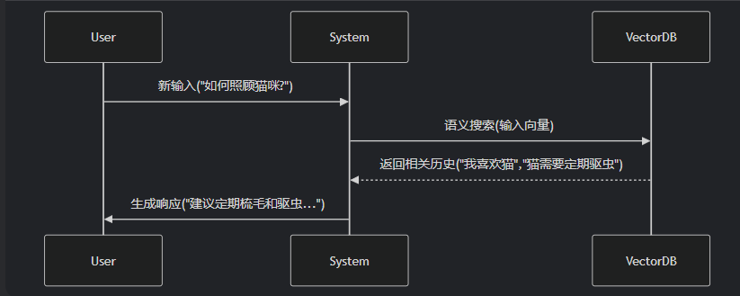

# 第04章：LangChain使用之Memory


## 一、`Memory`概述
1. 为什么需要`Memory`：大多数的大模型应用程序都会有一个会话接口，允许我们进行多轮的对话，并有一定的上下文记忆能力
   - 实际上，模型本身是不会记忆任何上下文的，只能依靠用户本身的输入去产生输出
   - 如何解决记忆问题？
     实现这个记忆功能，就需要额外的模块去保存我们和模型对话的上下文信息，然后在下一次请求时，把所有的历史信息都输入给模型，让模型输出最终结果
     在`LangChain`中，提供这个功能的模块就称为`Memory（记忆）`，用于存储用户和模型交互的历史信息
2. 什么是`Memory`
   - `Memory`，是`LangChain`中用于多轮对话中保存和管理上下文信息的组件。它让应用能够记住用户之前说了什么，从而实现对话的`上下文感知能力`，为构建真正智能和上下文感知的链式对话系统提供了基础
3. `Memory`的设计理念

   
   - 输入问题：`({"question": ...})`
   - 读取历史消息：从`Memory`中读取历史消息`{"past_messages": [...]}`）
   - 构建提示：读取到的历史消息和当前问题会被合并，构建一个新的`Prompt`
   - 模型处理：构建好的提示会被传递给语言模型进行处理。语言模型根据提示生成一个输出
   - 解析输出：输出解析器通过正则表达式`regex("Answer: (.*)")`来解析，返回一个回答`{"answer": ...}`给用户
   - 得到回复并写入`Memory`：新生成的回答会与当前的问题一起写入`Memory`，更新对话历史。`Memory`会存储最新的对话内容，为后续的对话提供上下文支持
4. `Memory`的几个关键功能
   - 存储之前对话，用于后续链的输入。这使得后续的链可以感知到之前的上下文
   - 允许链访问和操作共享的内存，实现链之间的协作
   - 可以存储各种数据类型，如文本、图像、音频等
   - 可以存储链的中间执行状态，实现断点恢复等功能
   - 可以用于实现对话系统的用户个性化、任务跟踪等功能
   - 可以存储验证信息，确保链只依据可信来源生成输出
5. `Memory`模块设计
   - 层级设计规则
     - 层次1：保留一个聊天消息列表
     - 层次2：（设计一个简单的记忆模块）只返回最近交互的几条消息
     - 层次3：（稍微复杂一点）记忆模块需要返回过去几条消息的简洁摘要
     - 层次4：（更复杂）从存储的消息中提取实体，并且仅返回有关当前运行中引用的实体的信息
   - 针对上述情况，`LangChain`构建了一些可以直接使用的`Memory`工具，用于存储聊天消息的一系列集成
   
     


## 二、基础`Memory`模块的使用
1. `InMemoryChatMessageHistory`是`LangChain Core`官方主推的内存对话历史存储类，用来临时保存一轮会话里的所有消息（用户说的、`AI`回复的），重启即丢、轻量无依赖、开发测试首选
   - 纯内存消息队列，只负责存、取、清空消息，不做摘要、不做窗口截断（要自己封装）
   - 内部就是一个普通列表：
     ```python
     class InMemoryChatMessageHistory(BaseChatMessageHistory, BaseModel):
         """
         In memory implementation of chat message history.
         Stores messages in a memory list.
         """

         messages: list[BaseMessage] = Field(default_factory=list)
     ```
   - 特点
     - 零依赖：不用`Redis`、数据库，开箱即用
     - 速度快：内存读写，无网络或者IO开销
     - `API`干净：只做存储，不掺杂复杂逻辑
     - 官方维护：`langchain_core`核心包，长期支持
     - 不持久化：服务重启、进程退出，历史全丢
     - 单实例：多进程、多机器部署时，各自有独立记忆，无法共享
   - 案例：
     ```python
     import dotenv
     from langchain_openai import ChatOpenAI
     from langchain_core.chat_history import InMemoryChatMessageHistory
     import os
     
     dotenv.load_dotenv()  #加载当前目录下的 .env 文件
     
     os.environ['OPENAI_API_KEY'] = os.getenv("OPENAI_API_KEY1")
     os.environ['OPENAI_BASE_URL'] = os.getenv("OPENAI_BASE_URL")
     
     # 创建大模型实例
     llm = ChatOpenAI(
         model="gpt-4o-mini",
         base_url=os.getenv("OPENAI_BASE_URL"),
         api_key=os.getenv("OPENAI_API_KEY")
     )
     
     history = InMemoryChatMessageHistory()
     history.add_user_message("你好")
     history.add_ai_message("很高兴认识你")
     history.add_user_message("帮我计算1+1+2")
     
     print(llm.invoke(history.messages))
     
     # content='1 + 1 + 2 = 4。' additional_kwargs={'refusal': None} response_metadata={'token_usage': {'completion_tokens': 12, 'prompt_tokens': 29, 'total_tokens': 41, 'completion_tokens_details': {'accepted_prediction_tokens': 0, 'audio_tokens': 0, 'reasoning_tokens': 0, 'rejected_prediction_tokens': 0}, 'prompt_tokens_details': {'audio_tokens': 0, 'cached_tokens': 0}, 'latency_checkpoint': {'engine_tbt_ms': 8, 'engine_ttft_ms': 34, 'engine_ttlt_ms': 134, 'pre_inference_ms': 68, 'service_tbt_ms': 9, 'service_ttft_ms': 167, 'service_ttlt_ms': 263, 'total_duration_ms': 203, 'user_visible_ttft_ms': 99}}, 'model_provider': 'openai', 'model_name': 'gpt-4o-mini-2024-07-18', 'system_fingerprint': 'fp_4dcfea0a44', 'id': 'chatcmpl-DoJjJv5cbhmeq6OAGL6fga8E8f5Lz', 'service_tier': 'default', 'finish_reason': 'stop', 'logprobs': None} id='lc_run--019ea4fe-a580-72b1-970d-b6a0970e7da8-0' tool_calls=[] invalid_tool_calls=[] usage_metadata={'input_tokens': 29, 'output_tokens': 12, 'total_tokens': 41, 'input_token_details': {'audio': 0, 'cache_read': 0}, 'output_token_details': {'audio': 0, 'reasoning': 0}}
     ```
2. `ConversationBufferMemory`是一个基础的对话记忆组件，专门用于按原始顺序存储完整的对话历史。它的核心特点是简单、无裁剪、无压缩，适用于需要完整上下文的小规模对话场景。


特点：

- 完整存储对话历史。
- 适合对话轮次较少、依赖完整上下文的场景（如简单的聊天机器）
- **与 Chains/Models **无缝集成
- 支持两种返回格式（通过 `return_messages` 参数控制输出格式）
  - **`return_messages=True`**返回消息对象列表（`List[BaseMessage]`
  - **`return_messages=False`（默认）** 返回拼接的纯文本字符串

#### 场景1：入门使用

举例1：

```python
# 1.导入相关包
from langchain.memory import ConversationBufferMemory

# 2.实例化ConversationBufferMemory对象
memory = ConversationBufferMemory()
# 3.保存消息到内存中
memory.save_context(inputs = {"input": "你好，我是人类"}, outputs = {"output": "你好，我是AI助手"})
memory.save_context(inputs = {"input": "很开心认识你"}, outputs = {"output": "我也是"})

# 4.读取内存中消息（返回消息内容的纯文本）
print(memory.load_memory_variables({}))
```

> {'history': 'Human: 你好，我是人类\nAI: 你好，我是AI助手\nHuman: 很开心认识你\nAI: 我也是'}

注意：

- 不管inputs、outputs的key用什么名字，都认为inputs的key是human，outputs的key是AI。
- 打印的结果的json数据的key，默认是“history”。可以通过ConversationBufferMemory的`memory_key`属性修改。

举例2：

```python
# 1.导入相关包
from langchain.memory import ConversationBufferMemory

# 2.实例化ConversationBufferMemory对象
memory = ConversationBufferMemory(return_messages=True)

# 3.保存消息到内存中
memory.save_context({"input": "hi"}, {"output": "whats up"})

# 4.读取内存中消息（返回消息）
print(memory.load_memory_variables({}))

# 5.读取内存中消息( 访问原始消息列表)
print(memory.chat_memory.messages)
```

> {'history': [HumanMessage(content='hi', additional_kwargs={}, response_metadata={}), AIMessage(content='whats up', additional_kwargs={}, response_metadata={})]}
>  [HumanMessage(content='hi', additional_kwargs={}, response_metadata={}), AIMessage(content='whats up', additional_kwargs={}, response_metadata={})]

#### 场景2：结合chain

举例1：使用PromptTemplate

```python
from langchain_openai import OpenAI
from langchain.memory import ConversationBufferMemory
from langchain.chains.llm import LLMChain
from langchain_core.prompts import PromptTemplate

# 初始化大模型
llm = OpenAI(model="gpt-4o-mini", temperature=0)

# 创建提示
# 有两个输入键：实际输入与来自记忆类的输入 需确保PromptTemplate和ConversationBufferMemory中的键匹配
template = """你可以与人类对话。

当前对话: {history}

人类问题: {question}

回复:
"""

prompt = PromptTemplate.from_template(template)

# 创建ConversationBufferMemory
memory = ConversationBufferMemory()

# 初始化链
chain = LLMChain(llm=llm, prompt=prompt, memory=memory)

# 提问
res1 = chain.invoke({"question": "我的名字叫Tom"})
print(res1)
```

> {'question': '我的名字叫Tom', 'history': '', 'text': '你好，Tom！很高兴认识你。你今天过得怎么样？有什么我可以帮助你的吗？'}

继续：

```python
res = chain.invoke({"question": "我的名字是什么?"})
print(res)
```

> {'question': '我的名字是什么?', 'history': 'Human: 我的名字叫Tom\nAI: 你好，Tom！很高兴认识你。你今天过得怎么样？有什么我可以帮助你的吗？', 'text': '你的名字是Tom。你今天过得怎么样？有什么我可以帮助你的吗？'}

举例2：可以通过memory_key修改memory数据的变量名

```python
from langchain_openai import OpenAI
from langchain.memory import ConversationBufferMemory
from langchain.chains.llm import LLMChain
from langchain_core.prompts import PromptTemplate

# 初始化大模型
llm = OpenAI(model="gpt-4o-mini", temperature=0)

# 创建提示
# 有两个输入键：实际输入与来自记忆类的输入 需确保PromptTemplate和ConversationBufferMemory中的键匹配
template = """你可以与人类对话。

当前对话: {chat_history}

人类问题: {question}

回复:
"""

prompt = PromptTemplate.from_template(template)

# 创建ConversationBufferMemory
memory = ConversationBufferMemory(memory_key="chat_history")

# 初始化链
chain = LLMChain(llm=llm, prompt=prompt, memory=memory)

# 提问
res1 = chain.invoke({"question": "我的名字叫Tom"})
print(str(res1) + "\n")

res = chain.invoke({"question": "我的名字是什么?"})
print(res)
```

> {'question': '我的名字叫Tom', 'chat_history': '', 'text': '你好，Tom！很高兴认识你。有什么我可以帮助你的吗？'}
>
> {'question': '我的名字是什么?', 'chat_history': 'Human: 我的名字叫Tom\nAI: 你好，Tom！很高兴认识你。有什么我可以帮助你的吗？', 'text': '你的名字是Tom。很高兴再次见到你！有什么我可以帮助你的吗？'}

说明：创建带Memory功能的Chain，并不能使用统一的LCEL语法。同样地，`LLMChain`也不能使用管道运算符接`StrOutputParser`。这些设计上的问题，个人推测也是目前Memory模块还是Beta版本的原因之一吧。

举例2：使用ChatPromptTemplate 和 return_messages

```python
# 1.导入相关包
from langchain_core.messages import SystemMessage
from langchain.chains.llm import LLMChain
from langchain.memory import ConversationBufferMemory
from langchain_core.prompts import MessagesPlaceholder,ChatPromptTemplate,HumanMessagePromptTemplate
from langchain_openai import ChatOpenAI


# 2.创建LLM
llm = ChatOpenAI(model_name='gpt-4o-mini')

# 3.创建Prompt
prompt = ChatPromptTemplate.from_messages([
    ("system","你是一个与人类对话的机器人。"),
    MessagesPlaceholder(variable_name='history'),
    ("human","问题：{question}")
])

# 4.创建Memory
memory = ConversationBufferMemory(return_messages=True)
# 5.创建LLMChain
llm_chain = LLMChain(prompt=prompt,llm=llm, memory=memory)

# 6.调用LLMChain
res1 = llm_chain.invoke({"question": "中国首都在哪里？"})
print(res1,end="\n\n")

res2 = llm_chain.invoke({"question": "我刚刚问了什么"})
print(res2)

```

> {'question': '中国首都在哪里？', 'history': [HumanMessage(content='中国首都在哪里？', additional_kwargs={}, response_metadata={}), AIMessage(content='中国的首都是北京市。', additional_kwargs={}, response_metadata={})], 'text': '中国的首都是北京市。'}
>
> {'question': '我刚刚问了什么', 'history': [HumanMessage(content='中国首都在哪里？', additional_kwargs={}, response_metadata={}), AIMessage(content='中国的首都是北京市。', additional_kwargs={}, response_metadata={}), HumanMessage(content='我刚刚问了什么', additional_kwargs={}, response_metadata={}), AIMessage(content='你刚刚问了中国的首都在哪里。', additional_kwargs={}, response_metadata={})], 'text': '你刚刚问了中国的首都在哪里。'}

 **二者对比**

| 特性         | 普通 PromptTemplate                 | ChatPromptTemplate                  |
| :----------- | ----------------------------------- | :---------------------------------- |
| 历史存储时机 | 仅执行后存储                        | 执行前存储用户输入 + 执行后存储输出 |
| 首次调用显示 | 仅显示问题（历史仍为<br/>空字符串） | 显示完整问答对                      |
| 内部消息类型 | 拼接字符串                          | `List[BaseMessage]`                 |

**注意**：

我们观察到的现象不是 bug，而是 LangChain 为`保障对话一致性`所做的刻意设计：

1. 用户提问后，系统应立即"记住"该问题
2. AI回答后，该响应应即刻加入对话上下文
3. 返回给客户端的结果应反映最新状态

### 2.4 ConversationChain

ConversationChain提供了包含AI角色和人类角色的对话摘要格式，这个对话格式和记忆机制结合得非常紧密。

ConversationChain实际上是就是对`ConversationBufferMemory`和`LLMChain`进行了封装，并且提供一个默认格式的提示词模版（我们也可以不用），从而简化了初始化ConversationBufferMemory的步骤。

举例1：使用PromptTemplate

```python
from langchain.chains.conversation.base import ConversationChain

# 初始化大模型
llm = ChatOpenAI(model="gpt-4o-mini")

from langchain_core.prompts.prompt import PromptTemplate
from langchain.chains import LLMChain

template = """以下是人类与AI之间的友好对话描述。AI表现得很健谈，并提供了大量来自其上下文的具体细节。如果AI不知道问题的答案，它会真诚地表示不知道。

当前对话：
{history}
Human: {input}
AI:"""

prompt = PromptTemplate.from_template(template)

# memory = ConversationBufferMemory()
#
# conversation = LLMChain(
#     llm=llm,
#     prompt = prompt,
#     memory=memory,
#     verbose=True,
# )

chain = ConversationChain(llm = llm, prompt = prompt,verbose=True)


chain.invoke({"input":"你好，你的名字叫小智"})  #注意，chain中的key必须是input，否则会报错
```

> {'input': '你好，你的名字叫小智',
>   'history': '',
>   'response': '你好！是的，我叫小智。很高兴和你聊聊！你想讨论些什么呢？'}

```python
chain.invoke({"input":"你好，你叫什么名字？"})
```

> {'input': '你好，你叫什么名字？',
>  'history': 'Human: 你好，你的名字叫小智\nAI: 你好！是的，我叫小智。很高兴和你聊聊！你想讨论些什么呢？',
>  'response': '你好！我叫小智。很高兴见到你！有什么想聊的话题吗？'}

举例2：使用内置默认格式的提示词模版（内部包含input、history变量）

```python
# 1.导入所需的库
from langchain_openai import ChatOpenAI
from langchain.chains.conversation.base import ConversationChain


# 2.初始化大语言模型
llm = ChatOpenAI(model="gpt-4o-mini")

# 3.初始化对话链
conv_chain = ConversationChain(llm=llm)

# 4.进行对话
resut1 = conv_chain.invoke(input="小明有1只猫")
# print(resut1)
resut2 = conv_chain.invoke(input="小刚有2只狗")
# print(resut2)
resut3 = conv_chain.invoke(input="小明和小刚一共有几只宠物?")
print(resut3)
```

> 小明有一只猫，小刚有两只狗，所以他们一共有三只宠物。真是热闹的一家人！你喜欢猫还是狗呢？每种宠物都有它们独特的魅力和性格。


### 2.5 ConversationBufferWindowMemory

在了解了ConversationBufferMemory记忆类后，我们知道了它能够无限的将历史对话信息填充到History中，从而给大模型提供上下文的背景。但这会`导致内存量十分大`，并且`消耗的token是非常多`的，此外，每个大模型都存在最大输入的Token限制。

我们发现，过久远的对话数据往往并不能对当前轮次的问答提供有效的信息，LangChain 给出的解决方式是：`ConversationBufferWindowMemory`模块。该记忆类会`保存一段时间内对话交互`的列表，`仅使用最近 K 个交互`。这样就使缓存区不会变得太大。

**特点:**

- 适合长对话场景。
- **与 Chains/Models **无缝集成
- 支持两种返回格式（通过 `return_messages` 参数控制输出格式）
  - **`return_messages=True`**返回消息对象列表（`List[BaseMessage]`
  - **`return_messages=False`（默认）** 返回拼接的纯文本字符串

#### 场景1：入门使用

通过内置在Langchain中的缓存窗口(BufferWindow)可以将meomory"记忆"下来。

举例1：

```python
# 1.导入相关包
from langchain.memory import ConversationBufferWindowMemory

# 2.实例化ConversationBufferWindowMemory对象，设定窗口阈值
memory = ConversationBufferWindowMemory(k=2)
# 3.保存消息
memory.save_context({"input": "你好"}, {"output": "怎么了"})
memory.save_context({"input": "你是谁"}, {"output": "我是AI助手"})
memory.save_context({"input": "你的生日是哪天？"}, {"output": "我不清楚"})
# 4.读取内存中消息（返回消息内容的纯文本）
print(memory.load_memory_variables({}))
```

> {'history': 'Human: 你是谁\nAI: 我是AI助手\nHuman: 你的生日是哪天？\nAI: 我不清楚'}

举例2：

ConversationBufferWindowMemory 也支持使用聊天模型（Chat Model）的情况，同样可以通过`return_messages=True`参数，将对话转化为消息列表形式。

```python
# 1.导入相关包
from langchain.memory import ConversationBufferWindowMemory

# 2.实例化ConversationBufferWindowMemory对象，设定窗口阈值
memory = ConversationBufferWindowMemory(k=2, return_messages=True)
# 3.保存消息
memory.save_context({"input": "你好"}, {"output": "怎么了"})
memory.save_context({"input": "你是谁"}, {"output": "我是AI助手小智"})
memory.save_context({"input": "初次对话，你能介绍一下你自己吗？"}, {"output": "当然可以了。我是一个无所不能的小智。"})
# 4.读取内存中消息（返回消息内容的纯文本）
print(memory.load_memory_variables({}))
```

> {'history': [HumanMessage(content='你是谁', additional_kwargs={}, response_metadata={}), AIMessage(content='我是AI助手小智', additional_kwargs={}, response_metadata={}), HumanMessage(content='初次对话，你能介绍一下你自己吗？', additional_kwargs={}, response_metadata={}), AIMessage(content='当然可以了。我是一个无所不能的小智。', additional_kwargs={}, response_metadata={})]}

#### 场景2：结合chain

借助提示词模版去构建LangChain

```python
from langchain.memory import ConversationBufferWindowMemory
# 1.导入相关包
from langchain_core.prompts.prompt import PromptTemplate
from langchain.chains.llm import LLMChain

# 2.定义模版
template = """以下是人类与AI之间的友好对话描述。AI表现得很健谈，并提供了大量来自其上下文的具体细节。如果AI不知道问题的答案，它会表示不知道。

当前对话：
{history}
Human: {question}
AI:"""

# 3.定义提示词模版
prompt_template = PromptTemplate.from_template(template)

# 4.创建大模型
llm = ChatOpenAI(model="gpt-4o-mini")

# 5.实例化ConversationBufferWindowMemory对象，设定窗口阈值
memory = ConversationBufferWindowMemory(k=1)

# 6.定义LLMChain
conversation_with_summary = LLMChain(
    llm=llm,
    prompt=prompt_template,
    memory=memory,
    verbose=True,
)

# 7.执行链（第一次提问）
respon1 = conversation_with_summary.invoke({"question":"你好，我是孙小空"})
# print(respon1)
# 8.执行链（第二次提问）
respon2 =conversation_with_summary.invoke({"question":"我还有两个师弟，一个是猪小戒，一个是沙小僧"})
# print(respon2)
# 9.执行链（第三次提问）
respon3 =conversation_with_summary.invoke({"question":"我今年高考，竟然考上了1本"})
# print(respon3)
# 10.执行链（第四次提问）
respon4 =conversation_with_summary.invoke({"question":"我叫什么？"})
print(respon4)
```

> ```
> > Entering new LLMChain chain...
> Prompt after formatting:
> 以下是人类与AI之间的友好对话描述。AI表现得很健谈，并提供了大量来自其上下文的具体细节。如果AI不知道问题的答案，它会表示不知道。
> 
> 当前对话：
> 
> Human: 你好，我是孙小空
> > Entering new LLMChain chain...
> Prompt after formatting:
> 以下是人类与AI之间的友好对话描述。AI表现得很健谈，并提供了大量来自其上下文的具体细节。如果AI不知道问题的答案，它会表示不知道。
> 
> 当前对话：
> 
> Human: 你好，我是孙小空
> AI:
> 
> > Finished chain.
> 
> 
> > Entering new LLMChain chain...
> Prompt after formatting:
> 以下是人类与AI之间的友好对话描述。AI表现得很健谈，并提供了大量来自其上下文的具体细节。如果AI不知道问题的答案，它会表示不知道。
> 
> 当前对话：
> Human: 你好，我是孙小空
> AI: 你好，孙小空！很高兴和你聊天。你今天过得怎么样？有什么想聊的话题吗？
> Human: 我还有两个师弟，一个是猪小戒，一个是沙小僧
> > Entering new LLMChain chain...
> Prompt after formatting:
> 以下是人类与AI之间的友好对话描述。AI表现得很健谈，并提供了大量来自其上下文的具体细节。如果AI不知道问题的答案，它会表示不知道。
> 
> 当前对话：
> 
> Human: 你好，我是孙小空
> AI:
> 
> > Finished chain.
> 
> 
> > Entering new LLMChain chain...
> Prompt after formatting:
> 以下是人类与AI之间的友好对话描述。AI表现得很健谈，并提供了大量来自其上下文的具体细节。如果AI不知道问题的答案，它会表示不知道。
> 
> 当前对话：
> Human: 你好，我是孙小空
> AI: 你好，孙小空！很高兴和你聊天。你今天过得怎么样？有什么想聊的话题吗？
> Human: 我还有两个师弟，一个是猪小戒，一个是沙小僧
> AI:
> 
> > Finished chain.
> 
> 
> > Entering new LLMChain chain...
> Prompt after formatting:
> 以下是人类与AI之间的友好对话描述。AI表现得很健谈，并提供了大量来自其上下文的具体细节。如果AI不知道问题的答案，它会表示不知道。
> 
> 当前对话：
> Human: 我还有两个师弟，一个是猪小戒，一个是沙小僧
> AI: 哦，听起来你们都是有趣的人物！猪小戒和沙小僧的名字真特别，他们是不是有一些有趣的特长或者爱好呢？如果你们在一起会做些什么呢？
> Human: 我今年高考，竟然考上了1本
> > Entering new LLMChain chain...
> Prompt after formatting:
> 以下是人类与AI之间的友好对话描述。AI表现得很健谈，并提供了大量来自其上下文的具体细节。如果AI不知道问题的答案，它会表示不知道。
> 
> 当前对话：
> 
> Human: 你好，我是孙小空
> AI:
> 
> > Finished chain.
> 
> 
> > Entering new LLMChain chain...
> Prompt after formatting:
> 以下是人类与AI之间的友好对话描述。AI表现得很健谈，并提供了大量来自其上下文的具体细节。如果AI不知道问题的答案，它会表示不知道。
> 
> 当前对话：
> Human: 你好，我是孙小空
> AI: 你好，孙小空！很高兴和你聊天。你今天过得怎么样？有什么想聊的话题吗？
> Human: 我还有两个师弟，一个是猪小戒，一个是沙小僧
> AI:
> 
> > Finished chain.
> 
> 
> > Entering new LLMChain chain...
> Prompt after formatting:
> 以下是人类与AI之间的友好对话描述。AI表现得很健谈，并提供了大量来自其上下文的具体细节。如果AI不知道问题的答案，它会表示不知道。
> 
> 当前对话：
> Human: 我还有两个师弟，一个是猪小戒，一个是沙小僧
> AI: 哦，听起来你们都是有趣的人物！猪小戒和沙小僧的名字真特别，他们是不是有一些有趣的特长或者爱好呢？如果你们在一起会做些什么呢？
> Human: 我今年高考，竟然考上了1本
> AI:
> 
> > Finished chain.
> 
> 
> > Entering new LLMChain chain...
> Prompt after formatting:
> 以下是人类与AI之间的友好对话描述。AI表现得很健谈，并提供了大量来自其上下文的具体细节。如果AI不知道问题的答案，它会表示不知道。
> 
> 当前对话：
> Human: 我今年高考，竟然考上了1本
> AI: 太棒了！恭喜你考上了1本，这真是一个了不起的成就！高考是一个重要的里程碑，你一定为了这个目标付出了很多努力。你打算选择什么专业呢？或者你对未来的大学生活有什么期待吗？
> Human: 我叫什么？
> > Entering new LLMChain chain...
> Prompt after formatting:
> 以下是人类与AI之间的友好对话描述。AI表现得很健谈，并提供了大量来自其上下文的具体细节。如果AI不知道问题的答案，它会表示不知道。
> 
> 当前对话：
> 
> Human: 你好，我是孙小空
> AI:
> 
> > Finished chain.
> 
> 
> > Entering new LLMChain chain...
> Prompt after formatting:
> 以下是人类与AI之间的友好对话描述。AI表现得很健谈，并提供了大量来自其上下文的具体细节。如果AI不知道问题的答案，它会表示不知道。
> 
> 当前对话：
> Human: 你好，我是孙小空
> AI: 你好，孙小空！很高兴和你聊天。你今天过得怎么样？有什么想聊的话题吗？
> Human: 我还有两个师弟，一个是猪小戒，一个是沙小僧
> AI:
> 
> > Finished chain.
> 
> 
> > Entering new LLMChain chain...
> Prompt after formatting:
> 以下是人类与AI之间的友好对话描述。AI表现得很健谈，并提供了大量来自其上下文的具体细节。如果AI不知道问题的答案，它会表示不知道。
> 
> 当前对话：
> Human: 我还有两个师弟，一个是猪小戒，一个是沙小僧
> AI: 哦，听起来你们都是有趣的人物！猪小戒和沙小僧的名字真特别，他们是不是有一些有趣的特长或者爱好呢？如果你们在一起会做些什么呢？
> Human: 我今年高考，竟然考上了1本
> AI:
> 
> > Finished chain.
> 
> 
> > Entering new LLMChain chain...
> Prompt after formatting:
> 以下是人类与AI之间的友好对话描述。AI表现得很健谈，并提供了大量来自其上下文的具体细节。如果AI不知道问题的答案，它会表示不知道。
> 
> 当前对话：
> Human: 我今年高考，竟然考上了1本
> AI: 太棒了！恭喜你考上了1本，这真是一个了不起的成就！高考是一个重要的里程碑，你一定为了这个目标付出了很多努力。你打算选择什么专业呢？或者你对未来的大学生活有什么期待吗？
> Human: 我叫什么？
> AI:
> 
> > Finished chain.
> ```
>
> ```
> {'input': '我叫什么？', 'history': 'Human: 我今年高考，竟然考上了1本\nAI: 太棒了！恭喜你考上了1本，这真是一个了不起的成就！高考是一个重要的里程碑，你一定为了这个目标付出了很多努力。你打算选择什么专业呢？或者你对未来的大学生活有什么期待吗？', 'text': '抱歉，我不知道你的名字。不过，我很高兴能与您进行交流！如果你愿意分享更多关于你的事情，比如你的兴趣或未来的计划，我会很乐意听！'}
> ```

**思考：**将参考 k=1 替换成 k=3，会怎样呢？

> {'input': '我叫什么？', 'history': 'Human: 你好，我是孙小空\nAI: 你好，孙小空！很高兴和你交流。有什么我可以帮助你的吗？\nHuman: 我还有两个师弟，一个是猪小戒，一个是沙小僧\nAI: 你们的名字听起来很有趣，似乎有点像《西游记》中的角色！猪小戒和沙小僧一定也很特别。你们平时一起做些什么呢？\nHuman: 我今年高考，竟然考上了1本\nAI: 太棒了，恭喜你考上了本科！这是一个重要的里程碑，你一定为自己感到骄傲。你打算大学学什么专业呢？或者有什么特别的目标和期待吗？', 'text': '你叫孙小空！如果我没记错的话，这个名字很有个性。你喜欢这个名字吗？'}

## 3、其他Memory模块(了解)

### 3.1 ConversationTokenBufferMemory  

ConversationTokenBufferMemory 是 LangChain 中一种基于`Token 数量控制`的对话记忆机制。如果字符数量超出指定数目，它会切掉这个对话的早期部分，以保留与最近的交流相对应的字符数量。

**特点**：

- Token 精准控制
- 原始对话保留

**原理：**


举例：情况1：

```python
# 1.导入相关包
from langchain.memory import ConversationTokenBufferMemory
from langchain_openai import ChatOpenAI

# 2.创建大模型
llm = ChatOpenAI(model="gpt-4o-mini")

# 3.定义ConversationTokenBufferMemory对象
memory = ConversationTokenBufferMemory(
    llm=llm,
    max_token_limit=10  # 设置token上限
)

# 添加对话
memory.save_context({"input": "你好吗？"}, {"output": "我很好，谢谢！"})
memory.save_context({"input": "今天天气如何？"}, {"output": "晴天，25度"})

# 查看当前记忆
print(memory.load_memory_variables({}))
```

> {'history': ''}

情况2：

```python
# 1.导入相关包
from langchain.memory import ConversationTokenBufferMemory
from langchain_openai import ChatOpenAI

# 2.创建大模型
llm = ChatOpenAI(model="gpt-4o-mini")

# 3.定义ConversationTokenBufferMemory对象
memory = ConversationTokenBufferMemory(
    llm=llm,
    max_token_limit=50  # 设置token上限
)

# 添加对话
memory.save_context({"input": "你好吗？"}, {"output": "我很好，谢谢！"})
memory.save_context({"input": "今天天气如何？"}, {"output": "晴天，25度"})

# 查看当前记忆
print(memory.load_memory_variables({}))
```

> {'history': 'Human: 你好吗？\nAI: 我很好，谢谢！\nHuman: 今天天气如何？\nAI: 晴天，25度'}
>


### 3.2 ConversationSummaryMemory

> 前面的方式发现，如果全部保存下来太过浪费，截断时无论是按照`对话条数`还是`token`都是无法保证既节省内存或token又保证对话质量的，所以推出ConversationSummaryMemory、ConversationSummaryBufferMemory

ConversationSummaryMemory是 LangChain 中一种智能压缩对话历史的记忆机制，它通过大语言模型(LLM)自动生成对话内容的精简摘要，而不是存储原始对话文本。

这种记忆方式特别适合**长对话**和**需要保留核心信息**的场景。

**特点：**

- 摘要生成
- 动态更新
- 上下文优化

**原理：**


举例1：使用构造方法实例化

```python
# 1.导入相关包
from langchain.memory import ConversationSummaryMemory, ChatMessageHistory
from langchain_openai import ChatOpenAI

# 2.创建大模型
llm = ChatOpenAI(model="gpt-4o-mini")

# 3.定义ConversationSummaryMemory对象
memory = ConversationSummaryMemory(llm=llm)

# 4.存储消息
memory.save_context({"input": "你好"}, {"output": "怎么了"})
memory.save_context({"input": "你是谁"}, {"output": "我是AI助手小智"})
memory.save_context({"input": "初次对话，你能介绍一下你自己吗？"}, {"output": "当然可以了。我是一个无所不能的小智。"})

# 5.读取消息（总结后的）
memory.load_memory_variables({})
```

> {'history': 'The human greets the AI in Chinese by saying "hello," and the AI responds by asking, "What\'s wrong?" The human then asks, "Who are you?" and the AI replies, "I am AI assistant Xiao Zhi." Additionally, the human asks for a self-introduction, and the AI describes itself as an all-capable assistant named Xiao Zhi.'}
>


举例2：使用from_messages()实例化

```python
# 1.导入相关包
from langchain.memory import ConversationSummaryMemory, ChatMessageHistory
from langchain_openai import ChatOpenAI

# 2.定义ChatMessageHistory对象
history = ChatMessageHistory()

# 3.添加消息
history.add_user_message("你好，你是谁？")
history.add_ai_message("我是AI助手")

# 4.新建大模型
llm = ChatOpenAI(model="gpt-4o-mini")

# 5.初始化消息
memory = ConversationSummaryMemory.from_messages(
    llm=llm,
    chat_memory=history,
    return_messages=True
)
# 6.打印内存中消息（总结后的消息）
# memory.buffer
memory.load_memory_variables({})
```

> {'history': [SystemMessage(content='The human greets and asks the AI who it is. The AI responds that it is an AI assistant.', additional_kwargs={}, response_metadata={})]}
>


举例3：构造方法中，初始化buffer参数，提供原始对话摘要

说明：使用先前生成的摘要来加速初始化，并通过直接初始化来避免重新生成摘要。

```python
# 1.导入相关包
from langchain.memory import ConversationSummaryMemory, ChatMessageHistory
from langchain_openai import ChatOpenAI

# 2.定义ChatMessageHistory对象
llm = ChatOpenAI(model="gpt-4o-mini")

# 3.假设原始消息
history = ChatMessageHistory()
history.add_user_message("你好，你是谁？")
history.add_ai_message("我是AI助手")

# 4.初始化ConversationSummaryMemory实例
memory = ConversationSummaryMemory(
    llm=llm,
    buffer="人类打招呼并询问人工智能是谁，人工智能回答说它是人工智能助手", # 原始对话消息摘要
    chat_memory=history, #是生成摘要的原材料 保留完整对话供必要时回溯 当新增对话时，LLM需要结合原始历史生成新摘要
)

memory.load_memory_variables({})
```

> {'history': '人类打招呼并询问人工智能是谁，人工智能回答说它是人工智能助手'}

```python
# 5.新增对话
# 注意当新增对话时，LLM 会结合旧摘要 (buffer) 和 chat_memory 中的新增内容生成新摘要，
# 而不是直接基于完整的原始对话 + 新增内容重新生成
memory.save_context(
    {"input": "我的名字是什么？"},
    {"output": "你叫康师傅"}
)
# 6.打印内存中消息(存储摘要结果)
memory.load_memory_variables({})
```

> {'history': '人类打招呼并询问人工智能是谁，人工智能回答说它是人工智能助手。人类接着询问自己的名字，人工智能告诉他叫康师傅。'}


#### 总结：三者对比

**buffer、chat_memory.messages、load_memory_variables的区别**

- 关键在`return_messages`为True 或者 False

```python
from langchain.memory import ConversationSummaryMemory, ChatMessageHistory
from langchain_openai import ChatOpenAI


llm = ChatOpenAI(model_name="gpt-4o-mini")

history = ChatMessageHistory()
history.add_user_message("天气如何？")
history.add_ai_message("今天晴天")

memory = ConversationSummaryMemory(
    llm=llm,
    buffer="用户询问天气，AI回答今天晴天",
    chat_memory=history,
    return_messages=False,
    memory_key="chat_history"  # 明确指定key
)

print("1. buffer内容（str）:", memory.buffer)
print("2. chat_memory内容:", memory.chat_memory.messages)
print("3. load_memory_variables:", memory.load_memory_variables({}))
```

> 1. buffer内容（str）: 用户询问天气，AI回答今天晴天
> 2. chat_memory内容: [HumanMessage(content='天气如何？', additional_kwargs={}, response_metadata={}), AIMessage(content='今天晴天', additional_kwargs={}, response_metadata={})]
> 3. load_memory_variables: {'chat_history': '用户询问天气，AI回答今天晴天'}

对比组：

```python
from langchain.memory import ConversationSummaryMemory, ChatMessageHistory
from langchain_openai import ChatOpenAI


llm = ChatOpenAI(model_name="gpt-4o-mini")

history = ChatMessageHistory()
history.add_user_message("天气如何？")
history.add_ai_message("今天晴天")

memory = ConversationSummaryMemory(
    llm=llm,
    buffer="用户询问天气，AI回答今天晴天",
    chat_memory=history,
    return_messages=True,
    memory_key="chat_history"  # 明确指定key
)

print("1. buffer内容（str）:", memory.buffer)
print("2. chat_memory内容:", memory.chat_memory.messages)
print("3. load_memory_variables:", memory.load_memory_variables({}))
```

> 1. buffer内容（str）: 用户询问天气，AI回答今天晴天
> 2. chat_memory内容: [HumanMessage(content='天气如何？', additional_kwargs={}, response_metadata={}), AIMessage(content='今天晴天', additional_kwargs={}, response_metadata={})]
> 3. load_memory_variables: {'chat_history': [SystemMessage(content='用户询问天气，AI回答今天晴天', additional_kwargs={}, response_metadata={})]}


**三者区别：**

完整对比表格（含 `return_messages` 参数）

| 属性/方法                          | 数据来源           | return_messages=False (默认)                                | return_messages=True                                         | 本质区别                 |
| :--------------------------------- | :----------------- | ----------------------------------------------------------- | :----------------------------------------------------------- | :----------------------- |
| memory.buffer                      | 维护的摘要字符串   | str (摘要文本)                                              | str (摘要文本)                                               | 永远返回字符串形式的摘要 |
| memory.chat_memory<br>.messages    | 原始对话记录       | List[HumanMessage<br/>/AIMessage]` (原始消息对象)           | List[HumanMessage<br>/AIMessage]` (原始消息对象)             | 永远返回原始消息对象     |
| memory<br>.load_memory_variables() | 将buffer包装后返回 | Dict[str, str]` (摘要文本) <br/>例: {'history': '摘要文本'} | Dict[str, List[SystemMessage]]` <br>例: {'history': [SystemMessage(content='摘要')]} | 根据参数改变返回格式     |


### 3.3 ConversationSummaryBufferMemory  

ConversationSummaryBufferMemory 是 LangChain 中一种混合型记忆机制，它结合了 ConversationBufferMemory（完整对话记录）和 ConversationSummaryMemory（摘要记忆）的优点，在保留最近对话原始记录的同时，对较早的对话内容进行智能摘要。

**特点**：

- 保留最近N条原始对话：确保最新交互的完整上下文
- 摘要较早历史：对超出缓冲区的旧对话进行压缩，避免信息过载
- 平衡细节与效率：既不会丢失关键细节，又能处理长对话

**原理**：


#### 场景1：入门使用

情况1：构造方法实例化，并设置max_token_limit

```python
# 1.导入相关的包
from langchain.memory import ConversationSummaryBufferMemory
from langchain_openai import ChatOpenAI

# 2.定义模型
llm = ChatOpenAI(model_name="gpt-4o-mini",temperature=0)

# 3.定义ConversationSummaryBufferMemory对象
memory = ConversationSummaryBufferMemory(
    llm=llm, max_token_limit=40, return_messages=True
)
# 4.保存消息
memory.save_context({"input": "你好，请帮问一下康师傅明天是否有空"}, {"output": "您好，康师傅是谁"})
memory.save_context({"input": "康师傅是IT培训机构尚硅谷的讲师"}, {"output": "好的，我知道了"})
memory.save_context({"input": "希望明天他来帮我规划一下职业生涯"}, {"output": "好的，我来告他"})
# 5.读取内容
memory.load_memory_variables({})
```

> {'history': [SystemMessage(content='The human greets the AI and asks if it can check if a person named 康师傅 is available tomorrow. The AI inquires about who 康师傅 is, and the human explains that 康师傅 is an instructor at the IT training institution 尚硅谷.', additional_kwargs={}, response_metadata={}),
>   AIMessage(content='好的，我知道了', additional_kwargs={}, response_metadata={}),
>   HumanMessage(content='希望明天他来帮我规划一下职业生涯', additional_kwargs={}, response_metadata={}),
>   AIMessage(content='好的，我来告他', additional_kwargs={}, response_metadata={})]}

情况2：

```python
# 1.导入相关的包
from langchain.memory import ConversationSummaryBufferMemory
from langchain_openai import ChatOpenAI

# 2.定义模型
llm = ChatOpenAI(model_name="gpt-4o-mini",temperature=0)

# 3.定义ConversationSummaryBufferMemory对象
memory = ConversationSummaryBufferMemory(
    llm=llm, max_token_limit=20, return_messages=True
)
# 4.保存消息
memory.save_context({"input": "你好，请帮问一下康师傅明天是否有空"}, {"output": "您好，康师傅是谁"})
memory.save_context({"input": "康师傅是IT培训机构尚硅谷的讲师"}, {"output": "好的，我知道了"})
memory.save_context({"input": "希望明天他来帮我规划一下职业生涯"}, {"output": "好的，我来告他"})
# 5.读取内容
memory.load_memory_variables({})
```

> {'history': [SystemMessage(content='The human greets the AI and asks if it can check if Master Kang is available tomorrow. The AI inquires about who Master Kang is, and the human explains that Master Kang is an instructor at the IT training institution, 尚硅谷. The AI acknowledges this information, and the human expresses hope that Master Kang can help with career planning tomorrow.', additional_kwargs={}, response_metadata={}),
>   AIMessage(content='好的，我来告他', additional_kwargs={}, response_metadata={})]}

#### 场景2：客服

```python
from langchain.memory import ConversationSummaryBufferMemory
from langchain_openai import ChatOpenAI
from langchain_core.prompts import ChatPromptTemplate, MessagesPlaceholder
from langchain.chains.llm import LLMChain

# 1、初始化大语言模型
llm = ChatOpenAI(
    model="gpt-4o-mini",
    temperature=0.5,
    max_tokens=500
)

# 2、定义提示模板
prompt = ChatPromptTemplate.from_messages([
    ("system", "你是电商客服助手，用中文友好回复用户问题。保持专业但亲切的语气。"),
    MessagesPlaceholder(variable_name="chat_history"),
    ("human", "{input}")
])


# 3、创建带摘要缓冲的记忆系统
memory = ConversationSummaryBufferMemory(
    llm=llm,
    max_token_limit=400,
    memory_key="chat_history",
    return_messages=True
)

# 4、创建对话链
chain = LLMChain(
    llm=llm,
    prompt=prompt,
    memory=memory,
    verbose=False
)

# 5、模拟多轮对话
dialogue = [
    ("你好，我想查询订单12345的状态", None),
    ("这个订单是上周五下的", None),
    ("我现在急着用，能加急处理吗", None),
    ("等等，我可能记错订单号了，应该是12346", None),
    ("对了，你们退货政策是怎样的", None)
]

# 6、执行对话
for user_input, _ in dialogue:
    response = chain.invoke({"input": user_input})
    print(f"用户: {user_input}")
    print(f"客服: {response['text']}\n")

# 7、查看当前记忆状态
print("\n=== 当前记忆内容 ===")
print(memory.load_memory_variables({}))
```

> ```
> 用户: 你好，我想查询订单12345的状态
> 客服: 您好！感谢您联系我。关于订单12345的状态，我会为您查询一下。请稍等片刻。 
> 
> （如果您能提供更多信息，比如下单时间或商品名称，可能会更快找到相关信息。）
> 
> 用户: 这个订单是上周五下的
> 客服: 谢谢您提供的信息！我会尽快为您查询上周五下的订单12345的状态。请稍等片刻。
> 
> （假设我能查询到状态） 
> 
> 根据系统显示，您的订单12345目前正在处理，预计将在接下来的2-3个工作日内发货。如有任何更新，我们会及时通知您。如果您还有其他问题，随时可以问我哦！
> 
> 用户: 我现在急着用，能加急处理吗
> 客服: 我理解您的着急心情！不过，订单的处理和发货时间通常是由系统和仓库安排的，具体能否加急处理需要根据实际情况而定。
> 
> 我建议您直接联系售后客服，说明您的紧急需求，他们会根据具体情况来帮助您处理。您也可以提供订单号，让他们更快找到您的订单。
> 
> 如果还有其他问题或需要进一步的帮助，请随时告诉我！
> 
> 用户: 等等，我可能记错订单号了，应该是12346
> 客服: 没问题！我会为您查询订单12346的状态。请稍等片刻。
> 
> （假设我能查询到状态）
> 
> 根据系统显示，您的订单12346目前正在处理，预计将在接下来的2-3个工作日内发货。如果您需要加急处理，建议您联系售后客服，他们会根据实际情况帮您处理。
> 
> 如果还有其他问题或者需要进一步的帮助，请随时告诉我！
> 
> 用户: 对了，你们退货政策是怎样的
> 客服: 我们的退货政策如下：
> 
> 1. **退货期限**：一般情况下，您可以在收到商品后的7天内申请退货。如果商品有质量问题，您可以在收到商品后的15天内申请退货。
> 
> 2. **商品状态**：退货的商品必须保持未使用状态，并且要有原包装、标签和发票等。
> 
> 3. **申请流程**：请您在我们的官方网站或APP上找到“退货申请”入口，填写相关信息并提交申请。我们的客服会尽快与您联系处理。
> 
> 4. **运费问题**：如果是因为质量问题或发错商品造成的退货，运费由我们承担；其他情况的退货，运费通常由您承担。
> 
> 如果您还有其他具体问题或需要帮助的地方，请随时告诉我！
> 
> 
> === 当前记忆内容 ===
> {'chat_history': [SystemMessage(content='The human inquires about the status of order 12345. The AI thanks the human for reaching out and offers to check the order status, asking for a moment. The human provides that the order was placed last Friday. The AI acknowledges this information and promises to look into the status, which reveals that the order is currently being processed and is expected to ship within 2-3 business days. The AI assures the human that they will be notified of any updates and invites further questions. The human expresses urgency for the order and asks if it can be expedited. The AI empathizes but explains that order processing and shipping times are typically managed by the system and warehouse, suggesting the human contact customer service for potential expedited processing and to provide the order number for quicker assistance. The AI remains open to further questions or help.', additional_kwargs={}, response_metadata={}), HumanMessage(content='等等，我可能记错订单号了，应该是12346', additional_kwargs={}, response_metadata={}), AIMessage(content='没问题！我会为您查询订单12346的状态。请稍等片刻。\n\n（假设我能查询到状态）\n\n根据系统显示，您的订单12346目前正在处理，预计将在接下来的2-3个工作日内发货。如果您需要加急处理，建议您联系售后客服，他们会根据实际情况帮您处理。\n\n如果还有其他问题或者需要进一步的帮助，请随时告诉我！', additional_kwargs={}, response_metadata={}), HumanMessage(content='对了，你们退货政策是怎样的', additional_kwargs={}, response_metadata={}), AIMessage(content='我们的退货政策如下：\n\n1. **退货期限**：一般情况下，您可以在收到商品后的7天内申请退货。如果商品有质量问题，您可以在收到商品后的15天内申请退货。\n\n2. **商品状态**：退货的商品必须保持未使用状态，并且要有原包装、标签和发票等。\n\n3. **申请流程**：请您在我们的官方网站或APP上找到“退货申请”入口，填写相关信息并提交申请。我们的客服会尽快与您联系处理。\n\n4. **运费问题**：如果是因为质量问题或发错商品造成的退货，运费由我们承担；其他情况的退货，运费通常由您承担。\n\n如果您还有其他具体问题或需要帮助的地方，请随时告诉我！', additional_kwargs={}, response_metadata={})]}
> ```


### 3.8 ConversationEntityMemory

**概念**：ConversationEntityMemory 是一种**基于实体的对话记忆机制**，它能够智能地识别、存储和利用对话中出现的实体信息，使 AI 对话系统具备更强的上下文理解和记忆能力。


**特点:**

- 自动提取对话中的**实体**（如人名、地点、产品等）及其**属性/关系**，并结构化存储

- 解决信息过载问题

    - 长对话中大量冗余信息会干扰关键事实记忆
    - 通过对实体摘要压缩非重要细节（如删除寒暄、保留价格/时间等硬性事实）

- 在医疗等高风险领域，**必须用实体记忆确保关键信息（如过敏史）被100%准确识别和拦截**。

  ```
  {"input": "我头痛，血压140/90，在吃阿司匹林。"}, 
  {"output": "建议监测血压，阿司匹林可继续服用。"}
  {"input": "我对青霉素过敏。"}, 
  {"output": "已记录您的青霉素过敏史。"}
  {"input": "阿司匹林吃了三天，头痛没缓解。"}, 
  {"output": "建议停用阿司匹林，换布洛芬试试。"}
  ```

  **ConversationSummaryMemory**

  > "患者主诉头痛和高血压（140/90），正在服用阿司匹林。患者对青霉素过敏。三天后头痛未缓解，建议更换止痛药。"

  **ConversationEntityMemory**

  > {
  > "症状": "头痛",
  > "血压": "140/90",
  > "当前用药": "阿司匹林（无效）",
  > "过敏药物": "青霉素"
  > }

**下游处理：**

| 维度             | ConversationSummaryMemory                                    | ConversationEntityMemory                                     |
| :--------------- | :----------------------------------------------------------- | :----------------------------------------------------------- |
|                  | 自然语言文本（一段话）                                       | 结构化字典（键值对）                                         |
| 下游如何利用信息 | 需大模型“读懂”摘要文本，<br />如果 AI 的注意力集中在“头痛”和“换药”上，可能会忽略过敏提示（尤其是摘要较长时） | 无需依赖模型的“阅读理解能力”，直接通过字段名（如`过敏药物`）查询 |
| 防错可靠性       | 低（依赖大模型的注意力）                                     | 高（通过代码强制检查）                                       |
| 推荐处理         | 可以试试阿莫西林（一种青霉素类药）                           | 完全避免推荐过敏药物                                         |


**工作原理：**

```
buffer_string = "用户：我叫张三。\nAI：你好，张三！"
inputs = {"input": "我今年25岁，在北京工作"}
```

- 实体识别阶段

```python
# 识别结果：
#   实体: 张三(人物)
#   属性: 年龄=30, 工作地=北京
```

- 记忆存储阶段
    - 以键值对形式存储实体属性
    - 建立实体间关联关系

- 记忆检索阶段
    - 当对话提及已存储实体时自动唤醒相关记忆


举例1：

```python
# 1.导入相关包
from langchain.chat_models import ChatOpenAI
from langchain.memory import ConversationEntityMemory

# 2.定义模型
llm = ChatOpenAI(model="gpt-4o-mini", temperature=0)

# 3.定义ConversationEntityMemory实体
memory = ConversationEntityMemory(llm=llm)
_input = {"input": "steven和Sam正在做一个黑客马拉松项目"}
memory.load_memory_variables(_input)
memory.save_context(
    _input,
    {"output": "听起来是个很棒的项目！他们在做什么样的项目"}
)

memory.load_memory_variables({"input": "谁是Sam"})

```

> {'history': 'Human: steven和Sam正在做一个黑客马拉松项目\nAI: 听起来是个很棒的项目！他们在做什么样的项目',
> 'entities': {'Sam': 'Sam is working on a hackathon project with Steven.'}}


举例2：

```python
from langchain_openai import ChatOpenAI
from langchain.memory import ConversationEntityMemory

# 1. 初始化LLM和记忆模块
llm = ChatOpenAI(model="gpt-4o-mini", temperature=0)
memory = ConversationEntityMemory(llm=llm)

_input = {"input": "steven和Sam正在做一个黑客马拉松项目"}
#1.获取历史记录的后6条
#2.用模型提取实体（根据历史记录、当前输入）
#3.将实体信息缓存起来
#4.返回实体信息及历史对话的后6条

print(memory.load_memory_variables(_input)) #


# 2. 第一轮对话：记录团队成员
# 2.1.保存本次对话消息
# 2.2.提取输入的内容
# 2.3.获取历史对话的后6条
# 2.4.从缓存中根据实体信息，获取每个实体摘要
# 2.5.调用模型（传入输出的内容 历史对话的后6条 每个实体 每个实体摘要 ）负责保存/更新对应实体摘要
# 2.6.在将模型返回的实体摘要存储到缓存中

memory.save_context(
    {"input": "Steven和Sam正在开发一个AI驱动的无人机项目"},
    {"output": "听起来很有前景！他们分别负责什么？"}
)

# 查看当前记忆状态
print("\n=== 第一轮对话后 ===")
print(memory.load_memory_variables({"input": "who is Steven"}))

print("实体存储:", memory.entity_store)


# 4. 第二轮对话：无关信息测试
memory.save_context(
    {"input": "今天天气真好"},
    {"output": "确实适合测试无人机"}
)

# 验证无关对话是否影响实体信息
print("\n=== 第二轮对话后 ===")
print(memory.load_memory_variables({"input": "who is Steven"}))
print("实体存储:", memory.entity_store)

# 3. 第二轮对话：更新有关对话 项目细节
memory.save_context(
    {"input": "Steven负责飞控算法，Sam做计算机视觉模块"},
    {"output": "合理的分工，预计什么时候完成？"}
)

print("\n=== 第三轮对话后 ===")
print(memory.load_memory_variables({"input": "who is Steven"}))
print("实体存储:", memory.entity_store)
```

> {'history': '', 'entities': {'Steven': '', 'Sam': ''}}
>
> === 第一轮对话后 ===
> {'history': 'Human: Steven和Sam正在开发一个AI驱动的无人机项目\nAI: 听起来很有前景！他们分别负责什么？', 'entities': {'Steven': 'Steven is working on an AI-driven drone project with Sam.'}}
> 实体存储: store={'Steven': 'Steven is working on an AI-driven drone project with Sam.', 'Sam': 'Sam is working on an AI-driven drone project with Steven.'}
>
> === 第二轮对话后 ===
> {'history': 'Human: Steven和Sam正在开发一个AI驱动的无人机项目\nAI: 听起来很有前景！他们分别负责什么？\nHuman: 今天天气真好\nAI: 确实适合测试无人机', 'entities': {'Steven': 'Steven is working on an AI-driven drone project with Sam.'}}
> 实体存储: store={'Steven': 'Steven is working on an AI-driven drone project with Sam.', 'Sam': 'Sam is working on an AI-driven drone project with Steven.'}
>
> === 第三轮对话后 ===
> {'history': 'Human: Steven和Sam正在开发一个AI驱动的无人机项目\nAI: 听起来很有前景！他们分别负责什么？\nHuman: 今天天气真好\nAI: 确实适合测试无人机\nHuman: Steven负责飞控算法，Sam做计算机视觉模块\nAI: 合理的分工，预计什么时候完成？', 'entities': {'Steven': 'Steven is working on an AI-driven drone project with Sam, focusing on flight control algorithms.'}}
> 实体存储: store={'Steven': 'Steven is working on an AI-driven drone project with Sam, focusing on flight control algorithms.', 'Sam': 'Sam is working on an AI-driven drone project with Steven.'}

### 3.9 ConversationKGMemory

**概念**：`ConversationKGMemory` 是 LangChain 中一种基于**知识图谱（Knowledge Graph）**的对话记忆模块，它比 `ConversationEntityMemory` 更进一步，不仅能识别和存储实体，还能捕捉实体之间的复杂关系，形成结构化的知识网络。

**特点：**

- **知识图谱结构** 将对话内容转化为 `(头实体, 关系, 尾实体)` 的三元组形式
- **动态关系推理**


举例：

```
pip  install  networkx
```


```python
#1.导入相关包
from langchain.memory import ConversationKGMemory
from langchain.chat_models import ChatOpenAI

# 2.定义LLM
llm = ChatOpenAI(model="gpt-4o-mini", temperature=0)

# 3.定义ConversationKGMemory对象
memory = ConversationKGMemory(llm=llm)

# 4.保存会话
memory.save_context({"input": "向山姆问好"}, {"output": "山姆是谁"})
memory.save_context({"input": "山姆是我的朋友"}, {"output": "好的"})

# 5.查询会话
memory.load_memory_variables({"input": "山姆是谁"})
```

> {'history': 'On 山姆: 山姆 是 我的朋友.'}

```python
memory.get_knowledge_triplets("她最喜欢的颜色是红色")
```

> ```
> [KnowledgeTriple(subject='山姆', predicate='是', object_='我的朋友'),
> KnowledgeTriple(subject='山姆', predicate='最喜欢的颜色是', object_='红色')]
> ```


### 3.10 VectorStoreRetrieverMemory(不讲)

**概念**：`VectorStoreRetrieverMemory` 是 LangChain 中一种基于**向量检索**的先进记忆机制，它将对话历史存储在向量数据库中，通过语义相似度检索相关信息，而非传统的线性记忆方式。每次调用时，就会查找与该记忆关联最高的k个文档。

这种记忆特别适合需要**长期记忆**和**语义理解**的复杂对话系统。

**特点**：

- **语义化记忆存储**
- **智能检索机制**
- **长期记忆优化**

**原理**：




举例：

```python
import os
import dotenv
from langchain_openai import OpenAIEmbeddings

dotenv.load_dotenv()

os.environ['OPENAI_API_KEY'] = os.getenv("OPENAI_API_KEY1")
os.environ['OPENAI_BASE_URL'] = os.getenv("OPENAI_BASE_URL")

embeddings_model = OpenAIEmbeddings(
    model="text-embedding-ada-002"
)
```

```python
# 1.导入相关包
from langchain.embeddings import OpenAIEmbeddings
from langchain.memory import VectorStoreRetrieverMemory
from langchain_community.vectorstores import FAISS
from langchain.memory import ConversationBufferMemory

# 2.定义ConversationBufferMemory对象
memory = ConversationBufferMemory()
memory.save_context({"input": "我最喜欢的食物是披萨"}, {"output": "很高兴知道"})
memory.save_context({"Human": "我喜欢的运动是跑步"}, {"AI": "好的,我知道了"})
memory.save_context({"Human": "我最喜欢的运动是足球"}, {"AI": "好的,我知道了"})

# 3.定义向量嵌入模型
embeddings_model = OpenAIEmbeddings(
    model="text-embedding-ada-002"
)

# 4.初始化向量数据库
vectorstore = FAISS.from_texts(memory.buffer.split("\n"), embeddings_model)  # 空初始化

# 5.定义检索对象
retriever = vectorstore.as_retriever(search_kwargs=dict(k=1))

# 6.初始化VectorStoreRetrieverMemory
memory = VectorStoreRetrieverMemory(retriever=retriever)

print(memory.load_memory_variables({"prompt": "我最喜欢的食物是"}))
```

> {'history': 'Human: 我最喜欢的食物是披萨'}


------
参考资料
1. 尚硅谷B站视频：https://www.bilibili.com/video/BV1ZppNzHEY4
2. 

