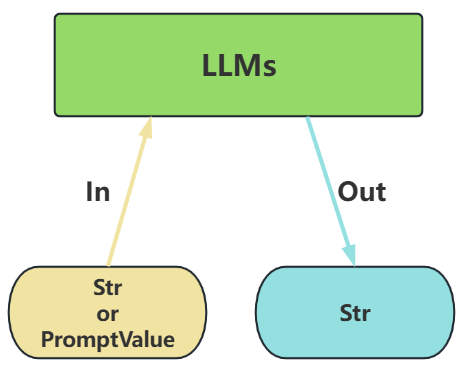
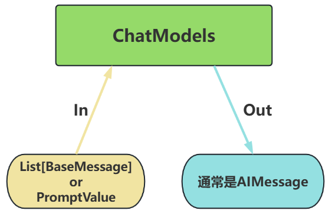

# LangChain之Model I/O


## 一、`Model I/O`介绍
1. `Model I/O`模块是与语言模型（LLMs）进行交互的`核心组件`，在整个框架中有着很重要的地位，主要包括：
   - 输入提示(Format)，对应`Prompt Template`，其实就是输入部分
   - 调用模型(Predict)，对应`Model`，其实就是执行调用部分
   - 输出解析(Parse)，对应`Output Parser`，其实就是输出部分

   
2. `Model I/O`可以调用的模型分类——`LangChain`作为一个“工具”，不提供任何`LLMs`，而是依赖于第三方集成各种大模型
   - 类型一：非对话模型
     - 特点：`Text Model`、非对话模型，是许多语言模型应用程序的支柱
       - 不支持多轮对话上下文。每次调用独立处理输入，无法自动关联历史对话（需手动拼接历史文本）
       - 底层机制：直接调用语言模型的文本补全API（如OpenAI的`text-davinci-003`），更接近底层模型的原生接口
       - 适用场景：仅需单次文本生成任务（如摘要生成、翻译、代码生成、单次问答）或对接不支持消息结构的旧模型（如部分本地部署模型）（`言外之意，优先推荐ChatModel`）
       - 局限性：无法处理角色分工或复杂对话逻辑
     - 案例
       - 输入：接受`文本字符串`或`PromptValue`对象
       - 输出：总是返回`文本字符串`
       ```python
       from langchain_openai import OpenAI
       
       llm = OpenAI()
       str = llm.invoke("写一首关于春天的诗")  # 直接输入字符串
       ```

     
   - 类型二：对话模型
     - 特点：`ChatModels`，也叫聊天模型、对话模型，底层使用LLMs
       - 原生支持多轮对话。通过消息列表维护上下文（例如：`[SystemMessage, HumanMessage, AIMessage, ...]`），模型可基于完整对话历史生成回复
       - 适用场景：对话系统（如客服机器人、长期交互的AI助手）
     - 案例
       - 输入：接受`PromptValue`或消息列表`List[BaseMessage]`，每条消息需指定角色（如`SystemMessage`、`HumanMessage`、`AIMessage`）
       - 输出：总是返回带角色的`消息对象`（`BaseMessage`子类），通常是`AIMessage`
       ```python
       from langchain_openai import ChatOpenAI
       from langchain_core.messages import SystemMessage, HumanMessage
       
       chat_model = ChatOpenAI()
       messages = [
           SystemMessage(content="你是一个诗人"),
           HumanMessage(content="写一首关于春天的诗")
       ]
       response = chat_model.invoke(messages)  # 输入消息列表
       
       print(type(response))  # <class 'langchain_core.messages.ai.AIMessage'>
       ```

     
   - 类型三：嵌入模型
     - 特点：也叫文本嵌入模型，这些模型将`文本`作为输入并返回`浮点数列表`，也就是`Embedding`
3. 基本使用
   - 参数列表
   
     |                步骤                 |                                       说明                                        |
     |:---------------------------------:|:-------------------------------------------------------------------------------:|
     |  `OpenAI(...) / ChatOpenAI(...)`  |                                    创建一个模型对象                                     |
     |       `model / model_name`        |             指定使用的模型名称。如 `qwen2.5-turbo`、`deepseek-v3`、`gpt-4o-mini`             |
     |         `temperature=0.7`         |  温度，控制生成文本的“随机性”，取值范围为0～1，数字越大，随机性越高。较高的值（如0.9）会生成更多样化的回答，较低的值（如0.3）则生成更确定的回答。  |
     |           `max_tokens`            |                      限制生成文本的最大长度，防止输出过长。tokens是API中的文本单位。                       |
     |        `model.invoke(xxx)`        |                                 执行调用，将用户输入发送给模型                                 |
     |            `.content`             |                                  提取模型返回的实际文本内容                                  |

   - 密钥管理方式【本地配置文件方案】
     - 安装依赖
       ```bash
       pip install python-dotenv
       ```
     - 在项目根目录创建`.env`文件
       ```bash
       OPENAI_API_KEY="sk-xxxxxxxxx"  # 需填写自己的API KEY
       OPENAI_BASE_URL="https://api.openai-proxy.org/v1"
       ```
     - 代码使用
       ```python
       from dotenv import load_dotenv
       from langchain_openai import ChatOpenAI
       import os
       
       load_dotenv()  # 自动加载 .env 文件
       
       os.environ["OPENAI_API_KEY"] = os.getenv("OPENAI_API_KEY1")
       os.environ["OPENAI_API_BASE"] = os.getenv("OPENAI_BASE_URL")
       
       # 框架实现了自动从环境变量中找 OPENAI_API_KEY 和 OPENAI_API_BASE
       llm = ChatOpenAI(
           model="gpt-4o-mini",
           temperature=0.7,
       )
       
       response = llm.invoke("RAG 技术的核心流程")
       print(response.content)
       ```
4. 调用方法
   - `invoke`: 处理单条输入，等待LLM完全推理完成后再返回调用结果
   - `stream`: 流式响应，逐字输出LLM的响应结果
   - `batch`: 处理批量输入
   - `astream`: 异步流式响应
   - `ainvoke`: 异步处理单条输入
   - `abatch`: 异步处理批量输入
   - `astream_log`: 异步流式返回中间步骤，以及最终响应
   - `astream_events`: （测试版）异步流式返回链中发生的事件（在`langchain-core 0.1.14`中引入）
5. `Embeddings Models`使用举例
   - `Embeddings Models`（嵌入模型）特点：将`字符串`作为输入，返回一个`浮点数`的列表。在`NLP`中，`Embedding`的作用就是将数据进行文本向量化
   
     
   - 代码
     ```python
     import os
     import dotenv
     from langchain_openai import OpenAIEmbeddings
     
     dotenv.load_dotenv()
     
     os.environ['OPENAI_API_KEY'] = os.getenv("OPENAI_API_KEY1")
     os.environ['OPENAI_BASE_URL'] = os.getenv("OPENAI_BASE_URL")
     
     embeddings_model = OpenAIEmbeddings(
         model="text-embedding-ada-002"
     )
     
     res1 = embeddings_model.embed_query('这是第一个测试文档')
     print(res1)
     
     # 打印结果：[-0.004306625574827194, 0.003083756659179926, -0.013916781172156334, ...., ]
     
     res2 = embeddings_model.embed_documents(['这是第一个测试文档', '这是第二个测试文档'])
     print(res2)
     # 打印结果：[[-0.004306625574827194, 0.003083756659179926, -0.013916781172156334,...],[...,...,.... ]]
     ```

## 二、`Model I/O`之`Prompt Template`
1. `Prompts Template`组件，通过模板管理大模型的输入，它接收用户输入，返回一个传递给`LLM`的信息（即提示词`prompt`）
   - `PromptTemplate`：LLM提示模板，用于**生成字符串提示**。它使用 Python 的字符串来模板提示
   - `ChatPromptTemplate`：聊天提示模板，用于**组合各种角色的消息模板**，传入聊天模型
   - 消息模板包括：SystemMessagePromptTemplate、HumanMessagePromptTemplate、AIMessagePromptTemplate、ChatMessagePromptTemplate等
   - `FewShotPromptTemplate`：样本提示模板，通过示例来教模型如何回答
   - `PipelinePrompt`：管道提示模板，用于把几个提示组合在一起使用
   - `自定义模板`：允许基于其它模板类来定制自己的提示模板
2. `Python`的`str.format()`方法
   - 基本用法
     ``` python
     # 简单示例，直接替换
     greeting = "Hello, {}!".format("Alice")
     print(greeting)
     # 输出: Hello, Alice!
     ```
   - 带有位置参数的用法
     ``` python
     # 使用位置参数
     info = "Name: {0}, Age: {1}".format("Jerry", 25)
     print(info)
     ```
   - 带有关键字参数的用法
     ``` python
     # 使用关键字参数
     info = "Name: {name}, Age: {age}".format(name="Tom", age=25)
     print(info)
     ```
   - 使用字典解包的方式
     ``` python
     # 使用字典解包
     person = {"name": "David", "age": 40}
     info = "Name: {name}, Age: {age}".format(**person)
     print(info)
     ```
3. `PromptTemplate`类，用于快速构建包含变量的提示词模板，并通过传入不同的参数值生成自定义的提示词
   - 完整提示词
     - 构造方法`template = PromptTemplate()`
       ```python
       from langchain_core.prompts import PromptTemplate

       #定义多变量模板
       template = PromptTemplate(
           template="请评价{product}的优缺点，包括{aspect1}和{aspect2}。",
           input_variables=["product", "aspect1", "aspect2"]
       )
       
       #使用模板生成提示词
       prompt_1 = template.format(product="智能手机", aspect1="电池续航", aspect2="拍照质量")
       prompt_2 = template.format(product="笔记本电脑", aspect1="处理速度", aspect2="便携性")
       ```
     - 调用`PromptTemplate.from_template()`
       ``` python
       from langchain_core.prompts import PromptTemplate
       
       prompt_template = PromptTemplate.from_template(
           "请给我一个关于{topic}的{type}解释。"
       )
       
       # 传入模板中的变量名
       prompt = prompt_template.format(type="详细", topic="量子力学")
       ```
   - 部分提示词
     - 实例化过程中使用`partial_variables`变量
       ```python
       from langchain_core.prompts import PromptTemplate
       
       template2 = PromptTemplate(
           template="{foo}{bar}",
           input_variables=["foo","bar"],
           partial_variables={"foo": "hello"}
       )
       
       prompt2 = template2.format(bar="world")
       
       print(prompt2)
       ```
     - 可以使用`PromptTemplate.partial()`方法创建部分提示模板
       ```python
       from langchain_core.prompts import PromptTemplate
       
       template1 = PromptTemplate(
           template="{foo}{bar}",
           input_variables=["foo", "bar"]
       )

       partial_template1 = template1.partial(foo="hello")
       
       prompt1 = partial_template1.format(bar="world")
       
       print(prompt1)
       ```
   - 结合`LLM`调用
     ```python
     import os
     import dotenv
     from langchain_openai import OpenAI
     from langchain_core.prompts import PromptTemplate
     
     dotenv.load_dotenv()
     
     os.environ['OPENAI_API_KEY'] = os.getenv("OPENAI_API_KEY1")
     os.environ['OPENAI_BASE_URL'] = os.getenv("OPENAI_BASE_URL")
     
     llm = OpenAI(
         model="gpt-4o-mini"
     )
     
     prompt_template = PromptTemplate.from_template(
         template="请评价{product}的优缺点，包括{aspect1}和{aspect2}。"
     )
     
     prompt = prompt_template.format(product="电脑", aspect1="性能", aspect2="电池")
     
     llm.invoke(prompt)
     ```
4. `ChatPromptTemplate`类，创建`聊天消息列表`的提示模板。它比普通`PromptTemplate`更适合处理多角色、多轮次的对话场景
   - 实例化方法——使用构造方法
     ```python
     from langchain_core.prompts import ChatPromptTemplate
     
     #参数类型这里使用的是tuple构成的list
     prompt_template = ChatPromptTemplate([
         # 字符串 role + 字符串 content
         ("system", "你是一个AI开发工程师. 你的名字是 {name}."),
         ("human", "你能开发哪些AI应用?"),
         ("ai", "我能开发很多AI应用, 比如聊天机器人, 图像识别, 自然语言处理等."),
         ("human", "{user_input}")
     ])
     
     #调用format()方法，返回字符串
     prompt = prompt_template.format(name="小谷AI", user_input="你能帮我做什么?")
     print(type(prompt))
     print(prompt)
     ```
   - 调用`from_messages()`
     ``` python
     # 导入相关依赖
     from langchain_core.prompts import ChatPromptTemplate
     
     # 定义聊天提示词模版
     chat_template = ChatPromptTemplate.from_messages([
         ("system", "你是一个有帮助的AI机器人，你的名字是{name}。"),
         ("human", "你好，最近怎么样？"),
         ("ai", "我很好，谢谢！"),
         ("human", "{user_input}"),
     ])
     
     # 格式化聊天提示词模版中的变量
     messages = chat_template.format(name="小明", user_input="你叫什么名字？")
     
     # 打印格式化后的聊天提示词模版内容
     print(messages)
     ```
5. 模板调用的几种方式`format()`、`invoke()`、`format_messages()`、`format_prompt()`
   - 方式1：使用`format()`，传入的是逐个的参数
     ```python
     from langchain_core.prompts import ChatPromptTemplate
     
     #参数类型这里使用的是tuple构成的list
     prompt_template = ChatPromptTemplate([
         # 字符串 role + 字符串 content
         ("system", "你是一个AI开发工程师. 你的名字是 {name}."),
         ("human", "你能开发哪些AI应用?"),
         ("ai", "我能开发很多AI应用, 比如聊天机器人, 图像识别, 自然语言处理等."),
         ("human", "{user_input}")
     ])
     
     #方式1：调用format()方法，返回字符串
     prompt = prompt_template.format(name="小谷AI", user_input="你能帮我做什么?")
     print(prompt)
     # System: 你是一个AI开发工程师. 你的名字是 小谷AI.
     # Human: 你能开发哪些AI应用?
     # AI: 我能开发很多AI应用, 比如聊天机器人, 图像识别, 自然语言处理等
     # Human: 你能帮我做什么?
     ```
   - 方式2：使用`invoke()`，传入的是一个map
     ```python
     from langchain_core.prompts import ChatPromptTemplate
     
     #参数类型这里使用的是tuple构成的list
     prompt_template = ChatPromptTemplate([
         # 字符串 role + 字符串 content
         ("system", "你是一个AI开发工程师. 你的名字是 {name}."),
         ("human", "你能开发哪些AI应用?"),
         ("ai", "我能开发很多AI应用, 比如聊天机器人, 图像识别, 自然语言处理等."),
         ("human", "{user_input}")
     ])
     
     prompt = prompt_template.invoke({"name":"小谷AI", "user_input":"你能帮我做什么?"})
     print(prompt)
     # messages=[SystemMessage(content='你是一个AI开发工程师. 你的名字是 小谷AI.', additional_kwargs={}, response_metadata={}), HumanMessage(content='你能开发哪些AI应用?', additional_kwargs={}, response_metadata={}), AIMessage(content='我能开发很多AI应用, 比如聊天机器人, 图像识别, 自然语言处理等.', additional_kwargs={}, response_metadata={}, tool_calls=[], invalid_tool_calls=[]), HumanMessage(content='你能帮我做什么?', additional_kwargs={}, response_metadata={})]
     ```
   - 方式3：使用`format_messages()`，传入的是逐个的参数，返回的是一个消息列表
     ```python
     from langchain_core.prompts import ChatPromptTemplate
     prompt_template = ChatPromptTemplate([
         ("system", "你是一个AI开发工程师. 你的名字是 {name}."),
         ("human", "你能开发哪些AI应用?"),
         ("ai", "我能开发很多AI应用, 比如聊天机器人, 图像识别, 自然语言处理等."),
         ("human", "{user_input}")
     ])
     
     # 调用format_messages()方法，返回消息列表
     prompt2 = prompt_template.format_messages(name="小谷AI", user_input="你能帮我做什么?")
     print(type(prompt2))
     print(prompt2)
     # [SystemMessage(content='你是一个AI开发工程师. 你的名字是 小谷AI.', additional_kwargs={}, response_metadata={}), HumanMessage(content='你能开发哪些AI应用?', additional_kwargs={}, response_metadata={}), AIMessage(content='我能开发很多AI应用, 比如聊天机器人, 图像识别, 自然语言处理等.', additional_kwargs={}, response_metadata={}, tool_calls=[], invalid_tool_calls=[]), HumanMessage(content='你能帮我做什么?', additional_kwargs={}, response_metadata={})]
     ```
   - 方式4：使用`format_prompt()`，传入的是逐个的参数
     ```python
     from langchain_core.prompts import ChatPromptTemplate
     # 参数类型这里使用的是tuple构成的list
     prompt_template = ChatPromptTemplate([
         # 字符串 role + 字符串 content
         ("system", "你是一个AI开发工程师. 你的名字是 {name}."),
         ("human", "你能开发哪些AI应用?"),
         ("ai", "我能开发很多AI应用, 比如聊天机器人, 图像识别, 自然语言处理等."),
         ("human", "{user_input}")
     ])
     
     prompt = prompt_template.format_prompt(name="小谷AI", user_input="你能帮我做什么?")
     print(prompt.to_messages())
     print(type(prompt.to_messages()))
     ```
6. 少量样本示例的提示词模板（`FewShotPromptTemplate`）：在构建`prompt`时，可以通过构建一个少量示例列表去进一步格式化`prompt`，这是一种简单但强大的指导生成的方式，在某些情况下可以显著提高模型性能
   ```python
   from langchain_core.prompts import (FewShotChatMessagePromptTemplate, ChatPromptTemplate)
   
   # 2.定义示例组
   examples = [
       {"input": "2🦜2", "output": "4"},
       {"input": "2🦜3", "output": "8"},
   ]
   
   # 3.定义示例的消息格式提示词模版
   example_prompt = ChatPromptTemplate.from_messages([
       ('human', '{input} 是多少?'), 
       ('ai', '{output}')
   ])
   
   # 4.定义FewShotChatMessagePromptTemplate对象
   few_shot_prompt = FewShotChatMessagePromptTemplate(
       examples=examples,  # 示例组
       example_prompt=example_prompt,  # 示例提示词词模版
   )
   # 5.输出完整提示词的消息模版
   final_prompt = ChatPromptTemplate.from_messages(
       [
           ('system', '你是一个数学奇才'),
           few_shot_prompt,
           ('human', '{input}'),
       ]
   )
   
   #6.提供大模型
   import os
   import dotenv
   from langchain_openai import ChatOpenAI
   
   dotenv.load_dotenv()
   
   os.environ['OPENAI_API_KEY'] = os.getenv("OPENAI_API_KEY1")
   os.environ['OPENAI_BASE_URL'] = os.getenv("OPENAI_BASE_URL")
   
   chat_model = ChatOpenAI(model="gpt-4o-mini",
                           temperature=0.4)
   
   print(chat_model.invoke(final_prompt.invoke(input="2🦜4")))
   # content='16' additional_kwargs={'refusal': None} response_metadata={'token_usage': {'completion_tokens': 2, 'prompt_tokens': 56, 'total_tokens': 58, 'completion_tokens_details': {'accepted_prediction_tokens': 0, 'audio_tokens': 0, 'reasoning_tokens': 0, 'rejected_prediction_tokens': 0}, 'prompt_tokens_details': {'audio_tokens': 0, 'cached_tokens': 0}, 'latency_checkpoint': {'engine_tbt_ms': 5, 'engine_ttft_ms': 50, 'engine_ttlt_ms': 60, 'pre_inference_ms': 99, 'service_tbt_ms': 8, 'service_ttft_ms': 537, 'service_ttlt_ms': 545, 'total_duration_ms': 455, 'user_visible_ttft_ms': 439}}, 'model_provider': 'openai', 'model_name': 'gpt-4o-mini-2024-07-18', 'system_fingerprint': 'fp_4dcfea0a44', 'id': 'chatcmpl-DoPQ1VTxak8W2MZbgnZ7xf6k2FyMU', 'service_tier': 'default', 'finish_reason': 'stop', 'logprobs': None} id='lc_run--019ea64c-554a-7c71-926f-e8dad91c6dc9-0' tool_calls=[] invalid_tool_calls=[] usage_metadata={'input_tokens': 56, 'output_tokens': 2, 'total_tokens': 58, 'input_token_details': {'audio': 0, 'cache_read': 0}, 'output_token_details': {'audio': 0, 'reasoning': 0}}
   ```

## 三、`Model I/O`之`Output Parsers`
1. 输出解析器（`Output Parser`）负责获取`LLM`的输出并将其转换为更合适的格式。语言模型返回的内容通常都是字符串的格式（文本格式），但在实际AI应用开发过程中，往往希望model可以返回更直观、更格式化的内容，LangChain提供了输出解析器
2. 输出解析器的分类
   - `StrOutputParser`：字符串解析器
   - `JsonOutputParser`：`JSON`解析器，确保输出符合特定`JSON`对象格式
   - `DatetimeOutputParser`：日期时间解析器，可用于将`LLM`输出解析为日期时间格式
   - `CommaSeparatedListOutputParser`：`CSV`解析器，模型的输出以逗号分隔，以列表形式返回输出
   - `XMLOutputParser`：XML解析器，允许以流行的`XML`格式从`LLM`获取结果
   - `EnumOutputParser`：枚举解析器，将`LLM`的输出，解析为预定义的枚举值
   - `StructuredOutputParser`：将非结构化文本转换为预定义格式的结构化数据（如字典）
   - `OutputFixingParser`：输出修复解析器，用于自动修复格式错误的解析器，比如将返回的不符合预期格式的输出，尝试修正为正确的结构化数据（如`JSON`）
   - `PydanticOutputParser`：将输出自动解析为`Pydantic`模型实例的组件
   - `RetryOutputParser`：重试解析器，当主解析器（如`PydanticOutputParser`或`JSONOutputParser`）因格式错误无法解析`LLM`的输出时，通过调用另一个`LLM`自动修正错误，并重新尝试解析
3. 具体解析器的使用
   - 字符串解析器`StrOutputParser`
     - 作用：`StrOutputParser`简单地将任何输入转换为字符串。它是一个简单的解析器，从结果中**提取content字段**
     - 案例
       ```python
       from langchain_core.messages import HumanMessage, SystemMessage
       from langchain_core.output_parsers import StrOutputParser
       import os
       import dotenv
       from langchain_openai import ChatOpenAI
       
       dotenv.load_dotenv()
       os.environ['OPENAI_API_KEY'] = os.getenv("OPENAI_API_KEY1")
       os.environ['OPENAI_BASE_URL'] = os.getenv("OPENAI_BASE_URL")
       chat_model = ChatOpenAI(model="gpt-4o-mini")
       messages = [
           SystemMessage(content="将以下内容从英语翻译成中文"),
           HumanMessage(content="It's a nice day today"),
       ]

       result = chat_model.invoke(messages)
       print(result)
       
       parser = StrOutputParser()
       #使用parser处理model返回的结果
       response = parser.invoke(result)
       print(response)
       ```
   - `JSON`解析器`JsonOutputParser`
     - 作用：`JSON Output Parser`，即`JSON`解析器，是一种用于将大模型的自由文本输出转换为结构化JSON数据的工具
     - 适合场景：特别适用于需要严格结构化输出的场景，比如`API`调用、数据存储或下游任务处理
     - 使用方法
       - 使用方法A
         ```python
         from langchain_core.output_parsers import JsonOutputParser
         from langchain_core.prompts import ChatPromptTemplate
         
         chat_model = ChatOpenAI(model="gpt-4o-mini")
         
         chat_prompt_template = ChatPromptTemplate.from_messages([
             ("system","你是一个靠谱的{role}"),
             ("human","{question}")
         ])
         
         parser = JsonOutputParser()
         
         # 方式1：
         result = chat_model.invoke(chat_prompt_template.format_messages(role="人工智能专家",question="人工智能用英文怎么说？问题用q表示，答案用a表示，返回一个JSON格式"))
         print(result)
         
         parser.invoke(result)
         ```
       - 使用方法B`JsonOutputParser().get_format_instructions()`
         ```python
         # 引入依赖包
         from langchain_core.output_parsers import JsonOutputParser
         from langchain_core.prompts import PromptTemplate
         
         # 初始化语言模型
         chat_model = ChatOpenAI(model="gpt-4o-mini")
         
         joke_query = "告诉我一个笑话。"
         
         # 定义Json解析器
         parser = JsonOutputParser()
         
         # 定义提示词模版
         # 注意，提示词模板中需要部分格式化解析器的格式要求format_instructions
         prompt = PromptTemplate(
             template="回答用户的查询.\n{format_instructions}\n{query}\n",
             input_variables=["query"],
             partial_variables={"format_instructions": parser.get_format_instructions()},
         )
         
         # 5.使用LCEL语法组合一个简单的链
         chain = prompt | chat_model | parser
         # 6.执行链
         output = chain.invoke({"query": "给我讲一个笑话"})
         print(output)
         ```
   - `XML`解析器`XMLOutputParser`
     - 作用：强制`LLM`返回`XML`格式的响应，并提取结构化数据
     - 使用方法
       - 使用方法A：
         ```python
         # 初始化语言模型
         chat_model = ChatOpenAI(model="gpt-4o-mini")
       
         # 测试模型的xml解析效果
         actor_query = "生成汤姆·汉克斯的简短电影记录"
         output = chat_model.invoke(f"""{actor_query}请将影片附在<movie></movie>标签中""")
         print(type(output))  # <class 'langchain_core.messages.ai.AIMessage'>
         print(output.content)
         ```
       - 使用方法B：`XMLOutputParser().get_format_instructions()`
         ```python
         from langchain_openai import ChatOpenAI
         from langchain_core.prompts import PromptTemplate
         from langchain_core.output_parsers import XMLOutputParser
         
         model = ChatOpenAI(model="gpt-4o-mini")
         
         actor_query = "生成周星驰的简化电影作品列表，按照最新的时间降序，必要时使用中文"
         # 设置解析器 + 将指令注入提示模板。
         parser = XMLOutputParser()
         prompt = PromptTemplate(
             template="回答用户的查询。\n{format_instructions}\n{query}\n",
             input_variables=["query"],
             partial_variables={"format_instructions": parser.get_format_instructions()},
         )
         
         chain = prompt | model | parser
         output = chain.invoke({"query": actor_query})
         print(output)
         ```

## 四、`LangChain`调用私有模型
1. `Ollama`的介绍
   - `Ollama`是在`Github`上的一个开源项目，其项目定位是：一个本地运行大模型的集成框架。目前主要针对主流的LlaMA架构的开源大模型设计，可以实现如`Qwen`、`Deepseek`等主流大模型的下载、启动和本地运行的自动化部署及推理流程
   - 目前作为一个非常热门的大模型托管平台，已被包括`LangChain`、`Taskweaver`等在内的多个热门项目高度集成。
2. `Ollama`的使用
   - `Ollama`项目支持跨平台部署，目前已兼容Mac、Linux和Windows操作系统。特别地对于Windows用户提供了非常直观的预览版，参考相关网址[2]、[3]
   - 下载模型：访问 https://ollama.com/search 可以查看支持的模型。使用命令行可以下载并运行模型，例如运行 `deepseek-r1:7b` 模型：
     ```bash
     ollama run deepseek-r1:7b
     ```
3. 调用私有模型
   ``` python
   from langchain_community.chat_models import ChatOllama
   #from langchain_ollama import ChatOllama
   
   ollama_llm = ChatOllama(
       model="deepseek-r1:7b",
       base_url="http://your-ip:port"  # 自定义地址
   )
   ```
   ``` python
   from langchain_core.messages import HumanMessage
   
   messages = [
       HumanMessage(content="你好，请介绍一下你自己")
   ]
   
   chat_model_response = ollama_llm.invoke(messages)
   
   print(chat_model_response.content)
   ```


-----
参考资料：
1. 尚硅谷B站视频：https://www.bilibili.com/video/BV1ZppNzHEY4
2. Ollama官方地址：https://ollama.com
3. Ollama Github开源地址：https://github.com/ollama/ollama

