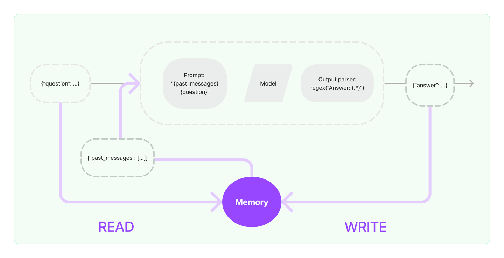
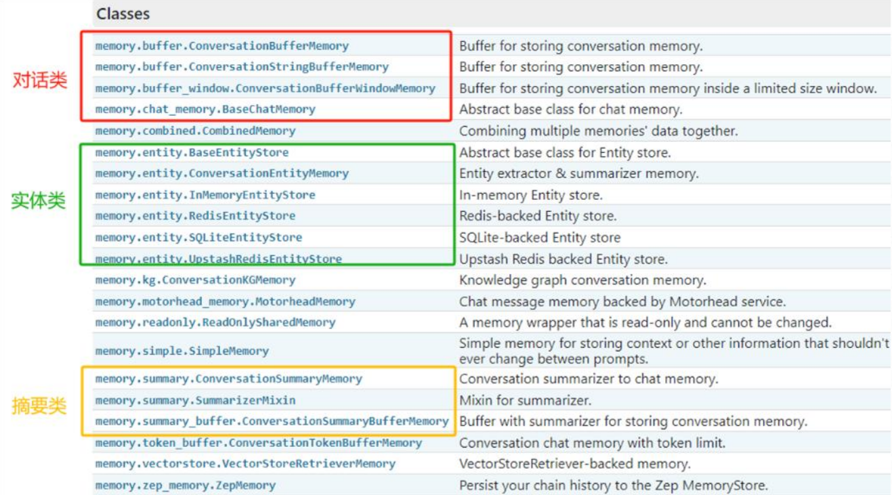
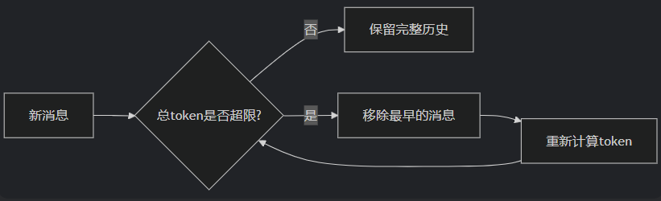
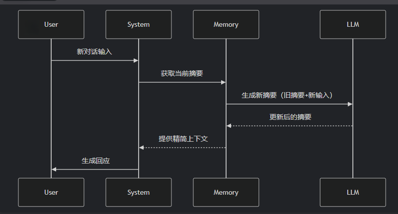
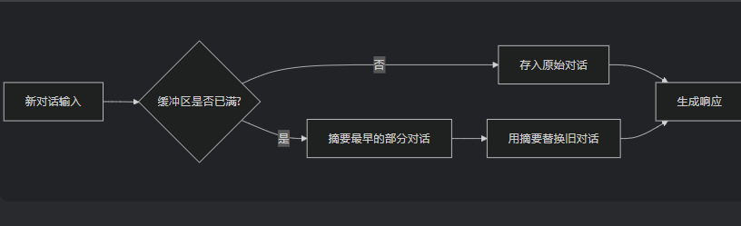

# 第04章：LangChain使用之Memory


## 一、`Memory`概述
1. 为什么需要`Memory`：大多数的大模型应用程序都会有一个会话接口，允许我们进行多轮的对话，并有一定的上下文记忆能力
   - 实际上，模型本身是不会记忆任何上下文的，只能依靠用户本身的输入去产生输出
   - 如何解决记忆问题？实现这个记忆功能，就需要额外的模块去保存我们和模型对话的上下文信息，然后在下一次请求时，把所有的历史信息都输入给模型，让模型输出最终结果。在`LangChain`中，提供这个功能的模块就称为`Memory（记忆）`，用于存储用户和模型交互的历史信息
2. 什么是`Memory`：是`LangChain`中用于多轮对话中保存和管理上下文信息的组件。它让应用能够记住用户之前说了什么，从而实现对话的上下文感知能力，为构建真正智能和上下文感知的链式对话系统提供了基础
3. `Memory`的设计理念

   
   - 输入问题：`({"question": ...})`
   - 读取历史消息：从`Memory`中读取历史消息`{"past_messages": [...]}`）
   - 构建提示：读取到的历史消息和当前问题会被合并，构建一个新的`Prompt`
   - 模型处理：构建好的提示会被传递给语言模型进行处理。语言模型根据提示生成一个输出
   - 解析输出：输出解析器通过正则表达式`regex("Answer: (.*)")`来解析，返回一个回答`{"answer": ...}`给用户
   - 得到回复并写入`Memory`：新生成的回答会与当前的问题一起写入`Memory`，更新对话历史。`Memory`会存储最新的对话内容，为后续的对话提供上下文支持
4. `Memory`的几个关键功能
   - 存储之前对话，用于后续链的输入。这使得后续的链可以感知到之前的上下文
   - 允许链访问和操作共享的内存，实现链之间的协作
   - 可以存储各种数据类型，如文本、图像、音频等
   - 可以存储链的中间执行状态，实现断点恢复等功能
   - 可以用于实现对话系统的用户个性化、任务跟踪等功能
   - 可以存储验证信息，确保链只依据可信来源生成输出
5. `Memory`模块设计
   - 层级设计规则
     - 层次1：保留一个聊天消息列表
     - 层次2：（设计一个简单的记忆模块）只返回最近交互的几条消息
     - 层次3：（稍微复杂一点）记忆模块需要返回过去几条消息的简洁摘要
     - 层次4：（更复杂）从存储的消息中提取实体，并且仅返回有关当前运行中引用的实体的信息
   - 针对上述情况，`LangChain`构建了一些可以直接使用的`Memory`工具，用于存储聊天消息的一系列集成
   
     

## 二、基础`Memory`模块的使用
1. `InMemoryChatMessageHistory`是`LangChain Core`官方主推的内存对话历史存储类，用来临时保存一轮会话里的所有消息（用户说的、`AI`回复的），重启即丢、轻量无依赖、开发测试首选
   - 纯内存消息队列，只负责存、取、清空消息，不做摘要、不做窗口截断（要自己封装）
   - 内部就是一个普通列表：
     ```python
     class InMemoryChatMessageHistory(BaseChatMessageHistory, BaseModel):
         """
         In memory implementation of chat message history.
         Stores messages in a memory list.
         """

         messages: list[BaseMessage] = Field(default_factory=list)
     ```
   - 特点
     - 零依赖：不用`Redis`、数据库，开箱即用
     - 速度快：内存读写，无网络或者IO开销
     - `API`干净：只做存储，不掺杂复杂逻辑
     - 官方维护：`langchain_core`核心包，长期支持
     - 不持久化：服务重启、进程退出，历史全丢
     - 单实例：多进程、多机器部署时，各自有独立记忆，无法共享
   - 案例：
     ```python
     import dotenv
     from langchain_openai import ChatOpenAI
     from langchain_core.chat_history import InMemoryChatMessageHistory
     import os
     
     dotenv.load_dotenv()  #加载当前目录下的 .env 文件
     
     os.environ['OPENAI_API_KEY'] = os.getenv("OPENAI_API_KEY1")
     os.environ['OPENAI_BASE_URL'] = os.getenv("OPENAI_BASE_URL")
     
     # 创建大模型实例
     llm = ChatOpenAI(
         model="gpt-4o-mini",
         base_url=os.getenv("OPENAI_BASE_URL"),
         api_key=os.getenv("OPENAI_API_KEY")
     )
     
     history = InMemoryChatMessageHistory()
     history.add_user_message("你好")
     history.add_ai_message("很高兴认识你")
     history.add_user_message("帮我计算1+1+2")
     
     print(llm.invoke(history.messages))
     
     # content='1 + 1 + 2 = 4。' additional_kwargs={'refusal': None} response_metadata={'token_usage': {'completion_tokens': 12, 'prompt_tokens': 29, 'total_tokens': 41, 'completion_tokens_details': {'accepted_prediction_tokens': 0, 'audio_tokens': 0, 'reasoning_tokens': 0, 'rejected_prediction_tokens': 0}, 'prompt_tokens_details': {'audio_tokens': 0, 'cached_tokens': 0}, 'latency_checkpoint': {'engine_tbt_ms': 8, 'engine_ttft_ms': 34, 'engine_ttlt_ms': 134, 'pre_inference_ms': 68, 'service_tbt_ms': 9, 'service_ttft_ms': 167, 'service_ttlt_ms': 263, 'total_duration_ms': 203, 'user_visible_ttft_ms': 99}}, 'model_provider': 'openai', 'model_name': 'gpt-4o-mini-2024-07-18', 'system_fingerprint': 'fp_4dcfea0a44', 'id': 'chatcmpl-DoJjJv5cbhmeq6OAGL6fga8E8f5Lz', 'service_tier': 'default', 'finish_reason': 'stop', 'logprobs': None} id='lc_run--019ea4fe-a580-72b1-970d-b6a0970e7da8-0' tool_calls=[] invalid_tool_calls=[] usage_metadata={'input_tokens': 29, 'output_tokens': 12, 'total_tokens': 41, 'input_token_details': {'audio': 0, 'cache_read': 0}, 'output_token_details': {'audio': 0, 'reasoning': 0}}
     ```
2. `ConversationBufferWindowMemory`记忆类会保存一段时间内对话交互的列表，仅使用最近$K$个交互。这样就使缓存区不会变得太大，从而节省上下文空间
   ```python
   from langchain_classic.memory import ConversationBufferWindowMemory
   memory = ConversationBufferWindowMemory(k=2)
   memory.save_context({"input": "你好"}, {"output": "怎么了"})
   memory.save_context({"input": "你是谁"}, {"output": "我是AI助手"})
   memory.save_context({"input": "你的生日是哪天？"}, {"output": "我不清楚"})

   print(memory.load_memory_variables({}))
   # {'history': 'Human: 你是谁\nAI: 我是AI助手\nHuman: 你的生日是哪天？\nAI: 我不清楚'}
   ```
3. `ConversationTokenBufferMemory`是`LangChain`中一种基于Token数量控制的对话记忆机制。如果字符数量超出指定数目，它会切掉这个对话的早期部分，以保留与最近的交流相对应的字符数量。
   - 特点：
     - Token级别的精准控制
     - 原始对话保留
   - 原理
   
     
   - 案例

     ```python
     from langchain_classic.memory import ConversationTokenBufferMemory
     from dotenv import load_dotenv
     from langchain_openai import ChatOpenAI
     import os
     
     load_dotenv()
     
     os.environ["OPENAI_API_KEY"] = os.getenv("OPENAI_API_KEY1")
     os.environ["OPENAI_API_BASE"] = os.getenv("OPENAI_BASE_URL")
     
     # 框架实现了自动从环境变量中找 OPENAI_API_KEY 和 OPENAI_API_BASE
     llm = ChatOpenAI(
         model="gpt-4o-mini",
         temperature=0.7,
     )
     
     # 3.定义ConversationTokenBufferMemory对象
     memory = ConversationTokenBufferMemory(
         llm=llm,
         max_token_limit=10  # 设置token上限
     )
     
     # 添加对话
     memory.save_context({"input": "你好吗？"}, {"output": "我很好，谢谢！"})
     memory.save_context({"input": "今天天气如何？"}, {"output": "晴天，25度"})
     
     # 查看当前记忆
     print(memory.load_memory_variables({}))
     ```
4. `ConversationSummaryMemory`是`LangChain`中一种智能压缩对话历史的记忆机制，它通过大语言模型自动生成对话内容的精简摘要，而不是存储原始对话文本。
   - 特点：这种记忆方式特别适合**长对话**和**需要保留核心信息**的场景
   - 原理
   
     
   - 样例
     ```python
     from langchain_classic.memory import ConversationSummaryMemory
     from dotenv import load_dotenv
     from langchain_openai import ChatOpenAI
     import os
     
     load_dotenv()
     
     os.environ["OPENAI_API_KEY"] = os.getenv("OPENAI_API_KEY1")
     os.environ["OPENAI_API_BASE"] = os.getenv("OPENAI_BASE_URL")
     
     # 框架实现了自动从环境变量中找 OPENAI_API_KEY 和 OPENAI_API_BASE
     llm = ChatOpenAI(
         model="gpt-4o-mini",
         temperature=0.7,
     )
     
     # 3.定义ConversationSummaryMemory对象
     memory = ConversationSummaryMemory(llm=llm)
     
     # 4.存储消息
     memory.save_context({"input": "你好"}, {"output": "怎么了"})
     memory.save_context({"input": "你是谁"}, {"output": "我是AI助手小智"})
     memory.save_context({"input": "初次对话，你能介绍一下你自己吗？"}, {"output": "当然可以了。我是一个无所不能的小智。"})
     
     # 5.读取消息（总结后的）
     memory.load_memory_variables({})
     ```
5. `ConversationSummaryBufferMemory`是`LangChain`中一种混合型记忆机制，它结合了`ConversationBufferMemory`（完整对话记录）和`ConversationSummaryMemory`（摘要记忆）的优点，在保留最近对话原始记录的同时，对较早的对话内容进行智能摘要。
   - 特点：
     - 保留最近N条原始对话：确保最新交互的完整上下文
     - 摘要较早历史：对超出缓冲区的旧对话进行压缩，避免信息过载
     - 平衡细节与效率：既不会丢失关键细节，又能处理长对话
   - 原理：
   
     
   - 样例
     ```python
     # 1.导入相关的包
     from langchain_classic.memory import ConversationSummaryMemory
     from langchain_openai import ChatOpenAI
     
     # 2.定义模型
     llm = ChatOpenAI(model_name="gpt-4o-mini",temperature=0)
     
     # 3.定义ConversationSummaryBufferMemory对象
     memory = ConversationSummaryBufferMemory(
         llm=llm, max_token_limit=40, return_messages=True
     )
     # 4.保存消息
     memory.save_context({"input": "你好，请帮问一下康师傅明天是否有空"}, {"output": "您好，康师傅是谁"})
     memory.save_context({"input": "康师傅是IT培训机构尚硅谷的讲师"}, {"output": "好的，我知道了"})
     memory.save_context({"input": "希望明天他来帮我规划一下职业生涯"}, {"output": "好的，我来告他"})
     # 5.读取内容
     memory.load_memory_variables({})
     ```
6. `ConversationEntityMemory`是一种基于实体的对话记忆机制，它能够智能地识别、存储和利用对话中出现的实体信息，使对话系统具备更强的上下文理解和记忆能力。
   - 特点：自动提取对话中的实体（如人名、地点、产品等）及其属性/关系，并结构化存储
     - 解决信息过载问题
     - 长对话中大量冗余信息会干扰关键事实记忆
     - 通过对实体摘要压缩非重要细节（如删除寒暄、保留价格/时间等硬性事实）
     - 在医疗等高风险领域，必须用实体记忆确保关键信息（如过敏史）被100%准确识别和拦截
   - 样例
     ```
     {"input": "我头痛，血压140/90，在吃阿司匹林。"},
     {"output": "建议监测血压，阿司匹林可继续服用。"}
     {"input": "我对青霉素过敏。"}, 
     {"output": "已记录您的青霉素过敏史。"}
     {"input": "阿司匹林吃了三天，头痛没缓解。"}, 
     {"output": "建议停用阿司匹林，换布洛芬试试。"}
     ```
     - 使用`ConversationSummaryMemory`
       `"患者主诉头痛和高血压（140/90），正在服用阿司匹林。患者对青霉素过敏。三天后头痛未缓解，建议更换止痛药。"`
     - 使用`ConversationEntityMemory`
       ```txt
       {
       "症状": "头痛",
       "血压": "140/90",
       "当前用药": "阿司匹林（无效）",
       "过敏药物": "青霉素"
       }
       ```
     - 下游处理的区别
     
       |        维度        |                   ConversationSummaryMemory                    |                   ConversationEntityMemory                   |
       |:----------------:|:--------------------------------------------------------------:|:------------------------------------------------------------:|
       |                  |                          自然语言文本（一段话）                           |                          结构化字典（键值对）                          |
       |     下游如何利用信息     | 需大模型“读懂”摘要文本，<br />如果 AI 的注意力集中在“头痛”和“换药”上，可能会忽略过敏提示（尤其是摘要较长时） |              无需依赖模型的“阅读理解能力”，直接通过字段名（如`过敏药物`）查询              |
       |      防错可靠性       |                          低（依赖大模型的注意力）                          |                         高（通过代码强制检查）                          |
       |       推荐处理       |                       可以试试阿莫西林（一种青霉素类药）                        |                          完全避免推荐过敏药物                          |
   - 工作原理
     - 实体识别阶段
     - 记忆存储阶段
       - 以键值对形式存储实体属性
       - 建立实体间关联关系
     - 记忆检索阶段
       - 当对话提及已存储实体时自动唤醒相关记忆


------
参考资料
1. 尚硅谷B站视频：https://www.bilibili.com/video/BV1ZppNzHEY4
2. LangChain的Memory：https://docs.langchain.com/oss/python/langchain/short-term-memory

