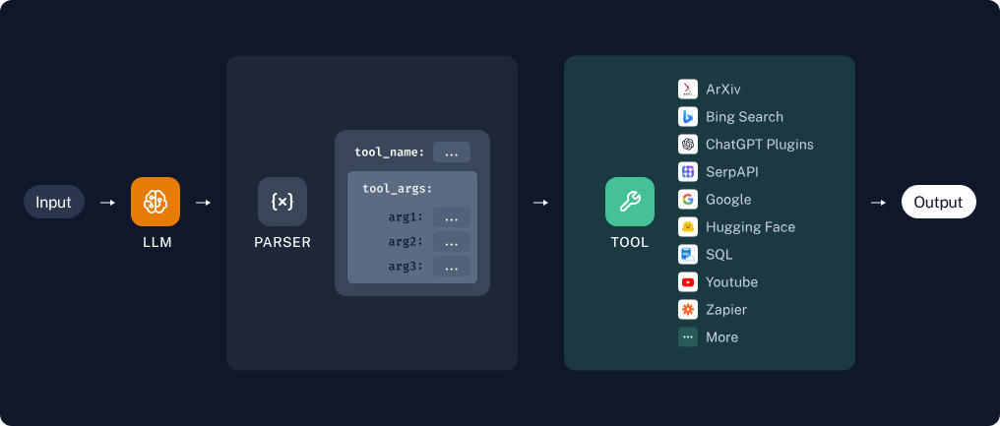

# 第05章：LangChain使用之Tools


## 一、`Tools`概述
1. 要构建更强大的AI工程应用，只有生成文本这样的“纸上谈兵”能力自然是不够的。工具`Tools`不仅仅是“肢体”的延伸，更是为“大脑”插上了想象力的“翅膀”。借助工具，才能让AI应用的能力真正具备无限的可能，才能从“`认识世界`”走向“`改变世界`”
   - `Tools`用于扩展大语言模型的能力，使其能够与外部系统、`API`或自定义函数交互，从而完成仅靠文本生成无法实现的任务（如搜索、计算、数据库查询等）
   - `Tools`本质上是封装了特定功能的可调用模块，是`Agent`、`Chain`或`LLM`可以用来与世界互动的接口
2. `Tools`的特点
   - 增强`LLM`的功能：让`LLM`突破纯文本生成的限制，执行实际操作（如调用搜索引擎、查询数据库、运行代码等）
   - 支持智能决策：在`Agent`工作流中，`LLM `根据用户输入动态选择最合适的`Tool`完成任务
   - 模块化设计：每个`Tool`专注一个功能，便于复用和组合（例如：搜索工具 + 计算工具 + 天气查询工具）
3. `Tool`的要素
   - name：工具的名称
   - description：工具的功能描述
   - 该工具输入的`JSON模式`
   - 要调用的函数
   - return_direct：是否应将工具结果直接返回给用户
4. `Tool`实操步骤
   - 步骤1：将`name`、`description`和`JSON`模式作为上下文提供给LLM
   - 步骤2：LLM会根据提示词推断出需要调用哪些工具，并提供具体的调用参数信息
   - 步骤3：用户需要根据返回的工具调用信息，自行触发相关工具的回调

   

## 二、自定义工具
1. 两种自定义方式
   - 使用`@tool`装饰器（自定义工具的最简单方式）
     - 装饰器默认使用函数名称作为工具名称，但可以通过传递字符串作为第一个参数来覆盖此设置
       ```python
       from langchain_core.tools import tool

       # 装饰器
       @tool
       def add_number(a: int, b: int) -> int:
           """计算两个数之和"""
           return a + b
     
       print(add_number.name)
       ```
     - 使用注解中的参数重写工具调用信息
       ```python
       from langchain.tools import tool
       from pydantic import BaseModel, Field
       
       class FieldInfo(BaseModel):
           a :int = Field(description="第1个参数")
           b :int = Field(description="第2个参数")
       
       @tool(name_or_callable="add_two_number",description="two number add",args_schema=FieldInfo,return_direct=True)
       def add_number(a:int,b:int)->int:
           """两个整数相加"""
           return a + b
       
       
       print(f"name = {add_number.name}")
       print(f"description = {add_number.description}")
       print(f"args = {add_number.args}")
       print(f"return_direct = {add_number.return_direct}")
       
       res = add_number.invoke({"a":10,"b":20})
       print(res)
       ```
   - 使用`StructuredTool.from_function`类方法：类似于`@tool`装饰器，但允许更多配置和同步/异步实现的规范
     ```python
     from langchain_core.tools.structured import StructuredTool
     def search_google(query: str):
         return "hahah"
     
     googleSearch = StructuredTool.from_function(
         func=search_google,
         name="google_search",
         description="查询搜索引擎结果",
     )
     
     print(googleSearch.name)
     print(googleSearch.description)
     googleSearch.invoke({"query": "查一下勾股定理"})
     
     # google_search
     # 查询搜索引擎结果
     # 'hahah'
     ```
2. 工具的几个常用属性
   
   |        属性         |         类型          |                               描述                               |
   |:-----------------:|:-------------------:|:--------------------------------------------------------------:|
   |      `name`       |         str         |                `必选的`，在提供给LLM或Agent的工具集中必须是唯一的。                 |
   |   `description`   |         str         |        `可选但建议`，描述工具的功能。LLM或Agent将使用此描述作为上下文，使用它确定工具的使用         |
   |   `args_schema`   | Pydantic BaseModel  |            `可选但建议`，可用于提供更多信息（例如，few-shot示例）或验证预期参数。            |
   |  `return_direct`  |       boolean       |        仅对Agent相关。当为True时，在调用给定工具后，Agent将停止并将结果直接返回给用户。         |
3. 工具调用举例
   - 步骤1：判断是否需要调用工具
     - 代码示例
       ```python
       import os
       import dotenv
       from langchain_openai import ChatOpenAI
       from  langchain_community.tools.file_management.move import MoveFileTool
       from  langchain_core.messages.human import HumanMessage
     
       dotenv.load_dotenv()  #加载当前目录下的 .env 文件
     
       os.environ['OPENAI_API_KEY'] = os.getenv("OPENAI_API_KEY1")
       os.environ['OPENAI_BASE_URL'] = os.getenv("OPENAI_BASE_URL")
     
       # 创建大模型实例
       llm = ChatOpenAI(
           model="gpt-4o-mini",
           base_url=os.getenv("OPENAI_BASE_URL"),
           api_key=os.getenv("OPENAI_API_KEY")
       )  # 默认使用 gpt-3.5-turbo
     
       messages = [HumanMessage(content="将文件a移动到桌面")]
       llm_with_tools = llm.bind_tools([MoveFileTool()])
       res = llm_with_tools.invoke(messages)
       print(res)
     
       # 注意返回的content是空
       # content='' additional_kwargs={'refusal': None} response_metadata={'token_usage': {'completion_tokens': 30, 'prompt_tokens': 76, 'total_tokens': 106, 'completion_tokens_details': {'accepted_prediction_tokens': 0, 'audio_tokens': 0, 'reasoning_tokens': 0, 'rejected_prediction_tokens': 0}, 'prompt_tokens_details': {'audio_tokens': 0, 'cached_tokens': 0}, 'latency_checkpoint': {'engine_tbt_ms': 9, 'engine_ttft_ms': 37, 'engine_ttlt_ms': 301, 'pre_inference_ms': 128, 'service_tbt_ms': 13, 'service_ttft_ms': 723, 'service_ttlt_ms': 1029, 'total_duration_ms': 996, 'user_visible_ttft_ms': 595}}, 'model_provider': 'openai', 'model_name': 'gpt-4o-mini-2024-07-18', 'system_fingerprint': 'fp_4dcfea0a44', 'id': 'chatcmpl-Dp1y9hCXIncoG04t0UYThyy5CKaKy', 'service_tier': 'default', 'finish_reason': 'tool_calls', 'logprobs': None} id='lc_run--019eaf21-7eeb-7c53-8972-1216d97ca8e1-0' tool_calls=[{'name': 'move_file', 'args': {'source_path': 'a', 'destination_path': 'C:\\Users\\YourUsername\\Desktop\\a'}, 'id': 'call_0PVQdtQpNVOAOzxy62kXFDpL', 'type': 'tool_call'}] invalid_tool_calls=[] usage_metadata={'input_tokens': 76, 'output_tokens': 30, 'total_tokens': 106, 'input_token_details': {'audio': 0, 'cache_read': 0}, 'output_token_details': {'audio': 0, 'reasoning': 0}}
       # 返回的关键是这个
       # tool_calls=[{'name': 'move_file', 'args': {'source_path': 'a', 'destination_path': 'C:\\Users\\YourUsername\\Desktop\\a'}, 'id': 'call_0PVQdtQpNVOAOzxy62kXFDpL', 'type': 'tool_call'}]
       ```
       ```python
       import os
       import dotenv
       from langchain_openai import ChatOpenAI
       from langchain_community.tools.file_management.move import MoveFileTool
       from langchain_core.messages.human import HumanMessage
       
       dotenv.load_dotenv()  #加载当前目录下的 .env 文件
       
       os.environ['OPENAI_API_KEY'] = os.getenv("OPENAI_API_KEY1")
       os.environ['OPENAI_BASE_URL'] = os.getenv("OPENAI_BASE_URL")
       
       # 创建大模型实例
       llm = ChatOpenAI(
           model="gpt-4o-mini",
           base_url=os.getenv("OPENAI_BASE_URL"),
           api_key=os.getenv("OPENAI_API_KEY")
       )  # 默认使用 gpt-3.5-turbo
       
       messages = [HumanMessage(content="北京天气怎么样")]
       llm_with_tools = llm.bind_tools([MoveFileTool()])
       res = llm_with_tools.invoke(messages)
       print(res)
       
       # content='抱歉，我不能实时获取天气信息，但你可以通过天气网站或应用来查找北京的最新天气情况。如果你需要了解某个特定日期的历史天气，我可以试着帮助你。' additional_kwargs={'refusal': None} response_metadata={'token_usage': {'completion_tokens': 45, 'prompt_tokens': 72, 'total_tokens': 117, 'completion_tokens_details': {'accepted_prediction_tokens': 0, 'audio_tokens': 0, 'reasoning_tokens': 0, 'rejected_prediction_tokens': 0}, 'prompt_tokens_details': {'audio_tokens': 0, 'cached_tokens': 0}, 'latency_checkpoint': {'engine_tbt_ms': 11, 'engine_ttft_ms': 58, 'engine_ttlt_ms': 535, 'pre_inference_ms': 106, 'service_tbt_ms': 11, 'service_ttft_ms': 779, 'service_ttlt_ms': 1253, 'total_duration_ms': 1154, 'user_visible_ttft_ms': 673}}, 'model_provider': 'openai', 'model_name': 'gpt-4o-mini-2024-07-18', 'system_fingerprint': 'fp_4dcfea0a44', 'id': 'chatcmpl-Dp1zbVm29DDUVyvIhD0uzmixiI46x', 'service_tier': 'default', 'finish_reason': 'stop', 'logprobs': None} id='lc_run--019eaf22-dddd-76f2-a565-2dfb6f5cfd88-0' tool_calls=[] invalid_tool_calls=[] usage_metadata={'input_tokens': 72, 'output_tokens': 45, 'total_tokens': 117, 'input_token_details': {'audio': 0, 'cache_read': 0}, 'output_token_details': {'audio': 0, 'reasoning': 0}}
       ```
     - 返回值说明
       - 情况一：模型决定调用工具
         - `content`：通常为空（因为模型选择调用工具，而非生成自然语言回复）
         - `tool_calls`：包含工具调用相关信息
       - 情况二：模型不调用工具
         - `content`：正常输出
         - `tool_calls`：为空
   - 步骤2：调用工具
     - 检查模型的返回，判断是否需要调用工具
     - 执行工具调用
     ```python
     import os
     import dotenv
     from langchain_openai import ChatOpenAI
     from  langchain_community.tools.file_management.move import MoveFileTool
     from  langchain_core.messages.human import HumanMessage
     
     dotenv.load_dotenv()  #加载当前目录下的 .env 文件
     
     os.environ['OPENAI_API_KEY'] = os.getenv("OPENAI_API_KEY1")
     os.environ['OPENAI_BASE_URL'] = os.getenv("OPENAI_BASE_URL")
     
     move_tool = MoveFileTool()
     tool_map = {"move_file": move_tool}  # 工具名映射
     
     # 创建大模型实例
     llm = ChatOpenAI(
     model="gpt-4o-mini",
     base_url=os.getenv("OPENAI_BASE_URL"),
     api_key=os.getenv("OPENAI_API_KEY")
     )  # 默认使用 gpt-3.5-turbo
     
     messages = [HumanMessage(content="帮我把文件Test.py移动到桌面")]
     llm_with_tools = llm.bind_tools([move_tool])
     
     
     # ======================
     # 第一步：调用AI，让AI决定是否调用工具
     # ======================
     ai_response = llm_with_tools.invoke(messages)
     print("=== AI 响应 ===")
     print("是否调用工具：", len(ai_response.tool_calls) > 0)
     print("工具调用详情：", ai_response.tool_calls)
     print("\n" + "="*50)
     
     # ======================
     # 第二步：自动判断 + 自动执行工具
     # ======================
     if ai_response.tool_calls:
         print("✅ 检测到工具调用，开始执行...\n")
     
         # 遍历所有工具调用（这里只有一个）
         for tool_call in ai_response.tool_calls:
             tool_name = tool_call["name"]
             tool_args = tool_call["args"]
             tool_id = tool_call["id"]
     
             print(f"正在执行工具：{tool_name}")
             print(f"参数：{tool_args}")
     
             # 执行工具
             selected_tool = tool_map[tool_name]
             tool_result = selected_tool.invoke(tool_args)
     
             print(f"✅ 工具执行结果：{tool_result}")
     
     else:
         print("❌ AI 没有调用任何工具")
         print("AI 直接回答：", ai_response.content)
     ```
     ```text
     === AI 响应 ===
     是否调用工具： True
     工具调用详情： [{'name': 'move_file', 'args': {'source_path': 'Test.py', 'destination_path': 'Desktop/Test.py'}, 'id': 'call_wqHIT5poBzAWKBrTlDGjS0Ok', 'type': 'tool_call'}]
     
     ==================================================
     ✅ 检测到工具调用，开始执行...
     
     正在执行工具：move_file
     参数：{'source_path': 'Test.py', 'destination_path': 'Desktop/Test.py'}
     ✅ 工具执行结果：Error: [Errno 2] No such file or directory: 'Desktop/Test.py'
     ```


------
参考资料
1. 尚硅谷B站视频：https://www.bilibili.com/video/BV1ZppNzHEY4


