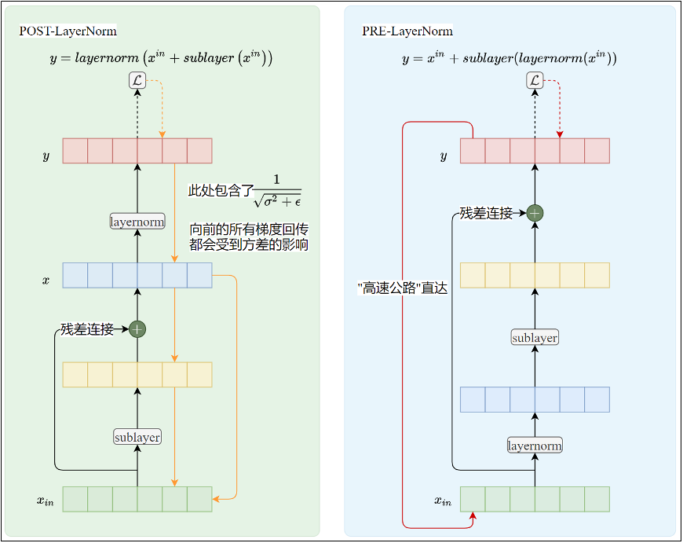
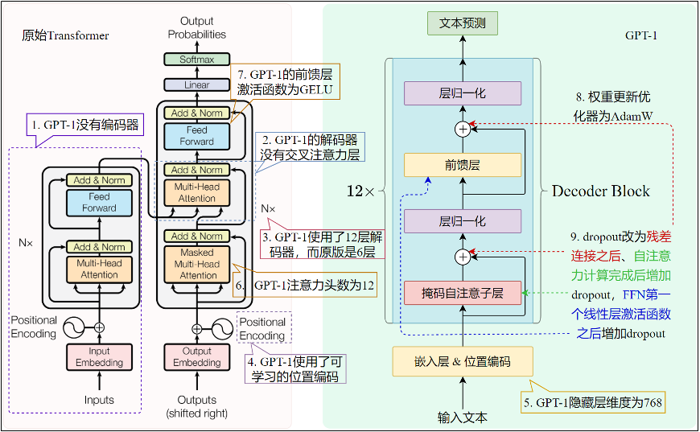
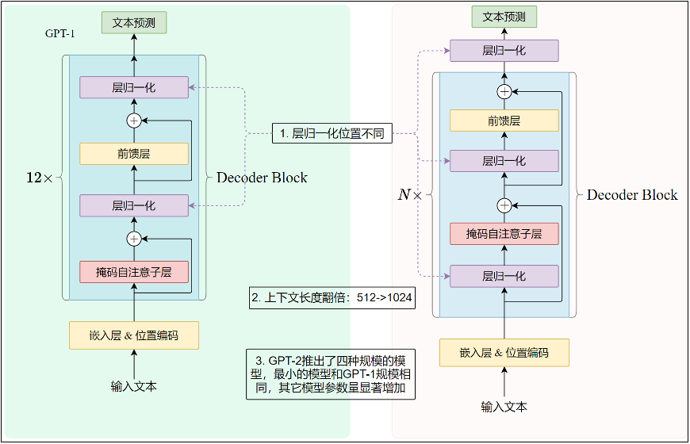

# 大模型简介


## 一、大模型介绍
1. 定义：大模型通常是指参数规模巨大、训练数据庞大、能力强大的深度神经网络模型（参数量一般大于1B）
2. 大模型的特点
   - 参数规模巨大：参数量可能达到十亿或者千亿
   - 训练数据庞大：训练时的数据量非常庞大
   - 能力强大：通用性强、泛化能力高
3. 大模型分类
   - 大语言模型：大语言模型（`Large Language Models`，`LLM`），是目前最广泛使用的大模型，专注于文本类信息处理
   - 多模态大模型：处理语音、图像、视频的大模型
   - 科学计算大模型：例如`AlphaFold`（蛋白质结构预测）、气候预测模型
4. 模型的“开源”
   - 传统的`OSI《开源定义》`和`OSAID-1.0`，都是理想化的严格标准，要求实现真正的透明与可复现
   - 当前所有主流“开源大模型”均未达标，主要因素可能是避免直接帮助竞争对手、避免版权问题等。
   - **目前大模型的开源都包含权重开源，可能还会包含模型设计代码、微调代码等，但不包含预训练代码、数据集和数据处理工作流**
5. 研究大模型常用的网站
   - 看论文
     - 原汁原味：https://arxiv.org/
     - 中文社区：https://modelscope.cn/papers
     - `dblp`：https://dblp.uni-trier.de/
   - 模型天梯网站
     - OpenRouter天梯：https://openrouter.ai/rankings
     - vellum天梯：https://www.vellum.ai/llm-leaderboard
     - SuperGLUE天梯：https://super.gluebenchmark.com/leaderboard
   - 模型版本迭代网站：https://www.datalearner.com/ai-models/

## 二、`GPT`系列模型回顾&简介
1. `GPT`系列的贡献
   1. `AdamW`算法（`GPT-1`）
      - 传统`Adam`算法：Adam（Adaptive Moment Estimation，自适应矩估计）融合了`Momentum`和`AdaGrad`的方法
        - 一阶求导：实现动量法`Momentum`，根据历史的“速度”来决定当前的速度，如果上一次的速度更大，这一次也容易保持
          $$
          v \leftarrow \alpha_1 v + (1-\alpha_1)\nabla
          $$
        - 二阶求导：实现自适应下降`AdaGrad`，根据历史的“加速度”来决定当前的加速度，如果上一次的速度变化很大，现在很容易也产生更大的速度变化
          $$
          h \leftarrow \alpha_2 h + (1-\alpha_2)\nabla^2
          $$
        - 计算最终的梯度：
          $$\hat{v} = \dfrac{v}{1-\alpha_1^t}$$
          $$\hat{h} = \dfrac{h}{1-\alpha_2^t}$$
          $$W \leftarrow W - \eta\,\dfrac{\hat{v}}{\sqrt{\hat{h}} + \epsilon}$$
        - 参数说明：
          - $\eta$：学习率
          - $\alpha_1$：一次动量系数，决定历史“速度”对本次的影响
          - $\alpha_2$：二次动量系数，决定历史“加速度”对本次的影响
          - $t$：迭代次数，从 1 开始
          - $\epsilon$：一个极小值，防止分母为零
      - 传统`Adam`算法存在的问题
        - 当传统`Adam`算法与`L2`正则化机制结合使用时，正则化机制会失效
        - 为什么会失效？
          - 统一符号：
            - 参数：$\theta$
            - 损失函数：$L(\theta)$
            - L2 正则项：$\displaystyle \frac{\lambda}{2}\|\theta\|^2$
            - 带 L2 的总损失：$\displaystyle \tilde{L}=L+\frac{\lambda}{2}\|\theta\|^2$
            - 梯度：$g_t=\nabla_\theta L(\theta_t)$
            - 学习率：$\alpha$
            - Adam 里的缩放项：$\displaystyle r_t = \frac{1}{\sqrt{\hat v}_t+\varepsilon}$
          - 标准 Adam + L2 的更新公式
            - 步骤1：加 L2 后的梯度
              $$\tilde g_t = g_t + \lambda \theta_t$$
            - 步骤2：代入 Adam 更新：Adam 的统一形式是：
              $$\theta_{t+1} = \theta_t - \alpha\cdot r_t\cdot \hat m_t$$
            - 步骤3：为抓住本质，简化为一步梯度行为（忽略动量，只看自适应缩放）：
              $$\theta_{t+1}=\theta_t - \alpha\,r_t\,\tilde g_t$$
            - 步骤4：将$\tilde g_t$ 代入，拆开并整理权重项：
              $$\theta_{t+1} = \theta_t - \alpha\,r_t\big(g_t + \lambda \theta_t\big)$$
              $$\theta_{t+1} = \theta_t - \alpha r_t g_t - \alpha r_t \lambda \theta_t$$
              $$\theta_{t+1} = \big(1 - \alpha\lambda r_t\big)\theta_t - \alpha r_t g_t \tag{1}$$
            - 真正的权重衰减是独立于梯度、直接乘衰减因子：
              $$\theta_{t+1} = \underbrace{(1 - \alpha\lambda)}_{\text{固定衰减}}\theta_t - \alpha r_t g_t \tag{2}$$
          - $(1)$和$(2)$的核心对比：
            - 真正权重衰减：衰减系数为 $1 - \alpha\lambda$（固定值，与参数无关）
            - Adam + L2 实际衰减：衰减系数为 $1 - \alpha\lambda r_t$（含Adam自适应缩放系数 $r_t$）
        - 关键事实
          - $$r_t = \frac{1}{\sqrt{\hat v_t}+\varepsilon},\quad \hat v_t \approx \mathbb E[g^2]$$
          - 权重越大 → 通常梯度越大 → $\hat v_t$ 越大
          - $\hat v_t$ 越大 → $r_t$ **越小**
          - 结论：**权重越大，$r_t$ 越小，L2 的衰减效果越弱**，完全违背L2“惩罚大权重”的初衷。
        - 为什么 SGD + L2 没问题？
          - 核心原因：SGD 无自适应缩放，$r_t=1$，因此：
            - SGD + L2：$$\theta_{t+1}=(1-\alpha\lambda)\theta_t-\alpha g_t$$
            - SGD + 权重衰减：$$\theta_{t+1}=(1-\alpha\lambda)\theta_t-\alpha g_t$$
            - 两者完全等价，因此`L2`正则化有效。
      - `AdamW`算法
        - 核心思想：绕过通过操作损失函数从而影响梯度来实现对参数进行限制的L2正则化方案，直接操作参数更新
        - 数学公式：
          $$\theta_t = \theta_{t-1} - \eta\left(\frac{\hat{m}_t}{\sqrt{\hat{v}_t}+\varepsilon} + \lambda\theta_{t-1}\right)$$
          即
          $$\theta_t = \theta_{t-1} - \eta\frac{\hat{m}_t}{\sqrt{\hat{v}_t}+\varepsilon} - \eta\lambda\theta_{t-1}$$
        - `AdamW`算法的梯度计算和`Adam`一样，不包含`L2`正则化项，`AdamW`算法本质上只是添加了$-\eta\lambda\theta_{t-1}$，等价于`Adam`算法与解耦权重衰减（$-\eta\lambda\theta_{t-1}$ 项）相结合。保留了正则化的数学本质，恢复了权重衰减的物理意义（参数收缩）
        - 在`AdamW`中，$\lambda$通常被称为权重衰减系数（Weight Decay Coefficient），而不是`L2`正则化强度系数。`AdamW`通常在实践中（训练基于`Transformer`架构的`LLM`时）比`Adam+L2`表现出更好的泛化性能，因此在`LLM`的训练中被广泛采用。
   2. `Pre-LayerNorm`和`Post-LayerNorm`（`GPT-2`）
      - `Post-LayerNorm`：层归一化后置，先进行层归一化，再进行残差链接（浅层模型效果更好）
        - 数学定义
          $$
          x = layernorm(x_{in} + sublayer(x_{in}))
          $$
        - 设计初衷：层归一化后置，保证传给下层的数据都是经过归一化的，保证数据传输到下一层时具有稳定的均值和方差
        - 潜在问题：数据的分布虽然得到了优化，但是残差链接的数据也因层归一化被改写（恰恰是`Pre-LayerNorm`的优点）
      - `Pre-LayerNorm`：层归一化前置，先进行残差链接，再层归一化（**现在深层大模型主流**）
        - 数学定义
          $$
          x = x_{in} + sublayer(layernorm(x_{in}))
          $$
        - 设计初衷：层归一化前置，能够保证残差链接这条数据传输（保证梯度存在的）高速公路稳定存在，可以有效避免模型多层数的梯度消失问题
        - 潜在问题：数据分布没有经过层归一化（恰恰是`Post-LayerNorm`的优点）
      - 然而，实践压倒性地证明，`Pre-LN`带来的训练稳定性和收敛速度的提升，远远超过了这个潜在的理论劣势。对于现代大型模型，训练可行性是第一位的
      - `Post-LayerNorm`与`Pre-LayerNorm`直观对比
      
        |     对比项     |  Post-LayerNorm (Post-LN)  |   Pre-LayerNorm (Pre-LN)    |
        |:-----------:|:--------------------------:|:---------------------------:|
        |    结构位置     |           残差连接之后           |           残差连接之前            |
        |    梯度稳定性    |       较差，深层易梯度爆炸/消失        |          极佳，梯度流稳定           |
        |    训练收敛     |          慢，需学习率预热          |        快，无需预热，支持大学习率        |
        |    深层适配     |       难训练（>12层易不稳定）        |        适合深层大模型（24层+）        |
        |    最终精度     |         略高（1%-2%）          |        略低（可被模型规模抵消）         |

        
   3. 稀疏自注意力机制（`GPT-3`）（稀疏注意力机制并非`GPT-3`原创）
      - 稠密自注意力机制：之前各种模型`Transformer`和`GPT`的注意力机制都是计算当前词元和其他所有词元之间的相关性，计算相关性的矩阵是“满”的，也就是**稠密注意力机制**
        - 明确复杂度计算的核心准则
          - 时间复杂度的计算，依赖于计算矩阵乘法的时间复杂度，矩阵乘法的时间复杂度需要关注输入两个相乘的矩阵的维度，$m * n$与$n * p$矩阵相乘的时间复杂度是$m * p$
          - 空间复杂度的计算，依赖于各个矩阵的维度，这点上不容易有歧义
        - 时间复杂度计算
          ```txt
          N：表示序列长度，seq_len
          d：表示模型的维度，d_model
          
          Q、K、V矩阵计算：3 * N * d * d = O(N * d * d)
          # 输入X维度：N * d、输出的Q、K、V矩阵的维度N * d
          # 因此映射矩阵W_q的形状必须是d * d
          # 计算矩阵乘法的计算复杂度是：N * d * d
          # 本质上Q、K、V矩阵的维度是 batch_size * seq_len * d_model，忽略batch_size就是seq_len * d_model
          # batch_size = 2：2句话，福如东海 + 寿比南山
          # seq_len = 4：4个字，福 + 如 + 东 + 海
          # d_model = 512：512维度数值表示一个token，福 = [0.1 ...... 0.22]
          
          注意力分数：N * N * d = O(N * N * d)
          # 因为注意力是要算每个token和其他token之间的相关性，必定是seq_len * seq_len，再加上每个向量内部使用d_model个数来表示
          
          因果掩码：N * N = O(N * N)
          
          Softmax作用于注意力分数矩阵，输出相关性系数P：N * N = O(N * N)
          
          计算加权求和，将相关性系数P乘以V，输出矩阵O：N * N * d = O(N * N * d)
          # 相关性系数P矩阵维度：N * N
          # V矩阵本身维度：N * d
          # 计算矩阵乘法：N * N * d
          
          输出投影，O经过线性层处理：O(N * d * d)
          # O矩阵形状：N * d
          # W_O：d * d，投影矩阵
          # 计算矩阵乘法：N * d * d
          
          总时间复杂度：O(N * N * d + N * d * d)
          # N>>d，N * N * d主导，序列长度敏感
          # N<<d，N * d * d主导，特征维度敏感
          ```
        - 空间复杂度计算
          ```txt
          参数存储：
          投影矩阵（计算Q、K、V、O矩阵的矩阵）W_q矩阵、W_k矩阵、W_v矩阵、W_o矩阵：d * d * 4
          Q、K、V矩阵：3 * N * d
          注意力分数矩阵：N * N
          softmax输出矩阵：N * N
          加权输出：N * d
          总时间复杂度：O(N * N + N * d + d * d)
          # N>>d，N * N主导，序列长度敏感
          # N<<d，d * d主导，特征维度敏感
          ```
        - 因此在稠密复杂度计算场景下，上下文长度较大时，计算注意力机制会成为算法瓶颈
      - 稀疏自注意力机制：`GPT-3`不再使用当前词元计算和其他所有词元之间的相关性，以此在能够保证训练效果的基础上适当降低训练成本
        - 设计思想：降低注意力关注的范围，正如`Transformer`论文展望的那样，计算“部分”注意力机制
        - 稀疏自注意力机制详解
          - 为什么会出现稀疏自注意力机制？因为`GPT-3`的模型参数量史无前例，当时的算力资源相对有限，必须要考虑适当优化
          - 数学描述：
          - 人话描述：
        - 时间复杂度计算
        - 空间复杂度计算
2. `GPT-1`模型结构与`Transformer`区别
   - 对比表格
   
     | 对比项           | 	Transformer	                             | GPT-1                                                           |
     |---------------|-------------------------------------------|-----------------------------------------------------------------|
     | 组件类型          | 	编码器 + 解码器	                               | 解码器                                                             |
     | 解码器层数	        | 6 层	                                      | 12 层                                                            |
     | 解码器内部架构	      | 掩码自注意力 + 交叉注意力 + 前馈层                      | 	掩码自注意力 + 前馈层                                                   |
     | 位置编码	         | 正余弦位置编码                                   | 	可学习的位置编码                                                       |
     | 隐藏层维度 d_model | 	512                                      | 	768                                                            |
     | 注意力头数         | 	8	                                       | 12                                                              |
     | 前馈层激活函数	      | RELU                                      | 	GELU                                                           |
     | 前馈层中间隐藏层维度    | 	4 倍 d_model                              | 	4 倍 d_model                                                    |
     | 嵌入层和输出线性层权重共享 | 	是（哈佛实现的 The Annotated Transformer 未共享权重） | 	是                                                              |
     | 优化器           | 	Adam	                                    | AdamW                                                           |
     | Dropout 正则化位置 | 	1. 嵌入和位置编码之后2. 每个子层输出之后，残差连接之前	          | 1. 嵌入和位置编码之后2. 残差连接之后3. FFN 第一个线性层激活函数之后4. 注意力计算完成后，和 V 做矩阵乘法之前 |
     | 层归一化	         | Post-LayerNorm                            | 	Post-LayerNorm                                                 |
   - 对比图
   
     
3. `GPT-2`模型结构与`GPT-1`区别
   - 核心变化：层归一化方式不同（为什么会出现这个变化？因为GPT-2的参数量和层数都超过之前的模型，在深层次迭代中发现还是`Pre-LayerNorm`更好用一些）
   - 其他变化
     - 参数量变化：模型的参数量得到了提升
     - 去除微调阶段，不进行微调直接上任务，第一代`zero-shot`（其含义是没有微调样本）
     - 数据处理变化：训练数据量提升
     - 词表构建变化：禁止非同类型的词语合并（例如`dog`不能和标点`!`再合并，解决了`GPT-1`中把`dog!`、`dog,`当成不同的词元来表示的问题）
   - 对比图
     
     
4. `GPT-3`模型结构与`GPT-2`区别
   - 核心变化：
      - 规模：模型维度175B，数据量非常大，前期数据处理工作非常大
      - 提示工程：可以没有样本（示例，`shot`）和训练数据，真正的`zero-shot`，通用人工智能的一个标杆
      - 稀疏自注意力机制：与稠密自注意力机制（每个`token`都会在允许的范围内关注其他所有的`token`）不同，在能够关注到的范围内“选择一部分”关注（优化了时间复杂度和空间复杂度）
        - 跳跃次数是固定的，但是步长是变化的，以此来实现在指定步数内关注全部内容
        - GPT3本质上是交叉的，一个稀疏一个稠密，来保证模型整体效果，因为单纯的稀疏模型效果不好，提高计算效率 + 减少资源占用，因为参数量级变更大了
5. `Instruct GPT`


## 三、`Llama`系列模型回顾&简介
1. `Llama`系列的贡献
2. `Llama-1`模型结构与`Transformer`区别
   - 只保留解码器部分
   - pre-Norm，归一化方案也改变了RMSNorm
   - SwiGLU激活函数，与GeLU共治天下，ReLU已经基本没人用了
   - RoPE位置编码
   - 训练优化：使用了大量的技术进行训练优化
     - FlashAttention
3. `Llama-2`模型结构与`Llama-1`区别
   - 分组查询注意力
4. 


参考资料：
1. 
