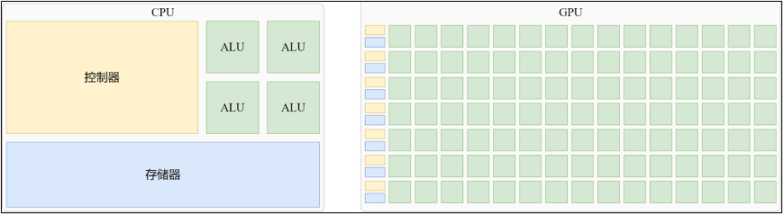
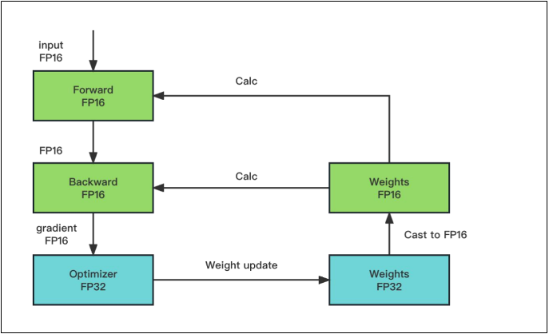
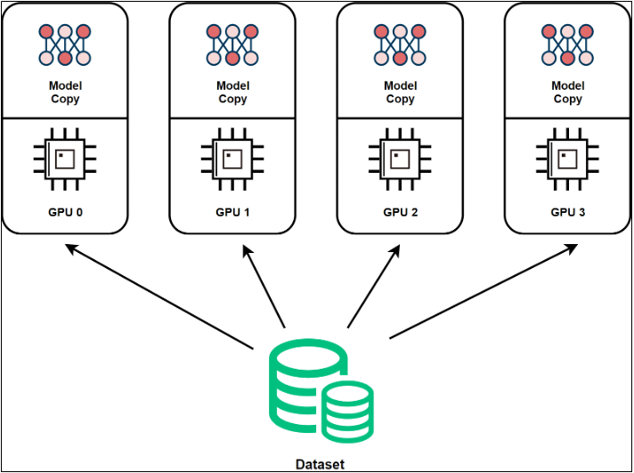
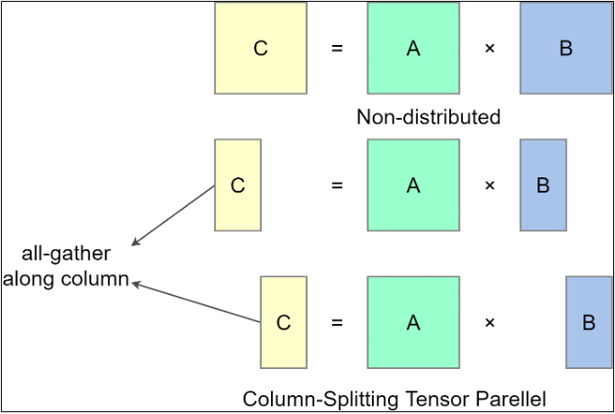
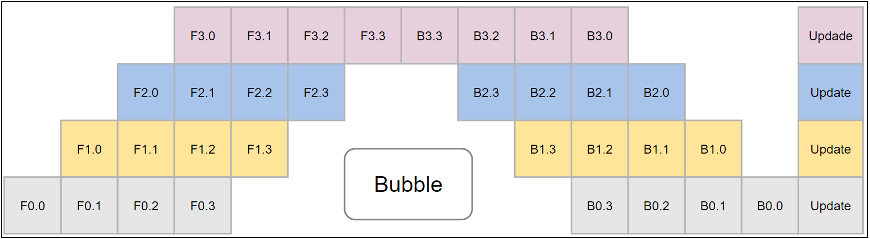
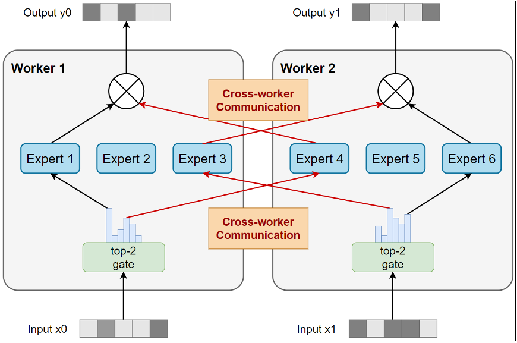
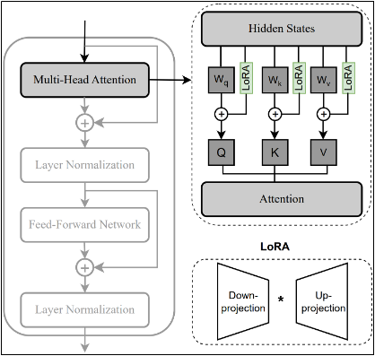
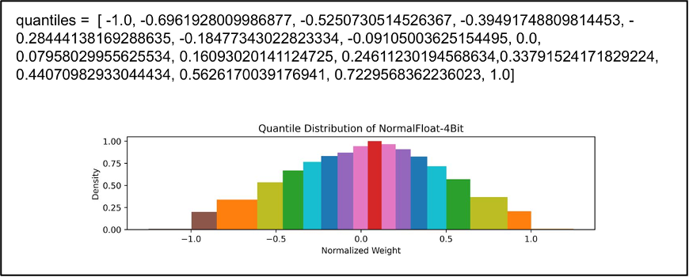
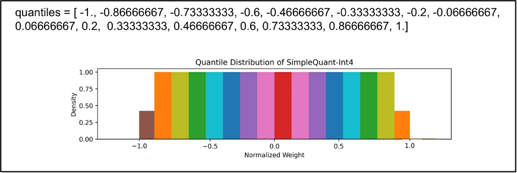

# 微调技术

## 一、硬件基础
1. 基础知识
   - `GPU`：`GPU`芯片，是真正完成图形渲染或各种计算任务的组件。最初特指用于图形渲染的处理器，随着`AI`的蓬勃发展，研究人员或开发者利用`GPU`的并行能力加速模型训练和推理，`GPU`厂商也积极变革，开发了专为高性能计算（`High Performance Computing`，`HPC`）场景而生的数据中心`GPU`或专用于`AI`计算的`NPU`。现在的`GPU`泛指所有可用于并行计算的处理器，包括`GPU`、`TPU`和`NPU`。
   - 显卡：`GPU`芯片和其他电子电路结合封装才能变成显卡。单独的`GPU`芯片是无法工作的，必须通过`PCB`（印刷电路板，电脑的主板也是一种`PCB`）板集成供电、散热等辅助模块。`GPU`芯片和`PCB`以及所有辅助模块构成的整体就是显卡，所以严格来说，`GPU`和显卡并不等同
     - 公版显卡：英伟达官方将`GPU`芯片封装后生产的显卡
     - 非公版显卡：一些其他厂商购买英伟达的`GPU`芯片，参考公版显卡的设计规范重新设计生产的显卡
2. `CPU`和`GPU`的对比
   - `CPU`：`CPU`擅长少量的复杂任务，但是也能够训练模型，只是效率太低了
   - `GPU`：`GPU`擅长执行大量相互独立的并行运算，在模型训练场景中能够更高效地完成任务
     
     
3. `CUDA`
   - `CUDA`（`Compute Unified Device Architecture`，统一计算设备架构）是一个软硬件协同设计的并行计算平台和编程模型，是软硬件的紧密集合与统一。允许开发者利用GPU进行通用计算
   - `CUDA`拥有类似`CPU`的多级缓存机制

## 二、微调技术
1. 概述
   - 微调定义：在预训练模型的基础上进行二次调参的行为
   - 微调分类
     - 低资源高效微调（`Parameter Efficient Fine-Tuning`，`PEFT`）：在使用预训练模型进行下游任务适配时，只更新或添加少量模型参数，同时保持大部分预训练参数不变的微调方法
     - 全参数微调：更新所有模型的参数权重，以`Qwen3-8B`模型为例，至少需要400G的显存，需要的训练成本非常高
   - 微调流程
     - 数据获取与模型选择：选择合适的模型并获取适量数据
     - 模型参数微调：使用数据训练模型
     - 大模型应用：`Agent`、`RAG`、对话等
   - 现阶段最难的是数据标注和模型选择，至于微调过程其实已经标准化
2. 模型获取阶段
   - 模型后缀与其代表的基本含义
     - `Instruct`版本：官方微调过的版本
     - `Base`版本：基础模型，只经过预训练
     - `chat`版本：训练的时候包含着用户的多轮对话，使用对话训练的
     - `4bit`or`8bit`版本：经过了量化的版本，压缩了参数的精度
     - `code`版本：针对代码能力专门开发的版本
     - `math`版本：针对数学领域专门开发的版本
   - 模型选择
     - 从魔搭社区、`huggingFace`上获取模型
     - 选择多大的模型？`8B`、`16B`、`32B`的模型一般企业都扛得住
3. 数据从哪里来？
   - 高质量开源数据集
     - github
       - BELLE：https://github.com/LianjiaTech/BELLE
       - https://github.com/OpenLMLab/MOSS
       - https://github.com/TigerResearch/TigerBot
       - https://github.com/hiyouga/ChatGLM-Efficient-Tuning
       - https://github.com/yanqiangmiffy/InstructGLM
     - huggingface
       - https://huggingface.co/datasets/BAAI/COIG-PC
       - https://huggingface.co/datasets/YeungNLP/firefly-train-1.1M
       - https://huggingface.co/datasets/YeungNLP/moss-003-sft-data
       - https://huggingface.co/datasets/YeungNLP/ultrachat
   - 大模型生成 + 人工辅助
     - 数据清洗阶段：针对原始数据集进行数据清洗，对空格、无效的数据进行去除，获取**训练的输入**
     - 大模型生成标准答案阶段：将需要完成的任务和数据集逐条发给大模型，由大模型生成答案，获取**训练的输出**
     - 人工辅助阶段：人工抽检或者使用人工逐条检查，校对大模型的生成是否准确
   - 全人工标注
4. 数据的质量非常重要，真实开发中需要做到以下几点
   - 去除重复数据
   - 去除不合规范数据（格式、内容）
   - 人工（至少是抽检）检查数据
   - 数据量不需要太大，几千到几万条一般已经足够了，数据量太多的全参数微调会降低模型的泛化能力
5. 混合精度训练
   - 定义：传统的大语言模型通常采用`FP32`作为权重的标准数据类型，以确保训练过程中的数值精度和稳定性，尤其是在处理细微的梯度更新和复杂优化算法时。然而，随着模型规模的日益增长，显存越来越成为训练的瓶颈。如果能将数据类型替换为`FP16/BF16`或位宽更小的数据类型，将能节约大量的资源
   - 精度分类
     - `FP32`：单精度浮点数，用8bit表示指数，23bit表示小数，1bit表示符号位；
     - `FP16`：半精度浮点数，用5bit表示指数，10bit表示小数，1bit表示符号位；
     - `BF32`：对FP32单精度浮点数截断数据，即用8bit表示指数，7bit表示小数，1bit表示符号位；
   - **使用低精度数值替代高精度数值训练存在的问题**
     - 上溢出：`FP16`表示的数值范围要比`FP32`更少，实际情况中比较少见
     - 下溢出（数值本身变成零了，因为无法表示）：`FP16`表示零值附近的精度会非常小，由于`梯度 + 学习率(也是一个很小的数)`的共同作用，真实的参数变化量一定会很小，`0.0...01`这种数值可能无法表示，这就造成了下溢出
     - 舍入误差（数值本身不是零，但是加上去没有效果）：`FP16`的精度不够高，最小可感知的变化程度比`FP32`少（例如普通格尺不可能达到游标卡尺的精度），精度不足就会带来舍入误差，使得权重无法更新
   - 混合精度训练
     - 出现原因：为了在节省资源的同时保证模型训练效果，百度研究院和英伟达联合提出了混合精度训练策略
     - 混合精度训练主要包含三种技术
       - <font color='yellow'>保留`FP32`格式的权重主副本：重要的地方使用`FP32`格式</font>
       - <font color='red'>通过损失缩放避免梯度值变为零：避免梯度变成零</font>
       - 将`FP16`算术累加至`FP32`格式：权重更新时都是`FP32`格式
     - <font color='yellow'>保留`FP32`格式的权重主副本：</font>
       - 问题重述：解决了舍入误差的问题（舍入误差：变化太小，对一个普通尺子量出来的刻度减少`0.1mm`是没有意义的，因为普通尺子根本感知不到`0.01mm`的变化）
       - 解决方案：既然普通尺子不认识，那就使用高精度尺子来实现，也就是说，参数本身的精度是`FP32`，但是使用`FP16`进行反向传播
       - <font color='yellow'>核心：用`FP32`精度来进行参数更新，使用`FP16`进行反向传播计算</font>
     - <font color='red'>损失缩放：</font>
       - 问题重述：解决了下溢出的问题（数值太小，计数法已经无法表示，导致数值变成零）
       - 解决方案：使用`FP16`传递时，进行放大；计算参数更新时，再缩小为原来的值，这时候的计算使用`FP32`格式
       - <font color='red'>核心：乘以一个系数使得`FP16`可以正常表示，计算参数的时候再重新缩小回原来的值，并用`FP32`格式表示</font>
6. 微调模型所需要的资源
   ```text
   微调模型：模型权重 + 梯度保留 + 优化器状态 + 隐藏层的激活值
   ```
   | 微调训练方式                 | 模型本身所需显存  | 梯度所需显存   | Adam 优化器状态  | 激活值   | 其他  | 总计     |
   |------------------------|-----------|----------|-------------|-------|-----|--------|
   | 全参数微调                  | 14GB      | 14GB     | 56GB        | 1.4GB | 2GB | 87.4GB |
   | LoRA（低秩适配器）            | 14GB      | 0.14GB   | 0.56GB      | 1.4GB | 2GB | 18.1GB |
   | QLoRA（8-bit 量化 + LoRA） | 7GB       | 0.14GB   | 0.56GB      | 1.4GB | 2GB | 11.1GB |
   | QLoRA（4-bit 量化 + LoRA） | 3.5GB     | 0.14GB   | 0.56GB      | 1.4GB | 2GB | 7.6GB  |
   - 模型规模计算
     - 确定参数格式：`FP16`等价于2个字节，`FP32`等价于4个字节
     - 确定模型大小：6B = 60亿，175B = 1750亿
     - 计算需要存储空间大小：60 * 2B = 11.18GB，1750 * 2B = 325.96GB
     - 要求显存和存储空间最小11.18GB、325.96GB，用于加载参数和存储参数
   - 权重显存计算（例如，$x * W_q = Q$中的$W_q$，就是一种权重），也就是模型训练学习的值
     - 以混合精度计算为例，假设权重参数量为$x$，不计算隐藏层共计$16x$
       - `FP32`表示的权重主副本：$4 * x$
       - `FP32`优化器，需要计算参数的一阶矩和二阶矩，$2 * 4 * x$
       - `FP16`权重副本，$2 * x$
       - `FP16`梯度，$2 * x$
     - 全部使用`FP32`为例，假设权重参数量为$x$，不计算隐藏层共计$16x$
       - `FP32`表示的权重：$4 * x$
       - `FP32`梯度，$4 * x$
       - `FP32`优化器，$2 * 4 * x$
     - **那使用混合精度训练的意义是什么？**
       - 加速训练：计算位数变小，速度必然变快；带宽占用也变小
       - 节约显存：隐藏层的元素数量远远大于权重数量，隐藏层的参数使用`FP16`会节约大量显存
     
       
   - 隐藏层显存计算（例如，$x * W_q = Q$中的$Q$，就是隐藏层的值），也就是中间计算结果
     - 中间计算结果的存储实际上占了大头，因为其与训练时的`batch_size`和`seq_len`有关，无法准确估算
     - 单层解码器汇总：
       $$
       24 \times \text{batch_size} \times \text{seq_len} \times \text{d_model} + \text{batch_size} \times \text{seq_len} \times \text{seq_len}
       $$
     - Qwen3-0.6B模型的解码器一共有28层，计算过程中的总隐藏层元素数量为：
       $$
       \begin{aligned}
       & 2 \times \text{batch_size} \times \text{seq_len} \times \text{d_model} + \text{batch_size} \times \text{seq_len} \times \text{d_vocab} \\
       & + 28 \times \left( 24 \times \text{batch_size} \times \text{seq_len} \times \text{d_model} + \text{batch_size} \times \text{seq_len} \times \text{seq_len} \right)
       \end{aligned}
       $$
     - 隐藏层的计算量和显存占用量，远远超过模型的权重本身，计算也最为复杂。对于`Transformer`架构的模型，激活值的显存与序列长度、隐藏层维度、层数、`batch size`都成正比。序列越长、`batch size`越大、模型越深，激活值占用的显存就越多。以`LLaMA-7B`为例，它有32层，隐藏维度是4096。如果你处理长度为2048的序列，`batch size`为1，那么激活值的显存大约在10GB左右。如果你将`batch size`增大到8，激活值显存会相应增加到大约`80GB`。
     - 调整`batch_size`对模型训练更新参数没有影响（除了训练速度），降低`batch_size`可以大幅节省隐藏层的显存占用，缩小`seq_len`通常不是一个好的选择
   - 总显存消耗包括：模型权重 + 梯度 + 优化器状态 + 激活值
7. 部署模型所需要的资源
   ```text
   部署模型：（模型权重 + KV cache） * 1.1
   ```
   - 对具有不同精度的不同模型，进行不同操作，会占用不同的显存
     - 不同精度：`FP32`、`FP16`等多精度
     - 不同模型：混合专家模型在推理时激活的参数量很少，与标准模型不同
     - 不同操作：部署、微调（全参数微调、`QLoRA`微调、`LoRA`微调）
   - 部署案例，以`Llama 70B - FP16`为例，支持10并发就需要 $(140 + 800) * 1.1 = 1034GB$
     - 模型权重：70亿 * 2B = 140GB
     - `KV cache`
       - 什么是`KV cache`：大模型生成文本是一个`token`一个`token`蹦出来的。为了加快速度，系统会把每个`token`计算过程中产生的`Key`和`Value`缓存起来，这样生成下一个`token`时就不用重复计算了。
       - `单token KV Cache = 模型层数 × Hidden维度 × 每个值字节数 × 2（Key + Value）`，`总KV Cache = 单token KV Cache × 上下文长度 × 并发用户数`
       - `Llama` 70B，80层 + 上下文长度32k + 10并发，`80 × 8196 × 2 bytes × 2 = 约2.5 MB`，`总KV Cache：2.5 MB × 32,000 × 10 = 800 GB`
     - 损耗空间：激活值、缓冲区、碎片，这些项通常按照 `模型权重 + KV cache` 总和的 `10% - 15%` 计算
     - 总值：`模型权重 + KV cache` 总和的 `110% - 115%` 计算
     - 优化策略
       - 量化：给模型"瘦身"
         - `INT8`量化：模型权重减半（140GB → 70GB）
         - `INT4`量化：模型权重再减半（140GB → 35GB）
         - `GPTQ/AWQ`：保持精度的同时大幅压缩
       - `KV Cache`优化
         - `PagedAttention`：类似操作系统的虚拟内存，减少碎片
         - `MQA/GQA`：减少`KV Cache`的大小（如`Llama 2`使用`GQA`）
         - 上下文压缩：压缩历史对话，保留关键信息
       - 模型切分
         - 张量并行：模型层切分到多个GPU
         - 流水线并行：不同层放到不同GPU
         - 混合并行：结合上述两种方法

## 三、并行训练技术
1. 理论方法（只是理论上的并行策略）
   - 数据并行（`Data Parallelism`，`DP`）
     - 定义：最常见的并行形式，因其实现相对简单。在数据并行训练中，数据集被划分为多个分片，每个分片分配给一个设备（通常是GPU）。这相当于沿批次（Batch）维度对训练过程进行并行化。每个设备持有完整的模型副本，并在其分配的数据分片上独立进行训练。在反向传播之后，所有设备的模型梯度会被聚合（通常通过`AllReduce`操作），以确保不同设备上的模型参数保持同步
     - 特点：每个显卡上都有一份完整的模型权重副本，只有数据是并行的，是一种真正的并行策略
     
       
   - 模型并行
     - 张量并行（`Tensor Parallelism`, `TP`）
       - 定义：在一个操作内部进行并行计算。
       - 特点：相当于从纵向切分模型，将模型的不同部分分别运行在不同的显卡上分别进行参数更新和计算
       
         
     - 流水线并行（`Pipeline Parallelism`, `PP`）
       - 定义：在模型的不同层之间进行并行计算。
       - 特点：相当于横向切分模型，将模型的不同层之间的运行分开，类似CPU的流水线并行；缺点也很明显，因为要进行前向传播和反向传播，会导致计算流程中出现空洞，不能完全利用显卡的效率
       
         
   - 多混合并行
     - 定义：数据并行、张量并行、流水线并行多种技术结合进行分布式训练
     - 特点：综合了多种方案的优点和缺点
   - 异构系统并行
     - 定义：使用CPU进行训练，在GPU不活跃处理某些张量时，将其卸载到CPU内存或NVMe磁盘存储
     - 特点：有可能在单台机器上容纳并训练巨大的模型
   - MOE并行
     - 定义：研究者提出了基于稀疏 `MoE` (`Mixture of Experts`) 层的模型架构。其核心思想是将大模型拆分成多个较小的子模型（称为“专家”, `experts`），并在每轮迭代中，根据输入样本动态激活（`activate`）一部分专家进行计算，从而节省计算资源。模型通过可训练的“门控”（gate）机制决定样本应路由到哪些专家，该机制确保计算的稀疏性
     - 特点：采用MoE结构，可以在计算成本仅呈次线性增长的同时训练超大规模模型，为固定计算资源预算带来显著增益
       
       
2. `Deepspeed`框架实现（使用的是张量并行策略）
   - `Deepspeed`框架简介：一个用于并行训练的优秀框架，能够在不改变代码的条件下实现模型的并行化处理
   - `ZeRO`（`Zero Redundancy Optimizer`）零冗余优化器：消除了数据和模型并行训练中的内存冗余，同时保留了低通信量和高计算粒度，使我们能够根据设备数量按比例缩放模型大小，并保持持续的高效率，它包含三种模式
     - `ZeRO-1`：只对优化器存储进行切分，没有带来额外通信
     - `ZeRO-2`：除了对优化器存储进行切分，还对梯度存储数据进行切分，没有带来额外通信
     - `ZeRO-3`：除了对优化器存储进行切分，还对梯度和参数存储数据进行切分，带来了额外通信，速度必然是最慢的，因为拆的太细节了，要有较大的聚合和通信成本

## 四、参数高效微调技术（`PEFT`）
1. 定义：PEFT（`Parameter Efficient Fine-Tuning`，参数高效微调）是指一类用于微调大型预训练语言模型（`Pretrained Language Models`，`PLMs`）的技术，通常仅更新或引入少量参数（通常占总参数的1%-10%），同时保持预训练模型的主体参数冻结（不变）。目标是以远少于全参数微调的资源开销，获得接近、甚至等同或超过后者的性能
2. 根据[7]的综述论文，目前参数高效微调技术主要分为五类
   - 附加式参数微调：引入额外的可训练参数，原先模型的所有参数全部冻结
   - 部分微调：筛选预训练模型参数中对下游任务至关重要的子集，冻结其余（认为不重要）的权重，从而减少微调的参数量
   - 重参数化微调：通过数学变换或结构转换，将模型的参数表示转换为另一种功能等价但参数量大大减少的形式，冻结模型权重，仅微调参数量更少的等价形式
   - 混合微调：综合使用上述方案来实现微调
   - 统一微调：提出了一个用于微调的整合框架，将多种微调方法整合为统一架构（同一套接口规范，如统一的预处理格式、导出格式和训练方法）
3. <font color='yellow'>**LoRA技术**</font>
   - 背景：研究表明，经过训练（或微调）的过参数化（权重规模远大于训练数据规模）模型，其有效参数空间（即真正影响模型性能的关键变化）实际上位于一个低维子空间（低内在维度，即低秩）中
   - 核心思想：换句话说，参数的模型太多了，训练数据不够，因此模型本质上没有包含像它参数量那样巨大的信息量，使用更小参数量的矩阵
   - 方案
     - 用$W_0$表示预训练模型中的权重矩阵，全参数微调后获得的权重矩阵$W$可表示为：
       $$
       W = W_0 + \Delta W
       $$
     - `LoRA`微调利用了$\Delta W$的低秩特性，将其表示为两个低秩矩阵的乘积：
       $$
       \Delta W = BA,\quad \Delta W\in\mathbb{R}^{d\times k},\ B\in\mathbb{R}^{d\times r},\ A\in\mathbb{R}^{r\times k}
       $$
     - 其中$d$和$k$分别为输出和输入特征维度。$r$是`LoRA`微调的秩，通常$r \ll \min(d,k)$
       $$
       W_0 + \Delta W = W_0 + BA
       $$
     - 训练过程中只更新$A$和$B$，冻结其它权重。需要更新的参数量只有$d \times r + r \times k$
     - 实际实现的时候，代码实现引入了一个额外的参数$s$，成为缩放系数，决定低秩矩阵对激活值的影响程度，
       - 修正后的表示为：
         $$
         W_0+\Delta W=W_0+s\cdot BA
         $$
       - 其中缩放系数：
         $$s=\frac{\alpha}{r}$$
       - $\alpha$：用户可配置的超参数（通常记为 `lora_alpha`），用于控制低秩更新的强度。
       - $r$：LoRA 的秩（rank）。
   - 优缺点
     - 优点
       - 大幅度降低所需要训练的参数量
       - 可以通过部署一套预训练权重替换`LoRA`权重的方案来实现任务切换
     - 缺点
       - 如果将$AB$矩阵的更新融合到$W$参数矩阵中，推理会更快（因为不需要等待LoRA额外附加模块的计算），但是不支持多任务
       - 如果不融合，推理会慢点，但是可以支持多任务
   - 图示
   
     
4. <font color='red'>**QLoRA技术**</font>（优化版本，核心思想还是`LoRA`的低秩分解）
   - 背景：在`LoRA`基础之上进行改进的优化版本
   - 核心思想主要有三个
     - 4位标准浮点数量化
     - 双重量化：第二次量化作用在第一次量化产生的量化常数上，可以进一步节约显存占用
     - 分页优化：CPU内存代替GPU显存保存部分梯度参数
   - 4位标准浮点数量化
     - 核心思想：类似分槽操作；
       - 将一批数据统一除以当前批次的最大绝对值，将数据全部映射到[-1, 1]之间
       - 将[-1, 1]区间通过某种映射分为16等份，然后将原来的值进行映射，最后需要的时候再重新映射回去
       - 分为16等份的过程中颇有讲究，有的是平均分，有的是按照正态分布的概率分布，保证每个区间内落入的概率等同，不同的划分方案有不同的实际效果
     - 计算公式：
       $$
       q_i = \frac{1}{2} \times \left( Q \times \left( \frac{i}{2^k + i} \right) + Q \times \left( \frac{i+1}{2^k + i} \right) \right)
       $$
     - 分位数生成规则
       - 将区间`[-1, 0]`分成7份，生成`[-1, ..., 0]`共8个分位数；
       - 将区间`[0, 1]`分成8份，生成`[0, ..., 1]`共9个分位数；
       - 合并上述两部分分位数，去掉重复的0，最终得到全部16个分位数。
     - 图示
     
       
       
   - 双重量化
     - 如果64个参数共享一个量化参数，那么相当于每一个参数的量化额外开销为$32bit/64 = 0.5$
     - 如果对量化常数进一步量化，每256个量化常数再进行一次FP8量化，得到的开销就是$8/64 + 32/(64 * 256) = 0.127 bit$
   - 分页优化器：在GPU偶尔内存不足的情况下，自动在CPU和GPU之间进行页面到页面的传输，以避免GPU OOM。

    

------
参考资料：
1. prompts：https://github.com/langgptai/wonderful-prompts
2. 混合精度训练论文网址：https://arxiv.org/pdf/1710.03740
3. 评估模型需要的显存：https://blog.csdn.net/Listennnn/article/details/149315631
4. 部署模型需要的显存计算：https://developer.aliyun.com/article/1707866
5. 微调模型需要的显存计算：https://developer.aliyun.com/article/1711383
6. 阿里云模型显存简易估算器：https://help.aliyun.com/zh/pai/getting-started/estimation-of-the-required-video-memory-for-the-model#7a013a3d617zj
7. 参数高效微调技术综述论文：https://arxiv.org/pdf/2312.12148

