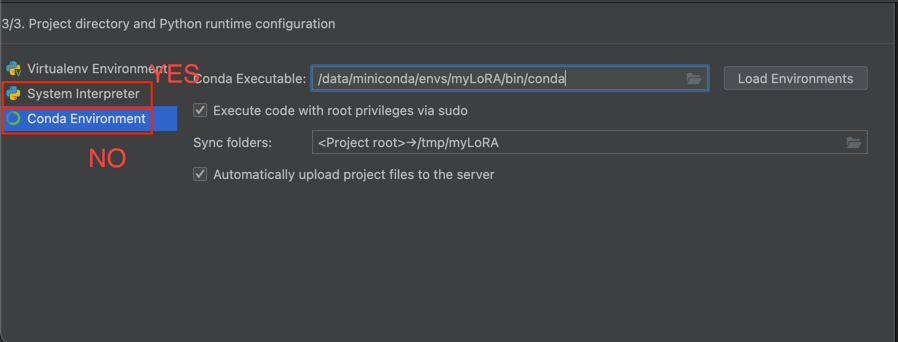

# 微调实战记录

## 一、LoRA微调环境配置
1. 算力租用
   - autodl：https://www.autodl.com/
   - 趣算云：https://www.funhpc.com/
   - 智星云：https://www.ai-galaxy.cn/
   - 恒源云：https://gpushare.com/auth/reset
2. 基础环境配置命令
   ```bash
   # 初始化环境
   conda init
   # 更新环境变量
   source ~/.bashrc
   # 实时观察显卡状态
   watch -n -1 nvidia-smi
   # 创建环境
   conda create -n myLoRA python=3.11
   ```
3. 本地编译器pycharm配置远程python环境
   - 报错：`lateinit property envs_dirs has not been initialized`，是pycharm环境配置问题，应该选择`System Interpreter`，找到conda中的envs，选择自己创建的环境中bin的python
   
     
   - 之后远程服务器会同步环境到本地，本地也会将项目文件缓存在云端
4. 安装modelscope，要考虑环境隔离，因为modelscope经常容易与其它环境报错，这里新创建一个环境的意义就是下载模型到指定目录并隔离环境
   ```bash
   # 新创建一个modelscope环境，用于下载模型到本地
   conda create -n modelscope python=3.11
   # 切换环境
   conda activate modelscope
   # 安装modelscope
   pip install modelscope
   # 使用清华源下载
   pip install modelscope -i https://pypi.tuna.tsinghua.edu.cn/simple
   # 查看当前conda所有环境
   conda info --envs
   ```
5. 下载模型的脚本并运行
   ```python
   # 模型下载
   # model_download.py
   from modelscope import snapshot_download
   model_dir = snapshot_download('unsloth/Qwen3-0.6B-Base-unsloth-bnb-4bit', cache_dir='/data/pythonProject/myLoRA/pretrained')
   ```
   ```bash
   # 终端执行 
   python model_download.py
   ```
6. 除了创建隔离环境和创建python环境，不推荐使用conda命令来安装相关包，主要是由于conda会自动更新相关依赖，实际开发中使用pip安装包会更频繁


参考资料
1. 查看pytorch、conda、cuda对应版本：https://pytorch.org/get-started/previous-versions/
2. 