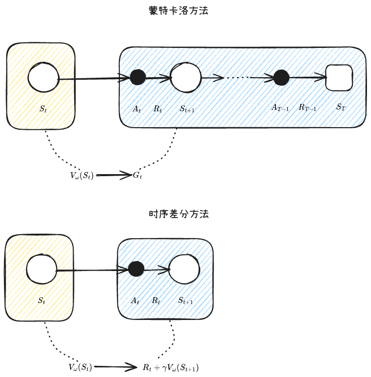

# 强化学习算法

## 一、强化学习算法简介

## 二、`Q-learning`与`DQN`算法

## 三、原始策略梯度法
1. 策略梯度法`policy gradient method`：通过神经网络等方法将策略模型化，并使用梯度来优化策略的方法叫作**策略梯度法**
2. 策略梯度法分析
   - 策略梯度法的合理性——**对策略函数应用梯度下降法**
     - 既然策略函数是一个根据当前状态来选择动作的概率函数，那么就可以使用神经网络进行拟合
     - 神经网络的参数可以使用梯度下降法进行参数更新，从而实现拟合效果的优化
   - 策略梯度法的难题——怎样实际应用？
     - 梯度下降法更新参数的前提是进行反向传播，也就是要有`loss`去计算反向传播来计算梯度，但是现在没有训练数据用于计算`loss`，怎么办呢？
3. 为策略梯度法提供训练数据
   - 我们需要通过不断地与环境交互创造训练数据，并根据最终的奖励来计算`loss`
   - 与深度学习的训练不同，强化学习的训练过程有两个主要特点
     - 奖励是延迟的，必须要完整地走完一次探索，才能最终产生`loss`并更新参数
     - 探索环境的方式，决定了训练数据的质量，间接影响了模型最终的效果
4. 蒙特卡洛采样：依靠随机采样、大数定律，用大量随机样本的均值/统计量，去近似求解难以直接计算的积分、期望、概率、复杂函数的数值方法。
   - 核心思想：算不出来解析解 -- 大量随机抽样 -- 用样本平均代替理论期望
   - 核心定理
     - 大数定理：样本量越大，样本均值越逼近数学期望
     - 随机采样代替积分：很多高维积分无法列出算式求解，蒙特卡洛做法是采集$N$个样本，求和后取平均来模拟期望
   - 优点与缺点
     - 优点
       - 不依赖解析表达式，对原函数可导、可积没有任何要求
       - 对高维天生适配
       - 逻辑简单，抽样--计算--平均，通用性极强。
     - 缺点
       - 收敛慢，误差为$O(\frac{1}{\sqrt{N}})$，需要的样本量很大
       - 结果是随机近似解（不够精确），存在采样方差
       - 稀疏区域采样效率低
   - 经典蒙特卡洛算法案例：求$\pi$的大小，在正方形内随机大量撒点，统计落在圆内点的数量，用`圆内点数/总点数`来近似面积比例
   - 与强化学习的联系
     - 强化学习因为没有合适的训练数据，必须通过**与环境交互**来**构造数据供自己学习**
     - 蒙特卡洛算法使用随机探索到的路径作为真实情况的无偏估计，并根据这条抽样轨迹来进行自我训练和学习
5. 策略梯度法的数学基础
   - 基本定义
     - 轨迹：回合制任务基于策略$\pi_{\theta}$选择动作的情况。在这种情况下，假定得到了以下由“状态、动作、奖励”构成的时间序列数据。
       $$
       \tau = (S_0, A_0, R_0, S_1, A_1, R_1, \cdots, S_{T+1})
       $$
       轨迹发生的概率为：
       $$
       \begin{aligned}
       \Pr(\tau)
       &=p\left(S_{0}\right) \pi_{\theta}\left(A_{0} | S_{0}\right) p\left(S_{1} | S_{0}, A_{0}\right) \pi_{\theta}\left(A_{1} | S_{1}\right) p\left(S_{2} | S_{1}, A_{1}\right) \cdots \pi_{\theta}\left(A_{T} | S_{T}\right) p\left(S_{T+1} | S_{T}, A_{T}\right) \\
       &=p\left(S_{0}\right) \prod_{t=1}^{T} \pi_{\theta}\left(A_{t} | S_{t}\right) p\left(S_{t+1} | S_{t}, A_{t}\right)
       \end{aligned}
       $$
     - 给定特定轨迹$\tau$和折扣因子$\gamma$，回报的定义如下
       $$
       G(\tau) = R_0 + \gamma R_1 + \gamma^2 R_2 + \cdots + \gamma^T R_T
       $$
     - 目标函数是$J(\theta)$，优化目标是在策略函数的作用下，产生高回报，但是注意待优化的是策略函数，也就是神经网络的参数$\theta$，而不是在当前给定的策略下找到最优路径
       $$
       J(\theta) = \mathbb{E}_{\tau\sim\pi_{\theta}}[G(\tau)]
       $$
       - $\theta$：神经网络的参数
       - $\mathbb{E}$：期望
       - ${\tau\sim\pi_{\theta}}$：表示轨迹是由策略产生的
       - $G(\tau)$：轨迹的回报，注意是**轨迹级别**
   - 给定目标函数$J(\theta)$，当前目标是优化目标函数最大，因此可以采用梯度上升法来实现
     - 对目标函数求导
       $$
       \begin{split}
       \nabla_{\theta}J(\theta) &= \nabla_{\theta}\mathbb{E}_{\tau\sim\pi_{\theta}}[G(\tau)] \\
       &= \mathbb{E}_{\tau\sim\pi_{\theta}}[\sum_{t=0}^TG(\tau)\nabla_{\theta}\log\pi_{\theta}(A_t|S_t)]
       \end{split}
       $$
     - 由于完整的期望无法计算，使用蒙特卡洛算法进行数据抽样，来实现对真实情况的估计，换句话说就是使用自己探索出来的数据来模拟现实世界
       $$
       \begin{split}
       & \text{采样}: \tau\sim\pi_{\theta} \\
       & \nabla_{\theta}J(\theta) \approx \sum_{t=0}^TG(\tau)\nabla_{\theta}\log\pi_{\theta}(A_t|S_t) \\
       \end{split}
       $$
     - 更新参数
       $$
       \theta \leftarrow \theta + \alpha\nabla_{\theta}J(\theta)
       $$
   - 因此原始的策略梯度法，就是使用$\mathbb{E}_{\tau\sim\pi_{\theta}}[\sum_{t=0}^TG(\tau)\nabla_{\theta}\log\pi_{\theta}(A_t|S_t)]$作为计算`Loss`的函数，来实现梯度下降和参数更新
   - 简单证明
     $$
     \begin{split}
     \nabla_\theta{J(\theta)} &= \nabla_\theta\mathbb{E}_{\tau\sim\pi_\theta}\left\lbrack{G(\tau)}\right\rbrack \\
     &= \nabla_\theta\sum_\tau{\Pr(\tau|\theta)G(\tau)} \quad\text{（展开期望值）} \\
     &= \sum_\tau\nabla_\theta(\Pr(\tau|\theta)G(\tau)) \quad\text{（将}\nabla_\theta\text{移动到}\sum\text{中）} \\
     &= \sum_\tau\left\lbrace{G(\tau)\nabla_\theta\Pr(\tau|\theta)+\Pr(\tau|\theta)\nabla_\theta{G(\tau)}}\right\rbrace \quad\text{（积的微分）} \\
     &= \sum_\tau{G(\tau)\nabla_\theta\Pr(\tau|\theta)} \quad\text{（}\nabla_\theta{G(\tau)}\text{永远为0）} \\
     &= \sum_\tau G(\tau)\Pr(\tau|\theta)\frac{\nabla_\theta\Pr(\tau|\theta)}{\Pr(\tau|\theta)} \quad\text{（乘以}{\frac{\Pr(\tau|\theta)}{\Pr(\tau|\theta)}}\text{）} \\
     &= \sum_\tau G(\tau)\Pr(\tau|\theta)\nabla_\theta\log\Pr(\tau|\theta) \quad\text{（}\log\text{梯度的技巧）} \\
     &= \mathbb{E}_{\tau\sim\pi_\theta}\left\lbrack{G(\tau)\nabla_\theta\log\Pr(\tau|\theta)}\right\rbrack
     \end{split}\tag{1}
     $$
   - 其中，$log$梯度技巧主要是
     $$
     \color{yellow}\log(f(x))'=\frac{f'(x)}{f(x)}
     $$
6. 策略崩溃
   - 策略梯度法的本质是，我们使用**当前策略**$\pi_\theta$采样一条轨迹$\tau$，如果采样的轨迹的回报$G(\tau)$很高，那么说明我们在某个状态$S_t$采取的动作$A_t$比较好，导致了总的奖励也就是回报比较高。那么通过梯度上升法，更新$\theta$之后，新的策略$\pi_{\theta_\text{new}}$会提升**在$S_t$时执行$A_t$的概率**。
   - 例如$A_t$是 “向左推车” ，那么在$S_t$状态下策略采取 “向左推车” 的概率就会提升，而同时策略采取 “向右推车” 的概率就会下降。
   - 而如果我们采样的轨迹获得的回报很小，那么计算出来的梯度$\nabla_\theta J(\theta)$可能也比较小，那么在$S_t$采取$A_t$的概率就会提升不大。
   - 策略崩溃：由于只采样一条轨迹，那么这条轨迹可能回报非常差，或者回报非常好，好得不得了。总之使得$\alpha\nabla_\theta{J(\theta)}$非常的大，导致步子太大，把策略给训崩了。
   - 一个形象的案例就是，一个人买彩票的第一次就中了1000w，那么之后这个人可能就一直会买彩票，他的“策略”因小概率事件被改写了
7. 代码实现见(`LLM/ReinforcementLearning/code&data/chap02/PolicyGradient`)

## 四、`REINFORCE`算法
1. `REINFORCE`算法：是对策略梯度法的一种改进算法，主要是将上述的策略梯度法进行了一些变化
2. `REINFORCE`算法的数学基础
   - 梯度策略法是基于下面的公式实现的（注意是策略梯度法）
     $$
     \begin{split}
     \nabla_{\theta}J(\theta) &= \nabla_{\theta}E_{\tau\sim\pi_{\theta}}[G(\tau)] \\
     &= E_{\tau\sim\pi_{\theta}}[\sum_{t=0}^TG(\tau)\nabla_{\theta}\log\pi_{\theta}(A_t|S_t)]
     \end{split}
     $$
   - 式子中的$G(\tau)$是目前为止获得的所有奖励的总和（准确地说是“带折扣因子”的奖励的总和）。这里要思考的问题是，无论在哪个时刻$t$，式子中都是$G(\tau)\nabla_{\theta}\log\pi_{\theta}(A_t|S_t)$，我们始终会使用固定不变的权重$G(\tau)$来增加（或减少）采取行动$A_t$的概率
   - 智能体行动的好坏是根据行动之后获得的奖励总和来评估的（回顾一下价值函数的定义）。反过来说，采取某个行动之前获得的奖励与该行动的好坏无关。如果要评估在某个时刻$t$采取的行动$A_t$，那么在此之前做了什么以及获得了多少奖励都无所谓。我们是根据采取行动$A_t$之后的结果（在时刻$t$以后获得的奖励的总和）来判断行动$A_t$的好坏的
   - 因此`REINFORCE`算法将梯度策略法中固定的$G(\tau)$更改为$G_t$，$G_t$是在时刻$t\sim T$获得的奖励的总和
     $$
     \nabla_{\theta}J(\theta)=E_{\tau\sim\pi_{\theta}}[\sum_{t=0}^TG_t\nabla_{\pi}\log\pi_{\theta}(A_t|S_t)] \\
     G_t = R_t + \gamma R_{t+1} + \cdots + \gamma^{T-1}R_T
     $$
3. 代码实现见(`LLM/ReinforcementLearning/code&data/chap02/Reinforce`)

## 五、带`Baseline`的`REINFORCE`算法
1. 带`Baseline`的`REINFORCE`算法：是对`REINFORCE`算法的一种优化，引入的思想其实是如果策略函数表现的不好，要通过使用`Baseline`的手段来实现惩罚
   - 【引入惩罚】传统的`REINFORCE`算法中，$G_t$永远大于零，因此不论探索出了什么轨迹，模型都会强化这种选择，因为奖励值是正的；带`Baseline`的`REINFORCE`算法在原本$G_t$的部分，变为$G_t - b(S_t)$，这个$b(S_t)$就是基线，本质上可以是任何函数，也可以是一个神经网络（这就是演员评论家算法）
   - 【减小方差】使用相对波动值代替了原始绝对值，在保持更新方向正确的前提下，最小化更新梯度的方差，让强化学习训练稳定、高效、易收敛
2. 带`Baseline`的`REINFORCE`算法的数学基础
   $$
   \begin{split}
   \nabla_{\theta}J(\theta) &= E_{\tau\sim\pi_{\theta}}[\sum_{t=0}^T G_t\nabla_{\theta}\log\pi_{\theta}(A_t|S_t)] \quad\quad\quad\quad\quad\quad(1) \\
   &= E_{\tau\sim\pi_{\theta}}[\sum_{t=0}^T (G_t-b(S_t))\nabla_{\theta}\log\pi_{\theta}(A_t|S_t)] \quad\quad(2)
   \end{split}
   $$
   - `式(1)`是REINFORCE的数学式。将基线应用于这个REINFORCE的数学式如`式(2)`所示
   - `式(2)`中的$b(S_t)$可以是任何函数。例如，在状态$S_t$下，可以考虑使用之前获得的奖励的平均值作为$b(S_t)$。实践中经常使用的是价值函数，数学式为$b(S_t)=V_{\pi_{\theta}}(S_t)$。如果能够使用基线减小方差，那么就可以进行样本效率更高的训练
   - 另外，将价值函数作为基线使用时，我们是不知道真正的价值函数$v_{\pi_{\theta}}(S_t)$的。这种情况下还需要训练价值函数神经网络。
   - 数学推导过程
     - 基础证明过程
       $$
       \begin{split}
       \nabla_\theta J(\theta) &= \mathbb{E}_{\tau\sim\pi_\theta}\left\lbrack{\sum_{t=0}^TG_t\nabla_\theta\log\pi_\theta(A_t|S_t)}\right\rbrack \\
       &= \mathbb{E}_{\tau\sim\pi_\theta}\left\lbrack{\sum_{t=0}^T(G_t-b(S_t))\nabla_\theta\log\pi_\theta(A_t|S_t)}\right\rbrack \\
       &= \mathbb{E}_{\tau\sim \pi_{\theta}}\left[ \sum_{t=0}^TG_{t}\nabla_{\theta}\log \pi_{\theta}(A_{t}|S_{t})\right] -\mathbb{E}_{\tau\sim \pi_{\theta}}\left[ \sum_{t=0}^Tb(S_{t})\nabla_{\theta}\log \pi_{\theta}(A_{t}|S_{t}) \right] \\
       &= \mathbb{E}_{\tau\sim\pi_\theta}\left\lbrack{\sum_{t=0}^TG_t\nabla_\theta\log\pi_\theta(A_t|S_t)}\right\rbrack \\
       \end{split}
       $$
     - 现在需要证明$\mathbb{E}_{\tau\sim \pi_{\theta}}\left[ \sum_{t=0}^Tb(S_{t})\nabla_{\theta}\log \pi_{\theta}(A_{t}|S_{t}) \right] \\ = 0$
       - 首先，证明以下式子成立
         $$
         \mathbb{E}_{x\sim P_\theta}\left\lbrack{\nabla_\theta\log P_\theta(x)}\right\rbrack = 0 \tag{1}
         $$
       - 这里假设随机变量$x$是基于概率分布$P_\theta(x)$生成的。$P_\theta(x)$会根据参数$\theta$改变概率分布的形状。此时有以下式子成立
         $$
         \sum_xP_\theta(x)=1
         $$
       - 由于$P_\theta(x)$是概率分布，因此所有$x$的值的和为1。然后，求这个式子的梯度。
         $$
         \nabla_\theta\sum_xP_\theta(x)=\nabla_\theta 1 = 0
         $$
       - 接下来，使用log梯度的技巧将式子展开，过程如下所示。
         $$
         \begin{split}
         0 &= \nabla_\theta\sum_xP_\theta(x) \\
         &= \sum_x\nabla_\theta P_\theta(x) \\
         &= \sum_xP_\theta(x)\nabla_\theta\log P_\theta(x) \\
         &= \mathbb{E}_{x\sim P_\theta}\left\lbrack{\nabla_\theta\log P_\theta(x)}\right\rbrack
         \end{split}
         $$
       - 证明(1)完毕。接下来将证明的式子用于我们的问题。具体来说，用$A_t$代替(1)中的$x$，然后使用$\pi_\theta(\cdot|S_t)$代替$P_\theta(\cdot)$：
         $$
         \mathbb{E}_{A_t\sim\pi_\theta}\left\lbrack{\nabla_\theta\log\pi_\theta(A_t|S_t)}\right\rbrack = 0
         $$
       - 上式是对$A_t$的期望值。因此，我们可以像下面的式子那样，将任何函数$b(S_t)$放入期望值中。$E[x]=0\to E[cx]=c\cdot 0=0$。
         $$
         \mathbb{E}_{A_t\sim\pi_\theta}\left\lbrack{b(S_t)\nabla_\theta\log\pi_\theta(A_t|S_t)}\right\rbrack = 0 \tag{2}
         $$
       - $b(S_t)$是以$S_t$为参数的函数，即使$A_t$发生变化，它的值也不会改变。由于式子(2)是对$A_t$的期望值，因此即使在期望值中加入函数$b(S_t)$，等式也成立。

## 六、`Actor-Critic`算法
1. `Actor-Critic`算法：是对具有`Baseline`的`REINFORCE`算法的一种具体实现，
   - `Actor`角色：对应策略函数
   - `Critic`角色：对应价值函数
2. `Actor-Critic`算法的数学基础
   $$
   \nabla_{\theta}J(\theta)=E_{\tau\sim\pi_{\theta}}[\sum_{t=0}^T(G_t-V_{\omega}(S_t))\nabla_{\theta}\log\pi_{\theta}(A_t|S_t)]
   $$
   - 时序差分方法
     - 回顾贝尔曼期望方程
       $$
       \boxed{
       \begin{aligned}
       V_\pi(S_t)
       &= \mathbb{E}_\pi[R_t+\gamma V_\pi(S_{t+1})|S_t] \\
       \end{aligned}
       }
       $$
     - 由于贝尔曼方程中的期望不可计算，于是便出现了诸多方法来解决该问题
       - 蒙特卡洛（MC）算法：通过环境采样获取完整轨迹，利用真实累积回报做无偏估计，待完整回合结束后统一更新价值
         - 特点：是真实环境的无偏估计，方差比较大
         - 解释：用全程的真实奖励，估计是准确无偏差的；但是完整轨迹随机因素多，数据波动大，方差很高
       - 时序差分（TD）算法：放弃直接计算全局期望，采用单步采样 + 下一状态价值自举的方式，在线近似更新价值函数
         - 特点：是真实环境的有偏估计，方差比较小
         - 解释：借用了未收敛的下一状态估计值，引入少量偏差；但只依赖单步数据，随机扰动少，方差大幅降低。
     
     
     - 使用时序差分方法后，就能够使用经典的神经网络训练方式来训练参数，每一次选择动作，都会被给予一个奖励，根据奖励来进行反向传播
   - 基于下面的公式的算法就是`Actor-Critic`。策略$\pi_{\theta}$和价值函数$V_{\omega}$是神经网络，我们要同时训练这两个神经网络。
     $$
     \nabla_{\theta}J(\theta)=E_{\tau\sim\pi_{\theta}}[\sum_{t=0}^T(R_t+\gamma V_{\omega}(S_{t+1})-V_{\omega}(S_t))\nabla_{\theta}\log\pi_{\theta}(A_t|S_t)]
     $$
     - 对于策略$\pi_{\theta}$要基于上面的公式进行训练；
     - 对于价值函数$V_{\omega}$，则通过TD方法，以接近$R_t+\gamma V_{\omega}(S_{t+1})$为目标训练$V_{\omega}(S_t)$这个神经网络

## 七、总结
1. Q-learning系列
2. 策略梯度法系列
   - 核心表达式
     $$
     \nabla_\theta J(\theta)=\mathbb{E}_{\tau\sim\pi_\theta}\left\lbrack{\sum_{t=0}^T\Phi_t\nabla_\theta\log\pi_\theta(A_t|S_t)}\right\rbrack
     $$
   1. $\Phi_t=G(\tau)$（最简单的策略梯度法）
   2. $\Phi_t=G_t$（REINFORCE），因为使用$\Phi_t=G(\tau)$不合理，进行的改进
   3. $\Phi_t=G_t-b(S_t)$（带基线的REINFORCE），因为模型一直给予奖励没有惩罚，再次改进
   4. $\Phi_t = R_t + \gamma V(S_{t+1})-V(S_t)$（Actor-Critic），简化到每一步都进行修正

-----
参考资料：
1. 左元强化学习：https://gitee.com/confucianzuoyuan/rl-tutorial-obsidian
