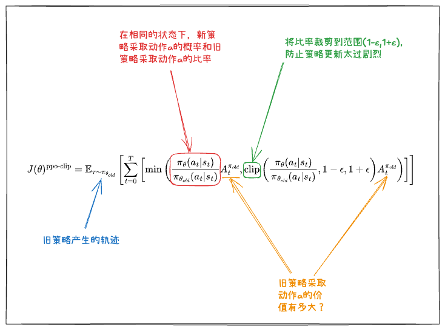

# 近端策略优化算法PPO

## 一、策略梯度法的问题
1. 策略崩溃问题：当梯度太大的时候，参数更新变化太大，模型参数变化比较剧烈，模型的效果也会一落千丈，从而浪费训练算力，导致性能崩溃
2. 深度学习为什么不曾考虑这个问题？
   - 首先明确，深度学习中同样存在这种问题；如果使用一批低质量的数据进行数据训练，训练得到的结果也一定是很差的
   - 只是深度学习中，梯度策略法产生的问题没有那么严重，因为深度学习的有监督学习能够有效控制学习的走向
   - 而强化学习中，训练数据是每一轮根据策略来采样的新的轨迹。而采样的轨迹的质量好坏无法控制。也就是说训练数据集和策略神经网络的参数是有关系的。

## 二、近端策略优化PPO
1. 为了解决强化学习中的策略崩溃问题，主要有两种解决方案：线搜索和置信域
   - 线搜索（`Line Search`）：先定方向，再定步长大小；在正确的方向上选择步长大小
   - 置信域（`Trust Region`）：先定步长大小，再确定具体方向；在“置信区间”内选择一个正确的方向
2. 回顾策略梯度法的目标函数
   $$
   J(\theta) = \mathbb{E}_{\tau\sim\pi_{\theta}}[G(\tau)]
   $$
   其对应的梯度函数为：
   $$
   \nabla_{\theta}J(\theta)=\mathbb{E}_{\tau\sim\pi_{\theta}}\left[\sum_{t=0}^TA_t^{\pi_\theta}\nabla_{\theta}\log\pi_{\theta}(a_t|s_t)\right]
   $$
   其中$A_t^{\pi_\theta} = R_t+\gamma V_\omega(S_{t+1})-V_\omega(S_t)$，这里的$A$表示优势，$A_t^{\pi_\theta}$优势、$A_t$动作。
3. 近端策略优化PPO——概述
   - PPO的目标函数
     $$
     J(\theta)^{\text{ppo-clip}}=\mathbb{E}_{\tau\sim\pi_{{\pi_\theta}_{old}}}\left[{\sum_{t=0}^T\left[\min\left(\frac{\pi_\theta(a_t|s_t)}{\pi_{\theta_{old}}(a_t|s_t)}A_t^{\pi_{old}},\text{clip}(\frac{\pi_\theta(a_t|s_t)}{\pi_{\theta_{old}}(a_t|s_t)},1-\epsilon,1+\epsilon)A_t^{\pi_{old}})\right)\right]}\right]
     $$
   - PPO的梯度公式：其中$A_t^{\pi_{old}} = R_t+\gamma V_\omega(S_{t+1})-V_\omega(S_t)$。
     $$
     \nabla_\theta J(\theta)^{\text{ppo-clip}}=\nabla_\theta\mathbb{E}_{\tau\sim\pi_{{\pi_\theta}_{old}}}\left[{\sum_{t=0}^T\left[\min\left(\frac{\pi_\theta(a_t|s_t)}{\pi_{\theta_{old}}(a_t|s_t)}A_t^{\pi_{old}},\text{clip}(\frac{\pi_\theta(a_t|s_t)}{\pi_{\theta_{old}}(a_t|s_t)},1-\epsilon,1+\epsilon)A_t^{\pi_{old}})\right)\right]}\right]
     $$

   
4. 近端策略优化PPO——说明
   - 如果新策略与旧策略的概率比超出$(1-\epsilon)$和$(1+\epsilon)$的范围，则优势函数将被剪裁
   - 我们假设比率
     $$
     p_t(\theta) = \frac{\pi_\theta(a_t|s_t)}{\pi_{\theta_{old}}(a_t|s_t)}
     $$

     |      |             $p_t(\theta)>0$              | $A_t$  |     $\min$ 的结果     | 目标函数是否被裁剪？  | 目标函数的符号  |  梯度  |
     |:----:|:----------------------------------------:|:------:|:------------------:|:-----------:|:--------:|:----:|
     |  1   | $p_t(\theta)\in[1-\epsilon,1+\epsilon]$  |  $+$   |  $p_t(\theta)A_t$  |      否      |   $+$    |  ✔   |
     |  2   | $p_t(\theta)\in[1-\epsilon,1+\epsilon]$  |  $-$   |  $p_t(\theta)A_t$  |      否      |   $-$    |  ✔   |
     |  3   |         $p_t(\theta)<1-\epsilon$         |  $+$   |  $p_t(\theta)A_t$  |      否      |   $+$    |  ✔   |
     |  4   |         $p_t(\theta)<1-\epsilon$         |  $-$   | $(1-\epsilon)A_t$  |      是      |   $-$    | $0$  |
     |  5   |         $p_t(\theta)>1+\epsilon$         |  $+$   | $(1+\epsilon)A_t$  |      是      |   $+$    | $0$  |
     |  6   |         $p_t(\theta)>1+\epsilon$         |  $-$   |  $p_t(\theta)A_t$  |      否      |   $-$    |  ✔   |
   - 情况分别说明
     1. 比例介于$[1-\epsilon,1+\epsilon]$之间，也就是处于“置信区间”之内，`clip()`函数无影响，直接优化即可；正优势的行为采取的概率变大，目标函数为正，强化该行为
     2. 比例介于$[1-\epsilon,1+\epsilon]$之间，也就是处于“置信区间”之内，`clip()`函数无影响，直接优化即可；负优势的行为采取的概率变小，目标函数为负，惩罚该行为
     3. 比例小于$1-\epsilon$，处于置信区间之外，`clip()`函数作用后是$1-\epsilon$，经过`min()`处理后是$p_t(\theta)A_t$；当前采取一个正确的行为的概率太小，目标函数为正，强化正确的行为
     4. 比例小于$1-\epsilon$，处于置信区间之外，`clip()`函数作用后是$1-\epsilon$，经过`min()`处理后还是$(1-\epsilon)A_t$，是常数求梯度后为零；负优势行为采取的概率变得极小，目标函数为负，避免太贪心，当前策略已经足够坏，不更新参数
     5. 比例大于$1+\epsilon$，处于置信区间之外，`clip()`函数作用后是$1+\epsilon$，经过`min()`处理后还是$(1+\epsilon)A_t$，是常数求梯度后为零；正优势行为采取的概率变得极大，目标函数为正，避免太贪心，当前策略已经足够好，不更新参数
     6. 比例大于$1+\epsilon$，处于置信区间之外，`clip()`函数作用后是$1+\epsilon$，经过`min()`处理后是$p_t(\theta)A_t$；当前采取一个错误的行为的概率太大，目标函数为负，惩罚错误的行为
5. PPO总结
   - PPO的学习样本怎么获得？旧策略对环境进行探索得到
   - PPO的参数更新怎么实现？根据旧策略和正在迭代的策略之间计算比值，在给定的范围内选择合适的方向进行梯度下降
   - PPO的基本实现是什么？是演员评论家算法，演员用于拟合策略函数，评论家用于拟合价值函数
6. PPO的数学基础（见`LLM/BasicKnowledge/Unread/ppo.pdf`）
7. PPO实战（见`LLM/ReinforcementLearning/code&data/chap02/PPO`）

## 三、KL散度
1. KL散度（`Kullback-Leibler Divergence`, `KLD`）
   - 用途：用于量化两个概率分布之间的差异
   - 定义：当给定两个概率分布$p(x)$和$q(x)$时，KL散度可以用下面的数学式表示。
     $$
     D_{KL}(p\Vert q)=\int p(x)\log\frac{p(x)}{q(x)}dx
     $$
   - 特点：
     - 两个概率分布的差异越大，KL散度的值就越大
     - KL散度的值大于或等于0，且仅当两个概率分布相同时，其值才为0
     - KL散度是非对称的衡量指标，因此$D_{KL}(p\Vert q)$和$D_{KL}(q\Vert p)$的值不同
2. KL散度的合理性——信息论角度
   - 信息论相关
     - 信息量（`Self-Information`）
       - 一个事件发生的信息量定义为：
         $$
         I(x) = -\log P(x)
         $$
       - 概率越小的事件，包含的信息量越大
       - 例如："太阳从东边升起"（高概率）vs "中彩票"（低概率）
     - 熵（`Entropy`）
       - 衡量随机变量的不确定性：
         $$
         H(P) = -\sum_{i} P(x_i) \log P(x_i)
         $$
       - 熵越大，不确定性越大
     - 交叉熵（`Cross-Entropy`）
       - 衡量两个概率分布之间的差异，与KL散度在数学上几乎等价
         $$
         H(P, Q) = -\sum_{i} P(x_i) \log Q(x_i)
         $$
       - 其中$P$是真实分布，$Q$是预测分布
   - 交叉熵与极大似然估计
     - 假设我们有训练数据${(x_1, y_1), (x_2, y_2), ..., (x_n, y_n)}$，其中$y_i$是真实标签
     - 似然函数：由于是连乘，容易导致精度损失或者梯度消失，转换为$log$的形式计算加和：
       $$
       L(\theta) = \prod_{i=1}^{n} P(y_i | x_i; \theta)
       $$
     - 对数似然：
       $$
       \log L(\theta) = \sum_{i=1}^{n} \log P(y_i | x_i; \theta)
       $$
     - 最大化对数似然 = 最小化负对数似然，这就是交叉熵损失：
       $$
       \text{Loss} = -\frac{1}{n}\sum_{i=1}^{n} \log P(y_i | x_i; \theta)
       $$
   - 交叉熵与KL散度
     - KL散度衡量两个分布的差异：
       $$
       D_{KL}(P||Q) = \sum_{i} P(x_i) \log \frac{P(x_i)}{Q(x_i)} = \sum_{i} P(x_i) \log P(x_i) - \sum_{i} P(x_i) \log Q(x_i)
       $$
       $$
       D_{KL}(P||Q) = -H(P) + H(P,Q)
       $$
       $$
       \frac{\partial D_{KL}(P\Vert Q)}{\partial\theta} = \frac{\partial H(P, Q)}{\partial \theta}
       $$
     - 其中：
       - $H(P) = -\sum_{i} P(x_i) \log P(x_i)$ 是真实分布的熵（常数）
       - $H(P,Q) = -\sum_{i} P(x_i) \log Q(x_i)$ 是交叉
       - 最小化KL散度 = 最小化交叉熵（因为真实分布的熵是常数，求导后是零）
   - KL散度与交叉熵什么时候不等价？当$H(P) = -\sum_{i} P(x_i) \log P(x_i)$真实分布的熵不是一个固定常数的时候，此时就只能使用KL散度来评估概率分布之间的差异

## 四、广义优势估计
1. 蒙特卡洛方案和时序差分方案的不足
   - 偏差与方差
     - 偏差：估计值与真实值之间差的多不多
     - 方差：每次采样出来的结果抖动大不大，噪声多不多
   - 蒙特卡洛方案：方差小，偏差大。把未来所有步的随机奖励全部累加，后面很多步的随机事件都会影响当前的奖励，估计偏离真实期望，有系统性误差；用的是整条轨迹总和，单一步的随机噪声被平均抹平了，结果很平滑、不乱跳，训练很稳
   - 时序差分方案（单步）：方差大，偏差小。单步时序差分方法只看下一步的奖励，几乎不凭空预测未来，估计值更贴近真实回报；但是因为每一步的噪声很大，每次算出来的优势忽大忽小，训练时参数乱跳
2. 广义优势估计（`Generalized Advantage Estimation`, GAE），融合了蒙特卡洛方案与单步时序差分方案，引入一个超参数，来控制时更关注当前还是未来
   - 数学表达
     $$
     A_t^{\text{GAE}(\lambda)} = \sum_{l=0}^{\infty} (\gamma \lambda)^l \delta_{t+l}
     $$
   - 数学原理：
     - 一步时序差分误差
       $$
       \delta_t=R_t+\gamma V(s_{t+1})-V(s_t)
       $$
     - 多步时序差分误差
       $$
       \begin{aligned}
       A_t^{(1)} &= \delta_t &&= -V(s_t)+R_t+\gamma V(s_{t+1}) \\
       A_t^{(2)} &= \delta_t+\gamma\delta_{t+1} &&= -V(s_t)+R_t+\gamma R_{t+1}+\gamma^2 V(s_{t+2}) \\
       A_t^{(3)} &= \delta_t+\gamma\delta_{t+1}+\gamma^2 \delta_{t+2} &&= -V(s_t)+R_t+\gamma R_{t+1}+ \gamma^2R_{t+2} +\gamma^3 V(s_{t+3}) \\
       &\quad\vdots &&\quad\quad\vdots \\
       A_t^{(k)} &= \sum_{l=0}^{k-1}\gamma^l\delta_{t+l} &&= -V(s_t)+R_t+\gamma R_{t+1}+\cdots+\gamma^{k-1}R_{t+k-1}+\gamma^kV(s_{t+k})
       \end{aligned}
       $$
     - GAE将这些不同步数的优势估计进行指数加权平均
       $$
       \begin{aligned}
       A_t^{\text{GAE}} &= (1-\lambda)(A_t^{(1)}+\lambda A_t^{(2)}+\lambda^2A_t^{(3)}+\cdots) \\
       &= (1-\lambda)(\delta_t+\lambda(\delta_t+\gamma\delta_{t+1})+\lambda^2(\delta_t+\gamma\delta_{t+1}+\gamma^2\delta_{t+2})+\cdots) \\
       &= (1-\lambda)(\delta_t(1+\lambda+\lambda^2+\cdots)+\gamma\delta_{t+1}(\lambda+\lambda^2+\lambda^3+\cdots)+\gamma^2\delta_{t+2}(\lambda^2+\lambda^3+\lambda^4+\cdots)+\cdots) \\
       &= (1-\lambda)\left({\delta_t\frac{1}{1-\lambda}+\gamma\delta_{t+1}\frac{\lambda}{1-\lambda}+\gamma^2\delta_{t+2}\frac{\lambda^2}{1-\lambda}+\cdots}\right) \\
       &= \sum_{l=0}^{\infty}(\gamma\lambda)^l\delta_{t+l}
       \end{aligned}
       $$
     - 变化可得
       $$
       A_t = \delta_t + \gamma\lambda A_{t+1}
       $$
     - 最后一步的广义优势估计就是该步骤本身获得的奖励与策略函数计算的奖励之差
       $$
       \delta_t=R_t+\gamma V(s_{t+1})-V(s_t)
       $$
       最后一步的：
       $$
       \delta_{last}=R_{last}-V(s_{last})
       $$
     - 逆序遍历数组，就可以得到每一步的广义优势估计
       $$
       \begin{aligned}
       A_{t+n} &= \delta_{t+n} \\
       A_{t+n-1} &= \delta_{t+n-1} + \gamma\lambda A_{t+n} \\
       A_{t+n-2} &= \delta_{t+n-2} + \gamma\lambda A_{t+n-1} \\
       \vdots \\
       A_t &= \delta_t + \gamma\lambda A_{t+1}
       \end{aligned}
       $$

 

-----
参考资料：
1. 左元强化学习：https://gitee.com/confucianzuoyuan/rl-tutorial-obsidian

