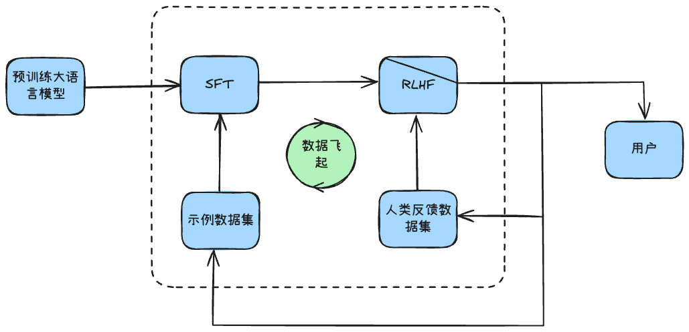
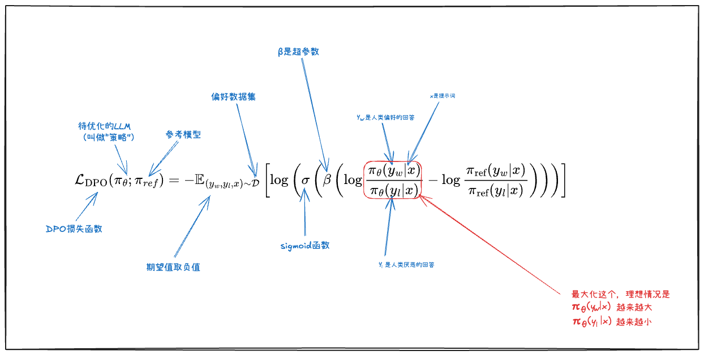
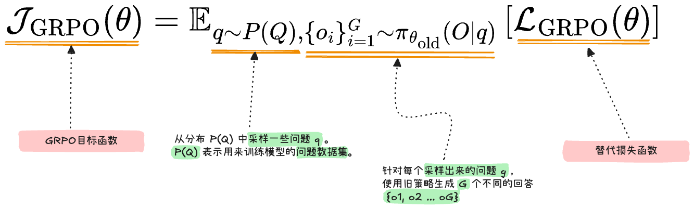
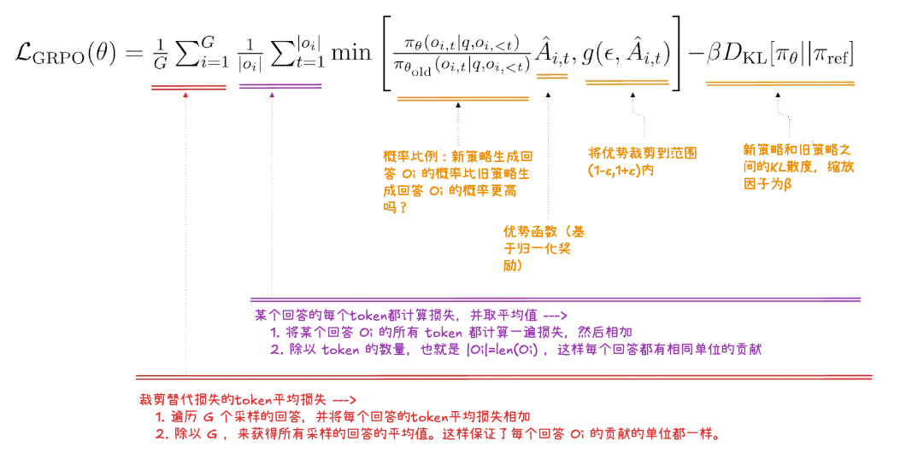

# RLHF-基于人类反馈的强化学习

## 一、`RLHF`-基于人类反馈的强化学习
1. `RLHF`（**R**einforcement **L**earning From **H**uman **F**eedback）定义：基于人类反馈的强化学习。
2. 大模型进化路线
   - `Qwen2.5-3B`（使用大量文本进行语义学习） ---> `Qwen2.5-3B-Instruct`（使用指令对大模型进行微调） ---> `Qwen2.5-3B-Instruct-RLHF`（基于人类反馈的大模型）
   - 图示
   
     
   - 大模型进化路线说明
     - 第一阶段：理解语言基本规律
     - 第二阶段：使用指令微调模型以满足特定任务
     - 第三阶段：根据人类偏好，生成人类满意的回复
   - 大模型进化路线（微调阶段）的问题：微调阶段可以让**模型输出我们喜欢的回答**，但是**没有办法让大模型不输出不喜欢的回答**
3. `RLHF`的意义
   - 正在优化大语言模型以**适应人类的偏好**，而不是对损失下降的一味追求
   - 数据来自人类的判断，而不是环境互动
   - 需要在奖励最大化与保持接近原始预训练行为之间取得平衡
4. `RLHF`中的关键技术
   - 近端策略优化：`PPO`
     $$
     J_{PPO}(\theta)=\mathbb{E}\left[{\min\left({\frac{\pi_\theta(a|s)}{\pi_{\theta_{old}}(a|s)}}A,\text{clip}\left({\frac{\pi_\theta(a|s)}{\pi_{\theta_{old}}(a|s)},1-\epsilon,1+\epsilon}\right)A\right)}\right]
     $$
   - 直接偏好优化：`DPO`，去掉奖励模型，直接用正例和负例来实现优化
     $$
     \mathcal{L}_{\text{DPO}}(\theta) = -\mathbb{E}_{(x, y_w, y_l) \sim \mathcal{D}} \left[
     \log \sigma \left(
     \beta \left( \log \frac{\pi_\theta(y_w \mid x)}{\pi_{\text{ref}}(y_w \mid x)} - \beta \log \frac{\pi_\theta(y_l \mid x)}{\pi_{\text{ref}}(y_l \mid x)}
     \right)
     \right)
     \right]
     $$
     - $x$：用户输入的问题
     - $\pi_{\theta}$：当前策略模型
     - $\pi_{ref}$：参考模型（`SFT`模型）
     - $y_{w}$：偏好回答，用户喜欢的回答
     - $y_i$：非偏好的回答，用户讨厌的回答
     - $\beta$：温度系数，控制偏离参考模型的程度
     - $\sigma$：sigmoid函数
     
     
   - 组相对策略优化：`GRPO`，`DeepSeek`代表性算法：从问题集中选一个问题，使用问题对模型进行提问，并生成多个回答，对优质回答给予采纳并用于训练
     $$
     \mathcal{J}_{\text{GRPO}}(\theta) = \mathbb{E}_{q \sim P(Q),\ \{o_i\}_{i=1}^G \sim \pi_{\theta_{\text{old}}}(\cdot|q)}
     \left[
     \mathcal{L}_{\text{GRPO}}(\theta)
     \right]
     $$
     $$
     \mathcal{L}_{\text{GRPO}}(\theta) = \frac{1}{G} \sum_{i=1}^G \frac{1}{|o_i|} \sum_{t=1}^{|o_i|}
     \min\left(
     \frac{\pi_\theta(o_{i,t} \mid q, o_{i,<t})}{\pi_{\theta_{\text{old}}}(o_{i,t} \mid q, o_{i,<t})} \hat{A}_{i,t},\
     g(\epsilon, \hat{A}_{i,t})
     \right) - \beta D_{\text{KL}}\left[\pi_\theta \parallel \pi_{\text{ref}}\right]
     $$
     - $\theta$：当前策略模型的参数
     - $\theta_{\text{old}}$：上一轮更新冻结的旧策略参数
     - $\pi_\theta(o_{i,t} \mid q, o_{i,<t})$：当前策略在输入$q$、已生成序列$o_{i,<t}$下，生成第$t$个`token`$o_{i,t}$的概率
     - $\pi_{\theta_{\text{old}}}(\cdot|q)$：旧策略模型的分布，用于重要性采样
     - $q \sim P(Q)$：从提示分布 $P(Q)$ 中采样的`prompt`
     - $G$：组大小，同一`prompt`采样的回复数量
     - $o_i$：第 $i$ 个采样回复，长度为 $|o_i|$
     - $\hat{A}_{i,t}$：第 $i$ 个回复、第 $t$ 个 token 对应的归一化优势函数
     - $g(\epsilon, \hat{A}_{i,t})$：`PPO`裁剪项，用于避免策略崩溃，$\mathrm{clip}\left(\frac{\pi_\theta}{\pi_{\theta_{\text{old}}}}, 1-\epsilon, 1+\epsilon\right) \hat{A}_{i,t}$
     - $\epsilon$：裁剪系数，限制策略更新幅度（通常取0.1~0.3）
     - $\beta$：`KL`散度权重系数
     - $D_{\text{KL}}[\pi_\theta \parallel \pi_{\text{ref}}]$：当前策略与参考模型（`SFT`模型）的`KL`散度，用于约束策略漂移
     
     

     
5. 强化学习算法发展
   - 第一阶段：原始策略梯度法 + `REINFORCE`算法 + `Actor-Critic`算法
   - 第二阶段：近端策略优化PPO
   - 第三阶段：直接偏好优化（是否属于强化学习有一定争议） + 组相对策略优化

## 二、RLHF基本流程——以PPO为例
1. 

-----
参考资料：
1. 左元强化学习：https://gitee.com/confucianzuoyuan/rl-tutorial-obsidian
2. RLHF：https://blog.csdn.net/julialove102123/article/details/135669376
3. RLHF论文链接：https://arxiv.org/pdf/2203.02155

