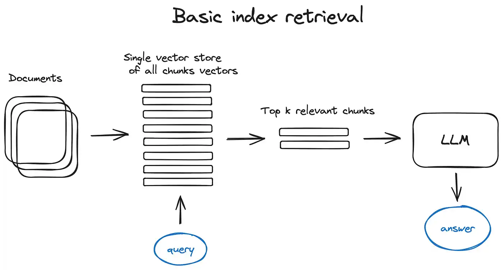
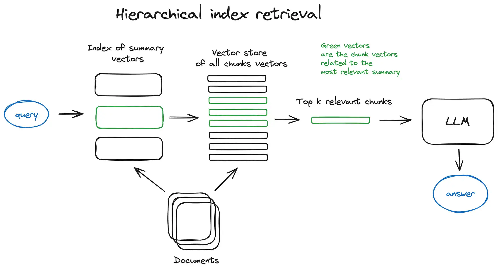
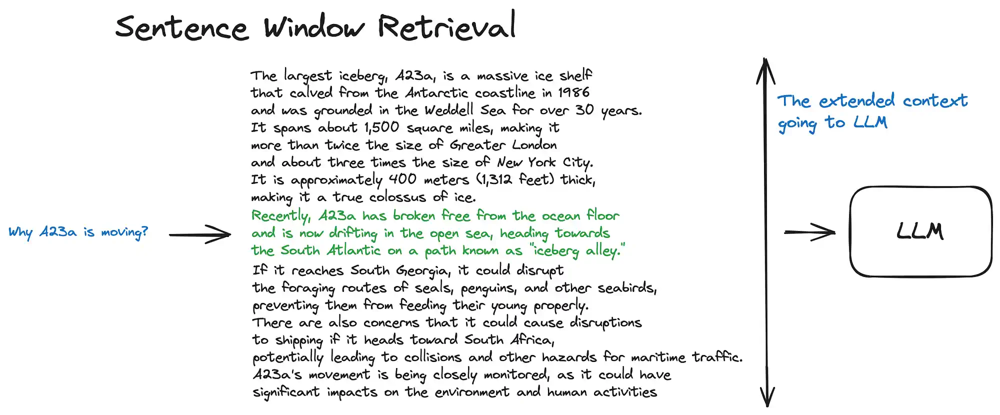
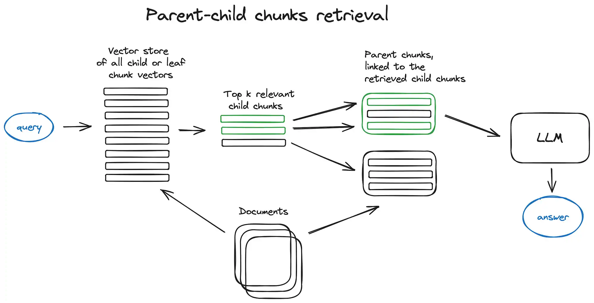

# 大模型技术之RAG

## 一、什么是RAG
1. RAG就是通过检索获取相关的知识并将其融入Prompt，让大模型能够参考相应的知识从而给出合理回答。因此，可以将RAG的核心理解为“检索+生成”。
   - 前者主要是利用向量数据库的高效存储和检索能力，召回目标知识
   - 后者则是利用大模型和Prompt工程，将召回的知识合理利用，生成目标答案
   - 用户向LLM问问题，RAG从各种数据源获取相关信息，将检索得到的结果融合到prompt中，由LLM综合分析获得答案
2. RAG的完整流程
   - 数据准备阶段：主要是将私域数据向量化后构建索引并存入数据库的过程
     - 数据提取
       - 数据加载：从不同源头获得多种数据格式的数据，依赖数据自身的情况统一处理为一种格式
       - 数据处理：数据过滤、压缩、格式化等
       - 元数据提取：提取数据中的关键信息
     - 文本分割：文本分割需要考虑两个条件，语义和Tokens的长度限制，普遍来说有以下两种分割方式
       - 固定长度分割：根据embedding模型的token长度限制，将文本分割为固定长度，会损失掉大部分的语义信息；可以通过句分割 + 冗余信息来缓解
       - 句分割：按照句子切分，常见的切分符号包括：感叹号、问号、换行符等
     - 向量化embedding：向量化是一个将文本数据转换为向量矩阵的过程，该过程会直接影响到后续检索的效果
       - 常见的向量化模型如下：
         
         |    Model Name     | description |                                  url                                   |
         |:-----------------:|:-----------:|:----------------------------------------------------------------------:|
         | ChatGPT-Embedding | OpenAI公司提供  | https://platform.openai.com/docs/guides/embeddings/what-are-embeddings |
         |  ERNIE-Embedding  |   百度公司提供    |         https://cloud.baidu.com/doc/WENXINWORKSHOP/s/alj562vvu         |
         |        BGE        |   北京智源研究院   |              https://huggingface.co/BAAI/bge-base-en-v1.5              |
       - 对于一些罕见的专有名词，可以使用上述的模型进行微调来实现
       - 【注意】向量化也是通过模型来实现的
     - 数据入库：数据向量化后构建索引，并写入数据库的过程可以概述为数据入库过程，ES可以作为该种数据的数据库存储数据
   - 应用阶段：用户提问 -- 数据召回 -- 注入prompt -- LLM生成答案
     - 用户提问：用户向大模型提问
     - 数据召回：也就是数据检索，怎么找到跟当前问题最相关的答案？
       - 相似性检索：计算向量与所有存储向量的相似性得分，返回得分最高的记录，常见的相似性计算方法包括
         - 余弦相似性：计算两个向量之间的夹角大小 $$ \text{余弦相似性} = \cos(\theta) = \frac{\mathbf{A} \cdot \mathbf{B}}{\|\mathbf{A}\| \|\mathbf{B}\|} $$
         - 欧式距离相似性：$$ d(\mathbf{A}, \mathbf{B}) = \sqrt{\sum_{i=1}^{n} (A_i - B_i)^2} $$
         - 曼哈顿距离：$$ d(\mathbf{A}, \mathbf{B}) = \sum_{i=1}^{n} |A_i - B_i| $$
       - 全文检索：数据存入的时候构建倒排索引，检索的时候使用关键词定位记录的位置
     - 注入prompt：将知识注入prompt
     - LLM生成答案
     ```txt
     【任务】假设你是一个专业的客服机器人，请参考【背景知识】，回答【问题】
     【背景知识】1. a是A；2. b是B；3. c是C；4. d是D
     【问题】abcd是什么？
     ```
3. RAG的必要性
   1. 大模型不具备某一方面的专业能力，RAG作为一种外界的知识库对LLM的能力进行了提升
   2. 数据安全性考量：某些企业不愿意将数据传给第三方平台进行训练
   3. 幻觉问题：大模型具有幻觉，经常会胡说八道，大模型需要某一方面的系统性知识


## 二、RAG的多种类型
1. 原始RAG技术：数据召回 -- 注入prompt -- LLM生成答案
   
2. 高级RAG技术：
   
   1. 分块：是优化语义表示和计算效率的核心技术策略，将原始资料转换为一个一个的小句子和文档
      - 为什么要分块？Transformer的架构限制——当输入长度超过阈值，注意力机制的权重分布趋向于平均化，因此输入数据的长度需要限制
      - 分块有很多方式，有很多文本拆分器可以实现这个功能
      - 块的大小有很多选择方式
        - 法律文本：768 tokens大块（保持条款完整性）
        - 学术论文：512 tokens块 + 章节标题锚点
        - 社交媒体：64 tokens微型块 + 表情符号敏感分割
      - token的含义：在大模型语境中，token是语言模型处理文本的最小语义单元
        - 英语：平均每个token对应4字符（如"ing"作为后缀token） 
        - 中文：单个汉字通常占2-3个token（基于UTF-8的BPE编码），【汉字的含义多重化，用2-3个token来代表一个汉字】
        - 代码：特殊符号如"->"在PythonTokenizer中被映射为独立token
   2. 向量化：将小句子和小文档转换为token描述的向量形式，将非结构化数据转换为机器可以理解的数值形式
      - 查看MTEB排行榜以获取最新更新即可，MTEB排行是一个用于评估向量化效果的常用标准
      - 向量化也叫做嵌入模型，嵌入模型的核心价值在于‌将**非结构化数据**转化为机器可理解的**数值形式‌**，从而解锁语义分析、高效检索和智能推荐等应用场景
   3. 搜索索引：怎么用问题查询出来数据库中最相关的结果？
      - 向量索引：计算距离，选出最相关的
        - 最基础的实现：计算当前查询向量与数据库中的向量的距离，做暴力匹配
        - 改进一点的实现：K近邻算法，根据距离计算周围相似度最高的K个邻居，每个邻居相当于一次投票
        
        
      - 分层索引：先在摘要中检索，再根据摘要进一步检索，降低检索范围
        - 将真实数据分为两层，第一层主要是数据的摘要，第二层是基本数据
        - 先在摘要中检索信息，再根据摘要选择数据范围，再进行暴力匹配
        
        
      - 假设性问题：根据原始的文档使用LLM生成一个可能的问题，后续计算问题之间的相似性，而不是文本与问题之间的相似性
        - 在文本块被分割得到后，使用LLM生成每个文本块的可能问题，建立【问题--文本块】之间的映射
        - 在外部用户提出自己的问题时，计算问题之间的相似性，然后根据【问题--文本块】之间的映射获得答案
        - 优势
          - 语义聚焦：生成的问题能提炼文本核心语义，过滤冗余信息 
          - 意图对齐：假设性问题更接近自然语言查询的表达方式
          - 维度优化：问题文本通常比原始段落更简洁，向量表征更精准
          - 相关性提升：查询与问题的语义相似度通常高于原始文本块
              
      - 内容增强：将目标文档的上下文一并发给LLM，提升上下文信息的数量
        - 第一种实现：语句窗口
          - 在检索到目标向量后，扩展上下文的k个向量，一起发给大模型
          
          
        - 第二种实现：父子检索
          - 首先在检索过程中获取较小的块，然后如果前 k 个检索到的块中有超过 n 个块链接到同一个父节点（较大的块），我们将这个父节点替换成给 LLM 的上下文
          
          
   4. 重排 & 过滤：将获取到的记录进行简单处理，将资料融合到prompt
   5. 查询转换：将用户的问题换一种提问方式，以获得更好的效果
      - A项目和B项目在GitHub上哪个更受欢迎？ --- A项目和B项目哪个在GitHub上的star更多？


    


   


参考文档
1. 快速入门RAG整体流程：https://blog.csdn.net/m0_59164304/article/details/137628721
2. 