# 神经网络基础

## 一、神经网络
1. 人工神经网络（Artificial Neural Network，ANN）简称 神经网络（NN），是一种模仿生物神经网络结构和功能的计算模型。大多数情况下人工神经网络能在外界信息的基础上改变内部结构，是一种自适应系统(adaptive system)，通俗地讲就是具备学习功能
2. 神经网络结构
   - 输入层：最左边的一列神经元都表示输入
   - 中间层：输入层与输出层之间的层统称为 中间层（隐藏层）
   - 输出层：最右边一列表示网络的输出
   
   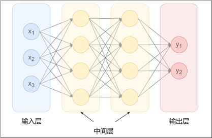

3. 全连接：相邻层的神经元相互连接（下一层的每一个神经元都与上一层所有神经元连接）
4. 神经元中的信息逐层传递（一般称为 前向传播forward），上一层神经元的输出作为下一层神经元的输入
5. 计算流程
   - 计算信号和偏置的加权总和
   - 使用激活函数将输入信号的加权总和转换为输出信号，起到激活神经元的作用
6. 激活函数：激活函数不是线性的，通过将感知机叠加起来，能够拟合非线性函数的场景

## 二、激活函数
1. 激活函数的作用：<font color='yellow'>引入激活函数，实现非线性拟合</font>
   - 激活函数是连接感知机和神经网络的桥梁，在神经网络中起着至关重要的作用
   - 如果没有激活函数，整个神经网络就等效于单层线性变换，不论如何加深层数，总是存在与之等效的“无隐藏层的神经网络”
   - 激活函数必须是非线性函数，也正是激活函数的存在为神经网络引入了非线性，使得神经网络能够学习和表示复杂的非线性关系
2. 阶跃函数（Binary Step）【太简单】
   - 定义：一旦超过这个阈值，就切换输出（0或者1）
   - 数学表达
     $$
     f(x)=
     \begin{cases}
     0,&x<0\\
     1,&x\ge0
     \end{cases},\quad
     f'(x)=0
     $$
   - 图像

   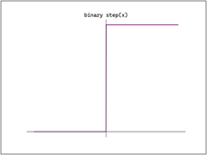
   - 特点
     - 阶跃函数的导数恒为0
   - 代码实现
   ```python
   import numpy as np
   def step_function(x):
       return np.array(x > 0, dtype=int)
   ```
3. Sigmoid函数【容易出现梯度消失】
   - 定义：是平滑的、可微的，能将任意输入映射到区间(0,1)。**常用于二分类的输出层**。但因其涉及指数运算，计算量相对较高
   - 数学表达
     $$f(x) = \frac{1}{1+e^{-x}}$$
     $$f'(x) = \frac{1}{1+e^{-x}} \left(1 - \frac{1}{1+e^{-x}}\right) = f(x)(1-f(x))$$
   - 图像
   
   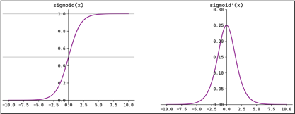
   - 特点
     - Sigmoid的**输入在[-6,6]之外时，其输出值变化很小，可能导致信息丢失**
     - Sigmoid的输出并非以0为中心，而是以[0,0.5]为中心，**其输出值均＞0，导致后续层的输入始终为正，可能影响后续梯度更新方向**
     - Sigmoid的导数范围为(0,0.25)，梯度较小。**当输入在[-6,6]之外时，导数接近0，此时网络参数的更新将会极其缓慢。使用Sigmoid作为激活函数，可能出现梯度消失（在逐层反向传播时，梯度会呈指数级衰减）**
   - 代码实现
   ```python
   import numpy as np
   def sigmoid(x):
       return 1 / (1 + np.exp(-x))
   ```
4. Tanh函数【容易出现梯度消失】
   - 定义：将输入映射到区间(-1,1)。其关于原点中心对称。**常用在隐藏层**
   - 数学表达
     $$f(x)=\frac{1-e^{-2x}}{1+e^{-2x}}$$
     $$f'(x)=1-\left(\frac{1-e^{-2x}}{1+e^{-2x}}\right)^2=1-f^2(x)$$
   - 图像
   
     
   - 特点
     - 输入在[-3,3]之外时，Tanh的输出值变化很小，此时其导数接近0
     - Tanh的输出以0为中心，且其梯度相较于Sigmoid更大，收敛速度相对更快。但同样也存在梯度消失现象
     - 关于[0,0]对称
   - 代码实现
   ```python
   import numpy as np
   def tanh(x):
       return np.tanh(x)
   ```
5. ReLU函数
   - 定义：ReLU（Rectified Linear Unit，修正线性单元）会将小于0的输入转换为0，大于等于0的输入则保持不变。ReLU定义简单，计算量小。**常用于隐藏层**
   - 数学表达
     $$f(x)=\max(0,x)=\begin{cases}0,&x\le0\\x,&x>0\end{cases}$$
     $$f'(x)=\begin{cases}0,&x<0\\1,&x>0\end{cases}$$ 默认不可导处导数为0
   - 图像

   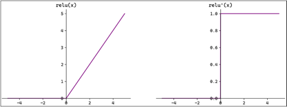
   - 特点
     - ReLU作为激活函数不存在梯度消失。当输入小于0时，ReLU的输出为0，这意味着在神经网络中，ReLU激活的节点只有部分是“活跃”的，这种稀疏性有助于减少计算量和提高模型的效率。
     - 当神经元的输入持续为负数时，ReLU的输出始终为0。这意味着神经元可能永远不会被激活，从而导致“神经元死亡”问题。这会影响模型的学习能力，特别是如果大量的神经元都变成了“死神经元”。
     - 为解决神经元死亡问题，引入了Leaky ReLU，在负数区域引入一个小的斜率来解决
       $$f(x)=\begin{cases}\alpha x,&x\le0\\x,&x>0\end{cases}$$其中 $\alpha$ 是一个很小的常数（通常取 0.01 左右）
   - 代码实现
   ```python
   import numpy as np
   def relu(x):
       return np.maximum(0, x)
   ```
6. Softmax函数
   - 定义：Softmax将一个任意的实数向量转换为一个概率分布，确保输出值的总和为1，是二分类激活函数Sigmoid在多分类上的推广.**常用于输出层，用于表示类别的预测概率**
   - 数学表达
     $$y_k = \frac{e^{x_k}}{\sum_{i=1}^n e^{x_i}},\quad k=1\sim n$$
     $$\frac{\partial y_k}{\partial x_i}=\begin{cases}y_k(1-y_i), & k=i \\-y_k y_i, & k\neq i\end{cases}$$
   - 图像
   - 特点
     - Softmax会放大输入中较大的值，使得最大输入值对应的输出概率较大，其他较小的值会被压缩。即在类别之间起到了一定的区分作用
   - 代码实现
   ```python
   def softmax(x):
       return np.exp(x) / np.sum(np.exp(x))

   # 考虑到x较大时，指数函数的值会非常大，容易溢出
   def softmax(x):
       x = x - np.max(x) # 溢出对策，所有变量都减去最大值，除了最大的数其他的数据都变成负数
       return np.exp(x) / np.sum(np.exp(x))
   
   # 矩阵版本
   def softmax(x):
       if x.ndim == 2:
           x = x.T
           x = x - np.max(x, axis=0)
           # axis=0代表行、axis=1代表列
           y = np.exp(x) / np.sum(np.exp(x), axis=0)
           return y.T
       x = x - np.max(x) # 溢出对策
       return np.exp(x) / np.sum(np.exp(x))
   ```
7. 其他激活函数
   - Identity（恒等函数）
     - 数学表达：$$f(x)=x,\quad f'(x)=1$$
     - 特点：没有引入非线性关系，本质还是线性拟合，不适合用在中间层
     - 图像：
     
     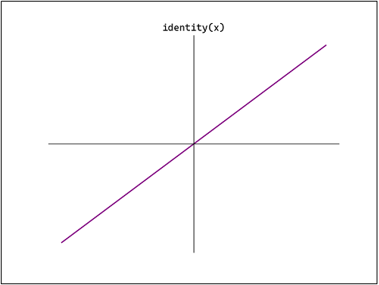
     - 代码实现：
     ```python
     def Identity(x):
         return x
     ```
   - Leaky ReLU（Leaky Rectified Linear Unit）
     - 数学表达：$$f(x)=\begin{cases}\alpha x,&x\le0\\x,&x>0\end{cases},\quad f'(x)=\begin{cases}\alpha,&x\le0\\1,&x>0\end{cases}$$
     - 特点：$\alpha$是一个很小的固定值
     - 图像：
     
     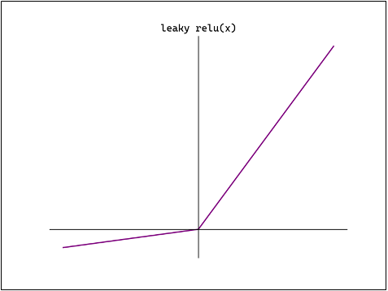
   - PReLU（Parametric Rectified Linear Unit）
     - 数学表达：$$f(x)=\begin{cases}\alpha x,&x\le0\\x,&x>0\end{cases},\quad f'(x)=\begin{cases}\alpha,&x\le0\\1,&x>0\end{cases}$$
     - 特点：$\alpha$是一个可训练的参数
     - 图像：

     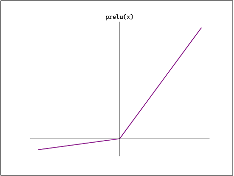
   - RReLU（Randomized Leaky ReLU）
     - 数学表达：$$f(x)=\begin{cases}\alpha x,&x\le0\\x,&x>0\end{cases},\quad f'(x)=\begin{cases}\alpha,&x\le0\\1,&x>0\end{cases}$$
     - 特点：$\alpha$是一个很小的值，它是从一个均匀分布中随机选择的值
     - 图像：

     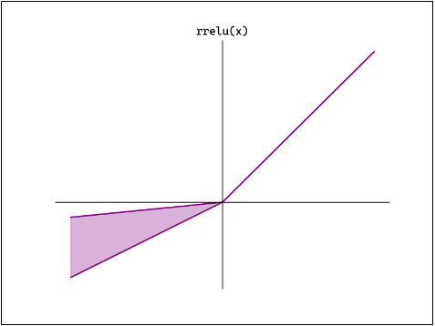
   - ELU（Exponential Linear Unit）
     - 数学表达：$$f(x) = \begin{cases} \alpha (e^x - 1), & x \le 0 \\ x, & x > 0 \end{cases},\quad f'(x) = \begin{cases} \alpha e^x, & x \le 0 \\ 1, & x > 0 \end{cases}$$
     - 特点：过[0,0]点，且$\alpha$也可以调整
     - 图像：

     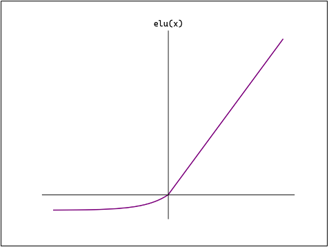
     - 代码实现：
     ```python
     ```
   - Swish（也称Sigmoid Linear Unit，SiLU）
     - 数学表达：$$f(x) = \frac{x}{1+e^{-x}},\quad f'(x) = \frac{1+e^{-x}+xe^{-x}}{(1+e^{-x})^2}$$
     - 特点：是ReLU和Sigmoid的结合体；但是图像是先减后增的
     - 图像：

     
   - Softplus
     - 数学表达：$$f(x)=\ln(1+e^x),\quad f'(x)=\frac{1}{1+e^{-x}}$$
     - 特点：也是综合了ReLU和Sigmoid的一种变体
     - 图像：

     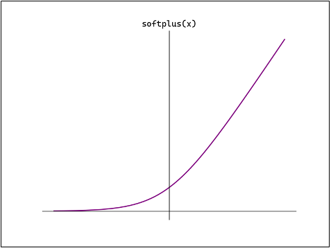
8. 隐藏层如果使用Tanh或者Sigmoid会存在梯度消失的情况，所以隐藏层大部分使用的还是ReLU函数；Softmax函数通常用于输出层。
9. **如何选择激活函数**：只有隐藏层和输出层才能存在激活函数
   - 隐藏层
     - 首选ReLU，如果效果不好可尝试Leaky ReLU等
     - Sigmoid在隐藏层易导致梯度消失，应尽量避免【浅层网络常用】
     - Tanh的输出均值为0，对中心化数据更友好，但仍可能引发梯度消失【浅层网络常用】
   - 输出层
     - 二分类选择Sigmoid
     - 多分类选择Softmax
     - 回归默认选择Identity

## 三、神经网络的简单实现
1. 三层神经网络结构：

   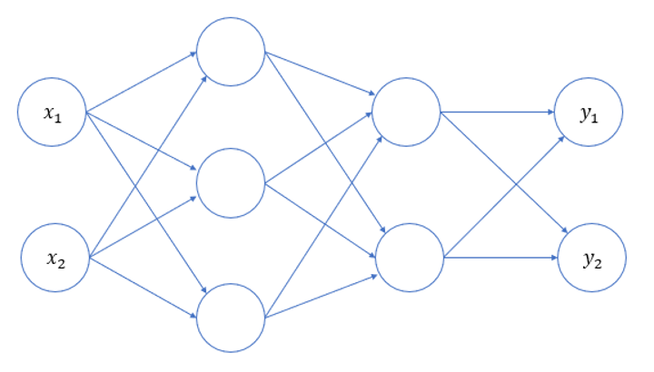
   - 只是三层网络的示意图，实际上每层还应该有偏置，各输入信号加权总和还要经过激活函数的处理
   
   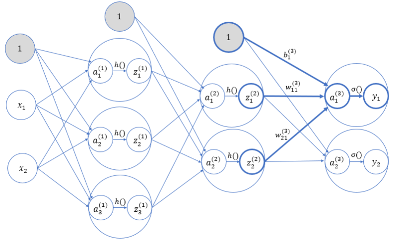
2. 由于是全连接，且每层的激活函数已经确定了，因此需要学习的就是每个连接上的权重，以第一层全连接为例：
   $$A^{(1)} = XW^{(1)} + B^{(1)}$$
   其中，$$A^{(1)} = (a_1^{(1)}\ \ a_2^{(1)}\ \ a_3^{(1)}),\quad X = (x_1\ \ x_2),\quad B^{(1)} = (b_1^{(1)}\ \ b_2^{(1)}\ \ b_3^{(1)}),$$
   $$W^{(1)} = \begin{pmatrix}
   w_{11}^{(1)} & w_{12}^{(1)} & w_{13}^{(1)} \\
   w_{21}^{(1)} & w_{22}^{(1)} & w_{23}^{(1)}
   \end{pmatrix}
   $$
3. 代码实现
   ```python
   import numpy as np
   from common.functions import sigmoid, identity

   # 初始化网络
   def init_network():
       network = {}
       # 第一层参数
       network['W1'] = np.array([[0.1, 0.3, 0.5], [0.2, 0.4, 0.6]])
       network['b1'] = np.array([0.1,0.2,0.3])
       # 第二层参数
       network['W2'] = np.array([[0.1, 0.4], [0.2, 0.5], [0.3, 0.6]])
       network['b2'] = np.array([0.1, 0.2])
       # 第三层参数
       network['W3'] = np.array([[0.1, 0.3], [0.2, 0.4]])
       network['b3'] = np.array([0.1, 0.2])
       return network
   
   # 前向传播
   def forward(network, x):
       w1, w2, w3 = network['W1'], network['W2'], network['W3']
       b1, b2, b3 = network['b1'], network['b2'], network['b3']
       # 逐层进行计算传递
       a1 = np.dot(x, w1) + b1
       z1 = sigmoid(a1)
       a2 = np.dot(z1, w2) + b2
       z2 = sigmoid(a2)
       a3 = np.dot(z2, w3) + b3
       y = identity(a3)
       return y

   # 测试主流程
   network = init_network()
   
   # 定义数据
   x = np.array([1.0, 0.5])
   
   # 前向传播（预测）
   y = forward(network, x)
   
   print(y)
   ```
4. 所谓的模型参数，就是指每层矩阵中各个参数的值；所谓的神经网络，就是激活函数 + 参数矩阵的堆叠

## 四、神经网络识别数字case
1. 见`ML&DL&NLP/DL/code&data/digit_recognizer.py`
2. 该case没有考虑模型的训练过程，直接使用joblib加载了一个预训练的模型进行测

