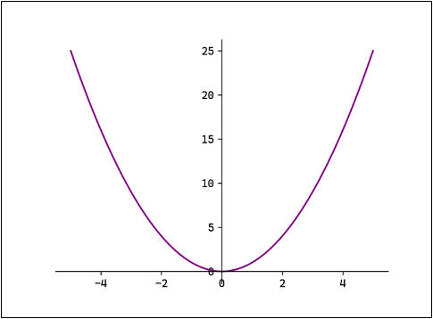
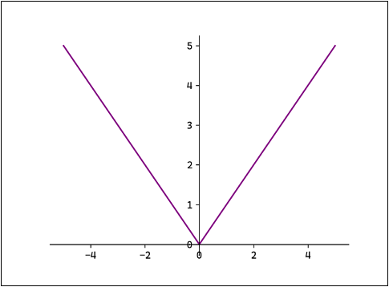
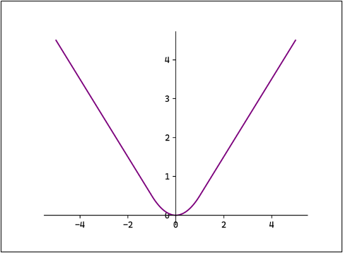

# 神经网络的学习

## 一、神经网络的学习和机器学习的学习有什么区别？
1. 神经网络（深度学习）也是机器学习的一种；跟传统机器学习方法相比，神经网络不需要人工设置特征量（如 SIFT、HOG等），这样就可以用同样的流程直接处理所有问题
2. 神经网络的学习不需要进行特征工程来处理数据、提取特征；不论什么问题，直接丢给模型处理就好
3. 可推广性强，可解释性弱

## 二、损失函数
1. 为什么需要损失函数：用来判定模型参数是不是足够好，或者说，也是我们优化参数的起点
2. 【分类问题】交叉熵误差（Cross Entropy Error，CEE）
   - 数学表达：$$L = -\frac{1}{n}\sum_{i=1}^n t_i \log y_i$$ 其中，$y_i$ 表示神经网络的输出，$t_i$ 表示正确解标签（不是自然编号，是独热编码形式，只有正确的那一条才是1）
   - 特点：之前的softmax是对所有数据的所有特征求交叉熵误差，此处仅仅对所有数据中正确解标签进行计算并求和
     - softmax公式对比：$$\text{Loss} = -\frac{1}{n} \sum_{i=1}^n \sum_{c=1}^C I(y_i=c) \log P(y_i=c \mid x_i)$$
     - 因为解标签中大部分是0，所以外层的求和可以不计算
   - 代码实现：
   ```python
   # 兼容了两种：一种是one-hot编码，一种是普通类别标签
   def cross_entropy(y, t):
       # 将y转为二维
       if y.ndim == 1:
           t = t.reshape(1, t.size)
           y = y.reshape(1, y.size)
       # 将t转换为顺序编码（类别标签）
       if t.size == y.size:
           t = t.argmax(axis=1)
   
       n = y.shape[0]
       # 1e-10 作为一个极小值，防止log(0)运算报错
       return -np.sum( np.log(y[np.arange(n), t] + 1e-10) ) / n
   ```
3. 【分类问题】二元交叉熵损失函数（Binary Cross-Entropy Loss）
   - 数学表达：$$L = -\frac{1}{n} \sum_{i=1}^{n} \left( y_i \log(\hat{y_i}) + (1 - y_i) \log(1 - \hat{y_i}) \right)$$其中：$y_i$ 为真实值（通常为 0 或 1），$\hat{y_i}$ 为预测值（表示样本 $i$ 为 1 的概率）
   - 特点：仅适用于二分类任务
4. 【分类问题】多分类任务损失函数（Categorical Cross-Entropy Loss）
   - 数学表达：$$L = -\frac{1}{n} \sum_{i=1}^{n} \sum_{c=1}^{C} y_{i,c} \log(\hat{y_{i,c}})$$其中：$C$ 是类别数，$y_{i,c}$ 为真实值（表示 $y_i$ 是否为类别 $c$，通常为 0 或 1），$\hat{y_{i,c}}$ 为预测值（表示样本 $i$ 为类别 $c$ 的概率）
   - 特点：交叉熵误差的完整版，与交叉熵误差本质一致
5. 【回归问题】均方误差（Mean Squared Error，MSE，也称作L2 Loss）
   - 数学表达：$$L = \frac{1}{n} \sum_{i=1}^n (y_i - t_i)^2$$
   - 特点：均方误差损失对异常值敏感，遇到异常值时容易发生**梯度爆炸**
   - 数学图像：
   
   
   - 代码实现：
   ```python
   def mean_squared_error(y, t):
      return 0.5 * np.sum((y-t)**2)
   ```
6. 【回归问题】平均绝对误差（Mean Absolute Erro，MAE，也称作L1 Loss）
   - 数学表达：$$L = \frac{1}{n} \sum_{i=1}^n |y_i - \hat{y_i}|$$
   - 特点：对异常值不敏感，在0点处不可导
   - 数学图像：
   
   
   - 
7. 【回归问题】Smooth L1
   - 数学表达：
   $$\text{Smooth L1} =
     \begin{cases}
     \frac{1}{2} \left( y_i - \hat{y_i} \right)^2, & \left| y_i - \hat{y_i} \right| < 1 \\
     \left| y_i - \hat{y_i} \right| - \frac{1}{2}, & \left| y_i - \hat{y_i} \right| \geq 1
     \end{cases}$$
   - 特点：在[-1,1]区间内，是类MSE；在外部是类MAE；在0点处可导
   - 数学图像：
   
   
8. 损失函数的意义：给优化指明了方向，优化的方向就是损失函数变小的方向

## 三、梯度计算
1. 损失函数定义后，我们需要将该函数转化为参数的函数并转换问题为一个最优化问题
   - 核心思想：<font color='red'>**将参数带入损失函数，通过求导、梯度下降、数值微分等来获得最优解或梯度，进而不断优化参数**</font>
   - 常用方式一：数值计算+求导，将参数带入函数中求导，导数等于零的位置就可能是参数最优的地方，**相当于直接求解**
   - 常用方式二：迭代+梯度下降法，将参数带入函数中求导，计算当前梯度，通过迭代取梯度方向并迈出适当步长逐渐调整参数，因为直接求解不能获得目标值
   - 常用方式三：迭代+数值微分，对自变量做微小调整计算函数值，来模拟当前的梯度计算
     - 数值微分：将自变量做一个微小调整，来计算函数值的变化，从而模拟当前点的梯度
     - 中心差分：数值微分的一种实现形式，从当前点向前后各减少一个微小量，避免只计算单向增大时的误差；另外，取微小值h时不能太小，这会导致计算机浮点数表示的精度不够，出现舍入误差
     - 数值微分代码实现
     ```python
     # f是一个函数，通常代表损失函数，要计算谁的数值微分（在某一点的导数）就用谁
     # 数值微分numerical_diff方法的含义就是计算哪个函数在哪一点处的梯度
     # 数值微分求导，传入x是一个标量
     def numerical_diff(f, x):
         h = 1e-4
         # 向前后各减少一个微小量
         return (f(x+h) - f(x-h)) / (2*h)
       
     # 数值微分求梯度，传入x是一个向量
     def _numerical_gradient(f, x):
         h = 1e-4
         grad = np.zeros_like(x)
         # 遍历x中的特征xi
         for i in range(x.size):
             tmp = x[i]
             x[i] = tmp + h
             fxh1 = f(x)
             x[i] = tmp - h
             fxh2 = f(x)
             # 利用中心差分公式计算偏导数
             grad[i] = (fxh1 - fxh2) / (2*h)
             # 恢复x[i]的值
             x[i] = tmp
         return grad
       
     # 传入X是一个矩阵
     def numerical_gradient(f, X):
         # 判断维度
         if X.ndim == 1:
             return _numerical_gradient(f, X)
         else:
             grad = np.zeros_like(X)
             # 遍历X中的每一行数据，分别求梯度
             for i, x in enumerate(X):
                 grad[i] = _numerical_gradient(f, x)
         return grad
     ```
2. 代码实战，逐行解析，见(./code&data/simple_net_grad.py)

## <font color='red'>四、神经网络的学习过程</font>
1. 确定神经网络的结构：神经网络层数和每一层的激活函数【**确定好前向传播的计算方式**】
2. 确定损失函数：根据问题类型和特性选择合适的损失函数，损失函数的梯度确定了参数迭代的方向【**确定损失函数，确定优化目标**】
3. 确定梯度计算：选择求导、计算梯度或数值微分来计算梯度，如果使用数值微分需要依赖损失函数的函数值，损失函数函数值`Loss(x)`依赖预测结果`f(x)`与真实值`y`之间的差异【**确定参数迭代方向**】
4. 持续迭代：按照梯度方向持续迭代，计算最优参数【**持续迭代贴近最优解**】

## 五、模型训练相关概念
1. Epoch（训练数据都跑一遍）：模型完整遍历一次整个训练数据集的过程。例如，训练10个Epoch表示模型将整个数据集反复学习10次。模型需要多次遍历数据集（多个Epoch）才能逐步学习数据中的模式，单次遍历数据集（1个Epoch）通常不足以让模型收敛，多次遍历可以逐步优化模型参数。
2. Batch Size（小批量数据包括多少）：每次训练时输入的样本数量。例如，Batch Size=32 表示每次用32个样本计算一次梯度并更新模型参数。小批量数据计算梯度比单样本（Batch Size=1）更稳定，比全批量（Batch Size=全体数据）更高效。并且较小的Batch Size可能带来更多噪声，有助于模型泛化。
3. Iteration（参数更新一轮）：完成一个Batch数据的正向传播（预测）和反向传播（更新参数）的过程
   ```txt
   例如，数据集现有2000个样本，对其训练10个Epoch，选择Batch Size=64：
   Batch个数为2000/64+1=31+1=32个（最后一个Batch仅有16个样本）。
   每个Epoch中迭代次数Itreation=32次。
   总迭代次数为10×32=320次。
   总训练样本数为10×2000=20000。
   ```

## 六、随机梯度下降法（SGD）
1. 在机器学习领域中，随机梯度下降法通常指随机选择一个数据并计算梯度；在深度学习中，随机梯度下降法通常指小批量数据随机梯度下降
2. 算法细节
   - 选择一小批数据，作为mini-batch
   - 使用梯度计算公式，计算批量数据中每个数据的梯度
   - 所有数据的梯度计算后取平均值
   - 更新参数，重复迭代

## 七、综合代码实现
1. 实现细节
   - 计算时间太长了，计算梯度的部分耗时太高，这种方法需要改进
2. 代码实现参考(ML&DL&NLP/DL/code&data/chap3/digit_recognizer_nn_train.py)


参考资料：
1. 尚硅谷深度学习视频：https://www.bilibili.com/video/BV1MRJmzSEaa