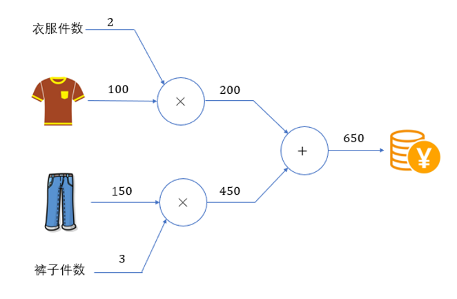
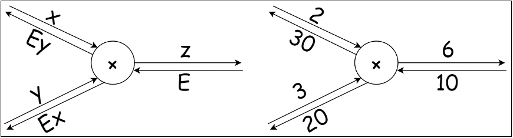
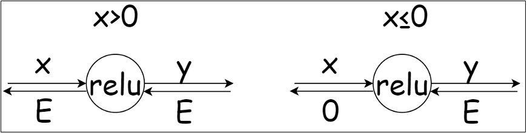
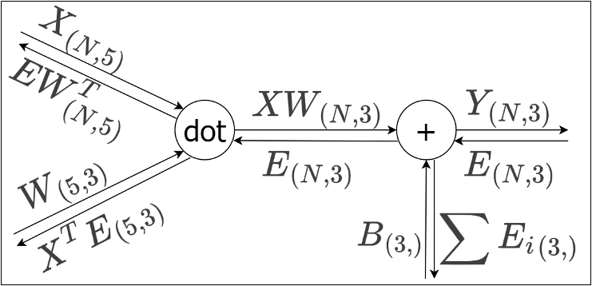
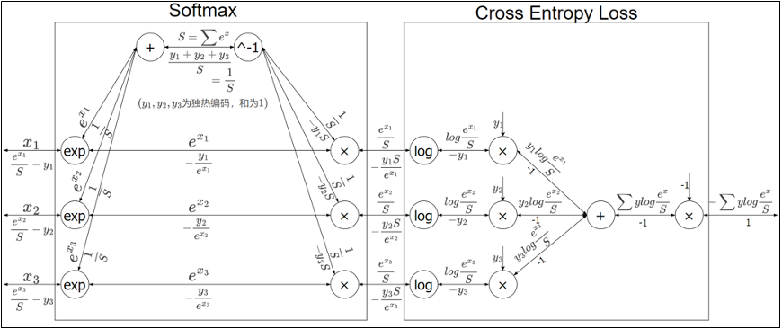

# 反向传播算法

## 一、反向传播算法
1. 定义：反向传播（Backward Propagation或Back Propagation，BP算法）指的是计算神经网络参数梯度的方法。简言之，该方法根据微积分中的链式法则，按相反的顺序从输出层到输入层遍历网络。该算法存储了计算某些参数梯度时所需的任何中间变量
2. 计算图：计算图将计算过程用图表示出来。这里说的图是数据结构中的图，通过多个节点和边表示（连接节点的直线称为边）

   
3. 反向传播算法
   - 反向传播将局部导数向反方向传递，传递的原理基于链式法则。反向传播时将信号乘以节点的局部导数然后传递给下一个节点
   - 对于复合函数$z=(x+y)^2$，令$u=x+y$，则
     $$
     \frac{\partial z}{\partial x}
     = \frac{\partial z}{\partial u} \cdot \frac{\partial u}{\partial x}
     = 2u \times 1
     = 2(x+y)
     $$
   - 在计算图上，我们可以利用反向（从右到左）的传递来方便地计算导数。这个过程，就可以叫做反向传播（backward）

## 二、反向传播的计算
1. 反向传播的计算：每次做数值运算（加减乘除等）操作时，就会涉及到函数值的变化，也就会涉及到反向传播
   - 加法节点的反向传播：对于$z = x + y$，
     $$
     \frac{\partial z}{\partial x} = 1,\quad \frac{\partial z}{\partial y} = 1
     $$
     因此加法的反向传播会将上游传来的值原样向下游传递。
   - 乘法节点的反向传播：对于$z = xy$，
     $$
     \frac{\partial z}{\partial x} = y,\quad \frac{\partial z}{\partial y} = x
     $$
     因此乘法的反向传播会将上游传来的值乘以输入的翻转向下游传递。从反向角度计算的话，就是将另一分支的值乘以当前梯度（如下图，x分支的反向传播 = E * 另一分支的y）
     - 乘法节点反向传播表达式
     
     
2. 激活函数层（既可以隐藏层也可以输出层）的反向传播计算：激活函数层处理的是
   - ReLU的反向传播
     - ReLU函数
       $$f(x)=\max(0,x)=\begin{cases}0,&x\le0\\x,&x>0\end{cases}$$
     - ReLU导函数
       $$f'(x)=\begin{cases}0,&x<0\\1,&x>0\end{cases}$$ 
     - ReLU反向传播表达式
     
       
     - 代码实现：
       ```python
       class Relu:
           # 初始化
           def __init__(self):
               # 内部属性，记录哪些x<=0
               self.mask = None
           # 前向传播
           def forward(self, x):
               self.mask = (x <= 0)
               y = x.copy()
               # 将 x<=0 的值都赋为0
               y[self.mask] = 0
               return y
           # 反向传播
           def backward(self, dy):
               dx = dy.copy()
               # 将 x<=0 的值都赋为0
               dx[self.mask] = 0
               return dx
       ```
   - Sigmoid的反向传播
     - Sigmoid函数
       $$f(x) = \frac{1}{1+e^{-x}}$$
     - Sigmoid导函数
       $$f'(x) = \frac{1}{1+e^{-x}} \left(1 - \frac{1}{1+e^{-x}}\right) = f(x)(1-f(x))$$
     - sigmoid反向传播表达式
       
       
     - 代码实现
       ```python
       # Sigmoid
       class Sigmoid:
           # 初始化
           def __init__(self):
               # 定义内部属性，记录输出值y，用于反向传播时计算梯度
               self.y = None
           # 前向传播
           def forward(self, x):
               y = sigmoid(x)
               self.y = y
               return y
           # 反向传播
           def backward(self, dy):
               dx = dy * (1.0 - self.y) * self.y
               return dx
       ```
3. Affine层的反向传播计算
   - Affine层：在全连接层中，每个输入节点与输出节点相连，通过权重矩阵和偏置进行线性变换，这种操作在几何领域称为仿射变换（Affine transformation，几何中，仿射变换包括一次线性变换和一次平移，分别对应神经网络的加权求和运算与加偏置运算）
   - 所谓的Affine层就是在激活函数之前的一步计算操作，它计算了从该层的输入通过线性变换得到的数值
   - Affine层的反向传播
   - Affine反向传播表达式
   
   
   - 代码实现
   ```python
   # Affine 仿射层
   class Affine:
       # 初始化
       def __init__(self, W, b):
           self.W = W
           self.b = b
           # 对输入数据X做保存，方便反向传播计算梯度
           self.X = None
           self.original_x_shape = None
           # 将权重和偏置参数的梯度（偏导数）保存成属性，方便梯度下降法计算
           self.dW = None
           self.db = None
       # 前向传播
       def forward(self, X):
           self.original_x_shape = X.shape
           self.X = X.reshape(X.shape[0], -1)
           y = np.dot(self.X, self.W) + self.b
           return y
       # 反向传播
       def backward(self, dy):
           dX = np.dot(dy, self.W.T)
           dX = dX.reshape(*self.original_x_shape)
           self.dW = np.dot(self.X.T, dy)
           self.db = np.sum(dy, axis=0)
           return dX
   ```
4. 激活函数（softmax，只能用于输出层的激活函数）的反向传播计算
   - softmax函数
     $$y_k = \frac{e^{x_k}}{\sum_{i=1}^n e^{x_i}},\quad k=1\sim n$$
   - softmax导函数
     $$\frac{\partial y_k}{\partial x_i}=\begin{cases}y_k(1-y_i), & k=i \\-y_k y_i, & k\neq i\end{cases}$$
   - 一般情况下，计算完softmax函数会用于计算Loss，因此将softmax和交叉熵误差损失函数合并起来，计算表达式（计算图）如下：
   
     
   - 简化得到：
   
     
   - 为什么激活函数softmax和交叉熵误差损失函数被设计为那么复杂的一个式子？简化后的梯度变化是一个非常简单的式子，这些都是设计得到的
   - 代码实现
     ```python
     # 输出层
     class SoftmaxWithLoss:
     # 初始化
         def __init__(self):
             self.loss = None
             self.y = None
             self.t = None
         # 前向传播
         def forward(self, X, t):
             self.t = t
             self.y = softmax(X)
             self.loss = cross_entropy(self.y, self.t)
             return self.loss
         # 反向传播
         def backward(self, dy=1):
             n = self.t.shape[0]
             # 如果是独热编码的标签，就直接代入公式计算
             if self.t.size == self.y.size:
                 dx = self.y - self.t
             # 如果是顺序编码的标签，就需要找到分类号对应的值，然后相减
             else:
                 dx = self.y.copy()
                 dx[np.arange(n), self.t] -= 1
             return dx / n
     ```
5. 反向传播的意义
   - 没有反向传播的时候，每更新一层的参数都需要完整的计算一遍从该层到输出的全部前向传播，再计算损失函数值会造成大量的重复计算；
   - 存在反向传播后，每次先计算最后一层的梯度更新变化，然后更新最后一层的参数；再依赖链式传播法则计算上一层的梯度变化，来更新参数，避免了大量的重复计算
   - 每次具体计算时，将梯度保存下来，需要的时候直接取出，反向传播计算梯度并更新参数

## 三、反向传播算法实战
1. 代码见(ML&DL&NLP/DL/code&data/chap4/digit_recognizer_nn_train_bp.py)
2. 使用反向传播大大加快了计算速度
   - 传统的数值微分计算梯度的方案，每次计算一个参数都需要量次完整的前向传播（计算`f(xi + .)`和`f(xi - .)`来模拟当前特征点处的梯度）
   - 反向传播方案中，计算梯度只需要一次前向传播 + 反向传播，所有的梯度就都计算出来了，大大加快了计算速度


参考资料：
1. 尚硅谷深度学习视频：https://www.bilibili.com/video/BV1MRJmzSEaa
