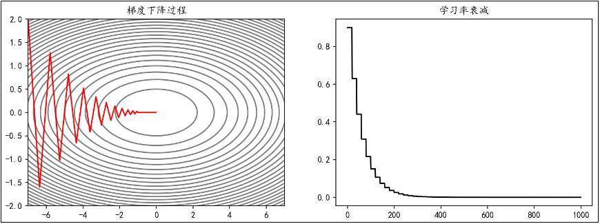
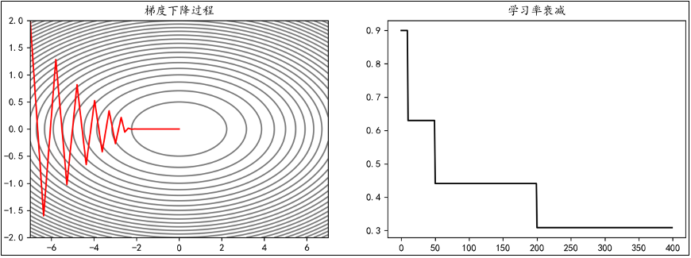
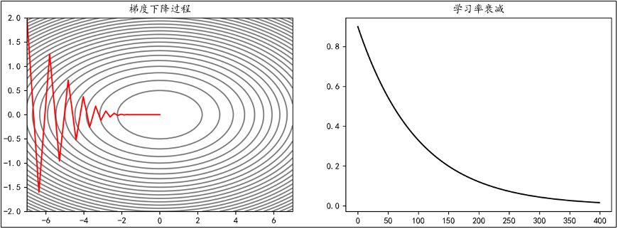

# 学习的技巧

## 一、深度学习
1. 当神经网络的层数加深时，往往可以有效地提高识别精度；特别是对于大规模的复杂问题，通常都需要用更多的层来分层次传递信息，而且可以有效减少网络的参数数量，从而使得学习更加高效。使用深度神经网络进行的学习就被称为深度学习（Deep Learning）。
2. 如果想提高模型效果，有两种方向：一种是加深网络层级数目，另一种是加大每一层的节点数量
   - 加深网络：网络层级加深，参数量不会显著增长，例如学习10个特征转变为学习15个特征，`a --> 5 --> 5`变为`a --> 5 --> 5 --> 5`，只需要新引入25个参数
   - 加大节点数量：每一层的参数量会迅速增长，例如学习10个特征转变为学习15个特征，`a --> 10`变为`a --> 15`，需要新引入5a个参数

## 二、当神经网络层级加深时遇到的经典问题——梯度消失和梯度爆炸
1. 梯度消失：在某些神经网络中，随着网络深度的增加，梯度在隐藏层反向传播时倾向于变小。这就意味着，前面隐藏层中的神经元要比后面的学习起来更慢。
   - 为什么倾向于变小：sigmoid函数计算出来的值本身就属于[0,1]之间，层数加深以后，多个小于0的小数连乘，传到前面的时候，梯度已经很小了
   - 前面参数的梯度经过传递变化很小，但是后面的参数还没有学习完毕，前面的参数学习比后面的越来越慢
   - 一个天真的解决方案：初始参数设定的大一点不就行了
     - 怎么来的这个方案：梯度 * 参数矩阵 才能最终确定变化量，梯度小，参数矩阵大一点不就行了么？
     - 虽然能避免梯度消失，但是又带来了梯度爆炸的问题
2. 梯度爆炸：如果我们进行一些特殊的调整（比如初始权重很大），可以让梯度反向传播时不会明显减小，从而解决梯度消失的问题；然而这样一来，前面层的梯度又会变得非常大，引起网络不稳定，无法再从训练数据中学习。这种现象被称为“梯度爆炸”
3. 基于梯度学习的深度神经网络中，梯度本身是不稳定的，前面层中的梯度可能“消失”，也可能“爆炸”。对于梯度消失和梯度爆炸，一个容易理解的解释是：当反向传播进行很多层的时候，每一层都对前一层梯度乘以了一个系数；因此当这个系数比较小（小于1）时，越往前传递，梯度就会越小、训练越慢，导致梯度消失；而如果这个系数比较大，则越往前传递梯度就会越大，导致梯度爆炸。
4. 主要问题是梯度消失，梯度爆炸是为了解决梯度消失才出现的
5. 简单方法
   - 结构方案
      - 修改模型结构：修改激活函数，不用sigmoid
      - 修改模型结构：<font color='green'>加入正则化项</font>
      - 修改模型结构：残差、RNN、LSTM、Attention
   - 限制方案
      - 数据：数据标准化处理等
      - 参数：<font color='red'>参数初始化要合适</font>
      - 学习算法的学习方式：<font color='yellow'>更新参数方法的优化</font>

## <font color='yellow'>二、更新参数方法的优化</font>
1. 随机梯度下降法的缺点：
   - 局部最优解：陷入局部最优，尤其在非凸函数中，难以找到全局最优解。
   - 鞍点：陷入鞍点，梯度为0，导致训练停滞。
   - 收敛速度慢：高维或非凸函数中，收敛速度较慢。
   - 学习率选择：学习率过大导致震荡或不收敛，过小则收敛速度慢。
2. 学习优化方法——动量法`Momentum`
   - 动量法简介：
     - 原始的梯度下降法直接使用当前梯度来更新参数：
       $$W \leftarrow W - \eta \nabla$$
     - 而Momentum（动量法）会保存历史梯度并给予一定的权重，使其也参与到参数更新中：
       $$v \leftarrow \alpha v - \eta \nabla$$
       $$W \leftarrow W + v$$
       - $v$：历史（负）梯度的加权和
       - $\alpha$：历史梯度的权重
       - $\nabla$：当前梯度，即 $\frac{\partial L}{\partial W}$
       - $\eta$：学习率
   - 动量法比随机梯度下降法收敛速度更快，遇到鞍点能够冲过去不会停留、能够避免SGD的剧烈震荡
   - 代码实现
     ```python
     # 动量法
     class Momentum:
         # 初始化
         def __init__(self, lr=0.01, momentum=0.9):
             self.lr = lr
             self.momentum = momentum
             self.v = None   # 历史负梯度的加权和
         # 更新方法
         def update(self, params, grads):
             # 对v进行初始化
             if self.v is None:
                 self.v = {}
                 for key, val in params.items():
                     self.v[key] = np.zeros_like(val)
             # 按照公式进行参数更新
             for key in params.keys():
                 self.v[key] = self.momentum * self.v[key] - self.lr * grads[key]
             params[key] += self.v[key]
     ```
3. 学习率衰减
   - 为什么出现了学习率衰减？动量法在学习速率比较大的时候，可能带来新的震荡问题；比如很快就找到了最小值点，但是因为历史的动量比较大，导致多次震荡不能收敛
   - 另外，学习率是最容易调整的参数
   - 学习率衰减：学习率衰减是一种平衡策略，初期使用较大学习率快速接近最优解，后期逐渐减小学习率，使参数更稳定地收敛到最优解
   - 衰减的几种实现方式
     - 等间隔衰减：每隔固定的训练周期（epoch），学习率按一定的比例下降，也称为“步长衰减”。例如，使学习率每隔20 epoch衰减为之前的0.7
     
     - 指定间隔衰减：在指定的epoch，让学习率按照一定的系数衰减。例如，使学习率在epoch达到[10,50,200]时衰减为之前的0.7
     
     - 指数衰减：学习率按照指数函数进行衰减。例如，使学习率以0.99为底数，epoch为指数衰减：
     
4. AdaGrad（Adaptive Gradient，自适应梯度）
   - 定义：AdaGrad会为每个参数适当地调整学习率，并且随着学习的进行，学习率会逐渐减小
     $$h \leftarrow h + \nabla^2$$
     $$W \leftarrow W - \eta \frac{1}{\sqrt{h}} \nabla$$
     - $h$：历史梯度的平方和，随着迭代越来越大，因为是历史的平方和，相当于累加一个正数
     - $\nabla^2$：梯度的平方（逐元素平方），即 $\frac{\partial L}{\partial W} \odot \frac{\partial L}{\partial W}$
     - $\odot$：对应矩阵/张量元素的乘法（哈达玛积，Hadamard Product）
     - $\nabla$：当前梯度，$\frac{\partial L}{\partial W}$
     - $\eta$：学习率
   - 使用AdaGrad时，学习越深入，更新的幅度就越小。如果无止境地学习，更新量就会变为0，完全不再更新
   - 实现：
     ```python
     # AdaGrad
     class AdaGrad:
     # 初始化
         def __init__(self, lr=0.01):
             self.lr = lr
             self.h = None
         # 更新方法
         def update(self, params, grads):
             # 对h进行初始化
             if self.h is None:
                 self.h = {}
                 for key, val in params.items():
                     self.h[key] = np.zeros_like(val)
             # 按照公式进行参数更新
             for key in params.keys():
                 self.h[key] += grads[key] * grads[key]
                 params[key] -= self.lr * grads[key] / (np.sqrt(self.h[key]) + 1e-8)
     ```
5. RMSProp（Root Mean Square Propagation，均方根传播）
   - 定义：RMSProp（Root Mean Square Propagation，均方根传播）是在AdaGrad基础上的改进，它并非将过去所有梯度一视同仁的相加，而是逐渐遗忘过去的梯度，采用指数移动加权平均，呈指数地减小过去梯度的尺度
     $$h \leftarrow \alpha h + (1-\alpha) \nabla^2$$
     $$W \leftarrow W - \eta \frac{1}{\sqrt{h}} \nabla$$
     - $h$：历史梯度平方和的指数移动加权平均
     - $\alpha$：权重，历史梯度的影响程度
     - $W$：待更新的参数
     - $\eta$：学习率（learning rate）
     - $\nabla$：参数的梯度
     - $\nabla^2$：参数梯度的平方
   - AdaGrad的优化，收敛速度也很快
   - 实现：
   ```python
   # RMSProp
   class RMSProp:
       # 初始化
       def __init__(self, lr=0.01, decay=0.99):
           self.lr = lr
           self.decay = decay
           self.h = None
       # 更新方法
       def update(self, params, grads):
       # 对h进行初始化
           if self.h is None:
               self.h = {}
               for key, val in params.items():
                   self.h[key] = np.zeros_like(val)
       # 按照公式进行参数更新
       for key in params.keys():
           self.h[key] *= self.decay
           self.h[key] += (1 - self.decay) * grads[key] * grads[key]
           params[key] -= self.lr * grads[key] / (np.sqrt(self.h[key]) + 1e-8)
   ```
6. Adam（Adaptive Moment Estimation，自适应矩估计）融合了Momentum和AdaGrad的方法
   - 定义：
     $$v \leftarrow \alpha_1 v + (1-\alpha_1)\nabla$$
     $$h \leftarrow \alpha_2 h + (1-\alpha_2)\nabla^2$$
     $$\hat{v} = \dfrac{v}{1-\alpha_1^t}$$
     $$\hat{h} = \dfrac{h}{1-\alpha_2^t}$$
     $$W \leftarrow W - \eta\,\dfrac{\hat{v}}{\sqrt{\hat{h}}}$$
     - $\eta$：学习率
     - $\alpha_1, \alpha_2$：一次动量系数和二次动量系数
     - $t$：迭代次数，从 1 开始
   - 结合了多种算法的优点和缺点，比如动量法不会停留在驻点上，但是会导致“冲”过了；
   - 实现：
   ```python
   # Adam
   class Adam:
       # 初始化
       def __init__(self, lr=0.01, alpha1=0.9, alpha2=0.999):
           self.lr = lr
           self.alpha1 = alpha1
           self.alpha2 = alpha2
           self.v = None
           self.h = None
           self.t = 0  # 迭代次数
       # 更新方法
       def update(self, params, grads):
           # 初始化v和h
           if self.v is None:
               self.v, self.h = {}, {}
               for key, val in params.items():
                   self.v[key] = np.zeros_like(val)
                   self.h[key] = np.zeros_like(val)
           self.t += 1 # 迭代次数+1
           # 按照当前的迭代次数，改变学习率参数
           lr_t = self.lr * np.sqrt(1 - self.alpha2**self.t) / (1 - self.alpha1**self.t)
           # 遍历所有参数，按公式进行更新
           for key in params.keys():
               # self.v[key] = self.alpha1 * self.v[key] + (1 - self.alpha1) * grads[key]
               # self.h[key] = self.alpha2 * self.h[key] + (1 - self.alpha2) * (grads[key] ** 2)
               # 换一种方式计算
               self.v[key] += (1 - self.alpha1) * (grads[key] - self.v[key])
               self.h[key] += (1 - self.alpha2) * (grads[key] ** 2 - self.h[key])
               params[key] -= lr_t * self.v[key] / (np.sqrt(self.h[key]) + 1e-8)
   ```
7. 哪种算法比较好？
   - 大部分SGD的改进方法都要比SGD本身要好，迭代速度会更快、不容易停在驻点上等
   - 具体的算法选择，需要依赖于具体场景，算法也相当于一个超参数
   - AdamGrad：适用于学习率比较大的场景，会自动削减学习率
   - Momentum：较短迭代次数中就可能很快收敛，但是会“冲过”，学习率不必太大

## <font color='red'>三、参数初始化</font>
1. 参数初始化决定了最优化问题的起始点在哪里，甚至也部分决定了最终的效果；目前参数仅仅在Affine层出现，但是往往我们需要结合后面的激活函数来确定参数的起始值，因为激活函数的输入就是上一层的输出
2. 方案一：常数初始化
   - 方案：所有权重参数初始化为一个常数
   - 特性1：避免全零初始化，因为全零经过计算后第一层的输出都一样，下一层没法进行学习
   - 特性2：将权重初始值设为0将无法正确进行学习。严格地说，不能将权重初始值设成一样的值。因为这意味着反向传播时权重全部都会进行相同的更新，被更新为相同的值（对称的值）。这使得神经网络拥有许多不同的权重的意义丧失了。为了防止“权重均一化”（瓦解权重的对称结构），必须随机生成初始值。
3. 方案二：秩初始化
   - 方案：权重参数初始化为单位矩阵
   - 特性1：单位矩阵，即主对角线上元素为1，其它元素为0
   - 特性2：用的还是很少
4. 方案三：正态分布初始化
   - 方案：权重参数按指定均值μ与标准差σ正态分布初始化。
   - 特性：因为不能直接将权重初始化为相同的常数，所以需要对参数进行随机初始化。最常见的随机分布就是 正态分布（也叫 高斯分布）
5. 方案四：均匀分布初始化
   - 方案：权重参数在指定区间内均匀分布初始化
6. 方案五：Xavier初始化（Glorot初始化）
   - 方案：Xavier初始化根据输入和输出的神经元数量调整权重的初始范围，确保每一层的输出方差与输入方差相近。
     - 标准差：$\sqrt{2/(n_{in}+n_{out})}$
     - 取值区间：$[-\sqrt{6/(n_{in}+n_{out})}, \sqrt{6/(n_{in}+n_{out})}]$
     - $n_{in}$：输入神经元数量
     - $n_{out}$：输出神经元数量
   - Xavier初始化适用于Sigmoid、Tanh等激活函数，能有效**缓解**梯度消失或爆炸问题。
   - 只能缓解问题，因为sigmoid本身就是[0,1]之间的值，深度学习一定存在梯度消失的问题
7. 方案六：He初始化（kaiming初始化）
   - 方案：He 初始化根据输入的神经元数量调整权重的初始范围
     - 权重服从**均值为 0**，**标准差为 $\sqrt{2/n_{in}}$** 的正态分布
     - 权重服从区间 $[-\sqrt{6/n_{in}}, \sqrt{6/n_{in}}]$ 内的均匀分布。
     - $n_{in}$：输入神经元的数量（输入维度）
   - He 初始化主要适用于 ReLU 及其变体（如 Leaky ReLU、PReLU 等）激活函数，可有效缓解 ReLU 激活后梯度消失或爆炸的问题。
8. **如果激活函数是sigmoid或者Tanh，尽量使用Xavier初始化来缓解梯度消失的问题**
9. **如果激活函数是ReLU，尽量使用He初始化来缓解梯度消失的问题**

## <font color='green'>四、正则化</font>
1. 正则化本身用于提高模型的泛化能力，避免过度拟合；该思想同样适用于避免深度学习中的梯度消失问题
2. 方案一：Batch Normalization批量标准化【线性层之后，激活函数层之前】
   - 思想：给神经网络每层的输入“做标准化”，让数据分布更规整，模型学起来又快又稳，还不容易学偏（过拟合）
     - 打个比方：没有BN正则化的学习，就好比今天学简单的、明天学复杂的、后天可能学了个其他学科的；存在BN之后，保持数据经过标准化处理，能够具有更好的分布
     - 优点：
       - 训练快：学习率能设更大，模型收敛速度翻倍
       - 更稳定：不会因为数据分布乱，导致梯度消失 / 爆炸
       - 抗过拟合：不用依赖太多其他技巧（比如 Dropout），模型不容易学偏
   - 方案：Batch Normalization 最重要的目的是调整各层的激活值分布，使其拥有适当的广度。BN 层通常放置在**线性层（全连接层/卷积层）之后**、**激活函数之前**
     - **计算批次均值**：$\mu = \frac{1}{n} \sum_{i=1}^n x_i$（$n$ 为批次中样本数量，$x_i$ 为单个样本的激活值）
     - **计算批次方差**：$\sigma^2 = \frac{1}{n} \sum_{i=1}^n (x_i - \mu)^2$
     - **标准化处理**：$\hat{x} = \frac{x - \mu}{\sqrt{\sigma^2 + \varepsilon}}$（$\varepsilon$ 为极小值，通常取 $10^{-5}$，防止分母为 0）
     - **缩放与平移**：$y = \gamma \hat{x} + \beta$
     - 关键参数说明
       - $\varepsilon$：微小值，核心作用是避免分母为 0
       - $\gamma$：缩放系数，可通过模型训练自动学习调整
       - $\beta$：平移偏置，可通过模型训练自动学习调整
   - 特性1：通常在线性层之后，激活函数之前
   - 特性2：对应地，反向传播的时候需要计算更多梯度变化
3. 方案二：权值衰减
   - 方案：在模型学习过程中对大的权重进行「惩罚」，可有效抑制过拟合，这种方法被称为**权值衰减**。过拟合的常见诱因之一就是权重参数取值过大。权值衰减的核心是在损失函数中加入权重的范数惩罚项，最常用的是 L2 范数的平方：
     $$L' = L + \frac{1}{2} \cdot \lambda \cdot \|W\|^2$$
     - 参数说明
       - $\|W\|$：权重 $W=(w_1, w_2, \dots, w_n)$ 的 L2 范数，计算公式为：$$\|W\| = \sqrt{w_1^2 + w_2^2 + \dots + w_n^2}$$
       - $\lambda$：控制正则化强度的超参数（$\lambda$ 越大，对大权重的惩罚越重）
   - 类似机器学习中的正则化操作
4. 方案三：Dropout随机失活、暂退法【激活函数层之后，线性层之前】
   - 方案：Dropout 是一种在模型训练过程中**随机关闭部分神经元**的正则化方法，核心目的是提升模型的泛化能力和鲁棒性。
     - 训练阶段：
       - 以概率 $p$ 随机将部分神经元的输出置为 0（关闭神经元），迫使网络不依赖特定神经元，避免过拟合；
       - 未被关闭的神经元的输出值会按 $1/(1-p)$ 的比例缩放，保证输出的**期望值不变**。
     - 测试阶段：
       - 不启用 Dropout，所有神经元保持激活状态；
       - 不对神经元输出做任何缩放处理
   - 核心特性与适用场景
     - 隐式集成效果：每次训练迭代相当于训练一个不同的子网络，测试时所有子网络的输出融合，近似模型集成的效果；
     - 适用范围：可用于全连接层和卷积层，**对大规模复杂网络的正则化效果尤为显著**；
     - 放置位置：通常部署在**激活函数之后**、**线性层（全连接层/卷积层）之前**。


参考资料：
1. 尚硅谷深度学习视频：https://www.bilibili.com/video/BV1MRJmzSEaa