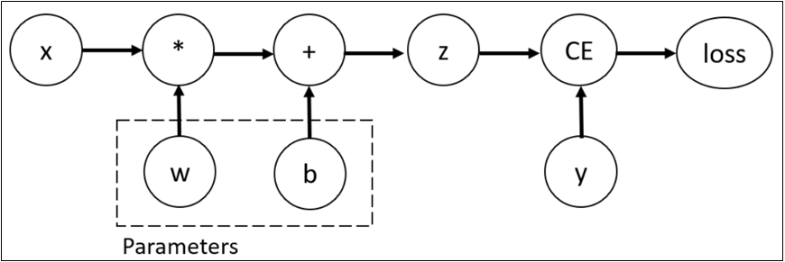

# PyTorch简介

## 一、张量
1. 什么是张量？Tensor（张量）是PyTorch的核心数据结构。张量在不同学科中有不同的意义，在深度学习中张量表示一个多维数组，是标量、向量、矩阵的拓展。
2. 创建张量
   ```python
   import torch
   
   # 1. 使用小写的tensor创建的张量，只能传内容，不能传形状
   # 创建标量张量
   tensor1 = torch.tensor(10)
   # 使用列表创建张量
   tensor2 = torch.tensor([1,2,3])
   # 使用numpy创建张量
   tensor3 = torch.tensor(np.array([[1,2,3], [2,3,4]]))
   
   # 2. 使用大写的Tensor创建的张量，里面的数据类型默认就是float32，可以传内容或者形状
   # 创建指定形状的张量
   tensor4 = torch.Tensor(3,2,4)
   tensor5 = torch.Tensor([3,2,4])
   
   # 3. 创建指定类型的tensor
   tensor6 = torch.IntTensor(2,3)
   tensor7 = torch.tensor([1,2,3], dtype=torch.int64)
   
   # 4. 指定区间的张量创建
   # torch.arange(start, end, step) 在区间[start,end)中创建步长为step的张量
   tensor8 = torch.arange(10, 30, 2)

   # torch.arange(end) 创建区间为[0,end)，步长为1的张量
   tensor9 = torch.arange(6)
   
   # torch.linspace(start, end, steps) 在区间按元素数量创建张量
   tensor10 = torch.linspace(10, 30, 5)

   torch.logspace(start, end, steps, base)在区间[start,end]之间生成steps个数，并以base为底，区间内的数为指数创建张量
   tensor11 = torch.logspace(1, 3, 3, 2)

   # 5. 按照数值填充张量
   tensor12 = torch.full(size, value) # 创建指定形状的按指定值填充的张量
   
   # 6. 随机填充张量
   tensor13 = torch.randn(size) # 创建标准正态分布的，指定形状的张量
   tensor14 = torch.normal(mean,std,size) # 创建自定义正态分布的，指定形状的张量
   tensor15 = torch.randperm(10) # 生成0-9的随机打乱的张量
   ```


## 二、张量操作
1. 张量数据转换类型
   ```python
   import torch
   tensor1 = torch.tensor([1,2,3])
   tensor2 = tensor1.type(torch.float32)
   
   tensor3 = tensor1.double()
   tensor4 = tensor1.long()
   ```
2. 张量转数组
   ```python
   # 将Tensor转换为ndarray，但是是共享内存的，可以用copy避免
   import torch
   tensor1 = torch.rand(3, 2)
   numpy_array = tensor1.numpy()
   ```
3. 数组转张量
   ```python
   # 将ndarray转换为Tensor，但是是共享内存的，可以用copy避免
   numpy_array = np.random.randn(3)
   tensor1 = torch.from_numpy(numpy_array)
   ```

## 三、张量计算
1. 基本运算
   - +、-、*、/加减乘除
   - add()、sub()、mul()、div()加减乘除，不改变原数据
   - add_()、sub_()、mul_()、div_()加减乘除、修改原数据
   - neg()、neg_()取负
   - pow()、pow_()求幂
   - sqrt()、sqrt_()求平方根
   - exp()、exp_()以e为底数求幂
   - log()、log_()以e为底求对数
2. 哈达玛积：对应元素直接相乘
   - 两个矩阵对应位置元素相乘称为哈达玛积（Hadamard product）
   - 使用*、mul()实现两个形状相同的张量之间对位相乘
   ```python
   import torch

   tensor1 = torch.tensor([[1, 2], [3, 4]])
   tensor2 = torch.tensor([[1, 2], [3, 4]])
   print(tensor1 * tensor2)
   print(tensor1.mul(tensor2))
   ```
3. 张量的矩阵乘法运算
   - mm()严格用于二维矩阵相乘
   - @、matmul()支持多维张量，按最后两个维度做矩阵乘法，其他维度相同，或者至少一个张量对应维度为1，广播后进行运算
   ```python
   import torch

   # 2维矩阵的矩阵乘法
   tensor1 = torch.tensor([[1, 2, 3], [4, 5, 6]])
   tensor2 = torch.tensor([[1, 2], [3, 4], [5, 6]])
   print(tensor1)
   print(tensor2)
   # 二维张量使用mm就可以
   print(tensor1.mm(tensor2))
   print(tensor1 @ tensor2)
   print(tensor1.matmul(tensor2))
   print()
   
   # 3维张量的矩阵乘法
   # 第一个张量 m * y * x
   # 第二个张量 m * x * z
   # 相当于m个矩阵相乘，第一个张量的最后一维必须等于第二个张量的矩阵中间维
   # 相乘的两个张量，最后面两个维度必须符合矩阵计算要求
   tensor1 = torch.tensor([[[1, 2, 3], [4, 5, 6]], [[6, 5, 4], [3, 2, 1]]])
   tensor2 = torch.tensor([[[1, 2], [3, 4], [5, 6]], [[6, 5], [4, 3], [2, 1]]])
   print(tensor1)
   print(tensor2)
   print(tensor1 @ tensor2)
   print(tensor1.matmul(tensor2))
   # 高维张量不能用mm
   ```
4. 节省内存
   - 运行一些操作时可能导致为新的结果分配内存，例如`X=X@Y`，发现`id(X)`会指向另一个位置，这是因为Python首先计算`X@Y`，为结果分配新的内存，再令X指向内存中的新位置
   - 如果后续X不再重复使用，可以使用`X[:] = X @ Y`来减少内存开销
   ```python
   # 替代 X = X + 10，节省内存
   X += 10
   # 替代 X = X @ Y，节省内存
   # 但是数据格式不一致的话，可能会被广播或者报错，理论上格式不一致就是应该开辟一个新的空间来记录
   X[:] = X @ Y
   ```

## 四、张量统计运算
1. 基本运算
   - sum()求和
   - mean()求均值
   - max()/min()求最大/最小值及其索引
   - argmax()/argmin()求最大值/最小值的索引
   - std()求标准差
   - unique()去重
   - sort()排序
2. 实战
   ```python
   import torch
   
   tensor1 = torch.randint(1, 9, (3, 2, 4))
   # 对第一个维度求和，相当于降维[3,2,4]变为[2,4]的一个矩阵，对哪个维度求和就相当于降哪个维度
   tensor1.sum(dim=0)
   
   # 求均值
   tensor2 = torch.randint(1, 9, (3, 2, 4)).float()
   tensor.mean(dim=2)
   
   # 求最大最小值和对应的值和索引
   tensor2.max()
   tensor2.max(dim=2)
   
   # 求最大最小值对应的索引
   tensor2.argmin()
   ```

## 五、张量的索引操作
1. 简单索引，通过索引定位元素，需要注意负数索引代表从后开始取
   ```python
   import torch
   tensor1 = torch.randint(1, 10, (3, 5, 4))
   print(tensor1) 
   # tensor([[[2, 6, 7, 2],
   #     [9, 1, 9, 1],
   #     [3, 5, 4, 3],
   #     [7, 4, 6, 6],
   #     [4, 7, 4, 9]],

   #    [[4, 2, 7, 2],
   #     [5, 8, 9, 1],
   #     [1, 8, 1, 2],
   #     [6, 6, 2, 5],
   #     [3, 2, 3, 3]],

   #    [[8, 4, 2, 3],
   #     [2, 4, 8, 9],
   #     [1, 1, 1, 7],
   #     [3, 3, 3, 2],
   #     [7, 1, 7, 7]]])
   
   print(tensor[1,2,3])
   # 取0维所有，第一维第三个，第二维不筛选
   print(tensor1[:, 3])
   # tensor([[7, 4, 6, 6],
   #    [6, 6, 2, 5],
   #    [3, 3, 3, 2]])
   
   # 取 第0维最后一个，第1维1到3(包含3),第2维0到2(包含2)
   print(tensor1[-1:, 1:4, 0:3])
   # tensor([[[2, 4, 8],
   #     [1, 1, 1],
   #     [3, 3, 3]]])
   ```
2. 列表索引：使用列表进行索引
   ```python
   # 取0号矩阵的第三行 和 1号矩阵的第二行
   # 逗号代表维度之间的区分
   print(tensor1[[0, 1], [3, 2]])
   
   # 取 第0维第0，第1维第1、2 和 第0维第1，第1维第1、2
   # 第一个列表中套了列表，代表广播
   print(tensor1[[[0], [1]], [1, 2]])
   ```
3. 布尔索引
   ```python
   # 选取符合条件的行：首元素大于5
   mask = tensor1[:, :, 0] > 5
   print(mask)
   # tensor([[ True,  True,  True, False, False],
   #      [ True, False, False,  True,  True],
   #      [ True,  True, False, False,  True]])
   print(tensor1[mask])
   # tensor([[8, 4, 7, 4],
   #      [8, 6, 9, 7],
   #      [9, 5, 8, 5],
   #      [8, 7, 6, 5],
   #      [6, 6, 4, 9],
   #      [8, 6, 7, 6],
   #      [8, 7, 2, 5],
   #      [8, 3, 6, 7],
   #      [8, 3, 7, 8]])
   ```

## 六、张量的形状操作
1. 交换维度：虽然改变了形状，但是形状本身受限制于每个维度的数据本身限制
   ```python
   # 1）transpose()交换两个维度
   import torch
   
   tensor1 = torch.randint(1, 9, (2, 3, 6))
   print(tensor1)
   print(tensor1.transpose(1, 2))  # 交换第1维和第2维
   
   # 2）permute()重新排列多个维度
   import torch
   
   tensor1 = torch.randint(1, 9, (2, 3, 6))
   print(tensor1)
   print(tensor1.permute(2, 0, 1))  # (2, 3, 6)->(6, 2, 3)
   ```
2. 调整形状：只要数字总数一致，其他的随便reshape
   ```python
   # 1）reshape()调整张量的形状
   import torch
   
   tensor1 = torch.randint(1, 9, (3, 5, 4))
   print(tensor1)
   print(tensor1.reshape(6, 10))
   print(tensor1.reshape(3, -1))
   
   # 2）view()调整张量的形状，本质上是创建了一个视图，要求内存连续
   # is_contiguous()判断是否内存连续
   # contiguous()转换为内存连续
   
   import torch
   
   tensor1 = torch.randint(1, 9, (3, 5, 4))
   print(tensor1)
   print(tensor1.is_contiguous())  # is_contiguous()判断是否内存连续
   print(tensor1.view(-1, 10))
   
   tensor1 = tensor1.T
   print(tensor1.is_contiguous())  # is_contiguous()判断是否内存连续
   print(tensor1.contiguous().view(-1))  # contiguous()强制内存连续
   # 张量转置后，内存不连续了
   ```
3. 增加或者删除维度
   ```python
   # 1）unsqueeze()在指定维度上增加1个维度
   import torch
   
   tensor1 = torch.tensor([1, 2, 3, 4, 5])
   print(tensor1)
   # tensor([1, 2, 3, 4, 5])
   
   # 在0维上增加一个维度
   print(tensor1.unsqueeze(dim=0))
   # tensor([[1, 2, 3]])
   
   # 在1维上增加一个维度
   print(tensor1.unsqueeze(dim=1))
   # tensor([[1],
   #    [2],
   #    [3]])
   
   # 2）squeeze()删除大小为1的维度
   import torch
   
   tensor1 = torch.tensor([1, 2, 3, 4, 5])
   print(tensor1.unsqueeze_(dim=0))
   print(tensor1.squeeze())
   ```

## 七、张量拼接操作
1. 张量拼接：按照已有维度拼接；除了拼接维度，其他维度的必须一致
   ```python
   import torch

   tensor1 = torch.randint(1, 9, (2, 2, 5))
   tensor2 = torch.randint(1, 9, (2, 1, 5))
   print(tensor1)
   print(tensor2)
   print(torch.cat([tensor1, tensor2], dim=1))
   ```
2. 张量堆叠：张量堆叠，按新维度堆叠。所有张量形状必须一致
   ```python
   import torch

   torch.manual_seed(42)
   tensor1 = torch.randint(1, 9, (3, 1, 5))
   tensor2 = torch.randint(1, 9, (3, 1, 5))
   print(tensor1)
   print(tensor2)
   
   # 支持指定维度堆叠，前两个维度不变，在第三个维度上堆叠
   tensor3 = torch.stack([tensor1, tensor2], dim=2)
   print(tensor3)
   print(tensor3.shape)
   ```
   
## <font color='yellow'>八、自动微分模块</font>
1. Tensor类详解
   ```text
   一些属性：
   1. data：用于记录数据
   2. requires_grad：是否需要计算梯度，bool类型
   3. grad：梯度
   4. dtype：类型
   5. grad_fn：记录梯度上计算了哪些操作，反向传播的时候用于计算梯度
   ```
2. 实战——计算梯度
   ```python
   import torch
   w = torch.rand(1, 2, requires_grad=True)
   b = torch.rand(1, 2, requires_grad=True)
   
   x = torch.tensor(10)
   y = torch.tensor([[3.0]])
   
   z = w * x + b
   print(z)
   # tensor([[6.7516, 5.7521]], grad_fn=<AddBackward0>)
  
   print(x.is_leaf)
   # True
   
   loss = torch.nn.MSELoss()
   loss_value = loss(z, y)
   print(loss_value)
   # tensor(10.8241, grad_fn=<MseLossBackward0>)
   
   # 反向传播
   loss_value.backward()
   print(w.grad)
   print(b.grad)
   ```
3. 下面计算图中x、w、b为叶子节点，即最基础的节点。叶子节点的数据并非由计算生成，因此是整个计算图的基石，叶子节点张量不可以执行in-place操作（不能在原地计算，不能用带`_`的这种操作）。而最终的loss为根节点。可通过is_leaf属性查看张量是否为叶子节点。
   
4. 自动微分原理
   - 自动微分的关键就是记录节点的数据与运算。数据记录在张量的data属性中，计算记录在张量的`grad_fn`属性中。
   - 计算图根据搭建方式可分为静态图和动态图，PyTorch是动态图机制，在计算的过程中逐步搭建计算图，同时对每个Tensor都存储`grad_fn`供自动微分使用。
   - 若设置张量参数`requires_grad=True`，则PyTorch会追踪所有基于该张量的操作，并在反向传播时计算其梯度。依赖于叶子节点的节点，requires_grad默认为True。当计算到根节点后，在根节点调用`backward()`方法即可反向传播计算计算图中所有节点的梯度。
   - 非叶子节点的梯度在反向传播之后会被释放掉（除非设置参数`retain_grad=True`）。而叶子节点的梯度在反向传播之后会保留（累积）。通常需要使用`optimizer.zero_grad()`清零参数的梯度。
   - 有时我们希望将某些计算移动到计算图之外，可以使用`Tensor.detach()`返回一个新的变量，该变量与原变量具有相同的值，但丢失计算图中如何计算原变量的信息。换句话说，梯度不会在该变量处继续向下传播。
     ```python
     x = torch.tensor(2.0, requires_grad=True)
     y = x.detach()
     print(x)
     print(y)
     # tensor(2., requires_grad=True)
     # tensor(2.) 做了detach之后的变量，失去了requires_grad=True
     # 但是底层上x、y的数据data是共享的
     
     print(x.untyped_storage().data_ptr())
     print(y.untyped_storage().data_ptr())
     # 打印一致
     # 更改x会更改y的数据，反之亦然
     ```
     ```python
     # 定义：y = x * x、u = y.detach()、z = u * x，最后调用z.sum().backward()【这里使用sum只是获取一个标量来反向传播，没有实际意义】
     # 反向传播函数计算 z = u * x 关于x的偏导数时将u作为常数处理，而不是 z = x * x * x 关于x的偏导数
     # detach后的变量参与计算图运算，数据只会当成常数
     ```
5. detach()与data的区别：优先使用detach()或者不去修改data地只读
   - detach()获取数据更规范，会被自动微分模块集中管理起来
   - data相当于直接釜底抽薪，获取最底层的数据，更改以后容易出错，因为自动微分模块不知晓，没有像detach()一样的处理措施

## 九、pytorch实战——机器学习案例：线性回归
1. 通过PyTorch训练一个模型一般分为以下4个步骤：
   - 准备数据
   - 构建模型
   - 定义损失函数与优化器
   - 模型训练
2. 代码实现(见ML&DL&NLP/DL/code&data/chap6/linear_regression.py)


参考资料：
1. 尚硅谷深度学习视频：https://www.bilibili.com/video/BV1MRJmzSEaa

