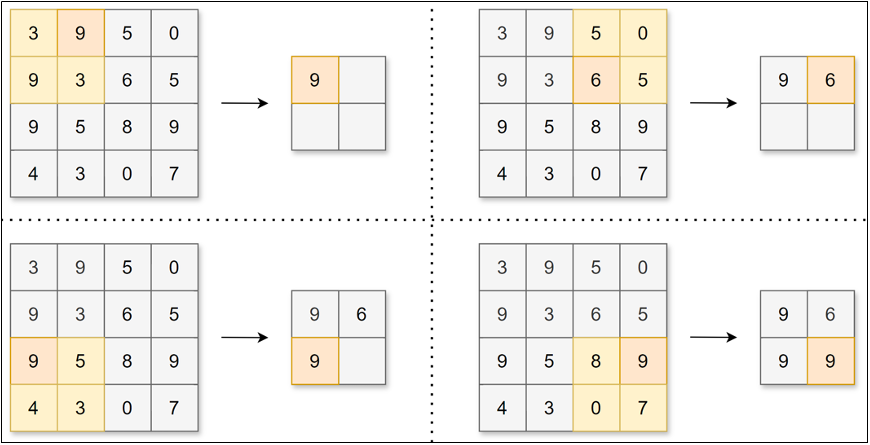

# 卷积神经网络

## 一、卷积神经网络（CNN）概述
1. 卷积神经网络：Convolutional Neural Network，CNN，是一种专门处理网格状数据（比如图片、语音）的神经网络，用“卷积操作”替代传统的全连接，通过“局部感知 + 参数共享”的方式，高效提取数据的空间特征
2. 卷积神经网络常被用于图像识别、语音识别等各种场合。它在计算机视觉领域表现尤为出色，广泛应用于**图像分类**、**目标检测**、**图像分割**、**语音识别**等任务。卷积神经网络的灵感来自于动物视觉皮层组织的神经连接方式，单个神经元只对有限区域内的刺激作出反应，不同神经元的感知区域相互重叠从而覆盖整个视野。
3. 卷积神经网络中新出现了卷积层和池化层，下图是一个CNN的结构
   
   
   - 卷积层用于提取输入数据的局部特征
   - 池化层用于降维，增强鲁棒性并防止过拟合
   - 全连接层用于整合特征并输出结果
4. 在已有的神经网络基础上加入了新的层，来提高模拟效果

## 二、卷积层
1. 传统全连接层有什么不足？
   - 无法利用空间结构信息：全连接层能够很好地处理行类型的数据（如一条记录），但是对表格类型的数据（如一张图像），全连接层的解决方案是将参数打平变为一维向量，丢失了原图像中的位置信息
   - 参数爆炸，难以训练：全连接层将参数打平后，待训练的参数数量暴增，学习的难度加大
   - 不具备局部感受野：全连接层全局建模，没有“只看局部”的能力，无法高效提取局部特征
   - 不具备权重共享：全连接层的每一个参数都是独立的，没有共享机制，同样的特征出现在不同位置时，需要重新学习，效率极低，泛化能力差
2. 数学上的卷积运算：卷积（Convolution）是分析数学中一种重要的运算，分为连续型卷积和离散型卷积，核心是两个函数的“加权叠加”。
   - 连续型卷积（最通用定义）：设 $f(x)$ 和 $g(x)$ 是定义在 $\mathbb{R}$ 上的可积函数，二者的卷积记为 $f * g$，定义为：
     $$
     (f * g)(x) = \int_{-\infty}^{+\infty} f(\tau) \cdot g(x - \tau) d\tau
     $$
     - 符号说明：
       - $\tau$：积分变量（也常用 $t$ 表示），仅作为积分占位符；
       - $f(\tau)$：被卷函数（输入）；
       - $g(x - \tau)$：卷积核（滤波器），$x - \tau$ 表示核的“翻转+平移”；
       - 积分区间：$\mathbb{R}$（实数域），实际工程中常简化为有限区间。
   - 离散型卷积（数字信号/图像处理常用）：对于离散序列 $f[n]$ 和 $g[n]$，卷积记为 $f * g$，定义为：
     $$
     (f * g)[n] = \sum_{k=-\infty}^{+\infty} f[k] \cdot g[n - k]
     $$
     - 符号说明：
       - $k$：求和变量；
       - $n$：输出序列的索引；
       - 机器学习/图像处理中，常限定 $k$ 为卷积核的尺寸范围（如 3×3 核取 $k=-1,0,1$）。
   - 二维卷积（图像卷积专用）：在图像处理中，二维函数 $f(x,y)$（图像）与 $g(x,y)$（卷积核）的卷积定义为：
     $$
     (f * g)(x,y) = \int_{-\infty}^{+\infty} \int_{-\infty}^{+\infty} f(\tau,\upsilon) \cdot g(x - \tau, y - \upsilon) d\tau d\upsilon
     $$
     离散形式（实际工程中使用）：
     $$
     (f * g)[i,j] = \sum_{m} \sum_{n} f[m,n] \cdot g[i - m, j - n]
     $$
3. 数学计算**卷积**对应的现实意义：类似一个滑动窗口（以一维数据为例）
   ```python
   f = [2,3,5,1,4,6,3,2,5]
   g = [1/3, 1/3, 1/3] # 可以看作是卷积核或者滤波器
   # 默认计算全部 mode='full'
   print(np.convolve(f,g))
   # [0.66666667 1.66666667 3.33333333 3.         3.33333333 3.66666667
      4.33333333 3.66666667 3.33333333 2.33333333 1.66666667]
   
   # 计算：
   # f*g(0) = f(0) * g(0) 
   # f*g(1) = f(1) * g(0) + f(0) * g(1)
   # f*g(2) = f(2) * g(0) + f(1) * g(1) + f(0) * g(2)
   # f*g(3) = f(3) * g(0) + f(2) * g(1) + f(1) * g(2) + f(0) * g(3)，由于g(3) = 0，实际上就是前三项
   # f*g(4) = f(4) * g(0) + f(3) * g(1) + f(2) * g(2) + f(1) * g(3) + f(0) * g(4)，由于后两项都是零，实际上也就是前三项
   
   # mode='vaild'，只计算有效的，也就是滑动窗口是满的情况才记录，其他的情况不记录
   print(np.convolve(f,g, mode='valid'))
   # [3.33333333 3.         3.33333333 3.66666667 4.33333333 3.66666667
   #  3.33333333]
   # 在这种计算方式下，就没有f*g(0)、f*g(1)了
   ```
4. 卷积层实现细节
   - 卷积运算：卷积层对数据进行卷积运算，卷积运算相当于图像处理中的滤波器计算（滤波计算 = 用小矩阵在图上滑动加权求和，用来模糊、锐化、去噪、找边缘。）
     - 对于输入数据，卷积运算以一定间隔滑动卷积核的窗口并应用。将各个位置上卷积核的元素和输入的对应元素相乘，然后再求和（也称为乘积累加运算、矩阵的内积）
     
       
     - 具体实现上，按照上述数学公式计算卷积值就可以了
   - 填充：有时要向输入数据的周围填入固定的数据，这称为填充（padding）
     - 为什么要填充？如果不填充的话，由于卷积核通常不是1*1的，就导致经过卷积层计算后输出的矩阵行数和列数都会缩水，运用填充可以令数据形状在经过卷积运算后保持不变
     
       
     - 填充相当于在原来数据的外面整个包装一层数据，为了不影响原来数据的计算，该层数据通常是零
   - 步幅：应用卷积核的位置间隔称之为步幅（stride）
     - 可以看到填充和步幅都会影响输出数据的形状大小。增大填充，输出数据形状大小会变大；增大步幅，输出数据形状大小会变小
     
       
     - 假设输入数据形状为$(H,W)$，卷积核大小为$(FH,FW)$，填充为$P$，步幅为$S$，输出数据形状为$(OH,OW)$，可得：
       $$
       OH = \frac{H + 2P - FH}{S} + 1
       $$
       $$
       OW = \frac{W + 2P - FW}{S} + 1
       $$
5. 三维数据的卷积运算
   - 必要性：图像是3维数据，除了长、宽外还需要处理通道方向，用于代表某一个地方的三原色值；仅仅认为图片是二维数据是不足以代表图像
   - 三维数据的卷积计算细节
     - 一句话总结：卷积核是三维的，计算时将所有通道的计算值统一加和，最终计算得到的是二维的卷积值；如果希望与原输入的维度保持不变，往往需要多个卷积核来实现
     - 使用1个形状为$(C,FH,FW)$的卷积核，对形状为$(C,H,W)$的输入数据进行卷积运算，输出1张形状为$(OH,OW)$特征图，即输出的通道数为1
     
       
     - 若想在通道方向获得多个卷积运算的输出，需要使用多个卷积核
     
       
6. 卷积层API使用
   ```python
   torch.nn.Conv2d(in_channels, out_channels, kernel_size, stride, padding, bias)
   # in_channels:输入通道数
   # out_channels:输出通道数
   # kernel_size:卷积核大小，可以是一个数字（默认是正方形），或者是一个元组tuple，源码中卷积核使用的是kaiming初始化方案
   # stride:步幅
   # padding:填充幅度
   # bias:是否需要偏置，false or true
   ```
   ```python
   import torch
   from matplotlib import pyplot as plt
   
   # 读取图片
   img = plt.imread("./code&data/chap8/duck.jpg")
   print(img.shape) # (1080, 1080, 3)
   
   # 调整图片变为卷积层的输入特征图
   input = torch.tensor(img).permute(2, 0, 1).float()
   print(input.shape) # torch.Size([3, 1080, 1080])
   
   # 定义卷积层
   conv = torch.nn.Conv2d(3, 3, (4,6), 1, 0)
   
   # 前向传播
   output = conv(input)
   
   # 将输出转化为图片数据
   # 1. 通道的值必须都在0-255之间
   output = torch.clamp(output.int(), 0, 255)
   # 2. 维度转换
   output = output.permute(1, 2, 0).detach().numpy()
   # 3. 画图需要numpy的array而不是tensor
   # 显示图片，进行对比
   fig, ax = plt.subplots(1, 2, figsize=(10,5))
   ax[0].imshow(img)
   ax[1].imshow(output)
   plt.show()
   ```

## 三、池化层
1. 池化的作用：池化层缩小长、宽方向上的空间来进行降维，能够缩减模型的大小并提高计算速度
   
   
2. 池化的类型
   - Max池化：计算窗口内的最大值【需要保留局部特征】
   - Average池化：计算窗口内的平均值【做一些模糊化处理，不需要特别细节的信息】
3. 池化层的特点：
   - 池化层没有要学习的参数
   - 池化运算按通道独立进行，经过池化运算后数据的通道数不会发生变化
   - 池化对微小偏差具有鲁棒性，数据发生微小偏差时，池化可能会返回相同的结果
4. 池化层API使用
   ```python
   torch.nn.MaxPool2d(kernel_size, stride, padding)
   torch.nn.AvgPool2d(kernel_size, stride, padding)
   ```
   ```python
   import torch
   from matplotlib import pyplot as plt
   
   # 读取图片
   img = plt.imread("./code&data/chap8/duck.jpg")
   print(img.shape) # (1080, 1080, 3)
   
   # 调整图片变为卷积层的输入特征图
   input = torch.tensor(img).permute(2, 0, 1).float()
   print(input.shape) # torch.Size([3, 1080, 1080])
   
   # 定义卷积层
   conv = torch.nn.Conv2d(3, 3, (3,3), 1, 0)
   # 定义池化层
   pool = torch.nn.MaxPool2d((24,24), 6,1)
   
   # 前向传播
   output = conv(input)
   output2 = pool(output)
   
   # 画图
   output = torch.clamp(output.int(), 0, 255)
   output = output.permute(1,2,0).detach().numpy()
   output2 = torch.clamp(output2.int(), 0, 255)
   output2 = output2.permute(1,2,0).detach().numpy()
   fig, ax = plt.subplots(1, 3, figsize=(15,5))
   ax[0].imshow(img)
   ax[1].imshow(output)
   ax[2].imshow(output2)
   plt.show()
   ```
   - 经过池化处理后，能够看到第三个图片明显更模糊，能够从更宏观的角度提取图片的信息
   
   

## 四、深度卷积神经网络发展史
1. 为什么需要更多的层数？
   - 参数数量：降低学习的参数数量，从而使学习更高效
   - 更有效地提取层次信息：有的信息本来就是分层次的，比如一张图一开始我们关注的可能是透明度、亮度等信息，后期我们要忽略这些信息来识别对应的图像内容
2. 基于CNN构建深度神经网络，可以提取出更多的图片信息，大幅提高图像识别精度
3. 卷积神经网络发展史
   - AlexNet
   - VGG
   - GoogleNet
   - ResNet
4. 快速使用
   ```python
   import torchvision.models as models
   
   # 1. AlexNet
   # pretrained=True，加载预训练模型
   alexnet = models.alexnet(pretrained=True)
   
   # 2. VGG-16
   vgg16 = models.vgg16()
   
   # 3. GoogleNet
   googlenet = models.googlenet()
   
   # 4. ResNet
   resnet50 = models.resnet50()
   ```
5. Transformer在2017年被提出，虽然目前普及面非常广，但是同样也很难说Transformer就是神经网络结构的终结，因为其模型复杂，还是有很多领域和场景依旧在使用简单高效的CNN，比如边缘计算、实时目标检测等

## 五、应用案例case——服装分类
1. 数据集下载：Fashion MNIST数据集——https://www.kaggle.com/datasets/zalando-research/fashionmnist
2. 代码实现见(ML&DL&NLP/DL/code&data/chap8/fashion_category.py)


参考资料：
1. 尚硅谷深度学习视频：https://www.bilibili.com/video/BV1MRJmzSEaa
2. 《动手学深度学习PyTorch版》