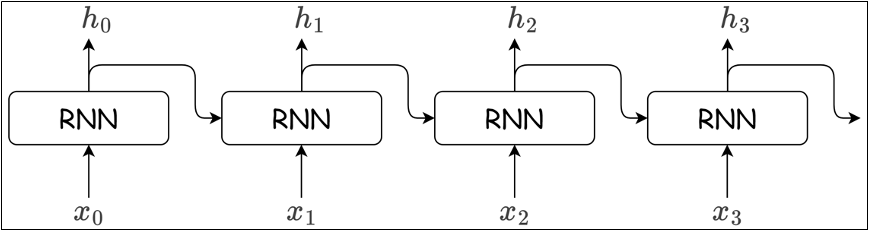

# 循环神经网络初步

## 一、自然语言处理概述
1. 自然语言处理（Natural Language Processing, NLP），是人工智能领域的一个重要分支。自然语言，指人类日常使用的语言（如中文、英文），NLP 的目标是让计算机“理解”或“使用”这些语言。
2. 传统自然语言处理方案
   - 基于同义词词典：人工定义词语之间的相关性
     - 方案定义：具有相同（同义词）或类似（近义词）含义的单词，可以归到同一个类别中；而根据单词“整体-部分”或者“上位-下位”关系，可以构建出层级的树状图
       这样，就可以构成一个庞大的“单词网络”，用它就可以教会计算机单词之间的关系，从而计算出单词的“相似度”
     - 主要缺点：
       - 需要人工逐个定义单词之间的相关性，非常费时费力
       - 新词不断出现，语言不断变化，词典维护成本极高
       - 在表现力上也有限制
   - 基于计数：使用统计算法，用周围出现的单词来表示当前位置可能出现的单词
     - 方案定义：大量的文本数据，构成了语料库。我们的目的，就是从语料库中，自动且高效地提取出语言的“本质”。最简单的做法，就是统计“词频”。
       - 分词：对词进行统计，首先需要对文本内容进行切分，找出一个个基本单元；
       - 词关联ID：给单词标上一个ID，构建单词和ID的关联字典（称为“词表”）；
       - 词向量化：用一个固定长度的向量来表示单词，也称为词的“分布式表示”。
       对每一个词，可以统计它周围出现了什么单词、出现了多少次（称为“上下文”）；把这些词频统计出来，就构成了一个向量；这个向量就可以表示当前的词了，称为“词向量”（word vector）。这样，所有词对应的向量，汇总起来就是一个矩阵，被称为 共现矩阵（co-occurrence matrix）。
     - 主要缺点：
       - 对所有词进行向量化表示的计算复杂度极高
   - 基于推理：使用神经网络
     - 方案定义：除了基于计数的方法，还可以使用推理的方法把词用向量表示出来。我们希望在已知上下文的前提下，“推测”当前位置的词是什么 利用神经网络，接收上下文信息作为输入，通过模型计算，输出各个单词可能得出现概率；从而就可以根据上下文，预测该出现的单词了

## 二、词嵌入层
1. 词嵌入：将单词用词向量来表达
   - 独热编码：容易构建，但是随着词汇量增加，向量大小会增加，且不能表示词语之间的相似度
   - 词嵌入技术
     - 首先需要对文本进行分词，再根据需要进行清洗和标准化（比如去掉标点等）
     - 构建词表，每个词对应一个索引（id2word和word2id两个索引）
     - 使用词嵌入矩阵将词索引转换为词向量
2. API使用
   ```python
   torch.nn.Embedding(num_embeddings, embedding_dim)
   # num_embeddings:词的数量，有多少个词语
   # embedding_dim:词向量的维度，词向量的维度是多少，每个词语用多少维度的向量来表达
   ```
   ```python
   import torch
   import torch.nn as nn
   import jieba
   
   text = "自然语言是由文字构成的，而语言的含义是由单词构成的。即单词是含义的最小单位。因此为了让计算机理解自然语言，首先要让它理解单词含义。"
   
   # 1. 分词
   original_words = jieba.lcut(text)
   print(original_words)
   # ['自然语言', '是', '由', '文字', '构成', '的', '，', '而', '语言', '的', '含义', '是', '由', '单词', '构成', '的', '。', '即', '单词', '是', '含义', '的', '最小', '单位', '。', '因此', '为了', '让', '计算机', '理解', '自然语言', '，', '首先', '要', '让', '它', '理解', '单词', '含义', '。']

   # 自定义一组停用词
   stopwords = {"的", "是", "而", "由", "，", "。"}
   
   # 2. 过滤停用词和标点符号
   words = [ word for word in original_words if word not in stopwords ]
   print(words)
   
   # 3. 构建词表（id2word）
   id2word = list(set(words))
   print(id2word)
   
   # 4. 构建字典，保存word到索引号的映射(word2id)
   word2id = dict()
   for id, word in enumerate(id2word):
   word2id[word] = id
   print(word2id)
   # {'自然语言': 0, '单位': 1, '理解': 2, '要': 3, '语言': 4, '让': 5, '单词': 6, '因此': 7, '文字': 8, '首先': 9, '为了': 10, '它': 11, '构成': 12, '含义': 13, '最小': 14, '即': 15, '计算机': 16}
   
   # 5. 构建一个嵌入层
   embed = nn.Embedding(num_embeddings=len(id2word), embedding_dim=5)
   
   # 6. 前向传播，传入单词索引号，得到词向量
   for id, word in enumerate(id2word):
       # 前向传播，里面传入的是张量
       word_vec = embed(torch.tensor(id))
   print(f"{id:>2}:{word:8}\t{word_vec.detach().numpy()}")
   
   # 这些并不是真实最后的结果，是基于初始化的嵌入层计算出来的，并非真实有效的词向量
   # 0:自然语言    	[0.6756485  1.1567926  1.4714301  0.06006525 0.8274371 ]
   # 1:单位      	[-0.9547002  -1.9623642   1.4999979   0.8210179  -0.01980313]
   # 2:理解      	[ 1.5148431  -0.23614424 -0.7871083   1.3706218   0.68019414]
   # 3:要       	[ 0.2817109   1.3691792   0.68404603 -0.64036214 -0.04662685]
   # 4:语言      	[ 0.11168046 -0.9685997   0.8012816  -1.0356132  -1.2301465 ]
   # 5:让       	[ 2.6092163e-01 -2.1006856e+00  5.4021608e-03 -1.4464767e-03 -7.0674491e-01]
   # 6:单词      	[ 1.6369089   0.24764079  0.03394281 -1.0797516   1.6031066 ]
   # 7:因此      	[-0.6789     -0.23241594  1.183228   -1.620567   -0.6077596 ]
   # 8:文字      	[-0.47652173 -0.37066114 -1.3330994  -0.00562555 -2.0994968 ]
   # 9:首先      	[ 0.8923304  -0.53177303  1.0241966   0.01884548 -1.1159546 ]
   # 10:为了      	[-2.4716163 -1.6041687 -1.1357589 -2.4126103 -1.172283 ]
   # 11:它       	[ 1.0621117   0.3320949   0.22146663 -1.7689841   0.5919539 ]
   # 12:构成      	[0.25455493 0.1719954  0.3139072  0.4699487  2.501754  ]
   # 13:含义      	[ 1.3574433   0.45414907 -2.0049527   0.62604654 -1.3605169 ]
   # 14:最小      	[ 0.8145774   0.612694   -1.1844188   0.7211544   0.28128174]
   # 15:即       	[ 1.4432226   1.0232238   1.2373617   0.14184418 -0.68144894]
   # 16:计算机     	[ 0.08593868 -2.4509249  -0.06978956  1.4066297   0.5301936 ]
   ```
3. 可以使用他人预训练好的词向量，如谷歌的词袋模型

## 三、循环网络层
1. 传统前馈神经网络的不足
   - 不能很好地处理时间序列数据，只能处理一条数据，多条数据之间的关联性模型无法理解
   - 使用矩阵“模拟”时间序列，并训练出来的参数也是针对矩阵的，本质还是一条数据
2. RNN简介：
   - RNN层（循环神经网络层）具有环路结构，数据可通过该环路在层内循环传递。
     - 当向RNN层输入时序数据序列 $(x_0, x_1, \dots, x_t)$ 时，该层会对应输出隐藏状态序列 $(h_0, h_1, \dots, h_t)$
   
       
     - 由图可知，各个时刻的RNN层接收传给该层的输入$x_t$和前一个时刻RNN层的输出$h_{t-1}$，据此计算当前时刻RNN层的输出$h_t$：
     
       $$
       h_t = \tanh(W_{ih} \cdot x_t + b_{ih} + W_{hh} \cdot h_{t-1} + b_{hh})
       $$
     
       - $x_t$：当前时刻的输入向量（比如你处理古诗时，一个汉字的 embedding 向量，维度是embedding_dim）
       - $h_{t-1}$：上一时刻的隐状态向量（维度就是hidden_size），隐状态维度越多，代表中间提取的信息越多，信息越不容易丢失
       - $h_t$：当前时刻的隐状态向量（维度和$h_{t-1}$一致，即hidden_size）
       - $W_{ih}$：输入到隐层的权重矩阵，形状是 (hidden_size, embedding_dim)
       - $W_{hh}$：上一隐层到当前隐层的权重矩阵，形状是 (hidden_size, hidden_size)
     - RNN层有2个权重，分别是与输入$x_t$运算的权重$W_x$，和与前一时刻RNN层的输出$h_{t-1}$（也叫隐藏状态、隐状态）运算的权重$W_h$。执行完乘积和求和运算之后使用 `tanh` 函数转换，其结果就是时刻$t$的输出$h_t$
   - API使用
     ```python
     # 创建RNN层
     rnn = torch.nn.RNN(input_size, hidden_size, num_layers)
     # input_size:输入数据的特征数量，也就是词向量的长度
     # hidden_size:隐藏状态的特征数量，输出状态的长度
     # num_layers:隐藏层的层数，如果设置多个层，前一个隐藏层的输出作为下一个隐藏层的输入
     
     # 前向传播，与平常的前向传播不同
     output, hn = rnn(input, hx)
     # input:输入数据[seq_len序列长度, batch_size批量大小, input_size]
     # hx:初始隐状态[num_layers, batch_size, hidden_size]
     # output:输出数据[seq_len, batch_size, hidden_size]
     # hn:隐状态[num_layers, batch_size, hidden_size]
     ```
3. 代码实战
   ```python
   import torch
   import torch.nn as nn
   
   rnn = nn.RNN(input_size=8, hidden_size=16, num_layers=2)
   
   # 定义输入数据
   input = torch.randn(1, 3, 8)
   # 第一个维度：代表“一个字”
   # 第二个维度：代表三个字同时并行训练
   # 第三个维度：代表每个字用几个值来表示
   hx = torch.randn(2, 3, 16)
   # 第一个维度：RNN内部有几个隐藏初始参数，也就是RNN内rnn的层数
   # 第二个维度：代表三个字同时并行训练
   # 第三个维度：hidden_size，隐状态的大小
   
   # 前向传播
   output, hn = rnn(input, hx)
   print(output)
   print(hn)
   ```

## 四、案例实战——古诗生成
1. 生成流程
   - 数据预处理
     - 定义滑动窗口大小，来确定x和y，x是前[n, n + m]个字，y是前[n + 1, n + 1 + m]个字
   - 训练模型
     - 定义模型结构
     - 隐状态数量：隐状态越多，代表RNN内部提取的信息越多，可以认为信息越不容易失真
   - 生成诗句
2. 代码见(ML&DL&NLP/DL/code&data/chap9/my_poem.py)


参考资料：
1. 尚硅谷深度学习视频：https://www.bilibili.com/video/BV1MRJmzSEaa
2. 《动手学深度学习PyTorch版》
