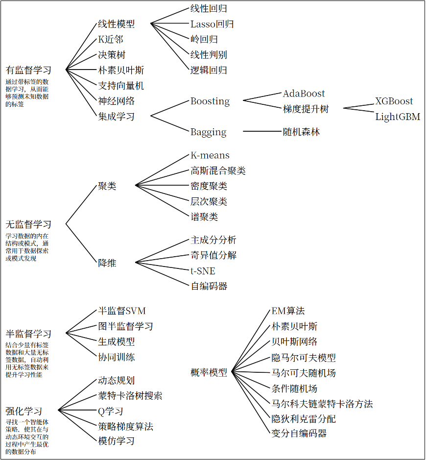

# 机器学习概览

## 一、机器学习、深度学习
1. 机器学习的概念是使用一系列模型去模拟真实世界；这个模型没有限制，可以是KNN、可以是神经网络、可以是其他各种模型
2. 深度学习是机器学习的一个子类别，深度学习使用的模型是确定的，都是深度神经网络模型；也就是说，深度学习是指定模型为深度神经网络的一种特殊的机器学习

## 二、机器学习术语
1. 数据集：数据集分为训练集、验证集、测试集
   1. 训练集：用于训练模型的数据
   2. 验证集：用于调节超参数的数据
   3. 测试集：用于评估模型性能的数据
2. 参数
   1. 参数：模型通过训练得到的值，也就是模型学习的对象
   2. 超参数：用户设置的值，不能通过训练自动学习；比如学习率，正则化系数等；可以理解为预设参数
3. 数据
   1. 样本：数据集中的一条记录，关于一个事物的描述（张三的年龄、血压、血脂，是否有心脏病）
   2. 特征：数据集中一系列反映事件或对象在某方面的表现或性质的事项，称为特征或属性（年龄、血压、血脂）
   3. 特征向量：将样本的所有特征标识为向量的形式，输入到模型中（张三、李四、王五等人每个人都构成一个向量）

## 三、机器学习基本理论
1. 机器学习三要素：模型、策略、算法
   1. 模型：总结数据的内在规律，使用哪种数学描述真实世界？（例如：线性函数、二次函数...）
   2. 策略：选择最优模型的评价准则（怎样判断一个模型是好还是坏？）
   3. 算法：选取最优模型的具体方法（怎样逐步获得最好的模型？）
2. 拓展：开发程序一样类似于机器学习三要素
   1. 模型：就是你开发出来的程序，也就是你对世界、业务的建模是什么样的？（对业务的抽象，比如电商系统）
   2. 策略：怎样评价你的开发程序好不好？DAU？点击率？（对抽象的评价，怎么评价电商系统，有哪些指标）
   3. 算法：怎么样持续优化系统，提高策略对应的指标呢？（提高抽象策略的路径，怎么提高这些指标？）
3. 机器学习分类（按照是否有监督）
   1. 有监督学习：提供数据和结果进行机器学习的过程（有监督学习获得的是对当前输入的直接正确答案，明确知道在优化什么，而且反馈及时容易区分“正确行为”）
   2. 无监督学习：提供数据不提供结果进行机器学习的过程（无监督学习是对当前输入进行无目标的规律挖掘，不知道在优化什么）
   3. 半监督学习：提供数据，结果不定提供进行机器学习的过程
   4. 强化学习：通过与环境交互，改进行为的学习过程（强化学习有明确的优化目标，但是反馈不及时且不容易区分“正确行为”）
   ```txt
   有监督学习与无监督学习的区别主要在于，是否知道自己在优化什么，在发掘哪方面的数据规律
   有监督学习：知道自己在学习的是，怎么判断一个人是否有疾病
   无监督学习：不知道自己的在学习什么
   
   有监督学习与强化学习的区别主要在于，反馈是否及时且有明确的好坏标准？
   强化学习：反馈是延迟的，而且评价通常不明确；例如下棋中最后一步才知道奖励是正的，这不代表本次比赛没有任何失误
   有监督学习：反馈是及时的，评价通常明确；例如判断一个人是不是患有疾病，数据输入后立即获知
   
   无监督学习与强化学习的区别主要在于，是否有明确的优化目标，知不知道在发掘什么规律？
   强化学习：明确优化目标就是最大reward
   无监督学习：不清楚在挖掘什么数据规律
   ```
4. 无监督学习主要是通过学习分析数据特征，如果新输入具有这种特征，那就可以认为包含这种规律并给予正向反馈
5. 监督学习主要分为分类和回归，离散情况下使用分类；连续情况下使用回归
6. 机器学习方法分类：
   
    
7. 机器学习过程
   1. 收集数据
   2. 数据清洗
   3. <font color='yellow'>特征工程：对数据的格式进行转换，确保数据适合用于机器学习</font>
   4. <font color='red'>选择算法：选择合适的算法（根据场景、数据量和数据特点进行选择）</font>
   5. <font color='green'>模型训练：使用训练数据对模型参数进行调整</font>
   6. <font color='purple'>模型评估：使用测试数据集对模型性能进行评估</font>
   7. 模型优化：提升模型效果
   8. 模型部署：将训练好的模型部署到生产环境中

## <font color='yellow'>四、特征工程</font>
1. 特征工程（Feature Engineering）：指的是通过对原始数据的处理、转换和构造，生成新的特征或选择有效的特征，从而提高模型的性能。简单来说，特征工程是将原始数据转换为可以更好地表示问题的特征形式，帮助模型更好地理解和学习数据中的规律。
2. 特征选择：特征太多，选择一部分特征；不改变也不创新，加速模型训练过程
   1. 方差评估法：计算某一个特征的方差，波动越大，代表特征越重要
   2. 随机干扰法：对不同特征分别加一个随机干扰项，如果某个特征加完干扰后模型效果显著变差，说明特征重要
   3. ...
3. 特征转换：将特征转换为另一种指标
   1. 归一化操作：将特征转换到某一个固定的区间范围内。适用于对尺度敏感的模型（KNN、SVM）
   2. 标准化操作：减去平均值除以标准差，标准化操作后的数据会被缩放为均值为0、标准差为1的分布
   3. 对数化操作：对于数量级变化比较大的数据，对数化操作非常合适
   4. 类别编码操作：
      1. 独热编码（One-hot Encoding）：将类别型变量转换为二进制列（男、女）
      2. 标签编码（Label Encoding）：将类别型变量转换为整数（红球0、绿球1、白球2，模型会认为红色和白色的距离更大，引入误导）
      3. 目标编码（Target Encoding）：用平均值代替变量
      4. 频率编码（Frequency Encoding）：按照出现的次数进行编码（红球5个=5，白球2个=2）
4. 特征构造：从无到有，构造出新的特征，基于已有的特征获取
5. 特征降维：与特征选择不同，是基于目前数据，提取出新的特征并实现降维效果
   1. 主成分分析PCA
   2. 线性判别分析LDA
   3. ...
6. 特征工程实战，真实算法中常用的特征工程方案
   1. 低方差过滤法：方差值小于某一阈值就过滤掉 
   ```python
   # 引入sklearn
   from sklearn.feature_selection import VarianceThreshold
   # 过滤掉方差小于0.9的
   vt = VarianceThreshold(0.9)
   X_filtered = vt.fit_transform(X)
   # 打印
   print(X_filtered)
   ```
   2. 相关系数法：通过计算特征与目标变量或特征之间的相关性，筛选出高相关性特征（与目标相关）或剔除冗余特征（特征间高度相关）
      1. 皮尔逊相关系数：线性相关性评估
         ```python
         import pandas as pd
         # 计算X和y之间的皮尔逊相关系数
         print(X.corrwith(y, method="pearson"))
         ```
      2. 斯皮尔曼相关系数：非线形相关性评估或者数据分布不符合正态分布的情况
         ```python
         import pandas as pd
         print(X.corrwith(y, method="spearman"))
         ```
   3. 主成分分析（PCA）：通过线形变换将高维数据投影到低维空间，同时保留数据的主要变化模式（找到一个n-1维平面，使得当前n维在这个平面上投影对应的loss最小）
   ```python
   import numpy as np
   from sklearn.decomposition import PCA
   from sklearn.preprocessing import StandardScaler
   
   # 构造数据
   n_samples = 1000
   ## 第1个主成分方向
   component1 = np.random.normal(0, 1, n_samples)
   ## 第2个主成分方向
   component2 = np.random.normal(0, 0.2, n_samples)
   ## 第3个方向（噪声，方差较小）
   noise = np.random.normal(0, 0.1, n_samples)
   ## 构造3维数据
   X = np.vstack([component1 - component2, component1 + component2, component2 + noise]).T
   
   # 标准化
   scaler = StandardScaler()
   X_standardized = scaler.fit_transform(X)
   
   # 应用PCA，将3维数据降维到2维
   pca = PCA(n_components=2)
   X_pca = pca.fit_transform(X_standardized)
   ```

## <font color='red'>五、模型评估和模型选择</font>
模型评估常用的就是损失函数；模型选择常出现的问题包括过拟合和欠拟合，解决选择模型困难的方法主要包括正则化和交叉验证
1. 损失函数：用于描述模型预测误差的大小；本质是模型参数的函数；要求非负。
2. 常见损失函数
   1. 0-1损失函数：命中即无损失，loss = 0；不命中即存在损失，loss = 1
   2. 平方损失函数：真实值与预测值的平方差（L1范数的平方）
   3. 绝对损失函数：真实值与预测值的绝对值（L1范数）
   4. 对数似然损失函数：适用于预测函数是概率的场景。【P(图片是猫) = 0.9 && P(图片是狗) = 0.1】
3. 训练误差与泛化误差
   1. 训练误差：模型在训练数据集上的平均误差，也叫经验误差
   2. 泛化误差：测试数据集上的平均误差（泛化：应用在其他场景下的适应能力）
4. 一般情况下对模型评估的策略，就是考察经验误差；当经验风险最小时，就认为取到了最优的模型。这种策略被称为经验风险最小化（empirical risk minimization，ERM）
5. 欠拟合和过拟合
   1. 拟合：是指机器学习模型在训练数据上学习到规律并生成预测结果的过程
   2. 欠拟合：是指模型在训练数据上表现不佳，无法很好地捕捉数据中的规律（学的不好，考得也不好）
   3. 过拟合：是指模型在训练数据上表现得很好，但在测试数据或新数据上表现较差的情况（学的好，考试不会）
   4. 欠拟合和过拟合的根本原因和解决办法
      1. 欠拟合
         1. 产生原因
            1. 模型复杂度不足：模型过于简单，无法捕捉数据中的复杂关系。
            2. 特征不足：输入特征不充分，或者特征选择不恰当，导致模型无法充分学习数据的模式。
            3. 训练不充分：训练过程中迭代次数太少，模型没有足够的时间学习数据的规律。
            4. 过强的正则化：正则化项设置过大，强制模型过于简单，导致模型无法充分拟合数据。
         2. 解决方案
            1. 选择更复杂的模型
            2. 增加特征或者改进特征工程
            3. 增加训练时间和轮数
            4. 减少正则化强度
      2. 过拟合
         1. 产生原因
            1. 模型复杂度过高：模型过于复杂，参数太多。
            2. 训练数据不足：数据集太小，模型能记住训练数据的细节，但无法泛化到新数据。
            3. 特征过多：特征太多，模型可能会“记住”数据中的噪声，而不是学到真正的规律。
            4. 训练过长：训练时间过长，导致模型学习到训练数据中的噪声，而非数据的真正规律。
         2. 解决办法
            1. 减少模型复杂度：降低模型的参数数量、使用简化的模型或降维来减小模型复杂度。
            2. 增加训练数据：收集更多数据，或通过数据增强来增加训练数据的多样性。
            3. 使用正则化：引入L1、L2正则化，避免过度拟合训练数据。
            4. 交叉验证：使用交叉验证技术评估模型在不同数据集上的表现，以减少过拟合的风险。
            5. 早停：训练时，当模型的验证损失不再下降时，提前停止训练，避免过度拟合训练集。
6. 【模型选择的方式一】正则化：是一种在训练机器学习模型时，在损失函数中添加额外项，来惩罚过大的参数，进而限制模型复杂度、避免过拟合，提高模型泛化能力的技术
   1. 基础思想：机器学习的过程是对参数进行学习的过程，正则化会惩罚过大、过多的参数；参数越大、参数数量越多，正则化惩罚越严重
      1. 原损失函数目的：更好地拟合数据集
      2. 正则化项目的：减小参数的大小，进而降低模型复杂度；
   2. 惩罚的思想主要来源于“参数越大，惩罚越大”，因此有常见的以下三种方式：
      1. L1正则化（Lasso回归）：参数的绝对值和 * 正则化系数
         1. 正则化系数是**超参数**，越大代表对模型的简单化要求越高，模型越简单，但是也越容易出现欠拟合的问题
         2. L1正则化倾向于创建稀疏模型，也就是很多参数项为零（<font color='red'>**_为什么？因为求导后损失函数中正则化项实际上是一个参数，优化目标就是参数本身趋近于零_**</font>）
      2. L2正则化（Ridge回归）：参数的平方方和 * 正则化系数
         1. L2正则化倾向于使得所有模型都变小，0.1的平方变为0.01，而不是像L1正则化一样趋向于零（<font color='red'>_**为什么？因为求导后损失函数中正则化项带有参数项，优化目标是参数项前面的系数趋近于零，而不是参数本身趋近于零**_</font>）
         2. 使得模型更平滑，防止过拟合
         3. 实际使用中L2正则化会更多
      3. ElasticNet正则化（弹性网络回归）：（参数的平方和 * 比例 + 参数的绝对值之和 * (1 - 比例)）* 正则化系数
         1. 可以理解为L1和L2正则化的结合版
         2. 拥有两个超参数：比例 和 正则化系数，比例决定了L1正则化和L2正则化的权重
   3. 正则化：加入惩罚项来限制参数大小，简化模型，自动适配，降低模型选择的成本
   4. 用模型模拟数据的时候，可以先直接选择一个复杂的模型再正则化实现拟合
7. 【模型选择方式二】交叉验证：一种评估模型泛化能力的方法，通过将数据集划分为多个子集，反复进行训练和验证，以减少因单次数据划分带来的随机性误差
   1. 交叉验证种类：
      1. 简单交叉验证：数据集一部分分为训练，一部分分为测试；容易因为数据划分不合理导致模型性能不好
      2. k折交叉验证：将数据分为k份，每次训练选择其中k-1，剩余的1个用于测试；迭代k轮取平均值
      3. 留一交叉验证：每次就留一个用于验证，其余全部用于训练；相当于特殊的k折交叉验证，性能开销比较高
   2. **交叉验证使用场景：用于确定超参数和模型的选择**

## <font color='green'>六、模型求解算法</font>
模型求解算法，研究的是怎么样逐步获得更优秀的模型的算法
1. 经验风险最小化与结构风险最小化
   1. 经验风险最小化：当损失函数最小时，就认为取到了最优的模型。这种策略被称为经验风险最小化（empirical risk minimization，ERM）
   2. 结构风险最小化：当正则化后的损失函数最小时，就认为取到了最优的模型。这种策略被称为结构风险最小化（Structural Risk Minimization，SRM）
2. 所谓的模型求解算法，就是一个最优化问题，求目标函数（损失函数）值最小的时候，参数的值
3. 具体解决方法包括：
   1. 解析法：如果模型损失函数的最小值可以通过数学公式进行严格推导，得到一个解析解，就直接得到了最优模型的全部参数，这种方法称作解析法
      1. 特点：目标函数必须可导，且**导数方程有解析解**
      2. 优点：直接准确，计算高效
      3. 缺点：适用条件苛刻，计算复杂度高
      4. 案例：线性回归问题使用最小二乘法实现
   2. 梯度下降法：每次计算当前点的梯度，选择梯度方向或者负梯度方向进行迭代，直到梯度接近零或者达到最大迭代次数
      1. 特点：每次的步长叫做学习率，下次参数 = 本次参数 + 学习率 * 当前梯度
      2. 优点：计算量比较小，约束比较小
      3. 缺点：容易陷入局部最优解，收敛比较慢
      4. 常用方法
         1. 批量梯度下降（Batch Gradient Descent，BGD）：每次使用全部训练数据计算梯度
            - 稳定收敛；但是计算开销大
         2. 随机梯度下降（Stochastic Gradient Descent，SGD）：每次迭代随机选择一个样本计算梯度
            - 速度快，适合大规模数据场景；但是梯度更新方向不稳定，优化过程震荡较大，难以收敛
         3. 小批量梯度下降（Mini-batch Gradient Descent，MBGD）：每次迭代选择一小批数据样本计算梯度
            - 平衡了上面两种方法，最常用
      5. 计算步骤：
         1. 初始化参数：随机选择初始参数
         2. 计算梯度：在当前参数下，计算损失函数的梯度
         3. 更新参数：沿着负梯度方向调整（梯度的计算方式：按照模型进行求一阶导数，代入当前点计算梯度）
         4. 重复迭代：满足梯度接近零或者达到了最大迭代次数等
         5. 案例
         ```txt
         数据：[x = 10, y = 15] [x = 20, y = 30]
         模型：采用线性模型 Model(x) = a * x 
         残差（模型计算值与真实值之间的差距）：Model(x) - y
         损失函数（Loss，各残差的平方和求平均）：LossFx = (Model(x) - y) ^ 2
         损失函数的梯度（注意，是对a求偏导）：Gradient(LossFx) = (Model(x) - y) * x = (ax - y) * x
         迭代目标：损失函数最小时，a的取值是多少？
         超参数预设：a初始参数(10)，学习率0.01
         # 开始迭代
         ## 第一轮迭代（x = 10, y = 15）
         计算残差：a * x − y = 10 ∗ 10 − 15 = 85
         计算梯度：(ax - y) * x = 85 ∗ 10 = 850
         更新 a：a = 10 − 0.01 ∗ 850 = 10 − 0.85 = 9.25
         
         ## 第二轮迭代（x = 20, y = 30）
         计算残差：a * x − y = 9.25 ∗ 20 − 30 = 155
         梯度：155 ∗ 20 = 3100
         更新 a：a = 9.25 − 0.01 ∗ (3100) = 9.25 - 31 = -21.75
         
         ## 第三轮迭代（x = -300，y = -450）
         计算残差：a * x − y = -21.75 × (-300) − (-450) = 6525 + 450 = 7000
         计算梯度：(ax - y) * x = 7000 × (-300) = -210000
         更新 a：a = -21.75 − 0.01 × (-2100000) = -21.75 + 21000 = 20978.25
         
         上述迭代过程，似乎逐渐远离真实值1.5，主要是学习率太大 + 随机梯度下降法的共同作用，会出现极限震荡的情况，尤其当x和y都比较大的时候，
         ...次数足够多后，a必定趋向于1.5
         ```
         6. <font color='green'>经验：随机梯度下降（极端case会导致梯度过大） + 学习率过大（步长太长，越过极值点）会导致震荡，不利于模型收敛</font>
   3. 牛顿法：牛顿法也是求解无约束最优化问题的常用方法，核心思想是利用目标函数的二阶导数信息，通过迭代逐渐逼近极值点
      1. 优点：收敛速度快；精度高
      2. 缺点：计算复杂；可能发散；适用场景更严格
      3. 由于牛顿法中需要计算黑塞矩阵的逆，这一步比较复杂；所以可以考虑用一个n阶正定矩阵来近似代替它，这种方法称为“拟牛顿法”。
4. 梯度下降法和牛顿法
   1. 梯度下降法：学习率作为超参数，利用损失函数的一阶导数执行下降
   2. 牛顿法：利用损失函数的二阶导数作为学习率，利用损失函数的一阶执行下降
   3. 一般来说，牛顿法适用于中小规模的凸优化问题

## <font color='purple'>七、模型评价指标</font>
1. 回归模型评价指标：针对这类问题，通常可以复用损失函数的定义
   1. 平均绝对误差MAE：差的绝对值之和，取平均；对异常值不敏感，评价极端case不建议使用
   2. 均方误差MSE：差的平方之和，取平均；对异常值极其敏感，评价极端case建议使用；量纲不一致
   3. 均方根误差RMSE：差的平方之和，取平均，最后开根号，保证量纲一致；对异常值一样敏感
   4. 决定系数（类似相关性系数）：对异常值敏感
2. 分类模型评价指标：对于分类问题，最常用的指标就是“准确率”，它定义为分类器对测试集正确分类的样本数与总样本数之比
3. 混淆矩阵：是一个用于帮助评价分类模型性能的工具

  |     真实值 \ 预测值     |                         正例（Positive）                         |                        负例（Negative）                        |
  |:-----------------:|:------------------------------------------------------------:|:----------------------------------------------------------:|
  | **正例（Positive）**  |    真正例（True Positive, TP）<br>定义：真实值为正例，模型也预测为正例，即正确识别的正样本    | 假负例（False Negative, FN）<br>定义：真实值为正例，但模型预测为负例，即漏判的正样本（漏检）  |
  | **负例（Negative）**  | 假正例（False Positive, FP）<br>定义：真实值为负例，但模型预测为正例，即误判为正的负样本（误报）  |   真负例（True Negative, TN）<br>定义：真实值为负例，模型也预测为负例，即正确识别的负样本   |
4. 基于混淆矩阵得到的各种评价指标
   1. 


## 八、常见的超参数
1. 正则化系数：模型的惩罚程度
2. 学习率：梯度下降法中的步长


参考资料：
1. 尚硅谷机器学习视频：https://www.bilibili.com/video/BV1BYe4z5E9z