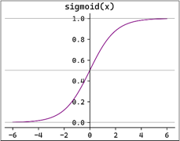

# 逻辑回归算法

## 一、逻辑回归算法简介
1. 逻辑回归是一种用于解决分类问题的统计方法，尤其适用于二分类问题。尽管名称中有“回归”，但它主要用于分类任务。
2. 逻辑回归通过将线性回归的输出映射到[0, 1]区间，来表示某个类别的概率
3. 常用sigmoid函数来做转换

    
4. sigmoid函数的导数`f(x)' = f(x) * (1 - f(x))`
5. 应用场景：（分类场景）
   - 信用评分：预测客户是否会违约（违约/不违约）
   - 欺诈检测：预测某笔交易是否是欺诈行为
   - 垃圾邮件检测：预测一封邮件是否是垃圾邮件（垃圾邮件/非垃圾邮件）
   - 广告点击预测：预测用户是否会点击某个广告（点击/不点击）
   - 图像分类：将图像分类为不同的类别（如猫、狗、鸟等）
   - 情感分析：将文本分类为正面、负面或中性情感
   - 产品质量分类：预测产品是否合格
   - 医学诊断：预测患者是否患有某种疾病（患病/未患病）
   - 蛋白质功能预测：基于蛋白质序列和结构特征预测其功能类别

## 二、工作原理
1. 先用线性回归模型获得预测值
2. 再使用映射函数和阈值来划分类别
3. 逻辑回归的损失函数和梯度
    - 损失函数：$Loss = -\frac{1}{n} \sum_{i=1}^n \left( y_i \log P(y_i=1|x_i;\beta) + (1-y_i) \log(1-P(y_i=1|x_i;\beta)) \right)$
    - 梯度：$\nabla \text{Loss} = \frac{1}{n} X^T \left( \frac{1}{1+e^{-(X\beta)}} - y \right)$
    - 梯度等于零的点太过于难以求解，使用梯度下降法逐渐逼近就好

## <font color='yellow'>**三、关键点**</font>
1. 多分类回归：逻辑回归虽然经常用于二分类问题，但是可以通过一对多以及softmax回归，来扩展到多分类任务
   - 二分类回归怎么样扩展到多分类回归？
     - 一对多回归：多个二分类器，分别计算来模拟多分类
     - softmax回归：在函数中加入示性函数（类似二分类回归中的`p & (1 - p)`）
   - 一对多回归：如果有C个类别，就训练C个二分类逻辑回归分类器
     - 实现方式：有A、B、C、D四个类别，第一次训练将A看作正类，B、C、D都看作负类
     - 优点&缺点
       - 优点：易于实现，适合于类别比较少的情况
       - 缺点：每个类别训练1个分类器，当类别数量较多时，训练时间较长
     - 实战
     ```python
     from sklearn.multiclass import OneVsRestClassifier
     # 创建OneVsRestClassifier模型
     model_ovr2 = OneVsRestClassifier(LogisticRegression())
     ```
   - softmax回归：直接扩展逻辑回归到多分类问题，使用Softmax函数将模型输出转化为概率分布；只需训练1个逻辑回归模型；预测时用1个模型；计算所有类别的概率，选择最大值若有C个类别，模型将输出C个分数
     - 实现方式：
     - 损失函数：$\text{Loss} = -\frac{1}{n} \sum_{i=1}^n \sum_{c=1}^C I(y_i=c) \log P(y_i=c \mid x_i)$，其中$I(y_i=c)$为示性函数，当$y_i=c$时值为1，反之值为0；C是类别数量
     - 优点&缺点
       - 优点：只训练1个模型，计算高效，分类一致性更好
       - 缺点：计算Softmax需要对所有类别求指数，计算量较高
     - 实战
     ```python
     from sklearn.linear_model import LogisticRegression
     # 对于多分类问题，LogisticRegression会自动使用softmax回归
     model = LogisticRegression()
     model = LogisticRegression()
     ```
2. <font color='yellow'>**特征工程选择：有明显边界条件的，选择归一化操作；没有明显边界条件的数据，普遍选择标准化操作**</font>

## 四、实战
1. 简单实战
   ```python
   # solver: 优化算法
   #   lbfgs: 拟牛顿法（默认），仅支持L2正则化
   #   newton-cg: 牛顿法，仅支持L2正则化
   #   liblinear: 坐标下降法，适用于小数据集，支持L1和L2正则化
   #   sag: 随机平均梯度下降，适用于大规模数据集，仅支持L2正则化 
   #   saga: 改进的随机梯度下降，适用于大规模数据，支持L1、L2和ElasticNet正则化
   # penalty: 正则化类型，可选l1、l2和elasticnet
   # C: 正则化强度，C越小，正则化强度越大
   # class_weight: 类别权重，balanced表示自动平衡类别权重，让模型在训练时更关注少数类，从而减少类别不平衡带来的偏差
   model = sklearn.linear_model.LogisticRegression(solver="lbfgs", penalty="l2", C=1, class_weight="balanced")
   ```
2. 手写数字识别case：见(./code&data/logistic/digit_recognizer.py)代码实战
   - 数据集
     - 图像的像素点，不需要特别复杂的特征工程
   - 特征工程
     - 归一化处理即可
   - 模型训练与评估
   - 交叉验证


参考资料：
1. 尚硅谷机器学习视频：https://www.bilibili.com/video/BV1BYe4z5E9z

