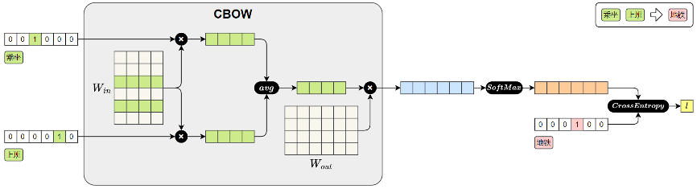
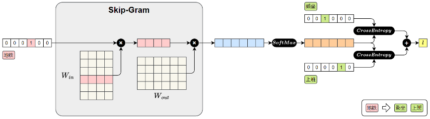

# 文本表示

## 一、文本表示（主要分为 <font color='yellow'>分词 + 词表示</font> 两个步骤）
1. 文本表示：将自然语言转化为计算机能够理解的数值形式，是绝大多数自然语言处理（NLP）任务的基础步骤
2. 文本表示的第一步通常是<font color='yellow'>分词</font>和<font color='yellow'>词表</font>构建（就是一个映射关系）
   - 分词：原始文本切分为若干具有独立语义的最小单元（即token）的过程
   - 词表：是由语料库构建出的、包含模型可识别token的集合，是一种双向映射
3. 文本表示的第二步通常是<font color='yellow'>词表示</font>，就是将一句话表示成一个向量
4. 基础概念
   - corpus：语料
   - token：词元
   - vocabulary：词汇表

## 二、分词
1. 英文分词基本分类：按照分词的粒度大小，可以分为词级分词`(word-level)`、字符级分词`(character-level)`、子词级分词`(subword-level)`
   - 词级分词：
     - 定义：将文本按词语进行切分；
     - 问题：实际应用中容易出现 `OOV(Out Of Vocabulary，未登录词)`问题。所谓OOV，是指在模型使用阶段，输入文本中出现了不在预先构建词表中的词语，比如一些网络热词等
   - 字符级分词：
     - 定义：是以单个字符为最小单位进行分词的方法，文本中的每一个字母、数字、标点甚至空格，都会被视作一个独立的token。
     - 问题：
       - 单个字符本身语义信息极弱，模型必须依赖更长的上下文来推断词义和结构，这显著增加了建模难度和训练成本
       - 输入序列也会变得更长，影响模型效率，训练成本很高
   - 子词级分词：
     - 定义：将词语切分为更小的单元——子词（subword），例如词根、前缀、后缀或常见词片段
     - 优势：与词级分词相比，子词分词可以显著缓解OOV问题；与字符级分词相比，它能更好地保留一定的语义结构
   - 目前子词级的分词是大模型最常用的手段
2. 英文子级分词算法
   - BPE（Byte Pair Encoding）：学习阶段学习的是合并规则（可以将多个相邻的字符转成一个组合），分词阶段也是在应用合并规则，直到没有新的合并规则可用
     - 应用模型：GPT、GPT-2、RoBERTa、BART 和 DeBERTa
     - 学习阶段：将语料中的词汇拆成单个字符，构建初始词表；迭代**统计**语料中出现频率最高的相邻字符对，将其加入词表；迭代进行直到规定的词表数量上限
     - 分词阶段：文本预分词（对于英文就是按照空格和标点区分），文本拆分成最小单元（单个字符），然后根据学习阶段获取到的词表进行拼接，获取到对应的词表
     - 案例：
       ```txt
       1. 原始词库： hug(10次) pug(5次) pun(12次) bun(4次) hugs(5次)
       2. 学习阶段
          2.1 拆分单个字符，构成初始词表 [h u g p n b s]
          2.2 hug = [h u g] | pug = [p u g] | pun = [p u n] | bun = [b u n] | hugs = [h u g s]
          2.3 统计相邻字符串出现的次数，hu = 15次，ug = 20次，因此分词器学习到的第一个合并规则是ug，词表更新[h u g p n b s ug]
          2.4 hug = [h ug] | pug = [p ug] | pun = [p u n] | bun = [b u n] | hugs = [h ug s]
          2.5 再次统计相邻字符串出现的次数，un = 16次，因此学习到的第二个合并规则是un，词表更新[h u g p n b s ug un]
          2.6 ...迭代直到词表长度达到标准
       3. 分词阶段
          3.1 待分词语句，bug mug
          3.2 预分词，对英文来说就是使用空格进行区分
          3.3 拆分成单个字符，bug = [b u g] | mug = [m u g]，其中m不在原始词表中，被用[UNK]替代
          3.4 应用学习到的合并规则，ug合并...un合并...
          3.5 持续迭代进行合并
       ```
     - 代码**简单**实现，见`ML&DL&NLP/NLP/code&data/chap2/token_test_bpe.py`
   - WordPiece：【注意：Google没有开源该算法的实现，以下是最佳猜测】
     - 应用模型：DistilBERT，MobileBERT，Funnel Transformers 和 MPNET
     - 学习阶段：将语料中的词汇**按照特定规则**拆成单个字符，构建初始词表；按照公示计算得分，优先合并得分比较高的，并将其加入词表，迭代进行直到规定的词表数量上限
       - 公式：`得分 = （词对出现的频率）÷（第一个元素出现的频率 × 第二个元素出现的频率）`
       - 公式解析：<font color='yellow'>wordPiece关注的是两个元素合并的概率，如果u和n经常一起出现，但是u和n单独出现的频率也很高，u和n可能并不会被优先合并</font>
       - 对比：对比BPE单纯关注两个词的共同出现频率，WordPiece关注的是合并的概率
     - 分词阶段：文本预分词（对于英文就是按照空格和标点区分），文本拆分成最小单元（单个字符），然后根据学习阶段获取到的词表进行拼接，获取到对应的词表
     - 案例：
     ```txt
     1. 原始词库： hug(10次) pug(5次) pun(12次) bun(4次) hugs(5次)
     2. 学习阶段
        2.1 拆分为单个字符，hug = [h ##u ##g] | pug = [p ##u ##g] | pun = [p ##u ##n] | bun = [b ##u ##n] | hugs = [h ##u ##g ##s]
        2.2 按照公式计算分数，如果按照BPE计算频率，第一个合并的是ug；但是wordPiece计算后，分数最高的是("##g", "##s")，进行合并然后扩充词表
        2.3 ...迭代直到词表长度达到标准
     3. 分词阶段
        3.1 待分词语句，bug bum
        3.2 预分词
        3.3 拆分成单个字符，bug = [b ##u ##g] | bum = [b ##u ##m]，其中m不在原始词表中，bum整体将会被用[UNK]替代，而不是["b", "##u", "[UNK]"]
     ```
     - 与BPE的区别
       - 合并公式不同
       - 对OOV的单词处理不同，BPE会将没有表示的部分展示为[UNK]，如 bum = ["b", "##u", "[UNK]"]，但是wordPiece会将整体变为[UNK]，如 bum = ["[UNK]"]
   - Unigram Language Model：
     - 应用模型：AlBERT，T5，mBART，Big Bird 和 XLNet
     - 学习阶段：算法获取语料中所有的字符串组合形式，然后计算剔除哪个组合的损失最小，直到获得规定的词库大小，从而达到获得分词的效果
     - 分词阶段：文本预分词（对于英文就是按照空格和标点区分），文本拆分成最小单元（单个字符），然后根据学习阶段获取到的词表进行拼接，获取到对应的词表
     - 案例：
     ```txt
     1. 原始词库： hug(10次) pug(5次) pun(12次) bun(4次) hugs(5次)
     2. 学习阶段
        2.1 获取所有的字符串子串 ["h", "u", "g", "hu", "ug", "p", "pu", "n", "un", "b", "bu", "s", "hug", "gs", "ugs"]
     3. 分词阶段
        3.1 执行剔除逻辑，看看怎么分词，能够最好地表达一个词语
        3.2 为了对一个给定的单词进行分词，我们会查看所有可能的分词组合，并根据 Unigram 模型计算出每种可能的概率，例如 pug = [p u g] | hug = [pu g]
        3.3 计算表示概率：用p+u+g表示pug的概率 = p出现的概率 * u出现的概率 * g出现的概率，用pu+g表示pug的概率 = pu出现的概率 * g出现的概率
        3.4 计算结果如下：["p", "u", "g"] : 0.000389 | ["p", "ug"] : 0.0022676 | ["pu", "g"] : 0.0022676
        3.5 pug将采用["p", "ug"]或者["pu", "g"]来标识
     ```
3. 中文分词基本类型
   - 字符级分词：按照汉字进行切分
   - 词级分词：将中文文本按照词语进行切分，切分结果贴近人类表达习惯；中文没有空格等边界，词级分词往往**依赖词典、规则和模型等来识别词语边界**
     - RNN和LSTM模型，受限于数据量，一般早年都是使用词级分词
     - 为什么早年中文 RNN/LSTM 都用「词级」？因为字级太碎，词级语义更完整。
       1. 词 = 最小语义单位、字：自 然 语 言 单独看没意义、词：自然语言 才有完整语义、RNN/LSTM 是序列建模，粒度越粗，语义越强，训练越稳。
       2. 词级序列更短，RNN/LSTM 更舒服：RNN/LSTM 最怕长序列 + 梯度消失。字级：一句话 50 字 → 50 步、词级：一句话 50 字 → 15~20 词、步数少一半，训练稳定得多。
       3. 早年中文没有成熟的子词算法：BPE、WordPiece 这些是后来为 Transformer 普及的。早年中文 NLP 只有：字级、词级。词级效果明显吊打字级，所以大家默认用词级。
   - 子词级分词：虽然中文没有英文中的子词结构，但是BPE算法可以直接使用在中文中，原理是一样的；
      - **当前主流中文大模型都是这种方案**
4. 中文分词基本算法，与英文分词的基本算法一致，包括BPE、WordPiece、Unigram等

## 三、分词工具
1. 分词工具分类
   - 【规则获取】基于词典或者模型的传统方案，主要是以词为单位进行切分（更死板）
     - jieba：https://github.com/fxsjy/jieba
     - HanLP：https://github.com/hankcs/HanLP
   - 【统计获取】基于子词建模算法的方案，从数据中学习词表（更智能化），实际上是基于统计获得的
     - Hugging Face Tokenizer
     - SentencePiece
     - tiktoken
2. jieba分词器三种模式
   - 精确模式：将句子最精确地切开，适合文本分析
     ```text
     小明毕业于北京大学计算机系
     [小明|毕业|于|北京大学|计算机系]
     ```
   - 全模式：把句子中所有的可以成词的词语都扫描出来
     ```text
     小明毕业于北京大学计算机系
     [小|明|毕业|于|北京|北京大学|大学|计算|计算机|计算机系|算机|系]
     ```
   - 搜索引擎模式：在精确模式基础上，对长词进一步切分，适合用于搜索引擎分词
     ```text
     小明毕业于北京大学计算机系
     [小明|毕业|于|北京|大学|北京大学|计算|算机|计算机|计算机系]
     ```
3. 分词工具实战
   - jieba
     ```python
     import jieba
     # 精确模式
     words_generator = jieba.cut(text) # 返回一个生成器
     words_list = jieba.lcut(text)  # 返回一个列表
     # 全模式
     words_generator = jieba.cut(text, cut_all=True)  # 返回一个生成器
     words_list = jieba.lcut(text, cut_all=True)  # 返回一个列表
     # 搜索引擎模式
     words_generator = jieba.cut_for_search(text)  # 返回一个生成器
     words_list = jieba.lcut_for_search(text)  # 返回一个列表
     
     # 返回生成器的模式，更加节省内存，不是一次性返回一整个列表
     ```
   - jieba支持自定义词典：支持用户自定义词典，以便包含 jieba 词库里没有的词，用于增强特定领域词汇的识别能力

## 四、词表示
1. 词表示：为了让模型能够理解和处理文本，必须将这些 token 转换为计算机可以识别和操作的数值形式
2. 表示方法：`one-hot`、语义化词向量、上下文相关词表示
   - 为什么`one-hot`编码不合适？
     - 维度爆炸：维度太大了，稀疏程度太高，对模型的算力、存储要求太大，而且很多是无谓开销
     - 没有语意信息：所有词之间的距离都一样（欧式距离都是$\sqrt{2}$）
     - 无法表示词语之间的关系：例如`男生 - 学生 = 男人`
     - 同义词和多义词无法表示：同义词之间的表示也是不同的，模型不明白
     - 泛化能力奇差无比：没见过的词语完全不理解
   - **语意化词向量**：静态词向量，不管句子怎么变，一个词对应的向量永远是固定的
     - Word2Vec（CBOW / Skip-gram）
     - GloVe（Global Vectors for Word Representation）
     - FastText（能处理子词、未登录词）
   - **上下文相关词表示**：同一个词，在不同句子里向量不一样；向量会根据上下文语境动态生成
     - BERT（双向上下文）
     - RoBERTa / ALBERT / DistilBERT
     - GPT（自回归，从左到右）
     - T5、XLNet 等
   - **语意化词向量**与**上下文相关词表示**的区别
     - 理解角度一
       - 语意化词向量的意义就是，每个词对应的词向量是固定的，不参与深层网络的计算
       - 上下文相关词表示是根据句子的上下文，经过`嵌入层 + 深层网络`计算得到复杂的“隐藏状态”，用这个隐藏状态来代表真实的句子；但是如果我们关注的是
     - 理解角度二
       - 语意化词向量 = 查表向量，表不会跟着模型的训练进行变化
       - 上下文向量 = 查表**初始**向量 + Transformer 注意力编码，查表的嵌入层参数会随着模型的训练动态变化
3. 语义化词向量：通过对大规模语料的学习，为每个词生成一个具有语义意义的稠密向量表示。这些向量能够在连续空间中表达词与词之间的关系，使得“意思相近”的词在空间中距离更近
   - <font color='yellow'>Word2Vec模型：基于分布假设，一个词的含义由它周围的词决定</font>，**我乘坐地铁上班** 和 **我乘坐公交上班**，地铁和公交的语义就是类似的
   - Word2Vec提供了两种典型的模型结构：
     - CBOW：continuous bag-of-words模式，输入一个词的上下文，模型的目标是预测中间的目标词
       ```txt
       我读书 -- 我 读 书
       相当于用 我 和 书 来标识 读
       ```
     - skip-gram：输入是一个中心词，模型的目标是预测其上下文中的所有词（前后的若干个词）
       ```txt
       我读书 -- 我 读 书
       相当于用 读 来标识 我 和 读
       ```
4. 【语义化词向量方案】Word2Vec训练原理
   - CBOW训练方案
     - 模型结构：CBOW计算词向量的神经网络为一层线性神经网络层 + 激活函数，CBOW模型损失值的计算图，与skip-gram相比，求平均的位置被提前了
       
       
       ```text
       CBOW 模型的前向传播过程如下：
       1. 输入上下文词（乘坐、上班）
          每个词用 one-hot 向量表示。
       2. 查找词向量（W_in）
          每个 one-hot 向量与参数矩阵 W_in 相乘，查出对应的词向量。（W_in实际上就是词向量矩阵，每一行表示一个词的向量）
       3. 平均上下文向量
          将多个上下文词向量取平均，得到一个整体的上下文表示。
       4. 预测中心词
          将平均后的上下文向量与参数矩阵W_out相乘，得到对整个词表的预测得分。
       5. Softmax 输出
          将得分输入Softmax，得到每个词作为中心词的概率分布。
       6. 计算损失
          将预测结果与真实中心词“地铁”的one-hot向量进行比对，计算交叉熵损失。
       ```
     - 最终学习到的$W_in$矩阵就是对应的词向量
   - skip-gram训练方案
     - 训练数据集生成：Skip-Gram的目标是根据中间词预测上下文，所以其训练样本`中间值 - 前后两个值`
       ```text
       前期的准备内容就是利用分词器将文本切分，然后用滑动窗口创建训练数据
       我每天乘坐地铁上班 --> 测试数据集是：
       每天 --> 我 & 乘坐
       乘坐 --> 每天 & 地铁
       地铁 --> 乘坐 & 上班
       再利用独热编码机制，转变为每行只有一个1的向量
       损失函数计算：例如输入是“乘坐”，输出结果对应“每天”和“地铁”，后期做损失函数计算时，以生成出的值与“每天”和“地铁”分别求损失，然后取平均
       ```
     - 模型结构：skip-gram计算词向量的神经网络为一层线性神经网络层 + 激活函数，Skip-Gram模型损失值的计算图：
       
       
       ```text
       前向传播过程如下：
       1. 输入中心词（地铁）
          “地铁”用 one-hot 向量表示
       2. 查找词向量（W_in）
          与参数矩阵W_in相乘，取出“地铁”对应的词向量。（W_in实际上就是词向量矩阵，每一行表示一个词的向量）
       3. 预测上下文
          将中心词向量与参数矩阵 W_out相乘，得到对整个词表的预测得分。
       4. Softmax 输出
          得分通过 Softmax 转为概率分布，表示各词作为上下文的可能性。
       5. 计算损失
          与真实上下文词“乘坐”、“上班”进行比对，计算交叉熵损失并求和，得到总损失。
       ```
     - 最终学习到的$W_in$矩阵就是对应的词向量
5. 获取Word2Vec词向量
   - 使用公开的，可从[网站](https://github.com/Embedding/Chinese-Word-Vectors)下载
     ```python
     from gensim.models import KeyedVectors
 
     # 词向量保存路径，可以从对应网站下载保存到本地
     model_path = 'sgns.renmin.word.bz2'
     model = KeyedVectors.load_word2vec_format(model_path)
     # 计算相似度
     similarity = model.similarity('地铁', '图书馆')
     print(similarity)
     0.27362388
     ```
   - 自己训练词向量，使用`gensim`进行训练
     ```python
     import jieba
     from gensim.models import Word2Vec, KeyedVectors
     import pandas as pd
     
     df = pd.read_csv('online_shopping_10_cats.csv', encoding='utf-8').dropna()
     
     sentences = [
         [token for token in jieba.lcut(review) if token.strip() != '']
         for review in df["review"]
     ]
     # 创建并训练模型，里面的init方法会调用训练方法实现参数学习
     model = Word2Vec(
         sentences,  # 已分词的句子序列
         vector_size=100,  # 词向量维度
         window=5,  # 上下文窗口大小
         min_count=2,  # 最小词频（低于将被忽略）
         sg=1,  # 1 = Skip-Gram，0 = CBOW
         workers=4  # 并行训练线程数
     )
     # 将训练好的模型保存
     model.wv.save_word2vec_format('my_vectors.kv')
     
     # 重新加载模型
     my_model = KeyedVectors.load_word2vec_format('my_vectors.kv')
     print(my_model['地铁'])
     # 剩下的场景，这个词向量就可以直接使用了
     ```

## 五、词向量的使用
1. 词向量怎么使用：训练好的词向量，通常用于初始化下游NLP任务的嵌入层。在现代深度学习的`NLP`模型中，大多数任务的输入第一层都是嵌入层。本质上，嵌入层就是一个查找表：输入是词在词汇表中的索引；输出是该词对应的向量表示。
2. 嵌入层的参数矩阵可以有两种典型的初始化方式：
   - 随机初始化：模型训练开始时，嵌入向量是随机生成的，模型会通过反向传播逐步学习每个词的表示；相当于为模型手动添加了一层`Embedding`层用于理解词语信息并用于学习
   - 使用预训练模型向量初始化`nn.Embedding.from_pretrained`：加载训练好的词向量到嵌入层中作为初始参数，这样可以为模型注入丰富的语言知识，尤其在低资源任务中优势明显。并且，加载预训练词向量后，可选择是否让嵌入层继续参与训练（选择模型参数是否冻结）
     ```python
     embedding_layer = nn.Embedding.from_pretrained(
         embedding_matrix, # 词向量矩阵，形状为(num_embeddigns,embedding_dim)
         freeze=False  # 是否冻结词向量，参数不参与梯度下降并更新
     )
     ```
     ```python
     from torch import nn
     from gensim.models import KeyedVectors
     import torch
     import jieba
     
     # 1.加载词向量
     wv = KeyedVectors.load_word2vec_format('./data/word2vec.txt')
     
     # 2.处理OOV
     unk_token = '<unk>'
     index2word = [unk_token] + wv.index_to_key
     word2index = {word: index for index, word in enumerate(index2word)}
     
     # 3.准备词向量矩阵
     num_embeddings = len(index2word)
     embedding_dim = wv.vector_size
     embedding_matrix = torch.randn(num_embeddings, embedding_dim)
     
     for index, word in enumerate(index2word):
         if word in wv:
             embedding_matrix[index] = torch.tensor(wv[word])
         # 如果是UNK，那就不登陆了，默认随机初始化的值就行
     
     # 4.创建Embedding
     embedding = nn.Embedding.from_pretrained(embedding_matrix)
     
     # 5.测试
     text = "我喜欢乘坐宇宙飞船"
     tokens = jieba.lcut(text)
     input_ids = [word2index.get(token, word2index[unk_token]) for token in tokens]
     input_tensor = torch.tensor(input_ids)
     embedding(input_tensor).shape
     ```
3. 上下文相关词表示
   - 旧有的词向量缺陷：只能为一个词分配一个固定的词表示（这种表示被称为静态词向量），但是在不同的语境下，词语的含义肯定不一样。
   - 上下文相关词表示（Contextual Word Representations），是指词语的向量表示会根据它所在的句子上下文动态变化，从而更好地捕捉其语义。一个具有代表性的模型是——ELMo（Embeddings from Language Models）。其基于LSTM 语言模型，使用上下文动态生成每个词的表示，每个词的向量由其前文和后文共同决定，是第一个被广泛应用于下游任务的上下文词向量模型。


-----
参考资料：
1. 分词体验：https://tiktokenizer.vercel.app/
2. BPE分词算法：https://hf-mirror.com/learn/llm-course/zh-CN/chapter6/5
3. WordPiece分词算法：https://huggingface.co/learn/llm-course/zh-CN/chapter6/6
4. Unigram分词算法：https://huggingface.co/learn/llm-course/zh-CN/chapter6/7
5. gensim教程：https://radimrehurek.com/gensim/auto_examples/tutorials/run_word2vec.html#sphx-glr-auto-examples-tutorials-run-word2vec-py
6. 尚硅谷教程：https://www.bilibili.com/video/BV1k44LzPEhU