# 传统序列模型


## 一、再谈RNN
1. 概述：RNN（Recurrent Neural Network，循环神经网络），会逐个读取句子中的词语，并在每一步结合当前词和前面的上下文信息，不断更新对句子的理解。通过这种机制，RNN 能够持续建模上下文，从而更准确地把握句子的整体语义。因此RNN曾是序列建模领域的主流模型，被广泛应用于各类NLP任务。随着技术的发展，RNN已经逐渐被结构更灵活、计算效率更高的Transformer 模型所取代，后者已经成为当前自然语言处理的主流方法。
2. 基础概念
   - 时间步：处理一次token，就代表执行一个时间步
   - 隐藏状态：记录上一时间步的RNN层输出，它的维度是可以人为指定的
3. 基础RNN结构：以时间步为单位，依次处理输入序列中的每个token。在每个时间步，RNN接收当前 token 的向量和上一个时间步的隐藏状态（即隐藏层的输出），计算并生成新的隐藏状态，并将其传递到下一时间步

   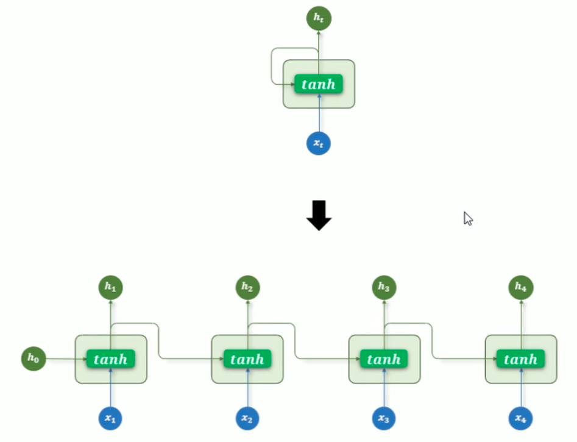
4. 多层RNN结构
   - 多层RNN结构的优势：通过多层连续提取，能够提取出更深层次的信息，达到更优秀的模型效果
   
   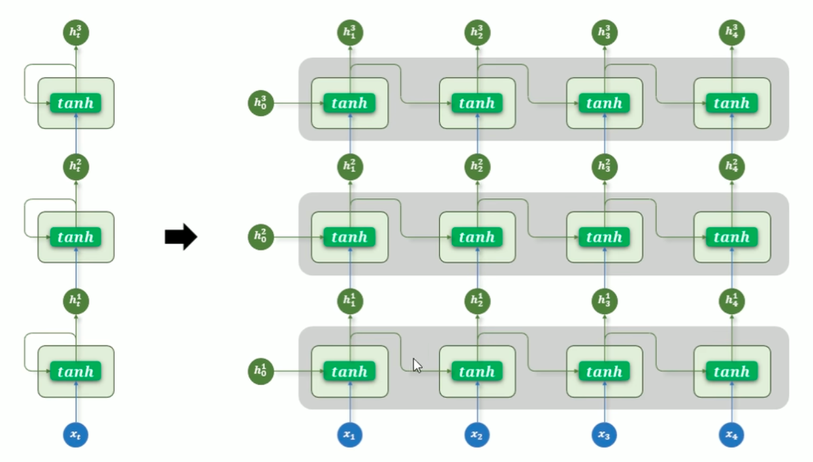
5. 双向RNN（Bidirectional RNN）结构
   - 双向RNN结构的优势：能够同时兼顾上下文，在语意标注场景能够同时根据上下文来推断当前词语的含义
     - 正向 RNN：按照时间顺序（从前到后）处理序列
     - 反向 RNN：按照逆时间顺序（从后到前）处理序列

   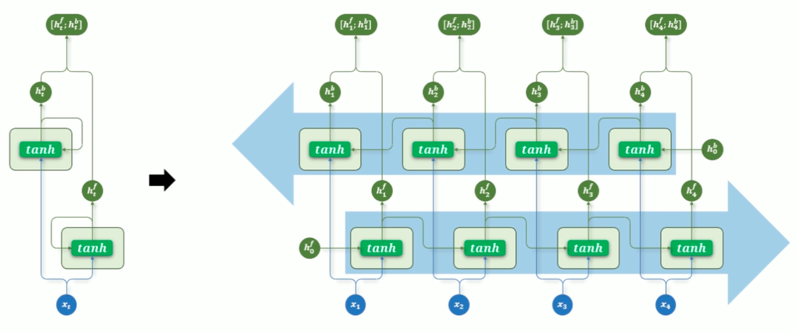
6. 多层RNN + 双向RNN组合使用，可以在兼顾上下文的情况下挖掘到更深层次的信息：多层 + 每一层都是双向的
7. 代码API（可关注[网站](https://docs.pytorch.org/docs/stable/generated/torch.nn.RNN.html)）
   - 创建RNN对象
     ```python
     torch.nn.RNN(
         input_size,  # 每个时间步输入特征的维度（词向量维度）
         hidden_size,  # 隐藏状态的维度
         num_layers=1,  # RNN 层数，默认为 1，可以配置多层
         nonlinearity="tanh",  # 激活函数，'tanh'（默认）或 'relu'
         bias=True,  # 是否使用偏置项，默认 True
         batch_first=False,  # 输入张量是否是 (batch, seq, feature)，默认 False 表示 (seq, batch, feature)
         dropout=0.0,  # 除最后一层外，其余层之间的 dropout 概率，随机失活概率参数，用于解决过拟合问题
         bidirectional=False,  # 是否为双向 RNN，默认 False
         device=None,  # 模块的初始化设备，如 'cuda', 'cpu'
         dtype=None,  # 模块初始化时的默认数据类型，如torch.float32
     )
     ```
   - 输入：input, hx
     - input
       - 维度形状说明：
         - 非批量输入（unbatched input）：`(L, H_in)`
         - 批量输入且 `batch_first=False`：`(L, N, H_in)`
         - 批量输入且 `batch_first=True`：`(N, L, H_in)`
       - input 张量包含输入序列的特征，也可以是打包后的变长序列
     - hx：初始的隐藏状态
       - 维度形状说明：
         - 非批量输入（unbatched input）：`(D * num_layers, H_out)`
         - 批量输入：`(D * num_layers, N, H_out)`
         
           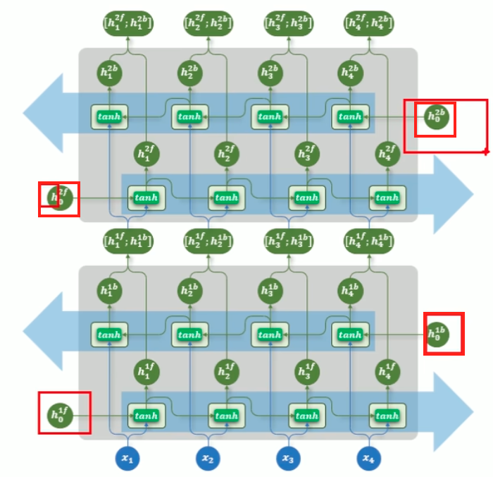
       - hx张量包含输入序列批次的初始隐藏状态。若未提供，默认值为全零
     - 符号说明

       |      符号      |          含义           |
       |:------------:|:---------------------:|
       |     $N$      |   batch size（批次大小）    |
       |     $L$      | sequence length（序列长度） |
       |     $D$      |   2（开启了双向RNN），否则为 1   |
       |   $H_{in}$   |  input_size（输入特征维度）   |
       |  $H_{out}$   | hidden_size（隐藏层特征维度）  |
   - 输出：
     - output：最终的预测结果
     - hn：最后一个时间步的隐藏状态，包含每一层的隐藏状态，可以用于连接下一个模型作为隐藏参数，大多数情况用不上

       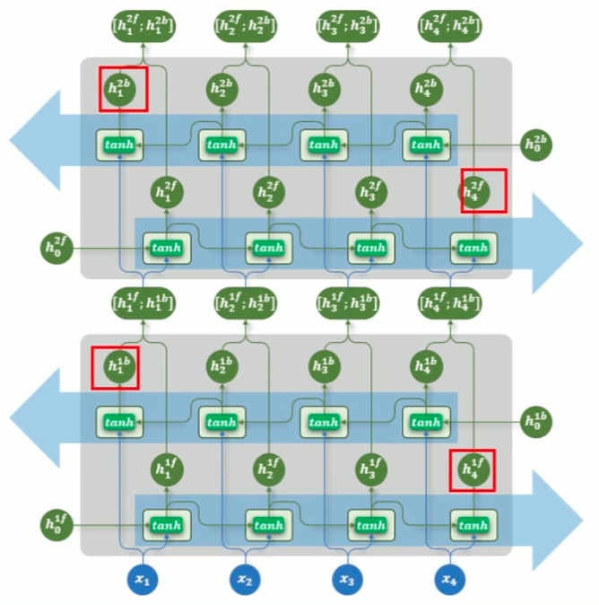
   - 参数形状说明：注意$output$是最后一层每个时间步的隐藏状态，$h_n$只是最后一个时间步每一层的隐藏状态
     - $input$：输入序列，形状为(seq_len, batch_size, input_size)，如果 batch_first=True，则为(batch_size, seq_len, input_size)
     - $h_0$：可选，初始隐藏状态，形状为(num_layers × num_directions, batch_size, hidden_size)
     - $output$：RNN层的输出（注意不是激活函数层的输出），包含最后一层每个时间步的隐藏状态，形状为 (seq_len, batch_size, num_directions × hidden_size )，如果 batch_first=True，则为(batch_size, seq_len, num_directions × hidden_size )
     - $h_n$：最后一个时间步的隐藏状态，包含每一层的每个方向，形状为 (num_layers × num_directions, batch_size, hidden_size)
8. 代码实战
   - 数据处理
   - 模型预设
     - 模型结构：嵌入层 —— RNN —— 线性层
     - 训练方案
       - 损失函数：交叉熵误差损失函数
       - 优化器：Adam
       - 参数初始化
     - 效果评估
       - 使用Topk评估准确率，因为这是一个多分类问题，很难用Top1来直接评估效果
   - 代码实现见(ML&DL&NLP/NLP/code&data/chap3/input-method-rnn)
9. RNN存在的问题
   - 尽管RNN在处理序列数据方面具有天然优势，但它在实际应用中面临一个非常严重的问题：长期依赖建模困难。这指的是：在训练过程中，当输入序列很长时，模型难以有效学习早期输入对最终输出的影响
   - 上述问题的根本原因在于训练过程中存在的梯度消失或梯度爆炸问题。在训练RNN时，采用的是时间反向传播方法，在反向传播过程中，梯度需要在每个时间步上不断链式传递，导致最前面的信息通常被遗忘
   - <font color='yellow'>RNN的梯度消失是指在时间步上的梯度消失，并非传统深度学习中的梯度消失导致最前面的参数无法更新</font>
10. 拓展知识：RNN是怎么进行参数更新的？
    - 数学基础：多元复合函数求导法则
      - 核心概念：多元复合函数求导法则（也常称“链式法则”）是多元函数微分学的核心法则，用于求解由多个多元函数复合而成的函数的偏导数/全导数。其核心思想是：**复合函数的导数等于各层函数导数的乘积（按链式依次相乘）**，区别于一元函数链式法则，多元复合需根据变量的依赖关系拆分偏导项。
      - 常见复合形式及求导公式
        - 形式1：一元函数与多元函数复合（全导数）：设函数 $u = \phi(t)$，$v = \psi(t)$ 在点 $t$ 可导，函数 $z = f(u, v)$ 在对应点 $(u, v)$ 可微，则复合函数 $z = f[\phi(t), \psi(t)]$ 在点 $t$ 可导（称**全导数**）。
          $$
          \frac{dz}{dt} = \frac{\partial z}{\partial u} \cdot \frac{du}{dt} + \frac{\partial z}{\partial v} \cdot \frac{dv}{dt}
          $$
        - 形式2：多元函数与多元函数复合（偏导数）：设函数 $u = \phi(x, y)$，$v = \psi(x, y)$ 在点 $(x, y)$ 具有偏导数，函数 $z = f(u, v)$ 在对应点 $(u, v)$ 可微，则复合函数 $z = f[\phi(x, y), \psi(x, y)]$ 在点 $(x, y)$ 具有偏导数。
          $$
          \frac{\partial z}{\partial x} = \frac{\partial z}{\partial u} \cdot \frac{\partial u}{\partial x} + \frac{\partial z}{\partial v} \cdot \frac{\partial v}{\partial x}
          $$
          $$
          \frac{\partial z}{\partial y} = \frac{\partial z}{\partial u} \cdot \frac{\partial u}{\partial y} + \frac{\partial z}{\partial v} \cdot \frac{\partial v}{\partial y}
          $$
        - 形式3：混合复合（既有中间变量又有自变量直接参与）：设 $z = f(u, x, y)$ 可微，$u = \phi(x, y)$ 具有偏导数，则复合函数 $z = f[\phi(x, y), x, y]$ 的偏导数为：
          $$
          \frac{\partial z}{\partial x} = \frac{\partial f}{\partial u} \cdot \frac{\partial u}{\partial x} + \frac{\partial f}{\partial x}
          $$
          $$
          \frac{\partial z}{\partial y} = \frac{\partial f}{\partial u} \cdot \frac{\partial u}{\partial y} + \frac{\partial f}{\partial y}
          $$
        - 注：$\frac{\partial z}{\partial x}$ 是复合后 $z$ 对 $x$ 的偏导（$y$ 固定），$\frac{\partial f}{\partial x}$ 是 $f(u, x, y)$ 对第二个自变量 $x$ 的偏导（$u, y$ 固定），二者含义不同。
    - 根据多元复合函数求导法则，$z$对$t$求导的最终结果，就是$z$沿着$x$的路径对$t$求导，再与$z$沿着$y$的路径对$t$求导**加和**便可得到
    - <font color='yellow'>因此反向传播求梯度计算的时候，就是每一个涉及到参数矩阵计算的地方都溯源到最终的输出值，并将各条路的求导结果加和，就可以得到最终的参数更新梯度结果</font>
      $$
      \frac{\partial l}{\partial W_h} = \frac{\partial l}{\partial h_t}\cdot\frac{\partial h_t}{\partial W_h} + \frac{\partial l}{\partial h_{t-1}}\cdot\frac{\partial h_{t-1}}{\partial W_h} + \frac{\partial l}{\partial h_{t-2}}\cdot\frac{\partial h_{t-2}}{\partial W_h} + \cdots + \frac{\partial l}{\partial h_2}\cdot\frac{\partial h_2}{\partial W_h} + \frac{\partial l}{\partial h_1}\cdot\frac{\partial h_1}{\partial W_h}
      $$
      其中每一项表示每条路径对 $\displaystyle\frac{\partial l}{\partial W_h}$ 的贡献。
      展开早期时间步的某一条路径（例如 $\displaystyle\frac{\partial l}{\partial h_1}\cdot\frac{\partial h_1}{\partial W_h}$）可以得到：
      $$
      \frac{\partial l}{\partial h_1}\cdot\frac{\partial h_1}{\partial W_h}
      = \frac{\partial l}{\partial h_t}
      \cdot \frac{\partial h_t}{\partial h_{t-1}}
      \cdot \frac{\partial h_{t-1}}{\partial h_{t-2}}
      \cdot \;\cdots\;
      \cdot \frac{\partial h_3}{\partial h_2}
      \cdot \frac{\partial h_2}{\partial h_1}
      \cdot \frac{\partial h_1}{\partial W_h}
      $$
      展开其中一环 $\displaystyle\frac{\partial h_t}{\partial h_{t-1}}$（为简单起见，按照标量推导）。
      现有
      $$
      h_t = \tanh\!\left(x_t W_x + h_{t-1} W_h + b\right)
      $$
      令
      $$
      u_t = x_t W_x + h_{t-1} W_h + b
      $$
      则有
      $$
      h_t = \tanh(u_t)
      $$
      可得
      $$
      \frac{\partial h_t}{\partial h_{t-1}}
      = \frac{\partial h_t}{\partial u_t} \cdot \frac{\partial u_t}{\partial h_{t-1}}
      = \tanh'(u_t) \cdot W_h
      $$
      所以，早期路径的展开可以写为：
      $$
      \frac{\partial l}{\partial h_1}\cdot\frac{\partial h_1}{\partial W_h}
      = \frac{\partial l}{\partial h_t}
      \cdot \tanh'(u_t)\cdot W_h
      \cdot \tanh'(u_{t-1})\cdot W_h
      \cdot \tanh'(u_{t-2})\cdot W_h
      \cdot \;\cdots\;
      \cdot \tanh'(u_3)\cdot W_h
      \cdot \tanh'(u_2)\cdot W_h
      \cdot \frac{\partial h_1}{\partial W_h}
      $$
      可以看到上述公式中有很多次的 $\tanh'(u_t)\cdot W_h$ 连乘，其中 $\tanh'(u_t)$ 的范围是 $(0,1]$。
      若 $W_h$ 也小于1，那么经过 $\tanh'(u_t)\cdot W_h$ 的多次连乘，早期路径（例如 $\displaystyle\frac{\partial l}{\partial h_1}\cdot\frac{\partial h_1}{\partial W_h}$）的值就会**指数级衰减**，并迅速接近于0，这个现象称为**梯度消失**。
      由于早期时间步的梯度值几乎为0，所以总梯度 $\displaystyle\frac{\partial l}{\partial W_h}$ 几乎只会受到最近时间步的输入影响。换句话说，在权重参数 $W_h$ 更新
      $$
      W_h = W_h - \eta\cdot\frac{\partial l}{\partial W_h}
      $$
      时，早期输入的信息几乎不会对 $W_h$ 的更新产生贡献。这就导致模型只能学到**短期依赖**，而无法学到**长期依赖**。另外，若 $W_h$ 大于1（大到 $\tanh'(u_t)\cdot W_h > 1$），那么经过 $\tanh'(u_t)\cdot W_h$ 的多次连乘，早期路径（例如 $\displaystyle\frac{\partial l}{\partial h_1}\cdot\frac{\partial h_1}{\partial W_h}$）的值就会**指数级增长**，这个现象称为**梯度爆炸**。梯度爆炸又会使得参数更新极不稳定。这两个问题是制约 RNN 学习长期依赖的主要瓶颈。
    - 后续的LSTM和GRU都是部分缓解了这部分问题，直到transformer才彻底解决

## 二、LSTM
1. 为了缓解RNN存在的梯度消失和梯度爆炸问题，Hochreiter和Schmidhuber于1997年提出了长短期记忆网络（Long Short-Term Memory, LSTM），但是LSTM在2010年之后才真正被大规模使用在NLP领域中。
2. LSTM结构介绍
   
   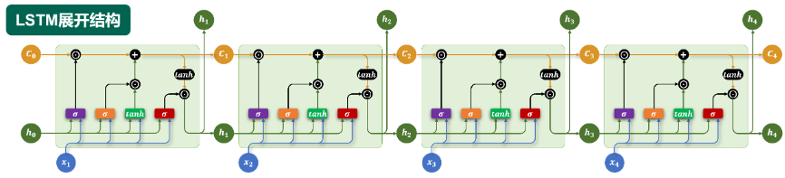
   - 记忆单元：记忆单元负责在序列中长期保存关键信息。它相当于一条“信息通道”，在多个时间步之间直接传递信息（记忆单元是缓解梯度消失和梯度爆炸问题的核心）
   - 遗忘门：遗忘门决定当前时间步要忘记多少过去的记忆
     - 遗忘门设计思路：要决定什么东西需要遗忘，需要当前的输入和历史的输入共同决定；例如`张三正在喝水，李四`这种场景就需要适当遗忘之前张三正在做什么
     - 遗忘门的计算公式：
       $$
       f_t = \sigma(W_f \cdot [h_{t-1}, x_t] + b_f)
       $$
     - 遗忘门计算图
     
       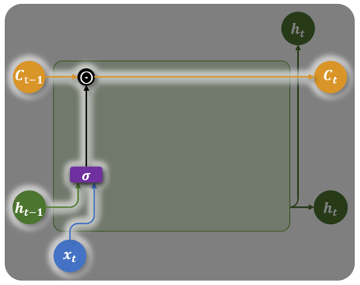
   - 输入门：输入门控制要从当前时间步的输入向记忆单元存入多少新的信息
     - 输入门设计思路：要决定当前的输入写入记忆多少，也是需要当前的输入和历史的输入共同决定；例如`张三一边看电视，一边吃零食`这种场景下的`吃零食`肯定要被记忆下来
     - 输入门的计算公式：
       $$
       i_t = \sigma(W_i \cdot [h_{t-1}, x_t] + b_i)
       $$
     - 输入门计算图
     
       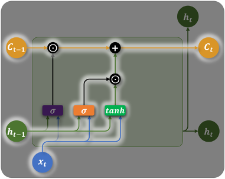
   - 输出门：输出门控制从记忆单元中读取多少信息作为当前时间步的隐藏状态进行输出
     - 输出门设计思路：根据当前的输入，应该从记忆单元中取多少信息当作隐藏状态传给下一个时间步？例如`张三正在喝水，李四`这时候就应该从记忆单元中取出适当的信息影响下一个状态
     - 输出门的计算公式：
       $$
       o_t = \sigma(W_o \cdot [h_{t-1}, x_t] + b_o)
       $$
     - 输出门计算图
     
       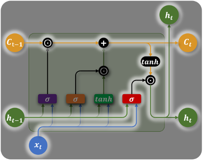
   - 记忆单元的参数更新
     - 记忆单元设计思路：记忆单元应该同时被遗忘门和输入门影响，因为遗忘门决定遗忘什么，输入门决定记忆什么
     - 记忆单元的计算公式：
       $$
       \tilde{C}_t = \tanh(W_C \cdot [h_{t-1}, x_t] + b_C)
       $$
       $$
       C_t = f_t \odot C_{t-1} + i_t \odot \tilde{C}_t
       $$
   - 隐藏状态的参数更新
     - 隐藏状态设计思路：隐藏状态应该根据上一时间步的隐藏状态和当前记忆单元中取出的部分记忆共同决定
     - 隐藏状态的计算公式：
       $$
       h_t = o_t \odot \tanh(C_t)
       $$
3. LSTM是怎么缓解梯度消失和梯度爆炸的？一句话结论：通过引入记忆单元，部分地保存了相对较为遥远一点的数据
   记忆单元的更新公式为$C_t = f_t \odot C_{t-1} + i_t \odot \tilde{C}_t$，所以$\frac{\partial C_t}{\partial C_{t-1}} = f_t$。在反向传播时，沿记忆单元路径，梯度传播实际上是多个$f_t$连乘的结果。虽然每个 $f_t$ 的取值小于1，但通常较接近于1。这是因为 $f_t$ 由遗忘门生成，<font color='yellow'>在一般任务中，遗忘门倾向于“记得多、忘得少”，因此 $f_t$ 的值通常较大</font>。由于乘积中的每一项 $f_t$ 较接近1，整体衰减速度远小于传统RNN中隐藏状态链式传播时的指数衰减。这使得早期时间步的输入，能够通过记忆单元路径稳定地影响到最终的总梯度，从而有效参与参数的更新，保证了模型对长序列依赖的学习能力。
4. LSTM为什么不能完全解决梯度消失和梯度爆炸？梯度传播实际上还是是多个$f_t$连乘的结果，远距离上依然会失效，只是极大地缓解了这个问题，并没有根本解决
5. LSTM的复杂结构
   - 多层结构：与RNN类似，LSTM 也可以通过堆叠多个层来构建更深的网络，以增强模型对序列特征的建模能力，通过层层传递和提取信息，多层结构能够捕捉更复杂、更抽象的时序特征。
     
     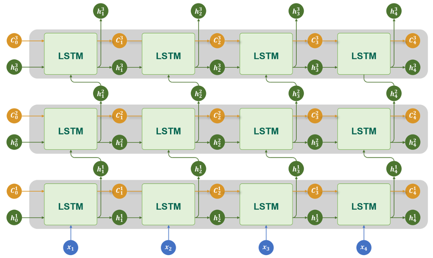
   - 双向结构：对于LSTM，同样可以通过双向机制，利用序列中的过去信息和未来信息，进一步提升模型的建模能力

     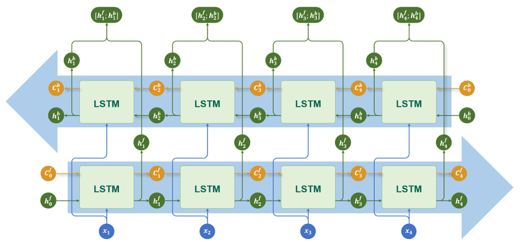
   - 多层+双向结构：多层和双向的结合版本

     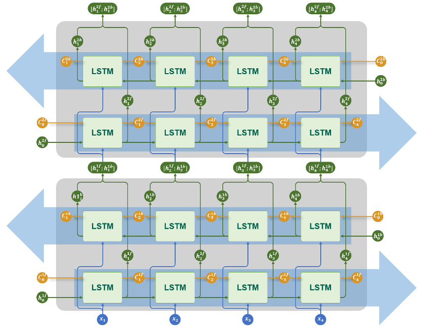
6. 代码API（可关注[网站](https://pytorch.org/docs/stable/generated/torch.nn.LSTM.html)）
   - 创建LSTM对象
     ```python
     torch.nn.LSTM(
         input_size,  # 每个时间步输入特征的维度（词向量维度）
         hidden_size,  # 隐藏状态的维度
         num_layers=1,  # RNN 层数，默认为 1
         bias=True,  # 激活函数，'tanh'（默认）或 'relu'
         batch_first=False,  # 是否使用偏置项，默认 True
         dropout=0.0,  # 输入张量是否是 (batch, seq, feature)，默认 False 表示 (seq, batch, feature)
         bidirectional=False,  # 是否为双向 RNN，默认 False
         proj_size=0,  # 隐藏状态的投影输出维度；若为 0，则不使用 projection。
         device=None,  # 模块的初始化设备，如 'cuda', 'cpu'
         dtype=None  # 模块初始化时的默认数据类型，如 torch.float32, torch.float64
     )
     
     proj_size 参数 非常特殊，普通情况下是0，其对应的功能不会被开启
     如果参数非0，那么所有的隐藏层状态h都会被修改为对应的维度，同时记忆状态c保持原来的维度
     为了保证计算正常映射，会执行一个额外的矩阵乘法将维度执行一个映射
     ```
   - 输入输出
     ```python
     lstm = torch.nn.LSTM()
     output, (h_n, c_n) = lstm(input, (h_0, c_0))
     ```
     - 输入参数
       - $input$：输入序列，形状为`(seq_len, batch_size, input_size)`，如果`batch_first=True`，则为`(batch_size, seq_len, input_size)`
       - $h_0$：可选，初始隐藏状态，形状为`(num_layers × num_directions, batch_size, hidden_size)`
       - $c_0$：可选，初始细胞状态，形状为`(num_layers × num_directions, batch_size, hidden_size)`
     - 输出参数
       - $output$：LSTM层的输出，包含最后一层每个时间步的隐藏状态，形状为`(seq_len, batch_size, num_directions × hidden_size )`，如果`batch_first=True`，则为`(batch_size, seq_len, num_directions × hidden_size)`
       - $h_n$：最后一个时间步的隐藏状态，包含每一层的每个方向，形状为`(num_layers × num_directions, batch_size, hidden_size)`
       - $c_n$：最后一个时间步的细胞状态，包含每一层的每个方向，形状为`(num_layers × num_directions, batch_size, hidden_size)`
7. 案例case——AI智评
   - 数据处理：[数据集](https://github.com/InsaneLife/ChineseNLPCorpus?tab=readme-ov-file#%E6%83%85%E6%84%9F%E8%A7%82%E7%82%B9%E8%AF%84%E8%AE%BA-%E5%80%BE%E5%90%91%E6%80%A7%E5%88%86%E6%9E%90)
     - 数据的长度不一致，怎么处理呢？按照一定百分比（比如95%分位作为基准线，不足的补齐，超过的截断）
     - 划分数据集的时候要分层抽样，避免一个数据集中全是正向或者负向的
     - 特殊的两个token：<pad>（用于填充）和<unk>（用于表示未知）
   - 模型预设
     - 模型结构：嵌入层 —— LSTM —— 线性层
     - 训练方案
       - 损失函数（本次是二分类任务）：BCEWithLogitsLoss（包含了sigmoid之后再做交叉熵损失函数计算）
       - 优化器：Adam
       - 参数初始化
   - 效果评估
   - 代码实现见(ML&DL&NLP/NLP/code&data/chap3/review-analyze-lstm)


## 三、GRU


-----
参考文档：
1. 尚硅谷教程：https://www.bilibili.com/video/BV1k44LzPEhU
2. pytorch快速上手教程：https://docs.pytorch.org/docs/stable/generated/torch.nn.RNN.html
3. RNN智能输入法案例huggingface数据集：https://huggingface.co/datasets/Jax-dan/HundredCV-Chat
4. pandas读取数据：https://pandas.pydata.org/pandas-docs/stable/user_guide/io.html
