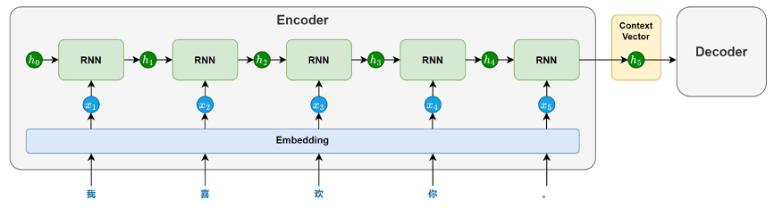
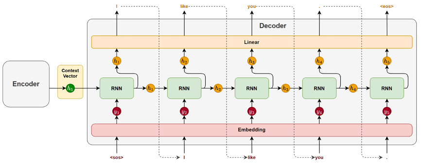

# Seq2Seq模型

## 一、Seq2Seq模型详解
1. 为什么需要Seq2Seq类的模型？
   传统的自然语言处理任务，以静态输出为主，其目标是预测固定类别或者标签。但是现实世界中的很多应用需要模拟**动态**生成新的序列：
   - 机器翻译：输入中文句子，输出对应的英文翻译
   - 文本摘要：输入长篇文章，生成简短的摘要
   - 问答系统：输入用户问题，生成自然语言回答
   - 对话系统：输入对话历史，生成连贯的下一条回复
   这类任务有两个关键的共同点，输入和输出都是序列，而且序列的长度是动态可变的。传统的RNN、LSTM、GRU支持的都是固定序列的输入和某一特定类别的输出，为了实现上述任务，基于RNN、LSTM提出了Seq2Seq模型。
2. Seq2Seq模型：包含一个解码器和一个编码器（注意：<font color='yellow'>解码器和编码器之间没有其他结构</font>）
   
   
   - 编码器：主要由一个循环神经网络（RNN/LSTM/GRU）构成，其任务是将输入序列的语义信息提取并压缩为一个上下文向量
   - 解码器：主要也由一个循环神经网络（RNN / LSTM / GRU）构成，其任务是基于编码器传递的上下文向量，逐步生成目标序列
3. 编码器
   - 在模型处理输入序列时，循环神经网络会依次接收每个token的输入，并在每个时间步步更新隐藏状态。
   - 每个隐藏状态都携带了截止到当前位置为止的信息。随着序列推进，信息不断累积，最终会在最后一个时间步形成一个包含整句信息的隐藏状态。
   - 这个最后的隐藏状态就会作为上下文向量（context vector），传递给解码器，用于指导后续的序列生成
   
   
4. 解码器
   - 在生成开始时，循环神经网络以上下文向量作为初始隐藏状态，并接收一个特殊的起始标记 <sos>（start of sentence）作为第一个时间步的输入，用于预测第一个token。
   - 随后，在每一个时间步，模型都会根据前一时刻的隐藏状态和上一步生成的token，预测当前的输出。这种“将前一步的输出作为下一步输入”的方式被称为自回归生成（Autoregressive Generation），它确保了生成结果的连贯性。
   - 生成过程会持续进行，直到模型生成了一个特殊的结束标记 <eos>（end of sentence），表示句子生成完成。
   
   

5. 模型的训练机制
   - 数据准备阶段：为了让模型明确序列的起点和终点，通常需要在目标句前添加<sos>，句末添加<eos>，这两个特殊标记帮助模型学会从哪里开始生成，以及何时停止生成
   - 前向传播
     - 编码器阶段：通过编码器RNN的循环多次处理，将输入编码为上下文向量
     - 解码器阶段：使用`TeacherForcing`策略，解码器的每一阶段的输入不是模型上一步的预测结果，而是目标序列中真实的前一个token。换句话说，编码器阶段的训练过程，如果完整句子是`<sos> I like you. <eos>`，解码器针对第一个时间步的输入`<sos>`输出的是`me`，那么第二个时间步的输入还是`I`而不是`me`
       - `TeacherForcing`策略好处之一：训练更快，误差不会累积
       - `TeacherForcing`策略好处之二：梯度传播更稳定，有利于优化收敛
   - 计算损失：使用交叉熵损失函数计算每个时间步的loss并加和
   - 反向传播：pytorch中使用`loss.backward()`
6. 模型的推理机制
   - 模型推理是Seq2Seq模型在实际任务中生成目标序列的过程，通常包括以下几个环节
   - 编码器处理：与训练阶段一致，正常根据输入生成隐藏状态（上下文向量）即可
   - 解码器处理——自回归生成（Autoregressive Generation）：每一步的输出会作为下一步的输入，逐步构造完整句子
     - 自回归生成流程：第一个时间步，解码器接受上下文向量和初始标记`<sos>`，解码器生成第一个词，第一个词会作为当前输入再预测下一个词
     - 词选择策略：每个时间步，编码器输出的是一个词的概率分布。我们需要从中选择一个具体词作为本时间步的输出，选择方式即为生成策略。常见策略包括：
       - 贪心解码：每一步都选择概率最高的词；简单高效但是容易陷入局部最优解，且生成非常单一
       - 束搜索：每一步保留多个候选词序列（如 beam size = 3），并在扩展后选择得分最高的完整句子；全局考虑生成质量高，但是计算开销大

## 二、案例实操
1. 需求说明：中文翻译成英文
2. 需求分析
   - 数据处理
     - 减少未登录词问题，将中文使用按照字来分词；英文使用NLTK分词器
     - 避免过多<pad>，使用不同的`seq_len`分批次进行训练
   - 模型结构
     - 训练：Teacher Forcing
     - 损失函数：交叉熵损失函数
     - 优化器：Adam
   - 推理方案：推理阶段采用自回归生成策略，词选择策略选择贪心解码
   - 评估方案：BLEU（Bilingual Evaluation Understudy）是一种常用的自动评估指标，用于衡量模型生成的翻译与人工参考译文之间的相似程度。
     - 其核心思想是：
       - n-gram 匹配：统计预测译文中有多少 n-gram（词或短语）同时出现在参考译文中，用于衡量翻译内容的准确性。
       - 精确率计算：将匹配到的 n-gram 数量除以预测译文中 n-gram 的总数，反映生成译文中“正确部分”的比例。
       ```text
       举例说明：
       预测译文：A-B-C-D
       真实译文：A-B—C-D-F
       
       取n-gram中n=3，
       真实译文中出现的组合是[A-B-C]、[B-C-D]、[C-D-F]
       预测译文中出现的组合是[A-B-C]、[B-C-D]，其中[A-B-C]、[B-C-D]都出现在了真实译文中
       则真实准确性 2/2 = 100%（预测译文组合 / 真实译文组合）
       但是这种机制会导致模型倾向于预测短译文，因为这样能够稳定获得更高的分数
       所以也加入了 长度惩罚机制 —— 防止模型通过生成过短句子获得不合理的高分
       ```
       - 此外，BLEU还引入长度惩罚机制，防止模型通过生成过短句子获得不合理的高分。最终得到的BLEU分数越高，说明生成译文与参考译文越接近
3. 实战代码见(ML&DL&NLP/NLP/code&data/chap4/translation-seq2seq)

## 三、Seq2Seq存在的问题
- 在上述 Seq2Seq 架构中，编码器会将整个源句压缩为一个固定长度的上下文向量，并将其作为解码器生成目标序列的唯一参考。
- 这种“压缩再解压”的方式虽然结构简洁，但在实际任务中暴露出两个核心问题：
   - 信息压缩困难，语义表达受限 
     - 对于编码器而言，用一个定长向量去表达任意复杂的句子，是一项非常困难的任务。尤其在面对长句时，信息很容易在压缩过程中丢失，导致语义表达不完整。这种“信息瓶颈”限制了模型在处理长文本或复杂语义结构时的表现。 
   - 缺乏动态感知，解码难以精准生成 
     - 解码器始终只能基于同一个上下文向量进行生成。但在实际生成过程中，不同位置的目标词，往往依赖源句中不同的关键信息：生成主语时，可能更依赖源句的开头；生成谓语或宾语时，可能需要参考句中或句末内容。然而在固定表示下，解码器无法“有选择地关注”输入序列的不同部分，只能一视同仁地处理所有信息，从而降低了生成的准确性与灵活性。


-----
参考资料：
1. 视频教学：https://www.bilibili.com/video/BV1k44LzPEhU
2. 中文翻译成英文数据集：https://tianchi.aliyun.com/dataset/174937
3. 英文分词NLTK：https://www.nltk.org/howto/tokenize.html