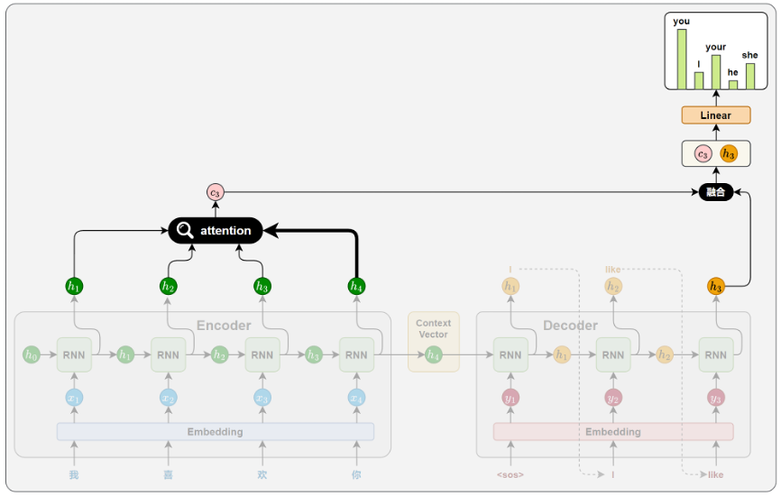
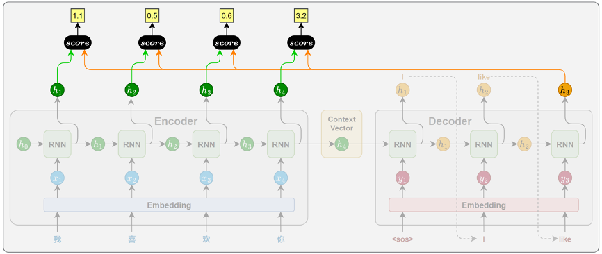
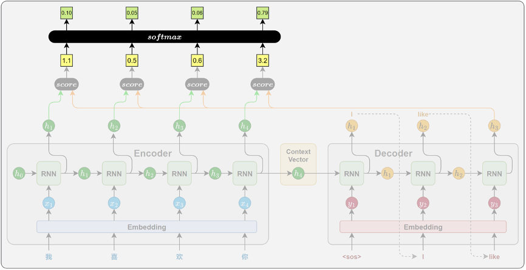
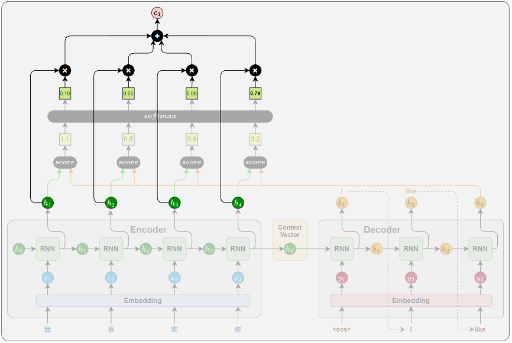
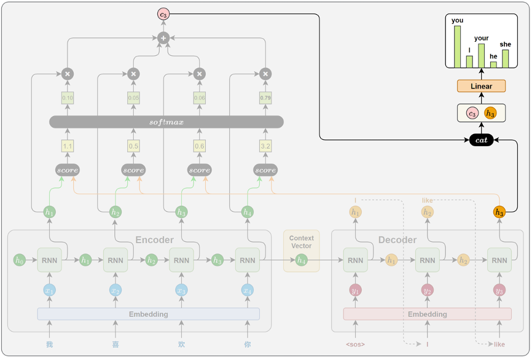
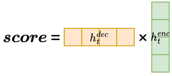
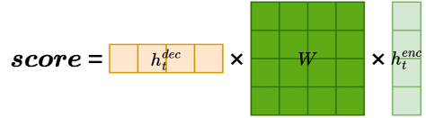
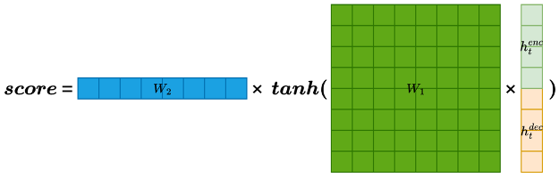

# Attention机制

## 一、Attention机制
1. 传统弊端：传统的 Seq2Seq 模型中，编码器在处理源句时，无论其长度如何，最终都只能将整句信息压缩为一个**固定长度的上下文向量**，用作解码器的唯一参考。这种设计存在两个显著问题：
   - 信息压缩困难：固定向量难以完整表达长句或复杂语义，容易丢失关键信息
   - 缺乏动态感知：解码器在每一步生成中都只能依赖同一个上下文向量，难以根据不同位置的生成需要灵活提取信息
2. 为了解决上述问题，研究者引入了Attention机制。其核心思想是：
   解码器在生成目标序列的每一步时，不再依赖于一个静态的上下文向量，而是根据当前的解码状态，动态地从编码器各时间步的隐藏状态中选取最相关的信息，以辅助当前步的生成。
   这种机制赋予模型“对齐”能力，使其能够自动判断源句中哪些位置对当前的目标词更为重要，从而有效缓解信息瓶颈问题，提升生成质量与表达能力
3. Attention机制的核心，就是在生成信息的过程中，动态参考全部的隐藏状态，并计算相关性系数，根据系数大小来决定动态选择哪个隐藏状态生成信息

## 二、工作原理
1. 注意力机制的核心思想，是解码器在生成目标序列的每一步时，动态地从编码器的各个时间步的隐藏状态中提取当前所需的信息，而不再只依赖一个固定的上下文向量
   
   
2. 注意力机制主要通过以下四个关键步骤实现
   - 相关性计算：计算当前时间步解码器的输出和编码器各个时间步输出的隐藏状态之间的相关性（相关性计算见注意力评分函数）
     - 设计思路：如果想根据`<sos>I like you.<eos>`来生成`<sos>我喜欢你。<eos>`，生成出`我`时候，需要看一下当前的输出需要和哪个隐藏状态最相关，往往就是`I`
     - 在目标序列生成的每一步，解码器都会计算当前时间步的隐藏状态与编码器各个时间步输出之间的相关性。这些相关性衡量了源句中每个位置对当前生成内容的重要程度，从而决定模型应将多少注意力分配给不同的源位置。
     - 计算图表示
       
       
   - 注意力权重计算：根据相关性计算出对应的权重
     - 设计思路：各个隐藏状态对最终输出肯定都有一定作用，使用softmax函数计算权重
     - 得到所有源位置的注意力评分后，使用 Softmax 函数将其归一化为概率分布，作为注意力权重。得分越高的位置，其对应的权重越大，代表模型在当前生成中更关注该位置的信息。
     - 计算图表示
       
       
   - 上下文向量计算：根据权重和编码器的每个时间步的隐藏状态来计算最终的上下文向量
     - 设计思路：根据权重计算出上下文向量，相比于Seq2Seq模型，这一次的上下文向量是随着时间步的变化而变化的
     - 将所有编码器输出按照注意力权重进行加权求和，得到一个上下文向量。这个向量就表示当前时间步，模型从源句中提取出的关键信息。
     - 计算图表示
       
       
   - 解码信息融合：将新的上下文向量作为作为输入，和当前解码器的输出一并拼接计算最终的序列输出
     - 设计思路：按照Seq2Seq模型，根据上上下文向量和解码器的输出共同计算该轮输出，这里使用的是最简单的方式，也就是直接拼接
     - 在得到上下文向量后，解码器将其与当前时间步的隐藏状态进行拼接，以融合两者信息，最终通过线性变换和 Softmax，生成当前时间步目标词的概率分布
     - 计算图表示
       
       
3. 注意力评分函数
   - 作用：用于评估解码器的输出和编码器的各个时间步的隐藏状态之间的相关性系数，主要包括三种计算方式（点积评分、通用点积评分、拼接评分）
   - 点积评分：点积评分是注意力机制中最简单、最直接的一种相关性评分方法。它通过计算解码器当前时间步的隐藏状态与编码器每个时间步的隐藏状态的点积，来衡量二者之间的相关性
     - 本质上类似于向量之间的点乘，如果夹角越小，代表相关性越强；趋近于零，代表完全不相关
     - 图例
       
       
   - 通用点积评分：通用点积评分在点积的基础上引入了一个可学习的权重矩阵W,用于先对编码器隐藏状态进行线性变换，再与解码器隐藏状态进行点积
     - 没有规定编码器和解码器隐藏状态维度完全一致，因此引入一个矩阵实现线性变换，能够实现更强的通用性
     - 该方法的设计动机主要是为了解决编码器和解码器隐藏状态维度不一致的问题。通过引入权重矩阵W，不仅实现了维度对齐，也增强了模型对编码器输出的适应能力，从而提升了注意力机制的表达能力
     - 图例
       
       
   - 拼接评分：拼接评分是一种表达能力更强的相关性评分方法。它的核心思想是：将解码器当前隐藏状态与编码器每个时间步的隐藏状态拼接为一个长向量，经过线性变换和非线性激活，最后用一个向量进行投影，得到最终打分值
     - 引入了线性和非线性两种处理机制，能够具备更强的表示能力
     - 相比前两种方法，Concat 评分方式在建模能力上更强。它不仅考虑了两个状态的数值关系，还引入非线性变换，能够捕捉更复杂的交互模式，更适合处理对齐关系复杂的任务场景
     - 图例
       
       

## 三、案例实操(见：ML&DL&NLP/NLP/code&data/chap5/translation-attention)

-----
参考资料：
1. 视频教学：https://www.bilibili.com/video/BV1k44LzPEhU
