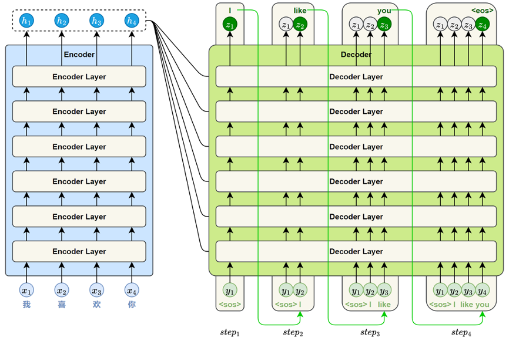
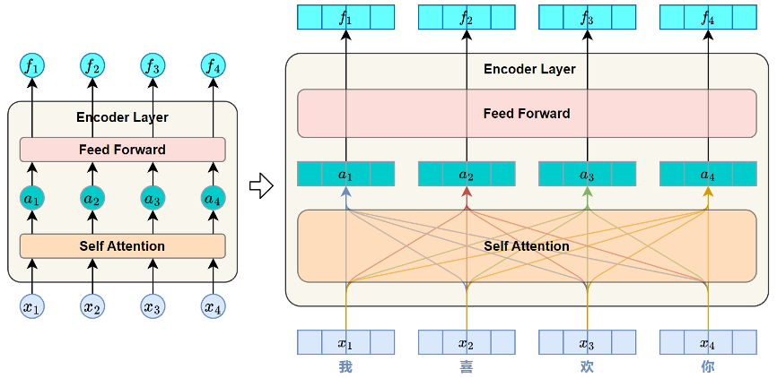
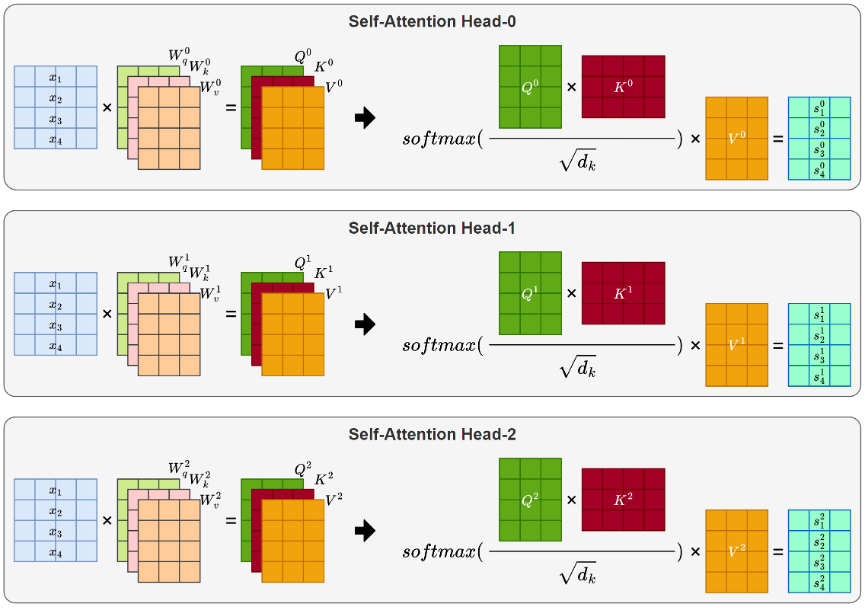
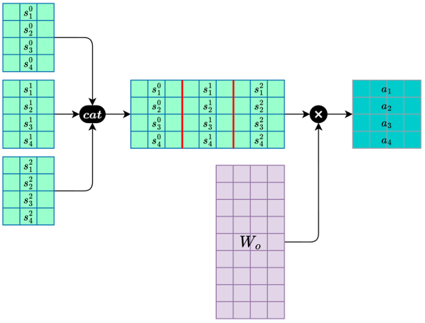
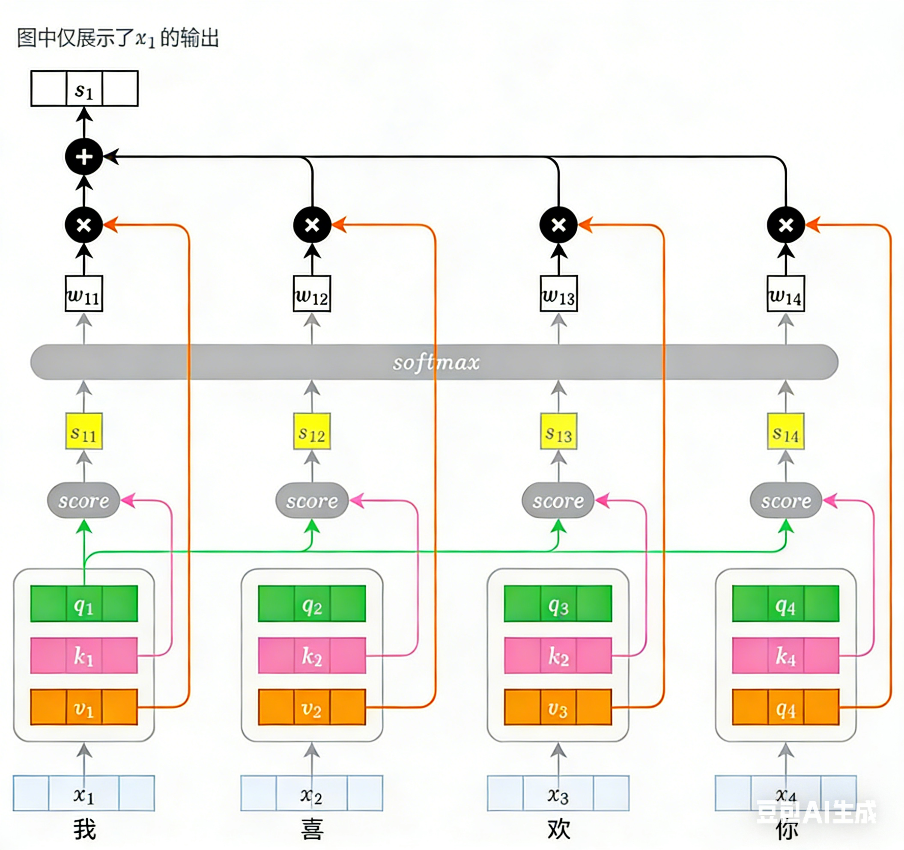
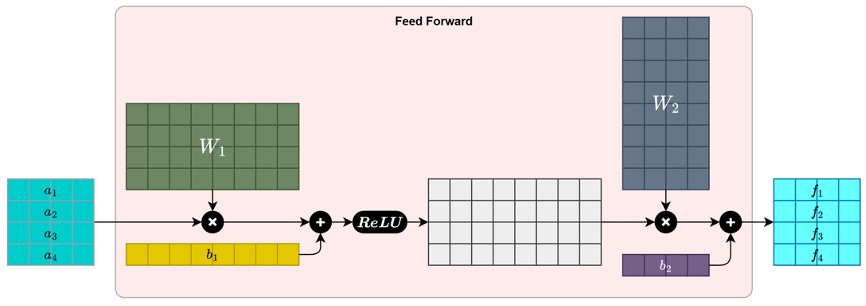
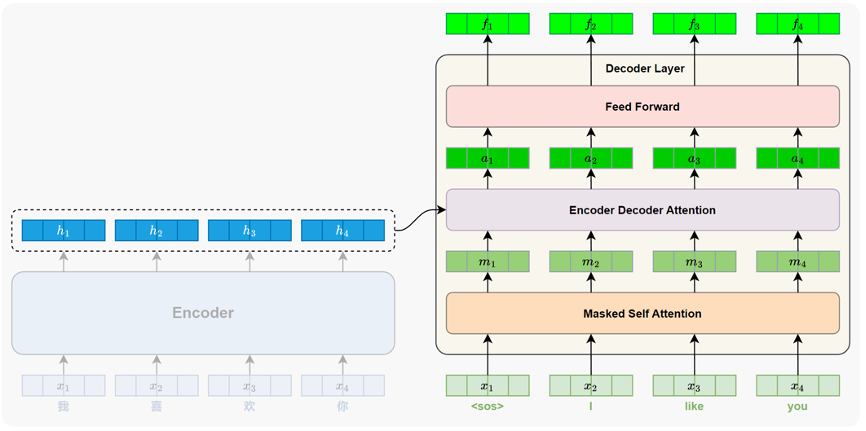
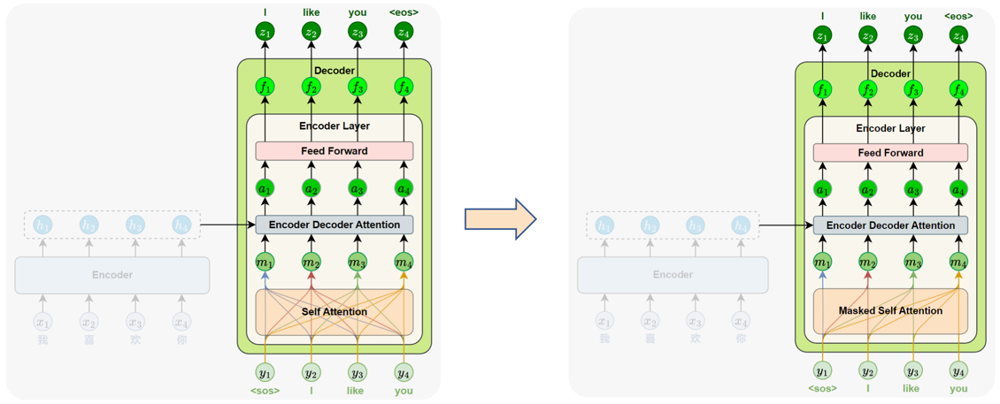
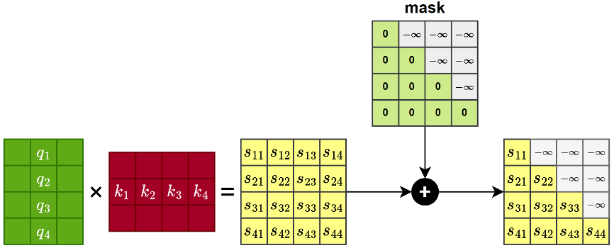
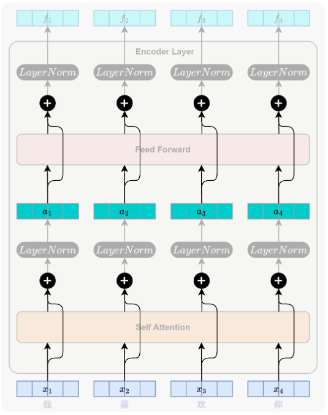

# Transformer模型

## 一、`RNN`、`Seq2Seq`、`Attention`等技术概览&总结
1. `Seq2Seq`模型的解码器阶段，每次输出下一个`token`时候，是**仅仅根据上一个`token`**和隐藏状态来实现的
2. 残差网络：`y = x + sublayer(x)`
   - 怎么缓解了梯度消失的问题？引入了一条新的路径，使得每层求梯度计算的时候，都至少有一个`1`
   - 这样构造的含义是什么？
     - 传统的`y = sublayer(x)`的含义在于，让模型学习如何根据`x`来直接构造`y`，模型学习的是`x`怎么变成`y`
     - 残差网络的含义在于，让模型学习如何在`x`的基础上来构造`y`，模型学习的是`x`怎么加一个值变成`y`

## 二、`Transformer`模型概况
1. 从`RNN`演化到`Seq2Seq`模型，我们引入了**注意力机制**，它显著地增强了模型的表达能力。它能够建立各种数据之间的相关性关系，从而更好地实现序列到序列的转换。注意力机制不需要顺序计算，同时任意位置之间都可以建立联系，更适合捕捉长距离的依赖，是不是能够用注意力机制来实现新的模型呢？
2. 核心思想：使用注意力机制来建立数据之间的联系，`Attention is All You Need`
3. 整体结构：`Transformer`延续了`Seq2Seq`中的编码器和解码器架构，为了模拟`RNN`的时序性，引入了**位置编码**和**掩码机制**
   - 编码器负责对输入序列进行理解和表示
   - 解码器则根据编码器的输出逐步生成目标序列
   
   

## 三、`Transformer`模型原理深究——编码器
1. 概述：`Transformer`的编码器用于理解输入序列的语义信息，并生成每个`token`的上下文表示，为解码器生成目标序列提供基础。与`Seq2Seq`模型一样，<font color='yellow'>编码器用于生成隐藏状态</font>
2. 编码器整体结构：标准的`Transformer`模型包含6个`Encoder Layer`，每个`Encoder Layer`包含一个`Self Attention`层（自注意力子层）和一个`Feed Forward`层（前馈神经网络子层）
   - `Self Attention`层（自注意力子层）：用于捕捉序列中各位置之间的依赖关系
   - `Feed Forward`层（前馈神经网络子层）：用于对每个位置的表示进行非线性变换，从而提升模型的表达能力

   
3. 编码器核心组件一：`Self Attention`层（自注意力子层）
   - 概述：自注意力机制层的作用是在序列内部建立各位置之间的依赖关系，使模型能够为每个位置生成融合全局信息的表示。它计算的是某个`token`在当前句子中所有`token`（包括自己）之间的依赖关系。
   - 为什么要引入自注意力子层？用于计算`token`之间的相关性，发起相关性计算的token对应的向量是`Query`向量，被迫接受相关性计算的`token`对应的向量是`Key`向量
     - 核心思想：每个位置用自身的`Query`向量，与整个序列中所有位置的`Key`向量进行相关性计算，从而得到注意力权重，并据此对对应的`Value`向量加权汇总，形成新的表示
     - `Query`向量：表示当前词的用于发起注意力匹配的向量
     - `Key`向量：表示序列中每个位置的内容标识，用于与`Query`进行匹配
     - `Value`向量：表示该位置携带的信息，用于加权汇总得到新表示（通常是残差），<font color='yellow'>`Query`向量与`Key`向量仅仅用于计算相关性系数，最终的系数需要乘以`Value`向量才能真正携带信息</font>
   - 实现过程：
     - 生成`Query`、`Key`、`Value`向量：每个词向量乘以对应的$\mathbf{W_query}$、$\mathbf{W_key}$、$\mathbf{W_value}$，就能得到对应的向量，这三个矩阵的参数都是**可学习**的
     - 计算位置间相关性：使用点积计算相关性，但是论文中的处理有一些不同，还进行了除以$\sqrt{d_k}$的操作
       - 相关性计算公式
         $$
         score(i,j) = \frac{\mathbf{q}_i \bullet \mathbf{k}_j}{\sqrt{d_k}}
         $$
       - 参数说明：
         - $q_i$：发起相关性计算的向量生成的`query`向量
         - $k_j$：被迫接受相关性计算的向量生成的`key`向量
         - $d_k$：向量的维度
       - 为什么需要除以$\sqrt{d_k}$？
         - 回想softmax函数的定义，如果向量中的某个值比较大，使用指数计算会导致这个值最终计算出的权重非常大，其他项的加和都很小
         - 出现的向量可能是`[0,0,0,1]`这种类型的，会出现梯度消失问题
         - 所以简而言之，经过`softmax`函数之前，最好经过一些处理，保证向量之间的差异性不是特别明显
     - 计算注意力权重：使用`softmax`函数计算权重
     - 加权汇总生成输出：将经过softmax函数计算后得到的权重乘以对应位置的`value`向量并加和，得到最终的输出
   - 多头自注意力机制
     - 为什么要有多头知道注意力机制？因为自然语言本身具有高度的语义复杂性，一个句子往往同时包含多种类型的语义关系，模型需要同时识别并建模多种层次和类型的依赖关系。但这些信息很难通过单一视角或一套注意力机制完整捕捉，Transformer 引入了多头注意力机制（Multi-Head Attention）。其核心思想是通过多组独立的 Query、Key、Value 投影，让不同注意力头分别专注于不同的语义关系，最后将各头的输出拼接融合。
     - 多头注意力机制是怎么保证能够分别学习语言中不同部分的特征的呢？
       - 核心原因：各个头的参数矩阵初始化的值是不一样的
     - 多头自注意力计算方法
       - 分别计算各头注意力：分别计算多个注意力机制，每个自注意力机制“计算一种语义关系”
         
         
       - 合并多头注意力：将各个矩阵直接拼接，再乘以$W_o$得到最终多头注意力的输出
         
         
   - 计算图：
   
     
4. 编码器核心组件二：`Feed Forward`层（前馈神经网络子层）
   - 概述：前馈神经网络（`Feed-Forward Network`，简称`FFN`）是`Transformer`编码器中每个子层的重要组成部分，紧接在多头注意力子层之后。它通过对每个位置的表示进行逐位置、非线性的特征变换，进一步提升模型对复杂语义的建模能力
   - 为什么要引入前馈神经网络子层？与自注意力子层的线性变化不一样（softmax计算得到的也只是权重，权重必须乘以对应的`value`向量才能生效），前馈神经网络子层中可以引入非线性激活函数，提高模型的建模能力；同时前馈神经网络子层中进行的线性变换部分，实际上是将原来的数据放大到一定维度，之后再还原为原来的维度，起到一个先放大后缩小的作用
   - 实现过程：一个标准的`FFN`子层包含两个线性变换和一个非线性激活函数，中间通常使用`ReLU`激活
     - 线性变换一：$W_1 x + b_1$
     - 非线性激活函数：$ReLU(W_1 x + b_1)$
     - 线性变换二：$W_2 [ReLU(W_1 x + b_1)] + b_2$
   - 计算公式：
     $$
     FFN(x) = \text{Linear}_2\left(\text{ReLU}\left(\text{Linear}_1(x)\right)\right) = W_2 \cdot \text{ReLU}(W_1 x + b_1) + b_2
     $$
   - 计算图：
     
     

## 四、`Transformer`模型原理深究——解码器
1. 概述：`Transformer`解码器的主要功能是：根据编码器的输出，逐步生成目标序列中的每一个词。生成方式采用自回归机制
2. 解码器整体结构：标准的`Transformer`模型包含6层`Decoder Layer`，每个`Decoder Layer`包含三个子层，分别是`Masked Self Attention`层（掩码自注意力子层）、`Encoder-Decoder Attention`层（编码器-解码器注意力子层）、`Feed-Forward Network`层（前馈神经网络子层）
   - `Masked Self Attention`层（掩码自注意力子层）：建模当前位置与前文词之间的依赖关系，采用了遮盖机制来限定关注范围
   - `Encoder-Decoder Attention`层（编码器-解码器注意力子层）：建模当前解码位置与源序列各位置之间的依赖关系，从编码器的输出中提取相关上下文信息
   - `Feed-Forward Network`层（前馈神经网络子层）：与编码器中结构完全一致，对每个位置的表示进行非线性变换，增强模型的表达能力
   
   
3. 解码器核心组件一：`Masked Self Attention`层（掩码自注意力子层）
   - 概述：建模目标序列中当前位置与前文之间的依赖关系，为当前词的生成提供上下文语义支持
   - 为什么要引入掩码自注意力子层？掩码的作用是拒绝模型了解后文来模拟`RNN`的时序性，自注意力子层的引入是为了计算当前位置的输出与前文之间的依赖关系
   - 实现过程：
     - 并行计算：`Transformer`模型采用了并行策略，一次性输入完整目标序列，同时预测每个位置的词
     - 掩码机制：引入了遮盖机制，计算当前位置信息的时候，阻止模型访问当前位置之后的词，具体策略是将注意力得分矩阵中对其后续位置的评分设置为负无穷
       
       
     - softmax计算：负无穷位置的函数值经过softmax计算后趋近于0，也就相当于不占用任何注意力
   - 计算图

     
4. 解码器核心组件二：`Encoder-Decoder Attention`层（编码器-解码器注意力子层）
   - 概述：建模当前解码位置与源语言序列中各位置之间的依赖关系，帮助模型在生成目标词时有效地参考输入内容，相当于Seq2Seq模型中的注意力机制
   - 为什么要引入编码器-解码器注意力子层？从编码器中提取信息，帮助模型生成序列，当前生成位置使用自己的`Query`，去“询问”编码器输出中的哪些位置最相关。注意力机制会根据`Query`与所有`Key`的相似度，为每个源位置分配一个权重，然后用这些权重对`Value`进行加权求和，得到当前生成词所需的上下文信息
   - 实现过程：与`Seq2Seq`模型中的注意力机制基本一致，区别在于使用的是`Q、K、V`向量来代替传统`Seq2Seq`模型中的隐藏状态
     - `Query`来自解码器当前的输入表示，即当前生成状态
     - `Key`和`Value`来自编码器的输出表示，即整个源序列的上下文

## 五、`Transformer`模型原理深究——解码器、编码器通用组件
1. 编码器时序性模拟机制：位置编码
   - 概述：通过引入位置编码，将文本信息的顺序告诉了模型，间接实现了序列的时序性；如果不引入该机制，就会导致模型无法区分“猫吃鱼”和“鱼吃猫”这类语序不同但词汇相同的句子
   - 为什么要引入位置编码？`Transformer`模型完全摒弃了`RNN`结构，意味着它不再按顺序处理序列，而是可以并行处理所有位置的信息。这样就导致`Transformer`模型完全无法实现
   - 如何引入位置编码？（帮助理解为什么`Transformer`模型使用了一种特殊的位置编码方式）
     - 第一种好想到的方案那就是顺序编号，然后将顺序编号融合到向量中；但是这样的话越靠后的`token`位置编码就越大，若直接与词向量相加，会造成数值倾斜，让模型更关注位置，而忽视词义
     - 第二种好想到的方案那就是将编号归一化到`[0,1]`区间之中，顺序编号并除以句子长度；但是这就导致相同位置的词在不同长度句子中的位置编码不再一致，一个句5个字的话的第一个字的位置编码和10个字的编码，第一个字的位置编码值是不一样的
   - 实现过程：`Transformer`使用了一种基于正弦（`sin`）和余弦（`cos`）函数的位置编码方式
     - 偶数位置编码方式：
       $$
       \text{PE}_{(\text{pos}, 2i)} = \sin\left(\frac{\text{pos}}{10000^{\frac{2i}{d_{\text{model}}}}}\right)
       $$
     - 奇数位置编码方式：
       $$
       \text{PE}_{(\text{pos}, 2i+1)} = \cos\left(\frac{\text{pos}}{10000^{\frac{2i}{d_{\text{model}}}}}\right)
       $$
     - 参数说明：
       - $pos$：当前词在序列中的位置；
       - $i$：用于表示位置编码向量的维度索引，`2i`表示偶数维，`2i+1`表示奇数维；
       - $d_{model}$：词向量的维度大小。
   - `Transformer`提出的这种编码方式不依赖任何可学习参数，数值稳定，并具备以下优势
     - 所有值都在[−1,1]范围内，数值稳定
     - 编码方式固定、可预计算，无需训练
     - 相同位置的编码在不同句子中保持一致
     - 编码之间具有数学规律，<font color='yellow'>便于模型在注意力机制中感知词语之间的相对位置关系</font>
   - <font color='yellow'>`Transformer`这种位置编码为什么便于模型在注意力机制中感知词语之间的相对位置关系</font>
     - 数学基础：三角和角公式
       $$
       \begin{align*}
       \sin(a + b) &= \sin(a)\cos(b) + \cos(a)\sin(b) \\
       \cos(a + b) &= \cos(a)\cos(b) - \sin(a)\sin(b)
       \end{align*}
       $$
     - 以2维的词向量为例，句子中第`p`位置的词和第`p + k`位置的词，表达式如下，其中$w$的代表位置编码公式中的$\frac{\text{1}}{10000^{\frac{2i}{d_{\text{model}}}}}$
       - 位置`p`：
         $$
         \begin{bmatrix}
         \sin(wp) \\
         \cos(wp)
         \end{bmatrix}
         $$
       - 位置`p+k`：
         $$
         \begin{bmatrix}
         \sin(w(p + k)) \\
         \cos(w(p + k))
         \end{bmatrix}
         $$
     - 当进行模型计算时，位置编码加上本身的词向量表示，再进行线性变换生成对应的`Q、K、V`矩阵，各个向量之间互相作哈达玛积运算，计算得到相关性系数，我们省略`Q、K、V`矩阵这步线性变换：
       $$
       \begin{align*}
       \left( \begin{bmatrix} e_{p1} \\ e_{p2} \end{bmatrix} + \begin{bmatrix} \sin(wp) \\ \cos(wp) \end{bmatrix} \right) \cdot \left( \begin{bmatrix} e_{(p+k)1} \\ e_{(p+k)2} \end{bmatrix} + \begin{bmatrix} \sin(w(p+k)) \\ \cos(w(p+k)) \end{bmatrix} \right)  \\
       \end{align*}
       $$
     - 采取简单策略，我们只关注两个位置矩阵相乘之后的结果
       $$
       \begin{align*}
       \begin{bmatrix}
       \sin(wp) \\
       \cos(wp)
       \end{bmatrix}
       \cdot
       \begin{bmatrix}
       \sin(w(p + k)) \\
       \cos(w(p + k))
       \end{bmatrix}
       &= \sin(wp)\sin(w(p + k)) + \cos(wp)\cos(w(p + k)) \\
       &= \cos\left(w(p + k) - wp\right) \\
       &= \cos(wk)
       \end{align*}
       $$
     - 从上面的计算结果我们了解到，两个向量之间的乘积，最终化简为$\cos(wk)$，也就是说<font color='yellow'>使用这种位置编码计算后，只有原来两个句子之间的距离保留了下来，与原来词向量在句子中的位置没有任何关系，这就是这种函数设计的精妙所在</font>
2. `Transformer`能够堆叠多层而梯度却正常传播的利器：残差连接和层归一化
   - 概述：残差连接和层归一化是神经网络中常用的结构，缓解模型训练中梯度消失、收敛困难等问题，`Transformer`同样引入了这些精妙的结构
   - 残差连接
     - 为什么要引入残差连接？缓解深层神经网络中的梯度消失问题，保证梯度“至少可以存在”
     - 设计思想：将子层的输入直接与其输出相加，形成一条跨越子层的“捷径”
     - 数学表达式
       $$
       y = x + \text{SubLayer}(x)
       $$
     - 计算图：

       
   - 层归一化
     - 为什么要引入层归一化？规范输入序列中每个`token`的特征分布（某个`token`的表示可能在不同维度上有较大数值差异），提升模型训练的稳定性
     - 设计思想：操作会将每个`token`的向量调整为均值为`0`、方差为`1`的规范分布
     - 数学计算过程
       - 计算均值
         $$
         \mu = \frac{1}{d}\sum_{i=1}^{d}x^i
         $$
       - 计算标准差
         $$
         \sigma = \sqrt{\frac{1}{d}\sum_{i=1}^{d}(x^i - \mu)^2}
         $$
       - 标准化变换（$\varepsilon$是一个很小的参数，防止出现除以零的情况）
         $$
         \hat{x^i} = \frac{x^i - \mu}{\sigma + \varepsilon}
         $$
       - 缩放和平移：$\gamma^i$和$\beta^i$是可以学习的参数
         $$
         \text{LayerNorm}(x^i) = \gamma^i \cdot \hat{x^i} + \beta^i
         $$

## 六、`Transformer`结构总结
1. `Transformer`信息流转
2. `Transformer`训练与推理机制
   - 训练与推理使用的都是“自回归生成机制”
   - 


## 七、`Transformer`的API使用
1. `Transformer`的API分为多种层次
   - `Transformer`模型API
     ```python
     torch.nn.Transformer(
                     d_model=512,          # 词向量的维度
                     nhead=8,              # 多头注意力的头数量
                     num_encoder_layers=6, # 编码器堆叠层数
                     num_decoder_layers=6, # 解码器堆叠层数
                     dim_feedforward=2048, # 前馈神经网络中，维度放大后的维度数量
                     dropout=0.1,          # 随机失活，pytorch中的实现中，每个子层后面都会有随机失活
                                           #（Q、K、V线性变换矩阵、FFN的线性层权重、层归一化、词向量这些不会被随机失活）
                     activation='relu',    # 编码器/解码器中间层的激活函数,也可以选择gelu，就是在零点处进行了一个平滑的处理
                     custom_encoder=None,  # 自定义编码器
                     custom_decoder=None,  # 自定义解码器
                     layer_norm_eps=1e-05, # 标准化的时候，避免除以零加上的极小值
                     batch_first=False,    # batch_first
                     norm_first=False,     # 是否将归一化处理提前？
                                           # False的处理是LayerNorm(x + SubLayer(x))，也就是层处理之后进行归一化
                                           # True的处理是x + SubLayer(LayerNorm(x))，也就是先计算归一化再进行层处理
                                           # 有研究表明，在层数明显加深的情况下，使用norm_first会明显提升性能
                     bias=True,            # 线性变换是否带上偏置
                     device=None,
                     dtype=None
     )
     ```
   - `Transformer`编码器的API
     ```python
     encoder_layer = nn.TransformerEncoderLayer(d_model=512, nhead=8)
     torch.nn.TransformerEncoder(
                    encoder_layer=encoder_layer,         # 指定自己要使用的编码器层是什么
                    num_layers=6,                        # 该编码器堆叠几层
                    norm=None,                           # 归一化计算方式
                    enable_nested_tensor=True,           # 是否使用嵌套张量，使用的话可以在序列的padding率高时，能显著提升整体性能（速度更快、显存占用更低）；
                    mask_check=True,                     # 掩码校验逻辑，确保padding mask能正确屏蔽无效位置，让编码器的计算既正确又高效，与解码器中的掩码机制不一样
     )
     ```
   - `Transformer`解码器的API
     ```python
     decoder_layer = nn.TransformerDecoderLayer(d_model=512, nhead=8)
     torch.nn.TransformerDecoder(
                    decoder_layer=decoder_layer,         # 指定自己要使用的解码器层是什么
                    num_layers=6,                        # 该解码器堆叠几层
                    norm=None,                           # 归一化计算方式
     )
     ```
   - `Transformer`编码器层的API
     ```python
     torch.nn.TransformerEncoderLayer(
                    d_model=512,           # 词向量的维度
                    nhead=8,               # 多头注意力机制的头数
                    dim_feedforward=2048,  # 前馈神经网络层中线性变换转换的层数
                    dropout=0.1,           # 随机失活
                    activation='relu',     # 前馈神经网络层中的激活函数
                    layer_norm_eps=1e-5,   # 标准化的时候，避免除以零加上的极小值
                    batch_first=False,     # batch_first
                    norm_first=False,      # 是否将归一化处理提前？
                    bias=True,             # 线性变换是否带上偏置
                    device=None,
                    dtype=None,
     )
     ```
   - `Transformer`解码器层的API
     ```python
     torch.nn.TransformerDecoderLayer(
                    d_model=512,           # 词向量的维度
                    nhead=8,               # 多头注意力机制的头数
                    dim_feedforward=2048,  # 前馈神经网络层中线性变换转换的层数
                    dropout=0.1,           # 随机失活
                    activation='relu',     # 前馈神经网络层中的激活函数
                    layer_norm_eps=1e-5,   # 标准化的时候，避免除以零加上的极小值
                    batch_first=False,     # batch_first
                    norm_first=False,      # 是否将归一化处理提前？
                    bias=True,             # 线性变换是否带上偏置
                    device=None,
                    dtype=None,
     )
     ```
2. `Transformer`的`forward()`方法
   - `Transformer`的`forward()`是怎样进行训练的？
     - `Transformer`的`forward()`封装了完整的前向传播逻辑，该函数的输入是接收源语言序列（编码器输入）和目标语言序列（解码器输入），并且以解码器的预测结果作为输出
     - 针对`我喜欢你`和`<sos>`同时作为输入，可以作为第一轮前向传播，根据解码器的输出进行反向传播
     - 针对`我喜欢你`和`<sos> I`同时作为输入，可以作为第二轮前向传播，根据解码器的输出进行反向传播
     - 针对`我喜欢你`和`<sos> I like`同时作为输入，可以作为第三轮前向传播，根据解码器的输出进行反向传播
   - 为什么`Transformer`的`forward()`不适合用于推理阶段？
     - 因为使用`forward()`相当于走一遍完整的编码器和解码器的流程，如果使用`forward()`进行推理，编码器需要根据输入序列先提取信息
     - 然而每次提取信息的结果是一样的，模型没有必要每次推理的时候都走一遍全部的流程
     - 推理阶段，先使用编码器进行编码，然后将结果暂存，再每次从`<sos>`开始作为输入，求模型的输出`i`；下一次就使用`<sos> i`作为输入直接进行迭代
   - <font color='yellow'>一句话总结，`Transformer`的`forward()`方法只适用于训练阶段</font>，因为`forward()`方法会走一个从编码到解码的全流程
   - API使用
     ```python
     # output：解码器输出的隐藏状态序列，形状为 (batch_size, tgt_len, d_model)。表示目标序列中每个位置的上下文表示，通常会送入线性层和softmax，用于生成词表上的预测概率。
     output = transformer(
         src=src_emb,                             # 源序列的嵌入表示，通常由词向量与位置编码相加得到，作为编码器的输入。其形状为 (batch_size, src_len, d_model)
         tgt=tgt_emb,                             # 目标序列的嵌入表示，通常由词向量与位置编码相加得到，作为解码器的输入。其形状为 (batch_size, tgt_len, d_model)
         src_key_padding_mask=src_pad_mask,       # 用于编码器中的自注意力机制，用以屏蔽源序列中填充(<pad>)的位置，
                                                  # 防止模型在计算注意力时关注无意义的内容。其张量形状为 (batch_size, src_len)，
                                                  # 其中值为 True 的位置表示应被忽略（即不参与注意力计算）
         tgt_key_padding_mask=tgt_pad_mask,       # 用于解码器中的自注意力机制，用以屏蔽目标序列中填充（<pad>）的位置，
                                                  # 防止模型在计算注意力时关注无意义的内容。其张量形状为 (batch_size, tgt_len)，
                                                  # 其中值为 True 的位置表示应被忽略（即不参与注意力计算）
         tgt_mask=tgt_mask,                       # 用于解码器的自注意力机制，常用于训练阶段的自回归任务，防止模型关注当前位置之后的token，避免信息泄露。
                                                  # 是一个形状为 (tgt_len, tgt_len) 的上三角矩阵，类型为 float，遮挡位置为 -inf，其余为 0。也支持 bool 类型（True 表示遮挡），内部会自动转换为加性掩码
         memory_key_padding_mask=src_pad_mask     # 用于解码器的交叉注意力机制，屏蔽编码器输出中的<pad>位置，防止解码器关注源序列中的无效token。
                                                  # 形状为 (batch_size, src_len)，值为 True 的位置将被忽略。通常与 src_key_padding_mask 相同。
     )
     # src_key_padding_mask，掩码处理的是源序列中的pad
     # tgt_key_padding_mask，掩码处理的是目标序列中的pad
     # tgt_mask，掩码处理的是目标序列中不应该被当前时间步看到的后文内容
     # memory_key_padding_mask，掩码处理的是编码器向解码器传递隐藏状态时的pad
     ```
3. `Transformer`的`encoder`
   - 本质上是`Transformer`对象的一个属性，使用`encoder`的`forward()`方法，能够实现源序列到目标序列的转换，提取上下文相关的语义表示
   - API使用
     ```python
     # memory：编码器的输出表示，包含每个 token 的上下文语义信息，作为解码器的输入。其形状为 (batch_size, src_len, d_model)。
     memory = transformer.encoder(
         src=src_emb,                        # 源序列的嵌入表示，通常由词向量与位置编码相加得到，作为编码器的输入。其形状为 (batch_size, src_len, d_model)
         src_key_padding_mask=src_pad_mask   # 掩码机制
     )
     ```
4. `Transformer`的`decoder`
   - 本质上是`Transformer`对象的一个属性，使用`decoder`的`forward()`方法，能够实现目标序列的逐渐生成
   - API使用
     ```python
     # output：解码器输出的隐藏状态序列，形状为 (batch_size, tgt_len, d_model)。表示目标序列中每个位置的上下文表示，通常会送入线性层和 softmax，用于生成词表上的预测概率。
     output = transformer.decoder(
         tgt=tgt_emb,                           # 目标序列的嵌入表示，通常由词向量与位置编码相加得到，作为解码器的输入。其形状为 (batch_size, tgt_len, d_model)。
         memory=memory,                         # 编码器的输出表示（隐藏状态），包含源序列每个token的上下文语义信息，作为解码器的输入。其形状为 (batch_size, src_len, d_model)。
         tgt_mask=tgt_mask,                     # 掩码机制
         tgt_key_padding_mask=tgt_pad_mask,     # 掩码机制
         memory_key_padding_mask=src_pad_mask   # 掩码机制
     )
     ```
5. 总结：`Transformer`的`forward()`方法是整体进行一次前向传播；`Transformer`对象`encoder`的`forward()`方法，是只对数据进行编码；`Transformer`对象`decoder`的`forward()`方法，是只对数据进行解码。

## 八、`Transformer`案例实操——中英翻译case
1. 模型结构定义
2. 代码实例见()


-----
参考资料：
1. 视频教学：https://www.bilibili.com/video/BV1k44LzPEhU
2. https://docs.pytorch.org/docs/stable/nn.html#transformer-layers