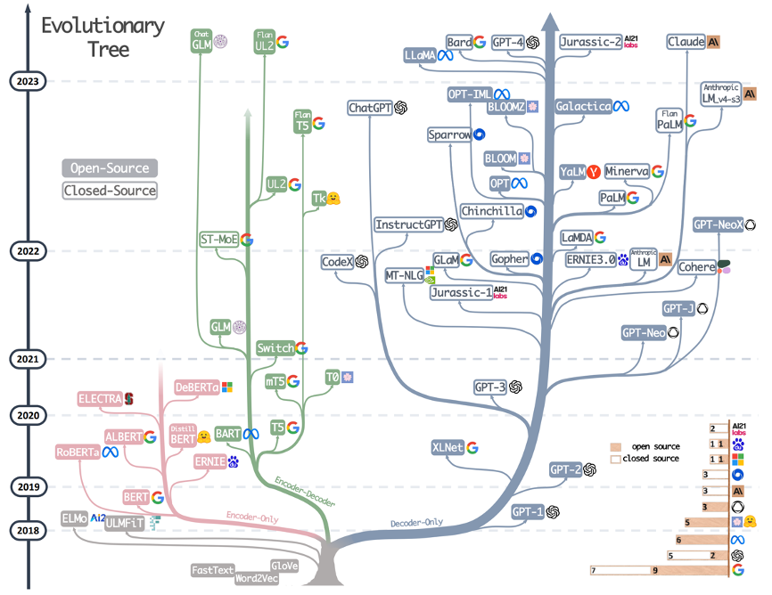
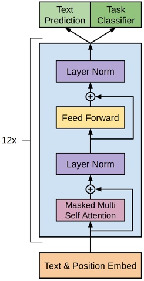
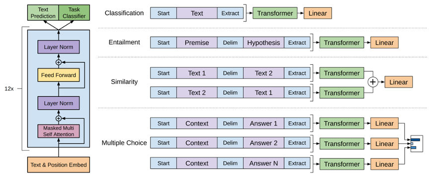
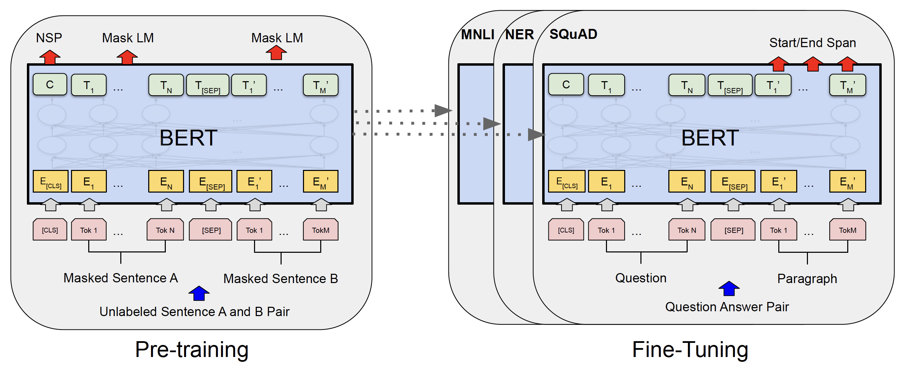
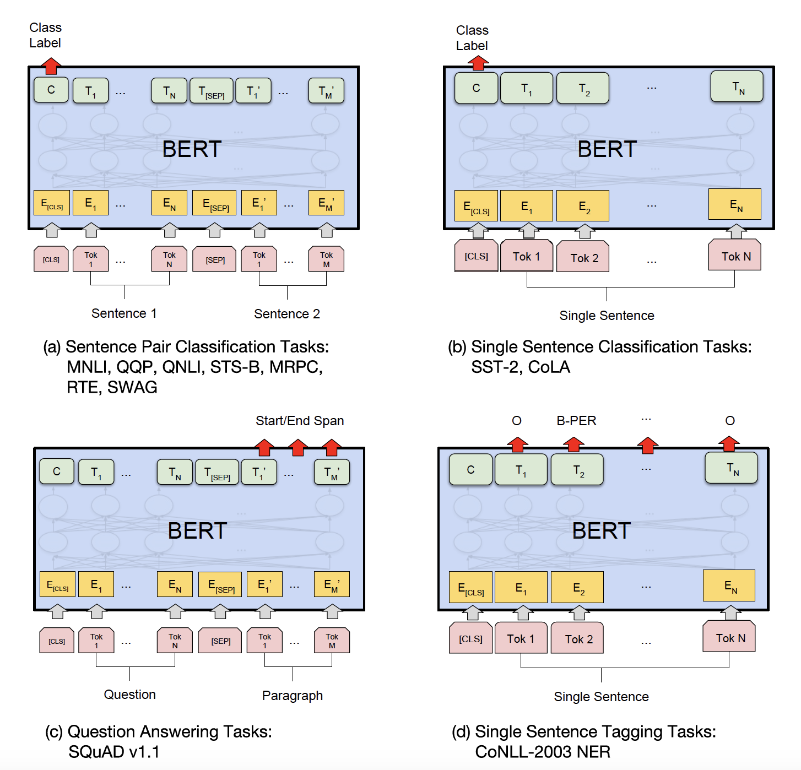

# 预训练模型

## 一、预训练模型
1. 早期的自然语言处理方法通常针对每个具体任务单独训练模型，且严重依赖大量人工标注数据。虽然在部分场景下效果可观，但也暴露出显著局限：
   - 语言知识难以复用：每个模型都需从零开始训练，导致训练成本高、效率低；
   - 强依赖高质量标注：在医疗、法律等专业领域，标注数据获取困难且代价高昂。
2. 为解决这些问题，研究者提出了新的建模范式——“预训练 + 微调”：
   - 预训练阶段：在大规模未标注语料上训练语言模型，学习词汇、句法和上下文等通用语言规律；
   - 微调阶段：将预训练模型迁移至具体任务，仅需少量标注数据即可完成任务适配。   
   
   这一方法显著提升了模型的通用性和开发效率，已成为当前`NLP`的主流技术路线，并广泛应用于文本分类、问答系统、翻译、对话等任务中。
3. 为什么预训练模型几乎都构建在`Transformer`架构之上？
   - 并行计算效率高，适合大规模训练；
   - 上下文建模能力强，可捕捉长距离依赖；
   - 结构通用灵活，可适配多种任务类型；
   - 易于扩展与迁移，支持参数堆叠与多任务学习。
4. `Transformer`架构的预训练模型分为以下几类
   - 解码器架构`Decoder-only`，仅仅使用`Transformer`的解码器，代表模型为`GPT`
   - 编码器架构`Encoder-only`，仅仅使用`Transformer`的编码器，代表模型为`BERT`
   - 编码器-解码器架构`Encoder-Decoder`，同时使用`Transformer`的解码器和解码器，代表模型为`T5`
5. 模型开发范式
   - 预训练阶段：模型学习基本的语言规律，不需要人工标注语料
   - 微调阶段：分为全参数微调和部分参数微调，例如在原来的大模型上新增一个线性层用于分类任务
     - 原大模型的参数不更新，冻结，只学习线性层用于分类，这种属于部分参数微调
     - 原大模型的参数和线性层的参数都更新，这种属于全参数微调，效果一般会好于部分参数微调
6. 2018年-2023年的模型发展史

   

## 二、`GPT`
1. 概述：`GPT`全名`Generative Pre-trained Transformer`，其核心思想是通过大规模无监督语料进行生成式语言建模预训练，即训练模型根据左侧上下文预测下一个词，从而让模型学习自然语言的通用语法、语义和上下文依赖能力。完成预训练后，再通过微调适应具体的下游任务。`GPT`首次展示了生成式语言模型在自然语言理解任务中的广泛迁移能力，为后续`GPT`系列及整个预训练语言模型的发展奠定了基础
2. 模型结构：`GPT`基于`Transformer`的解码器结构，但与标准的`Transformer`解码器并不完全相同
   - 输入嵌入层`Text & Position Embedding`，大体与`Transformer`一致
     - Text Embedding：将词或子词映射为向量
       - 与标准`Transformer`一致
     - Position Embedding：提供词在序列中的位置信息
       - 与标准`Transformer`不一致：位置编码是可学习的参数，每个位置对应一个可训练的向量，模型可以在训练过程中自动优化这些向量，而非使用不可训练的三角函数编码（如正弦/余弦函数）
   - 解码器：解码器部分由12个结构相同的解码器层堆叠而成，每个解码器层只包含如下两个子层
     - 掩码多头自注意力：`GPT`论文中使用了12头
     - 前馈网络
   - 输出层：根据下游任务不同，GPT模型的输出可以接入不同的任务头
     - 文本预测任务：用于下一个词的生成，输出是词表大小的概率分布，经过`Softmax`获得某个确定的词，**预训练阶段使用的便是该任务头**
     - 分类任务：该任务头多用于模型微调阶段，以适配具体的下游任务。通过提取特定位置的表示（如最后一个`token`）对整个输入文本进行分类（如情感分析、话题识别等）
   - 图示
     
     
3. 预训练：使用生成式语言建模作为训练目标，学习语言之间的组织规律
   - `GPT`的预训练阶段采用生成式语言建模作为训练目标，在大规模无监督文本上进行自监督学习。具体而言，模型的任务是基于已观察到的前文上下文，预测当前词的位置应出现的词，从而学习自然语言的统计规律与上下文依赖关系。这种自回归语言建模方式不依赖人工标注，训练样本可以直接从原始文本中自动构建，极大地降低了构建数据的成本。
   - `GPT`使用`Transformer`架构，具备全局自注意力机制，能够有效建模长距离依赖信息。同时，`Transformer`的并行计算特性使得模型能够高效处理长文本序列，相较于传统的`RNN`架构，训练效率显著提升，也使得在大规模语料上进行预训练成为可能。
4. 微调：预训练之后，使用有监督的任务数据对模型进行进一步训练，使其适应具体的下游任务
   - 微调的核心思路是：在保留预训练语言建模能力的基础上，利用标注数据对整个模型进行端到端优化，从而实现知识迁移
   - 具体实践中`GPT`的方案分两步走
     - 添加任务输出层：模型顶部输出层新增一个线性输出层，用于学习参数训练，将`GPT`的隐藏状态映射为下游任务所需要的标签或者输出
     - 统一输入格式设计：由于模型的限制，各种任务需要转换为连续的文本序列，模型才能识别，这就需要一种转换思想
       - 分类任务
         - 样例问题：给一段文本，告诉我这段文本是好评还是差评
         - 输入格式设计：`<start>味道好极了<extract>`
         - 怎样实现训练和预测
           - 训练阶段：当最后一个token对应的`<extract>`输入模型后，根据`GPT`输出的结果进行线性层的处理，训练阶段主要训练的就是这层线性层的参数
           - 预测阶段：将序列按照输入格式输给模型，使用最后`<extract>`输入模型得到的结果输入线性层
       - 文本蕴含任务
         - 样例问题：给两个文本，A文本是否能够总结出B文本？A文本是否表达了B文本的含义？
         - 输入格式设计：`<start>张三在家睡觉<Delim>张三暂时接听不到电话<extract>`
         - 怎样实现训练和预测：与分类任务一致
       - 文本相似度计算
         - 样例问题：A文本是否抄袭B文本？A文本和B文本之间的相似度是怎样的？
         - 输入格式设计：`<start>张三在喝茶看报<Delim>李四在看报喝茶<extract>` 和 `<start>李四在看报喝茶<Delim>张三在喝茶看报<extract>` 都输入模型
         - 怎样实现训练和分类：与分类任务一致
       - 多选问答
         - 样例问题：给一段带问题的文本和四个选项，告诉我哪个最符合问题要求
         - 输入格式设计：`<start>张三在喝茶看报<Delim>A. 张三在吃饭<extract>` 和 `<start>张三在喝茶看报<Delim>B. 张三在睡觉<extract>` 和 `<start>张三在喝茶看报<Delim>C. 张三在写作业<extract>` 都输入模型
         - 怎样实现训练和分类：与分类任务一致
   - `GPT`的思路确定了后续很多NLP任务开发的基础范式，预训练+微调的流程深入人心
   
   
5. `GPT`模型在上述的具体任务中，为什么都选择了模型的最后一个作为输出？因为是解码器结构，实际上只有最后一个向量对应的值才有全部的句子信息

## 三、`BERT`
1. 概述：`BERT`全名`Bidirectional Encoder Representations from Transformers`，核心创新在于采用`Transformer`的**编码器**结构，通过双向自注意力机制，在建模每个`token`表示时同时整合左右两个方向的上下文信息，从而获得更准确、更丰富的语义表示
2. 模型结构
   - 输入表示层：BERT的每个输入`token`表示由三部分嵌入相加组成
     - `Token Embedding`：词本身的语义表示
     - `Position Embedding`：表示`token`在序列中的位置，为可学习向量，与传统`Transformer`不同
     - `Segment Embedding`：用于区分句子对任务中的两个句子，分别用一个可学习的向量表示（为什么有`Segment Embedding`？因为主要是完成句子之间的比较、相似度计算、逻辑判断等功能，目的是**用来区分是不同的句子**，进而学习句子之间的关系）
   - 编码器：与传统`Transformer`相同
   - 输出层：根据下游任务的不同，可以使用不同的输出头；
     - `token-level`任务：使用每个位置的输出表示，对应文本生成任务
     - `sequence-level`任务：使用特殊`token`也就是`[CLS]`的输出表示，输入时被加在序列开头，专门用于汇总整个序列的语义信息，对应文本分类任务
   - 图示
   
   
3. 预训练：BERT的与训练包含两个核心任务，掩码语言模型和下一句预测，分别用于学习词级语义和句间逻辑关系
   - 掩码语言模型`Masked Language Modeling`：为实现双向语言建模，`BERT`不采用传统的从左到右或从右到左预测方式，而是引入了掩码语言模型。在训练中，`BERT`会随机遮盖输入序列中约15%的`token`，并训练模型根据上下文预测被遮盖的词
     - 遮盖策略主要包括三种：80%的被遮盖`token`替换为`[MASK]`，10%被替换为随机词，10%保持原词语不变
     - 例如：根据`今天的午[MASK]很好吃`来学习预测`饭`
   - 下一句预测`Next Sentence Prediction`：为了提升模型理解句间关系的能力，BERT 引入了“下一句预测”任务。训练时模型接收两个句子（这也可以说是引入`Segment Embedding`d的原因），判断第二句是否是第一句的真实后续句。
     - 使用`Segment Embedding`来表示不同的两个句子，从而实现句子之间的理解能力
     - 例如：正例`A：我今天很忙，B：所以没去上班`，反例`A：我今天很忙，B：天气很好`
   - BERT在预训练阶段同时优化`MLM`和`NSP`两个目标
4. 微调
   - `BERT`的输入格式在微调阶段基本保持与预训练一致，仍以`token`序列为输入，使用`[CLS]`和`[SEP]`等特殊符号。不同任务的差异主要体现在输出层设计，以及从模型输出中提取哪些表示进行预测
   - `BERT`支持的四类典型任务
     - 句子对分类任务
       - 样例问题：给两个句子，判断他们之间是否存在重复、蕴含、矛盾等关系
       - 输入格式设计：`[CLS]句子A[SEP]句子B[SEP]`
       - 怎样实现训练和分类
         - 使用`[CLS]`的输出向量接入线性层进行分类，用于判断两个句子之间是否存在重复、蕴含、矛盾等关系
         - 为什么是`[CLS]`对应的位置呢？首先`[CLS]`经过注意力机制已经融合了全部的上下文信息；其次不能选择真实`token`对应位置输出的隐藏状态，因为这相当于是在计算当前`token`和句子中其他词元之间的关系，而`[CLS]`是原句内容之外的标签，非常适合执行这一任务
     - 单句分类任务
       - 样例问题：判断一个商品的评论是负向还是正向的
       - 输入格式设计：`[CLS]句子[SEP]`
       - 怎样实现训练和分类：与句子对分类任务一样
     - 问答任务
       - 样例问题：抽取式问答（问答有多种类型，`GPT`对应的是生成式问答）
       - 输入格式设计：`[CLS]问题[SEP]段落[SEP]`
       - 怎样实现训练和分类
         - 针对每个`token`输出的答案进行线性层处理，判断当前位置是**答案开始**，还是**答案结束**的概率，最后取`softmax`，直接截取答案
         - 线性层的输入是$d_{model}$，但是输出维度可以是`1`（同时计算开始位置和结束位置就是`2`），这个位置的值决定了是开始还是结束位置的概率
     - 序列标注任务
       - 样例问题：在一段地址中找到对应的省份、市区信息
       - 输入格式设计：`[CLS]句子[SEP]`
       - 怎样实现训练和分类
         - 对每个`token`的输出向量单独进行分类，判断是不是人名和地名等
         - 相当于一个多分类任务
   
   
5. `Bert`与`GPT`对比
   - `Bert`本质上是一个双向语言表示模型，核心优势在于语言的理解，根据语言本身的内容进行信息提取和相关性判断这类任务是它的强项；它革命性地证明了双向上下文建模对于深度语言理解的巨大价值，在需要精准语义理解的任务上实现了质的飞跃
   - `GPT`是一个生成式大模型，可以根据输入使用自回归生成机制逐渐生成下游信息，达到模拟人类回复的效果，是当今大语言模型的普遍技术选择；

## 四、`T5`
1. 概述：`T5`全名`Text-to-Text Transfer Transformer`，它首次在完整的`Transformer`编码器-解码器结构`Encoder-Decoder`上实现了预训练语言模型；其核心思想是将所有自然语言处理任务统一表示为“文本到文本”的转换问题`Text-to-Text Framework`，即无论输入是文本分类、问答还是翻译，模型的输入输出均是自然语言形式的字符串
2. 模型结构：遵循原始的`Transformer`架构，不再赘述
3. 预训练
   - 训练方法：与原始的`Transformer`根据前文预测下文训练方法不同，`T5`随机选择句子中的若干片段，将每个被遮盖的连续片段替换为特殊的`token`，令模型学习生成这些遮盖片段的内容，作为输出序列
   - 这种方式既保留了模型的双向建模能力，又为训练提供了明确的“生成式”学习信号，使模型可以更自然的适配下游任务
4. 微调
   - `T5`微调阶段将所有任务转换为文本到文本的形式
   - `T5`支持的多种任务
     - 翻译任务：输入`translate English to German: That is good.`输出`Das ist gut.`
     - 情感分类：输入`sentiment: This movie was great.`输出`positive`
     - 问答：输入`question: What is the capital of France? context: France is a country...`输出`Paris`

## 五、案例实操
1. 模型选择及结构（原始`bert`的`[CLS]`隐藏状态+线性层）
2. 代码实战见(ML&DL&NLP/NLP/code&data/chap7/bert)

-----
参考资料：
1. 视频教学：https://www.bilibili.com/video/BV1k44LzPEhU
2. GPT论文：https://cdn.openai.com/research-covers/language-unsupervised/language_understanding_paper.pdf
3. BERT论文：https://arxiv.org/pdf/1810.04805
4. T5论文：https://arxiv.org/pdf/1910.10683
5. GLUE：https://gluebenchmark.com/