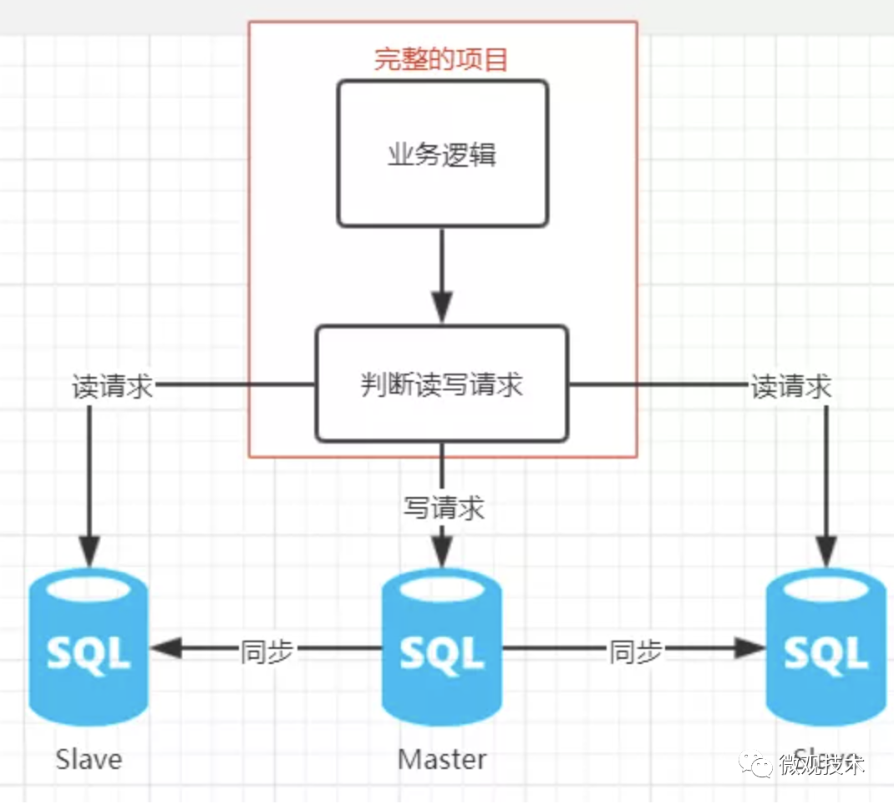

# MySQL数据库一些架构问题

## 一、MySQL为什么不能提供高并发？
1. 锁机制 ：MySQL在查询的时候会加锁，不论是行锁或者是表锁，会出现大量的阻塞和等待，影响系统的并发能力
2. 事务隔离级别：MySQL支持不同的事务隔离级别，不同的隔离级别下能够承担的请求量也是不一样的
3. 通信机制：MySQL需要通过TCP三次握手建立通信，这也是会使用一部分时间的
4. 硬件限制：计算资源有限，要交互磁盘

## 二、MySQL支持高并发操作的一些策略（索引、缓存、分库分表、读写分离、
1. 采用一些索引，加速查询，减少等待和锁表
2. 加缓存，拒绝请求直接查询MySQL
3. 读写分离：读请求给Salve，写请求给Master，主从之间使用同步机制  
   
4. 数据归档：因为大部分的业务具有热尾效应，可以将之前的历史数据保存到另外的一张表，这样来降低数据库的表容量，从而提高查询性能；成本小，比常提的分库分表具有更优秀的效果，而且不容易产生分布式问题
5. 分库分表：分片查询，一个数据库实例撑不住，就将并发请求分散到多个实例中
   1. 数据库大，就分表
   2. 并发高，就分库，多加一些MySQL实例

## 三、MySQL存在一些大表问题

## 四、解决方案

## 五、MySQL和ES的数据同步问题

## 六、跨页问题

## 七、电商平台主键生成
1. redis的incs命令动态生成
2. 

参考资料
1. https://cloud.tencent.com/developer/article/1683394